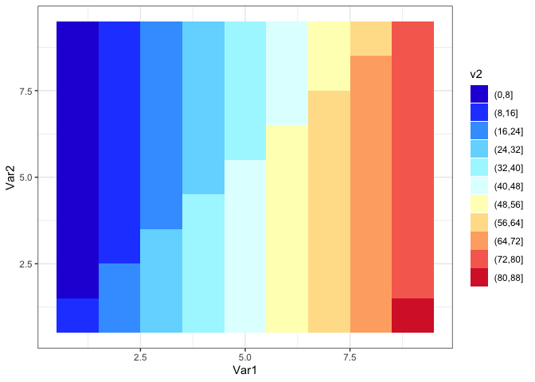
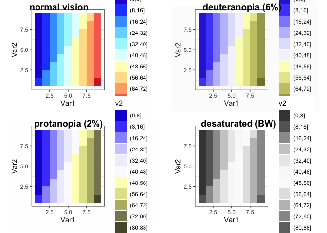
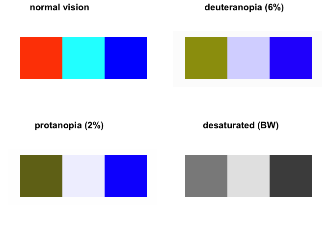
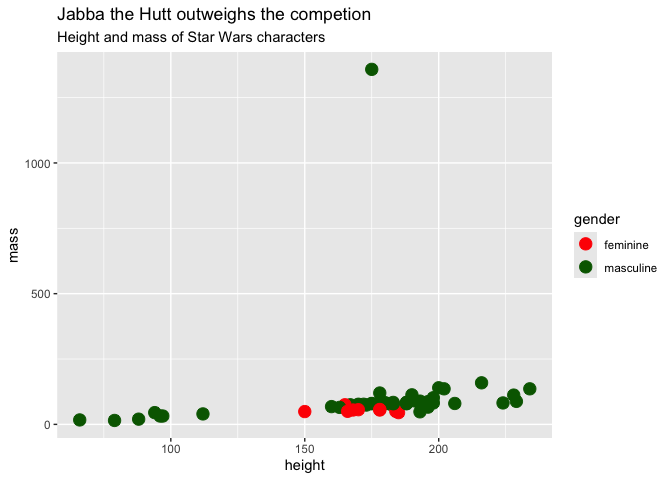
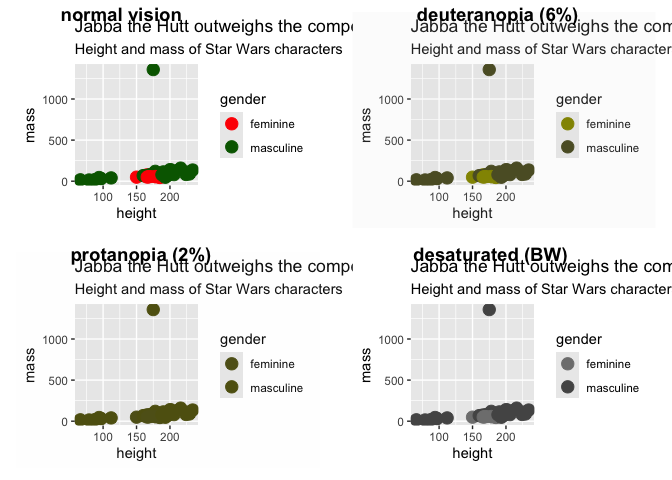

colorBlindness
================
Janet Young
2024-05-15

# colorBlindness package

see [colorBlindness package
vignette](https://cran.r-project.org/web/packages/colorBlindness/vignettes/colorBlindness.html)

``` r
mat <- matrix(1:81, nrow = 9, ncol = 9)

mat1 <- melt(t(mat[9:1, ]))
len <- length(Blue2DarkRed12Steps)-1
mat1$v2 <- cut(mat1$value,
              breaks = seq(0,ceiling(81/len)*len, 
                           length.out = len+1))
ht <- ggplot(mat1) + 
  geom_tile(aes(x=Var1, y=Var2, fill=v2)) + 
  scale_fill_manual(values=Blue2DarkRed12Steps) + 
  theme_bw()
ht
```

<!-- -->

``` r
# check the plot by CVD simulator
cvdPlot(ht)
```

<!-- -->

``` r
cvdPlot(replacePlotColor(displayColors(c("Red", "Green", "blue"))))
```

    ## Warning: The `guide` argument in `scale_*()` cannot be `FALSE`. This was deprecated in
    ## ggplot2 3.3.4.
    ## ℹ Please use "none" instead.
    ## ℹ The deprecated feature was likely used in the colorBlindness package.
    ##   Please report the issue to the authors.
    ## This warning is displayed once every 8 hours.
    ## Call `lifecycle::last_lifecycle_warnings()` to see where this warning was
    ## generated.

<!-- -->

`colorBlindness::replacePlotColor` - replace the colors for plots
replace the colors of plots to meet the requirement of publication.
Replacing red with magenta or green with turquoise. Replacing all the
colored symbols in the legend.

# Ra11y package

[Ra11y package](https://github.com/nicucalcea/Ra11y)

``` r
# remotes::install_github("nicucalcea/Ra11y")
library(Ra11y)

## example plot

starwars <- dplyr::starwars |> 
  tidyr::drop_na(height, mass, gender)

starwars_plot <- starwars |>
  ggplot(aes(x = height, y = mass, colour = gender)) +
  geom_point(size = 4) +
  scale_colour_manual(values = c("red", "darkgreen")) +
  labs(title = "Jabba the Hutt outweighs the competion",
       subtitle = "Height and mass of Star Wars characters")

starwars_plot
```

<!-- -->

``` r
test_plot(starwars_plot, test = "cvd") # CVD stands for Colour Vision Deficiency
```

    ## 

    ## ── Colour blindness ────────────────────────────────────────────────────────────

    ## ✖ There may be issues with the following colour combinations, consider changing them:

    ## • darkgreen — red

    ## Run `colorblindr::cvd_grid()` for colour-deficiency simulations of your plot.

``` r
## colorblindr doesn't seem available any more byt cvdPlot seems to give similar results to what' the we's shown here https://github.com/nicucalcea/Ra11y?tab=readme-ov-file
##colorblindr::cvd_grid(starwars_plot)

cvdPlot(starwars_plot)
```

<!-- -->

that Ra11y package has some suggestions about adding contrast and alt
text to help with color blindness
