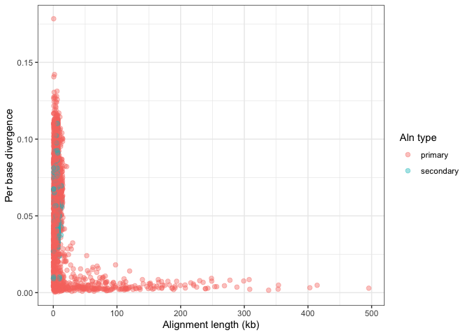

compare_two_genomes_dotplot_demo
================
Janet Young

2025-05-14

# Overview

The `pafr` package looks very nice for generating whole-genome dotplots
from paf files (and doing other analysis), which are generated by
minimap2 comparisons of one **query** genome against a second **target**
genome.

I tried this in the worm_mitoNuc project.

Perhaps also try the [SVbyEye](https://github.com/daewoooo/SVbyEye) tool
from Evan Eichler’s group, used for great ape genomes. More docs
[here](https://htmlpreview.github.io/?https://github.com/daewoooo/SVbyEye/blob/master/man/doc/SVbyEye.html)

# Resources

`pafr` package [github project page](https://dwinter.github.io/pafr/)
and [documentation website](https://dwinter.github.io/pafr/index.html)
are useful.

The [minimap
documentation](https://lh3.github.io/minimap2/minimap2.html#10) contains
a description of paf output format.

# Demo code

Read an example paf file. It generates a pafr class object, which
behaves a bit like a tibble.

``` r
ali <- read_paf( system.file("extdata", "fungi.paf", package="pafr") )
ali
```

    ## pafr object with 2501 alignments (36.5Mb)
    ##  8 query seqs
    ##  8 target seqs
    ##  11 tags: NM, ms, AS, nn, tp, cm, s1, s2, dv, cg, zd

pafr class objects can be treated like tibbles, and easily coerced to
tibbles:

``` r
ali |> 
    filter(qname=="Q_chr3") |> 
    select(-qlen) |> 
    as_tibble() |> 
    head(10)
```

    ## # A tibble: 10 × 22
    ##    qname   qstart    qend strand tname    tlen tstart   tend nmatch   alen  mapq
    ##    <chr>    <dbl>   <dbl> <chr>  <chr>   <dbl>  <dbl>  <dbl>  <dbl>  <dbl> <dbl>
    ##  1 Q_chr3 1436043 1665002 +      T_chr4 4.65e6 1.28e6 1.51e6 228016 238644    60
    ##  2 Q_chr3  741663  933043 +      T_chr4 4.65e6 6.23e5 8.04e5 180986 191436    60
    ##  3 Q_chr3 1217227 1407797 +      T_chr4 4.65e6 1.07e6 1.28e6 189733 207432    60
    ##  4 Q_chr3 3784821 3946018 +      T_chr4 4.65e6 3.42e6 3.58e6 159705 162431    60
    ##  5 Q_chr3 3129365 3301666 +      T_chr4 4.65e6 2.77e6 2.95e6 167946 179987    60
    ##  6 Q_chr3 1975265 2100285 +      T_chr4 4.65e6 1.79e6 1.91e6 124768 125361    60
    ##  7 Q_chr3  933042 1102558 +      T_chr4 4.65e6 8.24e5 9.80e5 155118 170034    60
    ##  8 Q_chr3 4573093 4724149 +      T_chr4 4.65e6 4.15e6 4.29e6 143061 152401    60
    ##  9 Q_chr3  526949  667584 +      T_chr4 4.65e6 4.89e5 6.23e5 133017 141262    60
    ## 10 Q_chr3 3301735 3494834 +      T_chr4 4.65e6 2.95e6 3.11e6 159247 193697    60
    ## # ℹ 11 more variables: NM <dbl>, ms <dbl>, AS <dbl>, nn <dbl>, tp <chr>,
    ## #   cm <dbl>, s1 <dbl>, s2 <dbl>, dv <dbl>, cg <chr>, zd <dbl>

Here are the column names of this particular pafr object. When I read my
own minimap file, I didn’t have all of these fields. Below I copy info
from the [minimap
documentation](https://lh3.github.io/minimap2/minimap2.html#10) about
these fields.

``` r
names(ali)
```

    ##  [1] "qname"  "qlen"   "qstart" "qend"   "strand" "tname"  "tlen"   "tstart"
    ##  [9] "tend"   "nmatch" "alen"   "mapq"   "NM"     "ms"     "AS"     "nn"    
    ## [17] "tp"     "cm"     "s1"     "s2"     "dv"     "cg"     "zd"

    1   string  Query sequence name
    2   int Query sequence length
    3   int Query start coordinate (0-based)
    4   int Query end coordinate (0-based)
    5   char    ‘+’ if query/target on the same strand; ‘-’ if opposite
    6   string  Target sequence name
    7   int Target sequence length
    8   int Target start coordinate on the original strand
    9   int Target end coordinate on the original strand
    10  int Number of matching bases in the mapping
    11  int Number bases, including gaps, in the mapping
    12  int Mapping quality (0-255 with 255 for missing)

    tp  A   Type of aln: P/primary, S/secondary and I,i/inversion
    cm  i   Number of minimizers on the chain
    s1  i   Chaining score
    s2  i   Chaining score of the best secondary chain
    NM  i   Total number of mismatches and gaps in the alignment
    MD  Z   To generate the ref sequence in the alignment
    AS  i   DP alignment score
    SA  Z   List of other supplementary alignments
    ms  i   DP score of the max scoring segment in the alignment
    nn  i   Number of ambiguous bases in the alignment
    ts  A   Transcript strand (splice mode only)
    cg  Z   CIGAR string (only in PAF)
    cs  Z   Difference string
    dv  f   Approximate per-base sequence divergence
    de  f   Gap-compressed per-base sequence divergence
    rl  i   Length of query regions harboring repetitive seeds

# Explore alignment statistics

## Distribution of alignment lengths

``` r
# the 'tp' field is for the type of alignment - I want more understandable labels on my plots:
tp_labeller <- c(P="primary", S="secondary", I="inversion")
```

``` r
ali |> 
    mutate(tp=toupper(tp)) |> 
    ggplot(aes(alen)) + 
    geom_histogram(colour="black", fill="steelblue", bins=20) + 
    theme_bw() + 
    ggtitle("Distribution of alignment lengths") +
    scale_x_log10("Alignment length") +
    facet_grid(rows=vars(tp), scales = "free",
               labeller = labeller(tp=tp_labeller))
```

<!-- -->

## Alignment length versus per-base divergence

``` r
ali |> 
    filter(!is.na(dv)) |> 
    ggplot(aes(x=alen, y=dv, color = tp)) + 
    geom_point(alpha=0.4, size=2) + 
    scale_x_continuous("Alignment length (kb)",
                       label =  function(x) x/ 1e3) +
    # scale_x_log10("Alignment length") +
    scale_y_continuous("Per base divergence") +
    scale_color_discrete(name="Aln type", labels=tp_labeller) +
    theme_bw() 
```

<!-- -->

## dotplots

``` r
dotplot(ali, label_seqs = TRUE) +
    theme_bw()
```

<!-- -->

Here’s the same dotplot, but changing the aesthetics of the text labels
for each chromosome

``` r
# GeomLabel$default_aes$size  ## 3.88
update_geom_defaults("text", list(size = 2, color="darkred"))
dotplot(ali, label_seqs = TRUE) +
    theme_bw()
```

<!-- -->

``` r
# restore geom_text defaults after we finish dotplots
update_geom_defaults("text", list(size = 3.88, color="black"))
```

Zoom in to a particular query or target chromosome:

``` r
# GeomLabel$default_aes$size  ## 3.88
update_geom_defaults("text", list(size = 2, color="darkred"))
ali |> 
    filter(qname=="Q_chr4" & tp=="P" & alen>=50000) |> 
    dotplot(label_seqs = TRUE) +
    theme_bw()
```

<!-- -->

``` r
# restore geom_text defaults after we finish dotplots
update_geom_defaults("text", list(size = 3.88, color="black"))
```

Choose order in which chromosomes are displayed

``` r
update_geom_defaults("text", list(size = 2, color="darkred"))

my_chr_order <- list()
my_chr_order[[1]] <- unique(ali$qname)
my_chr_order[[1]] <- my_chr_order[[1]] [ length(my_chr_order[[1]]):1 ]
my_chr_order[[2]] <- unique(ali$tname)

ali |> 
    dotplot(label_seqs=TRUE, 
            order_by="provided", ordering=my_chr_order,
            xlab="new query axis label",
            ylab="new target axis label") +
    theme_bw()
```

<!-- -->

``` r
update_geom_defaults("text", list(size = 3.88, color="black"))
```

Zoom using coord_cartesian (I suppress messages, otherwise it tells me
I’m adding to existing coordinate system)

``` r
update_geom_defaults("text", list(size = 2, color="darkred"))
p1 <- ali |> 
    dotplot(label_seqs=TRUE) +
    theme_bw()
suppressMessages( p1zoom <- p1 + 
                      coord_cartesian(xlim=c(1.2*10^7,1.8*10^7),
                                      ylim=c(1.7*10^7,2.3*10^7)) )
p1 + p1zoom
```

<!-- -->

``` r
update_geom_defaults("text", list(size = 3.88, color="black"))
```

Can add annotations, too - see the pafr documentation.

# Synteny plots

``` r
long_ali <- subset(ali, alen > 1e4 & mapq > 40)
plot_synteny(long_ali, q_chrom="Q_chr3", t_chrom="T_chr4", centre=TRUE) +
    theme_bw()
```

<!-- -->

``` r
plot_synteny(long_ali, q_chrom="Q_chr5", t_chrom="T_chr5", centre=TRUE) +
    theme_bw()
```

<!-- -->

``` r
plot_synteny(long_ali, q_chrom="Q_chr5", t_chrom="T_chr5", 
             centre=TRUE, rc=TRUE) +
    theme_bw()
```

<!-- -->
\# Plot coverage by query sequence

``` r
prim_alignment <- filter_secondary_alignments(ali)

plot_coverage(prim_alignment, fill="qname") +   
    scale_fill_brewer(palette="Set1") 
```

<!-- -->

# Finished

show R version used, and package versions

``` r
sessionInfo()
```

    ## R version 4.4.2 (2024-10-31)
    ## Platform: aarch64-apple-darwin20
    ## Running under: macOS Sequoia 15.4.1
    ## 
    ## Matrix products: default
    ## BLAS:   /Library/Frameworks/R.framework/Versions/4.4-arm64/Resources/lib/libRblas.0.dylib 
    ## LAPACK: /Library/Frameworks/R.framework/Versions/4.4-arm64/Resources/lib/libRlapack.dylib;  LAPACK version 3.12.0
    ## 
    ## locale:
    ## [1] en_US.UTF-8/en_US.UTF-8/en_US.UTF-8/C/en_US.UTF-8/en_US.UTF-8
    ## 
    ## time zone: America/Los_Angeles
    ## tzcode source: internal
    ## 
    ## attached base packages:
    ## [1] stats     graphics  grDevices utils     datasets  methods   base     
    ## 
    ## other attached packages:
    ##  [1] pafr_0.0.2       patchwork_1.3.0  kableExtra_1.4.0 lubridate_1.9.4 
    ##  [5] forcats_1.0.0    stringr_1.5.1    dplyr_1.1.4      purrr_1.0.2     
    ##  [9] readr_2.1.5      tidyr_1.3.1      tibble_3.2.1     ggplot2_3.5.1   
    ## [13] tidyverse_2.0.0  here_1.0.1      
    ## 
    ## loaded via a namespace (and not attached):
    ##  [1] gtable_0.3.6       xfun_0.50          htmlwidgets_1.6.4  devtools_2.4.5    
    ##  [5] remotes_2.5.0      tzdb_0.4.0         vctrs_0.6.5        tools_4.4.2       
    ##  [9] generics_0.1.3     curl_6.1.0         pkgconfig_2.0.3    RColorBrewer_1.1-3
    ## [13] lifecycle_1.0.4    compiler_4.4.2     farver_2.1.2       munsell_0.5.1     
    ## [17] httpuv_1.6.15      usethis_3.1.0      htmltools_0.5.8.1  yaml_2.3.10       
    ## [21] urlchecker_1.0.1   pillar_1.10.1      later_1.4.1        ellipsis_0.3.2    
    ## [25] cachem_1.1.0       sessioninfo_1.2.2  mime_0.12          tidyselect_1.2.1  
    ## [29] digest_0.6.37      stringi_1.8.4      labeling_0.4.3     rprojroot_2.0.4   
    ## [33] fastmap_1.2.0      grid_4.4.2         colorspace_2.1-1   cli_3.6.3         
    ## [37] magrittr_2.0.3     utf8_1.2.4         pkgbuild_1.4.6     withr_3.0.2       
    ## [41] scales_1.3.0       promises_1.3.2     timechange_0.3.0   rmarkdown_2.29    
    ## [45] hms_1.1.3          memoise_2.0.1      shiny_1.10.0       evaluate_1.0.3    
    ## [49] knitr_1.49         miniUI_0.1.1.1     viridisLite_0.4.2  profvis_0.4.0     
    ## [53] rlang_1.1.4        Rcpp_1.0.14        xtable_1.8-4       glue_1.8.0        
    ## [57] xml2_1.3.6         pkgload_1.4.0      svglite_2.1.3      rstudioapi_0.17.1 
    ## [61] R6_2.5.1           systemfonts_1.2.0  fs_1.6.5
