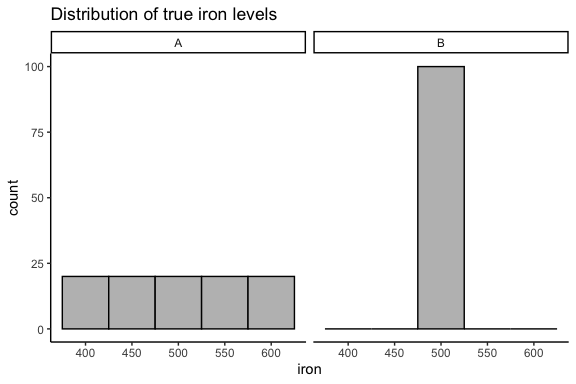
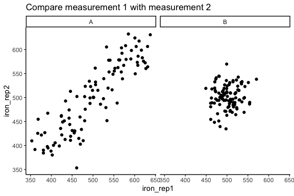
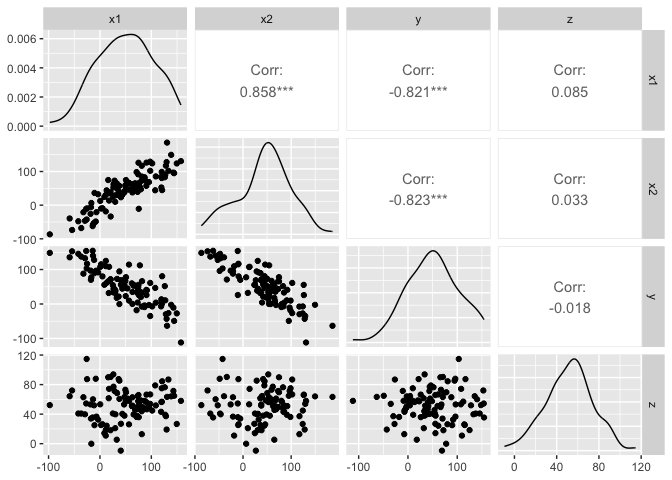
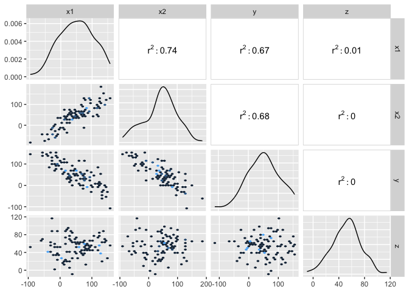

correlationExample_JY
================
Janet Young
2025-08-11

# First, some example data to demonstrate that R-squareds can be over-interpreted

Imagine a group of 100 mice, and we measure their blood iron content (or
some other arbitrary metric). We measure the blood iron twice using two
different machines, each of which has some error level which is
identical and normally distributed (mean 0, sd=25).

In group A, there are 5 different types of mice (20 mice in each group),
with five different blood iron levels

In group B, all 100 mice have exactly the same blood iron level.

<!-- -->

<!-- -->

The replicated measurements of group A show very good correlation
(Pearson = 0.8806821 for this sampling)

The replicated measurements of group B show very poor correlation
(0.1122519 for this sampling), but it doesn’t mean this experiment is
any worse than the other experiment, it’s just there isn’t any spread in
the true data, so the noise overwhelms the signal (there is no signal)

# Experiment with ggpairs (GGally package)

Make a dataset that includes groups that are

- well-correlated (positively)
- not correlated
- well-correlated (negatively)

Show default ggpairs plot

<!-- -->

By default for continuous variables, ggpairs uses the `cor()` function
for the upper plots. This (by default) returns the Pearson R (i.e. not
R-squared).

In this dataset, x1 and y are correlated with R=-0.8214117 (and
therefore R-squared of `r`cor(dat2$x1, dat2$y)^2\`)

Here’s a way to use a custom function to show R-squared rather than R:

Now try to get R^2 and slope together

<!-- -->

Maybe I want to use a different geom for the data plots, e.g. hexbin

<!-- -->

# Finished

    ## R version 4.5.0 (2025-04-11)
    ## Platform: aarch64-apple-darwin20
    ## Running under: macOS Sequoia 15.5
    ## 
    ## Matrix products: default
    ## BLAS:   /Library/Frameworks/R.framework/Versions/4.5-arm64/Resources/lib/libRblas.0.dylib 
    ## LAPACK: /Library/Frameworks/R.framework/Versions/4.5-arm64/Resources/lib/libRlapack.dylib;  LAPACK version 3.12.1
    ## 
    ## locale:
    ## [1] en_US.UTF-8/en_US.UTF-8/en_US.UTF-8/C/en_US.UTF-8/en_US.UTF-8
    ## 
    ## time zone: America/Los_Angeles
    ## tzcode source: internal
    ## 
    ## attached base packages:
    ## [1] stats     graphics  grDevices utils     datasets  methods   base     
    ## 
    ## other attached packages:
    ##  [1] GGally_2.3.0    patchwork_1.3.0 lubridate_1.9.4 forcats_1.0.0  
    ##  [5] stringr_1.5.1   dplyr_1.1.4     purrr_1.0.4     readr_2.1.5    
    ##  [9] tidyr_1.3.1     tibble_3.2.1    ggplot2_3.5.2   tidyverse_2.0.0
    ## 
    ## loaded via a namespace (and not attached):
    ##  [1] gtable_0.3.6       compiler_4.5.0     tidyselect_1.2.1   ggstats_0.10.0    
    ##  [5] scales_1.4.0       yaml_2.3.10        fastmap_1.2.0      lattice_0.22-6    
    ##  [9] hexbin_1.28.5      R6_2.6.1           labeling_0.4.3     generics_0.1.4    
    ## [13] knitr_1.50         pillar_1.10.2      RColorBrewer_1.1-3 tzdb_0.5.0        
    ## [17] rlang_1.1.6        stringi_1.8.7      xfun_0.52          S7_0.2.0          
    ## [21] timechange_0.3.0   cli_3.6.5          withr_3.0.2        magrittr_2.0.3    
    ## [25] digest_0.6.37      grid_4.5.0         rstudioapi_0.17.1  hms_1.1.3         
    ## [29] lifecycle_1.0.4    vctrs_0.6.5        evaluate_1.0.3     glue_1.8.0        
    ## [33] farver_2.1.2       rmarkdown_2.29     tools_4.5.0        pkgconfig_2.0.3   
    ## [37] htmltools_0.5.8.1
