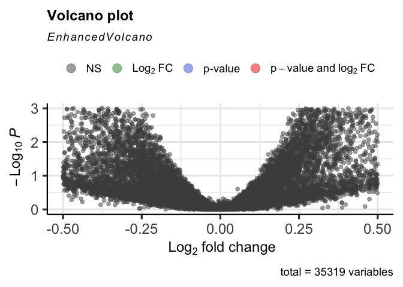

EnhancedVolcano tests
================
Janet Young

2024-05-01

Example code from [here](https://github.com/kevinblighe/EnhancedVolcano)

``` r
data('airway')
airway$dex %<>% relevel('untrt')

ens <- rownames(airway)

symbols <- mapIds(org.Hs.eg.db, keys = ens,
                  column = c('SYMBOL'), keytype = 'ENSEMBL')
```

    ## 'select()' returned 1:many mapping between keys and columns

``` r
symbols <- symbols[!is.na(symbols)]
symbols <- symbols[match(rownames(airway), names(symbols))]
rownames(airway) <- symbols
keep <- !is.na(rownames(airway))
airway <- airway[keep,]

# runDEseq
dds <- DESeqDataSet(airway, design = ~ cell + dex)
```

    ## Warning in DESeqDataSet(airway, design = ~cell + dex): 1337 duplicate rownames
    ## were renamed by adding numbers

``` r
dds <- DESeq(dds, betaPrior=FALSE)
```

    ## estimating size factors

    ## estimating dispersions

    ## gene-wise dispersion estimates

    ## mean-dispersion relationship

    ## final dispersion estimates

    ## fitting model and testing

``` r
res <- results(dds,
               contrast = c('dex','trt','untrt'))
res <- lfcShrink(dds,
                 contrast = c('dex','trt','untrt'), res=res, type = 'normal')
```

    ## using 'normal' for LFC shrinkage, the Normal prior from Love et al (2014).
    ## 
    ## Note that type='apeglm' and type='ashr' have shown to have less bias than type='normal'.
    ## See ?lfcShrink for more details on shrinkage type, and the DESeq2 vignette.
    ## Reference: https://doi.org/10.1093/bioinformatics/bty895

``` r
EnhancedVolcano(res,
                lab = rownames(res),
                x = 'log2FoldChange',
                y = 'pvalue')
```

<!-- -->

Setting xlim or ylim so that the dashed lines would not be visible
results in warnings. I asked for them to not be emitted,
[here](https://github.com/kevinblighe/EnhancedVolcano/issues/129)

``` r
# can add this to code chunk to avoid seeing the warning:
# warning=FALSE
EnhancedVolcano(res,
                lab = rownames(res),
                x = 'log2FoldChange',
                y = 'pvalue',
                ylim=c(0,3),
                xlim=c(-0.5,0.5))
```

    ## Warning: Removed 2 rows containing missing values or values outside the scale range
    ## (`geom_vline()`).

    ## Warning: Removed 1 row containing missing values or values outside the scale range
    ## (`geom_hline()`).

<!-- -->
