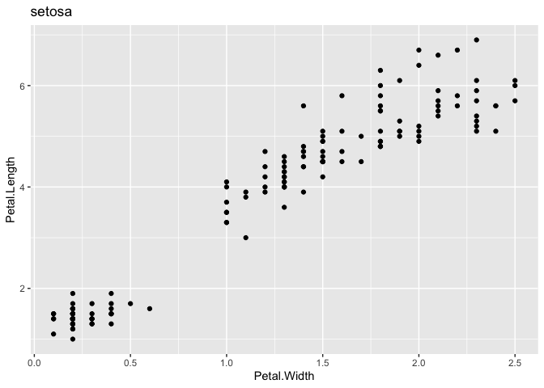

explore_purrr
================
Janet Young

2026-01-08

``` r
knitr::opts_chunk$set(echo = TRUE)
library(tidyverse)
```

    ## ── Attaching core tidyverse packages ──────────────────────── tidyverse 2.0.0 ──
    ## ✔ dplyr     1.1.4     ✔ readr     2.1.6
    ## ✔ forcats   1.0.1     ✔ stringr   1.6.0
    ## ✔ ggplot2   4.0.1     ✔ tibble    3.3.0
    ## ✔ lubridate 1.9.4     ✔ tidyr     1.3.1
    ## ✔ purrr     1.2.0     
    ## ── Conflicts ────────────────────────────────────────── tidyverse_conflicts() ──
    ## ✖ dplyr::filter() masks stats::filter()
    ## ✖ dplyr::lag()    masks stats::lag()
    ## ℹ Use the conflicted package (<http://conflicted.r-lib.org/>) to force all conflicts to become errors

``` r
library(patchwork) # for combining plots
```

Learning the `purrr` package

From the [R for Data Science
book](https://r4ds.had.co.nz/iteration.html)

`map()` is similar to the `apply()` family of functions. Flavors of map
are defined by what sort of output we want: - `map()` makes a list.  
- `map_lgl()` makes a logical vector.  
- `map_int()` makes an integer vector.  
- `map_dbl()` makes a double vector.  
- `map_chr()` makes a character vector.

If input is a tbl/data.frame, the `map` functions know to apply a
function across each column

``` r
map_dbl(mtcars, mean)
```

    ##        mpg        cyl       disp         hp       drat         wt       qsec 
    ##  20.090625   6.187500 230.721875 146.687500   3.596563   3.217250  17.848750 
    ##         vs         am       gear       carb 
    ##   0.437500   0.406250   3.687500   2.812500

Can use `...` to supply extra arguments

Remember that `.` can be used to refer to the data that’s being passed
in

``` r
## this doesn't work (although group_by would)
# mtcars %>% split(cyl)

## this does work, returns list of 3 data frames
## we need to use the magrittr pipe (%>%) so that split can access .
# mtcars %>% 
#     split(.$cyl)
```

This could also have been achieved with `group_by |> summarise`, but for
more complex functions you probably need `map`

``` r
## we need to use the magrittr pipe (%>%) so that split can access .
mtcars %>% 
    split(.$cyl) %>%
    map(function(df){ mean(df$mpg) })
```

    ## $`4`
    ## [1] 26.66364
    ## 
    ## $`6`
    ## [1] 19.74286
    ## 
    ## $`8`
    ## [1] 15.1

``` r
mtcars |> 
    group_by(cyl) |> 
    summarize( mean(mpg) )
```

    ## # A tibble: 3 × 2
    ##     cyl `mean(mpg)`
    ##   <dbl>       <dbl>
    ## 1     4        26.7
    ## 2     6        19.7
    ## 3     8        15.1

Using `\` - the backslash is shorthand for `function`:

``` r
mtcars %>% 
    split(.$cyl) %>%
    map(\(df){ mean(df$mpg) })
```

    ## $`4`
    ## [1] 26.66364
    ## 
    ## $`6`
    ## [1] 19.74286
    ## 
    ## $`8`
    ## [1] 15.1

A more complex function: linear modelling using `lm()`. Output of this
is a list object, each of which is the output of the lm function:

``` r
models <- mtcars %>% 
    split(.$cyl) %>%
    map(function(df) lm(mpg ~ wt, data = df))
```

The `~` (“lambda expression”) is now NOT recommended by purrr but you
still often see code that uses it online etc. For example: purrr has a
shortcut to make that syntax less verbose - the `.` refers to the
current list element, and this is a “one-sided function”. Or, you should
use `.x` to refer to the data (and `.y` if there’s \>1 element)

``` r
models <- mtcars %>% 
    split(.$cyl) %>%
    map(~lm(mpg ~ wt, data = .))
```

Extract bits of the output of lm for each list element:

``` r
models |> 
    map(summary) |> 
    map_dbl(~.$r.squared)
```

    ##         4         6         8 
    ## 0.5086326 0.4645102 0.4229655

or this does the same thing:

``` r
models |> 
    map(summary) |> 
    map_dbl("r.squared")
```

    ##         4         6         8 
    ## 0.5086326 0.4645102 0.4229655

selecting list elements by position:

``` r
x <- list(list(1, 2, 3), list(4, 5, 6), list(7, 8, 9))
x |> map_dbl(2)
```

    ## [1] 2 5 8

``` r
# same as sapply(myList, "[[", 2) 
```

# using map to make a bunch of plots

Here we make a function that generates a plot and test it on the whole
dataset

``` r
## make a function that generates a plot
myPlotFunc <- function(dat) {
    ggplot(dat,
           aes(x = Petal.Width, y = Petal.Length)) +
        geom_point() +
        ggtitle(unique(dat$Species))
}

## test it on the whole dataset
iris |> myPlotFunc()
```

<!-- -->

Now we try using the tidyverse way to split and apply (=map)

``` r
## group_split then map to plot each (purrr::map)
temp <- iris |>
    group_split(Species) |>
    map(myPlotFunc)
temp[[1]] + temp[[2]] + temp[[3]]
```

<!-- -->

Another way to write that is by using an anonymous function. Note the
`~` before tje function, and the use of `.` within the function to
denote the data being passed in

``` r
temp <- iris |>
    group_split(Species) |>
    map(~ggplot(.,
               aes(x = Petal.Width, y = Petal.Length)) +
            geom_point() +
            ggtitle(unique(.$Species)))
temp[[1]] + temp[[2]] + temp[[3]]
```

<!-- -->

# Exercises

21.5.3 Exercises (from [here](https://r4ds.had.co.nz/iteration.html))

Write code that uses one of the map functions to:

Compute the mean of every column in mtcars.

``` r
mtcars |> 
    map_dbl(mean)
```

    ##        mpg        cyl       disp         hp       drat         wt       qsec 
    ##  20.090625   6.187500 230.721875 146.687500   3.596563   3.217250  17.848750 
    ##         vs         am       gear       carb 
    ##   0.437500   0.406250   3.687500   2.812500

Determine the type of each column in nycflights13::flights

``` r
nycflights13::flights |> 
    # map(typeof)
    map(class) |> 
    map_chr(1)  # need this because class(nycflights13::flights$time_hour) had two elements ("POSIXct" "POSIXt")
```

    ##           year          month            day       dep_time sched_dep_time 
    ##      "integer"      "integer"      "integer"      "integer"      "integer" 
    ##      dep_delay       arr_time sched_arr_time      arr_delay        carrier 
    ##      "numeric"      "integer"      "integer"      "numeric"    "character" 
    ##         flight        tailnum         origin           dest       air_time 
    ##      "integer"    "character"    "character"    "character"      "numeric" 
    ##       distance           hour         minute      time_hour 
    ##      "numeric"      "numeric"      "numeric"      "POSIXct"

Compute the number of unique values in each column of iris.

``` r
iris |> 
    map(unique) |> 
    map_int(length)
```

    ## Sepal.Length  Sepal.Width Petal.Length  Petal.Width      Species 
    ##           35           23           43           22            3

Generate 10 random normals from distributions with means of -10, 0, 10,
and 100.

``` r
x <- c(-10, 0, 10, 100)
x |> 
    map(~ rnorm(n=10, mean=.))
```

    ## [[1]]
    ##  [1]  -9.064497 -10.924838  -9.963794 -10.070108  -9.245529 -10.131357
    ##  [7]  -8.426541  -9.699687 -10.430776 -10.701590
    ## 
    ## [[2]]
    ##  [1] -0.4699853 -0.1916542 -0.8745771  0.3612513 -0.2819181  0.6221907
    ##  [7]  0.6777893 -0.4259728  0.5016096  0.2538071
    ## 
    ## [[3]]
    ##  [1] 11.264357  9.809178 11.770290 10.012939  7.788737 10.001248 11.674972
    ##  [8] 11.110788 11.091658 10.316854
    ## 
    ## [[4]]
    ##  [1] 101.82606 100.35546  98.98423  99.93864  97.70401 100.84326  99.58755
    ##  [8] 101.34601  98.84543 100.74778

How can you create a single vector that for each column in a data frame
indicates whether or not it’s a factor?

``` r
iris |> 
    map_lgl(is.factor)
```

    ## Sepal.Length  Sepal.Width Petal.Length  Petal.Width      Species 
    ##        FALSE        FALSE        FALSE        FALSE         TRUE

What happens when you use the map functions on vectors that aren’t
lists? What does map(1:5, runif) do? Why? Answer - it still works,
because why not?

What does map(-2:2, rnorm, n = 5) do? Why? Answer - it still works. I
actually don’t understand how rnorm knows to put the incoming data into
the mean argument

What does map_dbl(-2:2, rnorm, n = 5) do? Why? Answer - it doesn’t work,
because map_dbl expects only a single number in the output, and rnorm is
giving 5 per list element

Rewrite map(x, function(df) lm(mpg ~ wt, data = df)) to eliminate the
anonymous function.

``` r
mtcars %>% 
    split(.$cyl) %>%
    # map(function(df) lm(mpg ~ wt, data = df)) 
    map(~lm(mpg ~ wt, data = .)) 
```

    ## $`4`
    ## 
    ## Call:
    ## lm(formula = mpg ~ wt, data = .)
    ## 
    ## Coefficients:
    ## (Intercept)           wt  
    ##      39.571       -5.647  
    ## 
    ## 
    ## $`6`
    ## 
    ## Call:
    ## lm(formula = mpg ~ wt, data = .)
    ## 
    ## Coefficients:
    ## (Intercept)           wt  
    ##       28.41        -2.78  
    ## 
    ## 
    ## $`8`
    ## 
    ## Call:
    ## lm(formula = mpg ~ wt, data = .)
    ## 
    ## Coefficients:
    ## (Intercept)           wt  
    ##      23.868       -2.192

Dealing with failure

The `safely()` function can be used to wrap any function:

``` r
safe_log <- safely(log)
safe_log(10)
```

    ## $result
    ## [1] 2.302585
    ## 
    ## $error
    ## NULL

``` r
safe_log("a")
```

    ## $result
    ## NULL
    ## 
    ## $error
    ## <simpleError in .f(...): non-numeric argument to mathematical function>

``` r
# or str(safe_log("a"))
```

Here, y is a list of three things, each of which has a result and an
error element:

``` r
x <- list(1, 10, "a")
y <- x |> map(safely(log))
str(y)
```

    ## List of 3
    ##  $ :List of 2
    ##   ..$ result: num 0
    ##   ..$ error : NULL
    ##  $ :List of 2
    ##   ..$ result: num 2.3
    ##   ..$ error : NULL
    ##  $ :List of 2
    ##   ..$ result: NULL
    ##   ..$ error :List of 2
    ##   .. ..$ message: chr "non-numeric argument to mathematical function"
    ##   .. ..$ call   : language .f(...)
    ##   .. ..- attr(*, "class")= chr [1:3] "simpleError" "error" "condition"

purrr’s transpose function is nice (but it is old and we should now use
list_transpose) - it turns a list-of-lists “inside-out”. now we have a
list of two things - all the results, and all the errors:

``` r
y2 <- y |> transpose()
str(y2)
```

    ## List of 2
    ##  $ result:List of 3
    ##   ..$ : num 0
    ##   ..$ : num 2.3
    ##   ..$ : NULL
    ##  $ error :List of 3
    ##   ..$ : NULL
    ##   ..$ : NULL
    ##   ..$ :List of 2
    ##   .. ..$ message: chr "non-numeric argument to mathematical function"
    ##   .. ..$ call   : language .f(...)
    ##   .. ..- attr(*, "class")= chr [1:3] "simpleError" "error" "condition"

``` r
y3 <- y |> list_transpose()
str(y3)
```

    ## List of 2
    ##  $ result:List of 3
    ##   ..$ : num 0
    ##   ..$ : num 2.3
    ##   ..$ : NULL
    ##  $ error :List of 3
    ##   ..$ : NULL
    ##   ..$ : NULL
    ##   ..$ :List of 2
    ##   .. ..$ message: chr "non-numeric argument to mathematical function"
    ##   .. ..$ call   : language .f(...)
    ##   .. ..- attr(*, "class")= chr [1:3] "simpleError" "error" "condition"

``` r
# can detect errors like this:
is_ok <- y3$error |> map_lgl(is_null)
# and use that to select input values that caused error:
x[!is_ok]
```

    ## [[1]]
    ## [1] "a"

``` r
# or select things that worked: 
# list_c is a bit like unlist - there's also list_flatten list_rbind list_cbind
y3$result[is_ok] |> list_c()
```

    ## [1] 0.000000 2.302585

`possibly()` is a bit like `safely()` except that you can define the
default output if there’s an error:

``` r
x <- list(1, 10, "a")
x |> 
    map_dbl(possibly(log, NA_real_))
```

    ## [1] 0.000000 2.302585       NA

`quietly()` captures other stuff (output, messages, warnings, but not
errors - errors will break it)

``` r
x <- list(1, -1)
x |> map(quietly(log)) |> str()
```

    ## List of 2
    ##  $ :List of 4
    ##   ..$ result  : num 0
    ##   ..$ output  : chr ""
    ##   ..$ warnings: chr(0) 
    ##   ..$ messages: chr(0) 
    ##  $ :List of 4
    ##   ..$ result  : num NaN
    ##   ..$ output  : chr ""
    ##   ..$ warnings: chr "NaNs produced"
    ##   ..$ messages: chr(0)

Iterating over pairs (or more) of arguments - `map2()` is for pairs of
args

``` r
mu <- list(5, 10, -3)
sigma <- list(1, 5, 10)
map2(mu, sigma, rnorm, n = 5) |> str()
```

    ## List of 3
    ##  $ : num [1:5] 3.22 5.62 4.11 4.44 5.14
    ##  $ : num [1:5] 9.2 13.57 17.96 14.74 4.25
    ##  $ : num [1:5] -10.143 -20.498 -0.814 -8.118 -16.641

`pmap()` is for groups of \>2 args. It’s good practise to name the
arguments in the list:

``` r
n <- list(1, 3, 5)
args1 <- list(n=n, mean=mu, sd=sigma)
args1 |>
    pmap(rnorm) |> 
    str()
```

    ## List of 3
    ##  $ : num 5.74
    ##  $ : num [1:3] 10.6 7.2 8.43
    ##  $ : num [1:5] -22.84 -7.9 -10.63 3.14 -4.55

args for pmap must always have same length, so they can be stored in a
data frame:

``` r
# tribble() = row-wise tibble creation
params <- tribble(
    ~mean, ~sd, ~n,
    5,     1,  1,
    10,     5,  3,
    -3,    10,  5
)
params |> 
    pmap(rnorm)
```

    ## [[1]]
    ## [1] 6.13847
    ## 
    ## [[2]]
    ## [1] 14.033007  8.899752  7.029191
    ## 
    ## [[3]]
    ## [1] -12.8214271   0.2862643 -10.1067759 -11.7361794  -2.0457586

`invoke_map()` is used if you want to vary the function that gets used:

``` r
f <- c("runif", "rnorm", "rpois")
param <- list(
    list(min = -1, max = 1), 
    list(sd = 5), 
    list(lambda = 10)
)
invoke_map(f, param, n = 5) |> str()
```

    ## Warning: `invoke_map()` was deprecated in purrr 1.0.0.
    ## ℹ Please use map() + exec() instead.
    ## This warning is displayed once every 8 hours.
    ## Call `lifecycle::last_lifecycle_warnings()` to see where this warning was
    ## generated.

    ## Warning: `invoke()` was deprecated in purrr 1.0.0.
    ## ℹ Please use `exec()` instead.
    ## ℹ The deprecated feature was likely used in the purrr package.
    ##   Please report the issue at <https://github.com/tidyverse/purrr/issues>.
    ## This warning is displayed once every 8 hours.
    ## Call `lifecycle::last_lifecycle_warnings()` to see where this warning was
    ## generated.

    ## List of 3
    ##  $ : num [1:5] 0.463 0.237 -0.448 -0.29 -0.847
    ##  $ : num [1:5] 9.8 2.62 2.69 8.28 -7.34
    ##  $ : int [1:5] 10 8 19 6 13

that works but invoke_map is deprecated

or using a tibble for the input:

``` r
sim <- tribble(
    ~f,      ~params,
    "runif", list(min = -1, max = 1),
    "rnorm", list(sd = 5),
    "rpois", list(lambda = 10)
)
sim |> 
    mutate(sim = invoke_map(f, params, n = 10))
```

    ## # A tibble: 3 × 3
    ##   f     params           sim       
    ##   <chr> <list>           <list>    
    ## 1 runif <named list [2]> <dbl [10]>
    ## 2 rnorm <named list [1]> <dbl [10]>
    ## 3 rpois <named list [1]> <int [10]>

except that `invoke_map()` is now deprecated and it tells us to use
map() + exec() instead. I tried using it but I don’t see how to do it.

``` r
# map(f, exec, !!!param)
# map2(f, list(args1, args2), \(fn, args) exec(fn, !!!args))
# map2(as.list(f), param, exec)
```

use `walk()` when we don’t care about the return value, e.g. if we want
to render to screen or save files:

``` r
x <- list(1, "a", 3)

x |> 
    walk(print)
```

    ## [1] 1
    ## [1] "a"
    ## [1] 3

``` r
## the map version of that gives the output of the print function AND returns a list
# x |> map(print)
```

`walk2` and `pwalk` are more useful

`keep()` and `discard()` are “predicate” functions that help you only do
the apply on some columns/list elements:

``` r
iris |> 
    keep(is.factor) |> 
    table()
```

    ## Species
    ##     setosa versicolor  virginica 
    ##         50         50         50

``` r
iris |> 
    discard(is.factor) |>
    map_dbl(mean)
```

    ## Sepal.Length  Sepal.Width Petal.Length  Petal.Width 
    ##     5.843333     3.057333     3.758000     1.199333

`some()` and `every()`:

``` r
x <- list(1:5, letters, list(10))

x |> 
    some(is_character)
```

    ## [1] TRUE

``` r
#> [1] TRUE

x |> 
    every(is_vector)
```

    ## [1] TRUE

``` r
#> [1] TRUE

x |>
    every(is_character)
```

    ## [1] FALSE

``` r
# FALSE
```

detect() finds the first element where the predicate is true;
detect_index() returns its position:

``` r
x <- sample(10)
x
```

    ##  [1]  4  8  9 10  5  1  2  6  7  3

``` r
#  [1]  1  7  4  2  9 10  3  8  5  6

## detect returns the actual value of the first thing that satisfies
x |> 
    detect(~ . > 5)
```

    ## [1] 8

``` r
#> [1] 7

## detect_index 
x |> 
    detect_index(~ . > 5)
```

    ## [1] 2

``` r
#> [1] 1

## in this case there are NONE so it fails
x |> 
    head_while(~ . > 5)
```

    ## integer(0)

``` r
# but this works
x |> 
    head_while(~ . < 6)
```

    ## [1] 4

``` r
x |> 
    tail_while(~ . > 4)
```

    ## integer(0)

purrr:::reduce does a function repeatedly (is this like do.call?)

``` r
dfs <- list(
    age = tibble(name = "John", age = 30),
    sex = tibble(name = c("John", "Mary"), sex = c("M", "F")),
    trt = tibble(name = "Mary", treatment = "A")
)

dfs |> reduce(full_join)
```

    ## Joining with `by = join_by(name)`
    ## Joining with `by = join_by(name)`

    ## # A tibble: 2 × 4
    ##   name    age sex   treatment
    ##   <chr> <dbl> <chr> <chr>    
    ## 1 John     30 M     <NA>     
    ## 2 Mary     NA F     A

or maybe you have a list of vectors, and want to find the intersection:

``` r
vs <- list(
    c(1, 3, 5, 6, 10),
    c(1, 2, 3, 7, 8, 10),
    c(1, 2, 3, 4, 8, 9, 10)
)

vs |> reduce(intersect)
```

    ## [1]  1  3 10

``` r
#> [1]  1  3 10
```

reduce() takes a “binary” function (i.e. a function with two primary
inputs), and applies it repeatedly to a list until there is only a
single element left.

accumulate() is similar but it keeps all the interim results. You could
use it to implement a cumulative sum:

``` r
x <- sample(10)
x
```

    ##  [1]  6  4  5  3  7  9  8 10  2  1

``` r
#  [1]  4  5  2  9  6  7  8  1  3 10

## this is the same as cumsum()
x |> accumulate(`+`)
```

    ##  [1]  6 10 15 18 25 34 42 52 54 55

``` r
## this is the same as sum(x):
## x |> reduce(`+`)  
```

Exercise: Create an enhanced col_summary() that applies a summary
function to every numeric column in a data frame.

``` r
col_summary_2 <- function(df, func) {
    df |> 
        keep(is.numeric) |> 
        map(func)
}

iris |> col_summary_2(mean)
```

    ## $Sepal.Length
    ## [1] 5.843333
    ## 
    ## $Sepal.Width
    ## [1] 3.057333
    ## 
    ## $Petal.Length
    ## [1] 3.758
    ## 
    ## $Petal.Width
    ## [1] 1.199333

``` r
# output <- iris |> 
#     keep(is.numeric) |> 
#     map(summary)  |> 
#     map(~function(dat) { tibble(stat=names(dat), 
#                                 x=as.numeric(dat)) } )
# as_tibble(rownames="stat")
```

# Finished

``` r
sessionInfo()
```

    ## R version 4.5.2 (2025-10-31)
    ## Platform: aarch64-apple-darwin20
    ## Running under: macOS Tahoe 26.2
    ## 
    ## Matrix products: default
    ## BLAS:   /System/Library/Frameworks/Accelerate.framework/Versions/A/Frameworks/vecLib.framework/Versions/A/libBLAS.dylib 
    ## LAPACK: /Library/Frameworks/R.framework/Versions/4.5-arm64/Resources/lib/libRlapack.dylib;  LAPACK version 3.12.1
    ## 
    ## locale:
    ## [1] en_US.UTF-8/en_US.UTF-8/en_US.UTF-8/C/en_US.UTF-8/en_US.UTF-8
    ## 
    ## time zone: America/Los_Angeles
    ## tzcode source: internal
    ## 
    ## attached base packages:
    ## [1] stats     graphics  grDevices utils     datasets  methods   base     
    ## 
    ## other attached packages:
    ##  [1] patchwork_1.3.2 lubridate_1.9.4 forcats_1.0.1   stringr_1.6.0  
    ##  [5] dplyr_1.1.4     purrr_1.2.0     readr_2.1.6     tidyr_1.3.1    
    ##  [9] tibble_3.3.0    ggplot2_4.0.1   tidyverse_2.0.0
    ## 
    ## loaded via a namespace (and not attached):
    ##  [1] gtable_0.3.6       crayon_1.5.3       compiler_4.5.2     tidyselect_1.2.1  
    ##  [5] nycflights13_1.0.2 scales_1.4.0       yaml_2.3.12        fastmap_1.2.0     
    ##  [9] R6_2.6.1           labeling_0.4.3     generics_0.1.4     knitr_1.50        
    ## [13] pillar_1.11.1      RColorBrewer_1.1-3 tzdb_0.5.0         rlang_1.1.6       
    ## [17] utf8_1.2.6         stringi_1.8.7      xfun_0.54          S7_0.2.1          
    ## [21] timechange_0.3.0   cli_3.6.5          withr_3.0.2        magrittr_2.0.4    
    ## [25] digest_0.6.39      grid_4.5.2         rstudioapi_0.17.1  hms_1.1.4         
    ## [29] lifecycle_1.0.4    vctrs_0.6.5        evaluate_1.0.5     glue_1.8.0        
    ## [33] farver_2.1.2       rmarkdown_2.30     tools_4.5.2        pkgconfig_2.0.3   
    ## [37] htmltools_0.5.9
