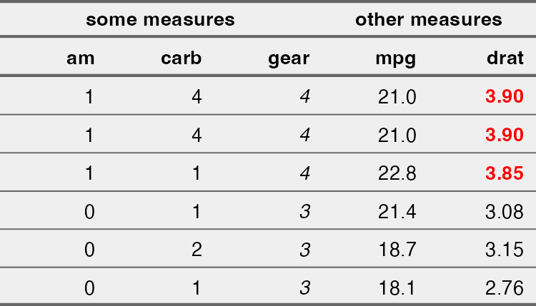

flextable_demo
================
Janet Young

2024-04-18

Checking out the `flextable` package, using code from the [flextable
“book” website](https://ardata-fr.github.io/flextable-book/index.html)

Simple table display

``` r
df <- airquality[ sample.int(10),]
flextable(df)
```


qflextable does a bit more formatting, including autofit on the columns

``` r
qflextable(df)
```


Fancier

``` r
ft <- flextable(df)
ft <- add_header_row(ft,
  colwidths = c(4, 2),
  values = c("Air quality", "Time")
)
ft <- theme_vanilla(ft)
ft <- add_footer_lines(ft, "Daily air quality measurements in New York, May to September 1973.")
ft <- color(ft, part = "footer", color = "#666666")
ft <- set_caption(ft, caption = "New York Air Quality Measurements")
ft
```


Using default display settings:

``` r
set_flextable_defaults(
  font.size = 10, theme_fun = theme_vanilla,
  padding = 6,
  background.color = "#EFEFEF")
flextable(df)
```


Use col_keys to select some columns

``` r
myft <- flextable(head(mtcars), 
  col_keys = c("am", "carb", "gear", "mpg", "drat" ))
myft
```


Formatting certain cells/columns  
- use j to specify certain column(s) by index - can use conditional
formatting

``` r
myft <- italic(myft, j = 3)
myft <- color(myft, ~ drat > 3.5, ~ drat, color = "red")
myft <- bold(myft, ~ drat > 3.5, ~ drat, bold = TRUE)
myft
```


Adding header rows that span \>1 column:

``` r
myft <- add_header_row(
  x = myft, values = c("some measures", "other measures"),
  colwidths = c(3, 2))
myft <- align(myft, i = 1, part = "header", align = "center")
myft
```


Aligning within the parent document:

``` r
myft <- set_table_properties(myft, align = "right", layout = "autofit")
myft
```



Ask to display non-existent columns if we want to separate groups of
columns a bit - here we ask for the `col1` column. Also `empty_blanks()`
replaces <na> with blank.

``` r
myft <- flextable(
  data = head(airquality), 
  col_keys = c("Ozone", "Solar.R", "col1", "Month", "Day")) |> 
  width(j = "col1", width = .2) |>
  empty_blanks()
myft
```


Cute table that includes tiny plots:

``` r
## data.table seems to be similar to a data.frame, but cells can contain more complex 
z <- as.data.table(ggplot2::diamonds)

z <- z[, list(
  price = mean(price, na.rm = TRUE),
  list_col = list(.SD$x)
), by = "cut"]

# flextable ----
ft <- flextable(data = z) %>%
  mk_par(j = "list_col", value = as_paragraph(
    plot_chunk(value = list_col, type = "dens", col = "#ec11c2", 
               width = 1.5, height = .4, free_scale = TRUE)
  )) %>%
  colformat_double(big.mark = " ", suffix = " $") %>% 
  autofit()
ft
```


Exporting formatted tables: `save_as_docx`, `save_as_pptx`,
`save_as_image`

``` r
save_as_docx(myft, path=here("Rscripts/flextable_demo_fig1.docx"))
```

Wow - you can put a these lines at the top of a doc, and then any time
you print a dataframe, it will be a flextable formatted using the
defaults:

``` r
set_flextable_defaults(font.size = 11, padding = 3)
use_df_printer()
```
