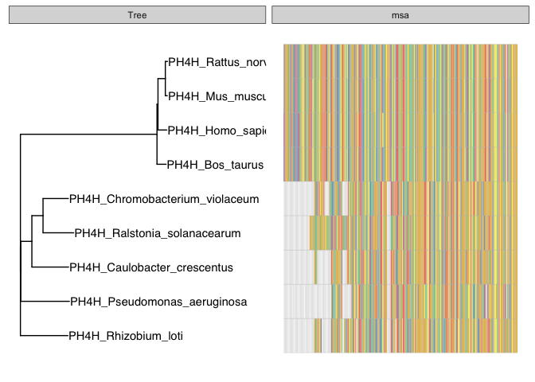
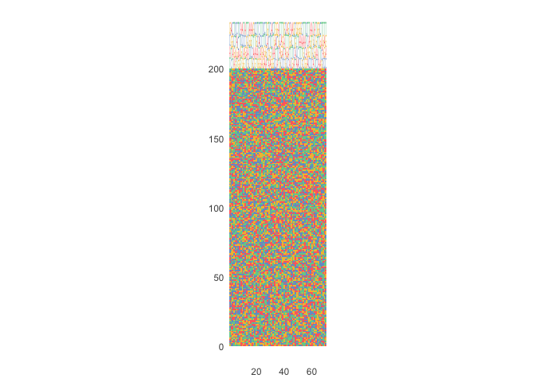
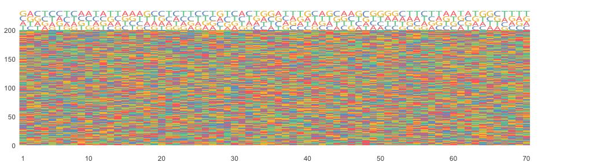

ggmsa_demo
================
Janet Young

2024-04-05

``` r
library(ggtree)
```

    ## ggtree v3.10.0 For help: https://yulab-smu.top/treedata-book/
    ## 
    ## If you use the ggtree package suite in published research, please cite
    ## the appropriate paper(s):
    ## 
    ## Guangchuang Yu, David Smith, Huachen Zhu, Yi Guan, Tommy Tsan-Yuk Lam.
    ## ggtree: an R package for visualization and annotation of phylogenetic
    ## trees with their covariates and other associated data. Methods in
    ## Ecology and Evolution. 2017, 8(1):28-36. doi:10.1111/2041-210X.12628
    ## 
    ## G Yu. Data Integration, Manipulation and Visualization of Phylogenetic
    ## Trees (1st ed.). Chapman and Hall/CRC. 2022. ISBN: 9781032233574
    ## 
    ## LG Wang, TTY Lam, S Xu, Z Dai, L Zhou, T Feng, P Guo, CW Dunn, BR
    ## Jones, T Bradley, H Zhu, Y Guan, Y Jiang, G Yu. treeio: an R package
    ## for phylogenetic tree input and output with richly annotated and
    ## associated data. Molecular Biology and Evolution. 2020, 37(2):599-603.
    ## doi: 10.1093/molbev/msz240

``` r
library(ape)
```

    ## 
    ## Attaching package: 'ape'

    ## The following object is masked from 'package:ggtree':
    ## 
    ##     rotate

``` r
library(Biostrings)
```

    ## Loading required package: BiocGenerics

    ## 
    ## Attaching package: 'BiocGenerics'

    ## The following objects are masked from 'package:stats':
    ## 
    ##     IQR, mad, sd, var, xtabs

    ## The following objects are masked from 'package:base':
    ## 
    ##     anyDuplicated, aperm, append, as.data.frame, basename, cbind,
    ##     colnames, dirname, do.call, duplicated, eval, evalq, Filter, Find,
    ##     get, grep, grepl, intersect, is.unsorted, lapply, Map, mapply,
    ##     match, mget, order, paste, pmax, pmax.int, pmin, pmin.int,
    ##     Position, rank, rbind, Reduce, rownames, sapply, setdiff, sort,
    ##     table, tapply, union, unique, unsplit, which.max, which.min

    ## Loading required package: S4Vectors

    ## Loading required package: stats4

    ## 
    ## Attaching package: 'S4Vectors'

    ## The following object is masked from 'package:ggtree':
    ## 
    ##     expand

    ## The following object is masked from 'package:utils':
    ## 
    ##     findMatches

    ## The following objects are masked from 'package:base':
    ## 
    ##     expand.grid, I, unname

    ## Loading required package: IRanges

    ## 
    ## Attaching package: 'IRanges'

    ## The following object is masked from 'package:ggtree':
    ## 
    ##     collapse

    ## Loading required package: XVector

    ## Loading required package: GenomeInfoDb

    ## 
    ## Attaching package: 'Biostrings'

    ## The following object is masked from 'package:ape':
    ## 
    ##     complement

    ## The following object is masked from 'package:base':
    ## 
    ##     strsplit

``` r
library(ggmsa)
```

    ## Registered S3 methods overwritten by 'ggalt':
    ##   method                  from   
    ##   grid.draw.absoluteGrob  ggplot2
    ##   grobHeight.absoluteGrob ggplot2
    ##   grobWidth.absoluteGrob  ggplot2
    ##   grobX.absoluteGrob      ggplot2
    ##   grobY.absoluteGrob      ggplot2

    ## ggmsa v1.8.0  Document: http://yulab-smu.top/ggmsa/
    ## 
    ## If you use ggmsa in published research, please cite:
    ## L Zhou, T Feng, S Xu, F Gao, TT Lam, Q Wang, T Wu, H Huang, L Zhan, L Li, Y Guan, Z Dai*, G Yu* ggmsa: a visual exploration tool for multiple sequence alignment and associated data. Briefings in Bioinformatics. DOI:10.1093/bib/bbac222

``` r
library(here)
```

    ## here() starts at /Volumes/malik_h/user/jayoung/git_more_repos/Rtest_and_Rnotes

``` r
knitr::opts_chunk$set(echo = TRUE)
```

``` r
## example from here https://github.com/YuLab-SMU/ggmsa/issues/15
protein_sequences <- system.file("extdata", "sample.fasta", package = "ggmsa")
x <- readAAStringSet(protein_sequences)
d <- as.dist(stringDist(x, method = "hamming")/width(x)[1])
tree <- bionj(d)
p <- ggtree(tree ) + geom_tiplab() #tree

data <- tidy_msa(x, start = 100,end = 350)  #msa
#tree + msa
p + geom_facet(geom = geom_msa, data = data,
               panel = 'msa', font = NULL,
               color = "Chemistry_AA")  +
    xlim_tree(1)
```

    ## Warning: No shared levels found between `names(values)` of the manual scale and the
    ## data's fill values.

<!-- -->

``` r
# example from here: https://github.com/YuLab-SMU/ggmsa/issues/56
# seq <- readDNAStringSet("/Volumes/malik_h/user/jayoung/git_more_repos/Rtest_and_Rnotes/Rscripts/ggmsa_mult_seq_alns/ggmsa_tests_example_for_github.fa")

seq <- readDNAStringSet(here("Rscripts/ggmsa_mult_seq_alns/ggmsa_tests_example_for_github.fa"))


ggmsa(seq, seq_name = F,
      char_width = 0.5,
      font = NULL, border = NA, color = "Chemistry_NT") +
    geom_seqlogo(color = "Chemistry_NT")
```

    ## Warning: No shared levels found between `names(values)` of the manual scale and the
    ## data's fill values.

<!-- -->

``` r
p <- ggmsa(seq, seq_name = F,
           char_width = 0.5,
           font = NULL, border = NA, color = "Chemistry_NT") +
    facet_msa(field=80) +
    geom_seqlogo(color = "Chemistry_NT")
```

    ## Scale for x is already present.
    ## Adding another scale for x, which will replace the existing scale.
    ## Coordinate system already present. Adding new coordinate system, which will
    ## replace the existing one.

``` r
ggsave(filename = here("Rscripts/ggmsa_testPlot.pdf"), p, height=3, width=11)
```

    ## Warning: No shared levels found between `names(values)` of the manual scale and the
    ## data's fill values.

``` r
p
```

    ## Warning: No shared levels found between `names(values)` of the manual scale and the
    ## data's fill values.

<!-- -->
