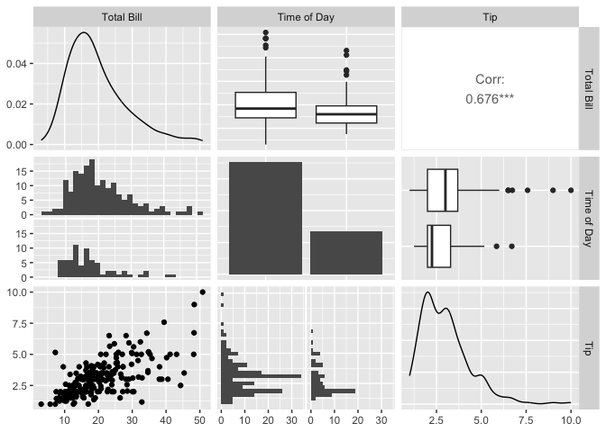
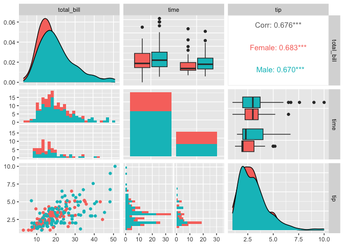
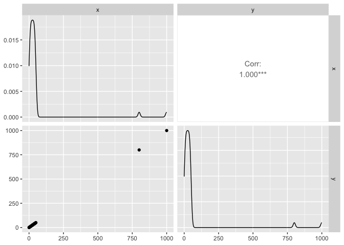
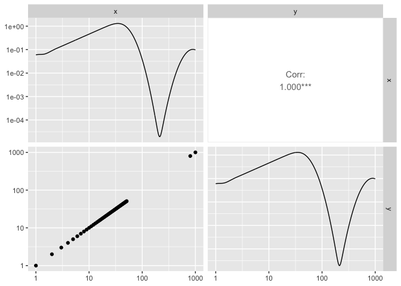

GGally_pairs_plots
================
Janet Young

2024-03-06

explore [GGally
package](https://ggobi.github.io/ggally/articles/ggpairs.html)

``` r
knitr::opts_chunk$set(echo = TRUE)
library(tidyverse)
```

    ## ── Attaching core tidyverse packages ──────────────────────── tidyverse 2.0.0 ──
    ## ✔ dplyr     1.1.4     ✔ readr     2.1.4
    ## ✔ forcats   1.0.0     ✔ stringr   1.5.1
    ## ✔ ggplot2   3.5.0     ✔ tibble    3.2.1
    ## ✔ lubridate 1.9.3     ✔ tidyr     1.3.0
    ## ✔ purrr     1.0.2     
    ## ── Conflicts ────────────────────────────────────────── tidyverse_conflicts() ──
    ## ✖ dplyr::filter() masks stats::filter()
    ## ✖ dplyr::lag()    masks stats::lag()
    ## ℹ Use the conflicted package (<http://conflicted.r-lib.org/>) to force all conflicts to become errors

``` r
library(GGally)
```

    ## Registered S3 method overwritten by 'GGally':
    ##   method from   
    ##   +.gg   ggplot2

``` r
# example data. 244 rows, 7 columns: total_bill  tip    sex smoker day   time size
data(tips)

tips %>% summary()
```

    ##    total_bill         tip             sex      smoker      day         time    
    ##  Min.   : 3.07   Min.   : 1.000   Female: 87   No :151   Fri :19   Dinner:176  
    ##  1st Qu.:13.35   1st Qu.: 2.000   Male  :157   Yes: 93   Sat :87   Lunch : 68  
    ##  Median :17.80   Median : 2.900                          Sun :76               
    ##  Mean   :19.79   Mean   : 2.998                          Thur:62               
    ##  3rd Qu.:24.13   3rd Qu.: 3.562                                                
    ##  Max.   :50.81   Max.   :10.000                                                
    ##       size     
    ##  Min.   :1.00  
    ##  1st Qu.:2.00  
    ##  Median :2.00  
    ##  Mean   :2.57  
    ##  3rd Qu.:3.00  
    ##  Max.   :6.00

Defaults - the diagonals give some kind of summary of that variable -
upper and lower panels give different views of the pairwise
comparisons: - if both variables are continuous, one plot is a
scatterplot and the other states the correlation - if one continuous and
one categorical, we get faceted histograms and boxplots

``` r
pm <- ggpairs(tips, columns = c("total_bill", "time", "tip"), 
              columnLabels = c("Total Bill", "Time of Day", "Tip"))
pm
```

    ## `stat_bin()` using `bins = 30`. Pick better value with `binwidth`.
    ## `stat_bin()` using `bins = 30`. Pick better value with `binwidth`.

<!-- -->

can group by color

``` r
pm <- ggpairs(tips, mapping = aes(color = sex), columns = c("total_bill", "time", "tip"))
pm
```

    ## `stat_bin()` using `bins = 30`. Pick better value with `binwidth`.
    ## `stat_bin()` using `bins = 30`. Pick better value with `binwidth`.

<!-- -->

data where log10 would make sense:

``` r
df_noZeros <- data.frame(x=c(1:50,800,1000), 
                         y=c(1:50,800,1000))
ggpairs(df_noZeros)
```

<!-- -->

``` r
ggpairs(df_noZeros) +
    scale_x_log10() +
    scale_y_log10()
```

    ## Scale for x is already present.
    ## Adding another scale for x, which will replace the existing scale.
    ## Scale for y is already present.
    ## Adding another scale for y, which will replace the existing scale.
    ## Scale for y is already present.
    ## Adding another scale for y, which will replace the existing scale.
    ## Scale for y is already present.
    ## Adding another scale for y, which will replace the existing scale.

<!-- -->

data where log10 would make sense, except there are zeros:

``` r
df_zeros <- data.frame(x=c(0:50,800,1000), 
                         y=c(0:50,800,1000))
ggpairs(df_zeros)
```

<!-- -->
add 1 to all columns then plot on a log10 scale:

``` r
df_zeros %>% 
    mutate(across(
        .cols=x:y,
        .fns = function(myNums) { myNums+1 } )
        ) %>% 
ggpairs() +
    scale_x_log10() +
    scale_y_log10()
```

    ## Scale for x is already present.
    ## Adding another scale for x, which will replace the existing scale.
    ## Scale for y is already present.
    ## Adding another scale for y, which will replace the existing scale.
    ## Scale for y is already present.
    ## Adding another scale for y, which will replace the existing scale.
    ## Scale for y is already present.
    ## Adding another scale for y, which will replace the existing scale.

<!-- -->
\`\`\`
