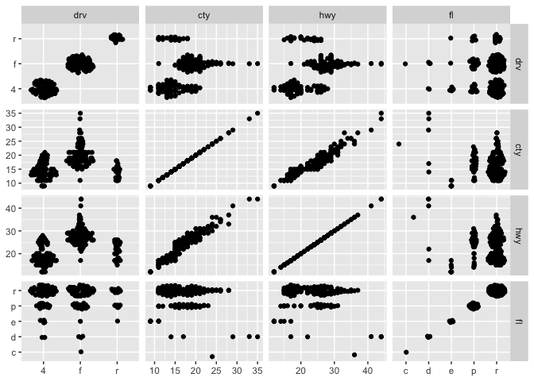
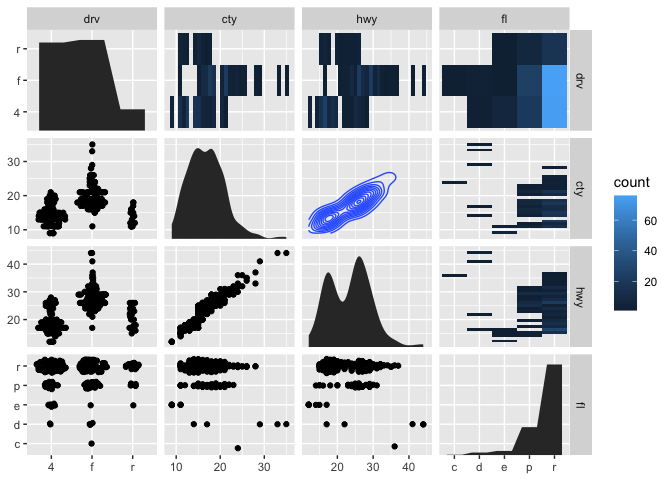

facet_matrix
================
Janet Young

2024-03-06

``` r
knitr::opts_chunk$set(echo = TRUE)
library(tidyverse)
```

    ## ── Attaching core tidyverse packages ──────────────────────── tidyverse 2.0.0 ──
    ## ✔ dplyr     1.1.4     ✔ readr     2.1.4
    ## ✔ forcats   1.0.0     ✔ stringr   1.5.1
    ## ✔ ggplot2   3.5.0     ✔ tibble    3.2.1
    ## ✔ lubridate 1.9.3     ✔ tidyr     1.3.0
    ## ✔ purrr     1.0.2     
    ## ── Conflicts ────────────────────────────────────────── tidyverse_conflicts() ──
    ## ✖ dplyr::filter() masks stats::filter()
    ## ✖ dplyr::lag()    masks stats::lag()
    ## ℹ Use the conflicted package (<http://conflicted.r-lib.org/>) to force all conflicts to become errors

``` r
library(ggforce)
library(palmerpenguins)
library(gridExtra) # for grid.arrange
```

    ## 
    ## Attaching package: 'gridExtra'
    ## 
    ## The following object is masked from 'package:dplyr':
    ## 
    ##     combine

``` r
library(showtext) # For fonts
```

    ## Loading required package: sysfonts
    ## Loading required package: showtextdb

``` r
font_add_google("Roboto Condensed") ## downloads and installs a font
```

``` r
ggplot(mpg) +
  geom_point(aes(x = .panel_x, y = .panel_y)) +
  facet_matrix(vars(displ, cty, hwy))
```

<!-- -->

``` r
# Switch the diagonal, alternate the axes and style strips as axis labels
ggplot(mpg) +
  geom_point(aes(x = .panel_x, y = .panel_y)) +
  facet_matrix(vars(displ, cty, hwy), flip.rows = TRUE,
               alternate.axes = TRUE, switch = 'both') +
  theme(strip.background = element_blank(),
        strip.placement = 'outside',
        strip.text = element_text(size = 12))
```

<!-- -->

``` r
# Mix discrete and continuous columns. Use geom_autopoint for scale-based jitter
ggplot(mpg) +
  geom_autopoint() +
  facet_matrix(vars(drv:fl))
```

<!-- -->

``` r
ggplot(mpg) +
  geom_autopoint() +
  geom_autodensity() +
  facet_matrix(vars(drv:fl), layer.diag = 2)
```

<!-- -->

``` r
ggplot(mpg) +
  geom_autopoint() +
  geom_autodensity() +
  geom_density2d(aes(x = .panel_x, y = .panel_y)) +
  geom_bin2d(aes(x = .panel_x, y = .panel_y)) +
  facet_matrix(vars(drv:fl), layer.lower = 1, layer.diag = 2,
               layer.continuous = -4, layer.discrete = -3, layer.mixed = -3)
```

<!-- -->

``` r
ggplot(mpg) +
  geom_boxplot(aes(x = .panel_x, y = .panel_y, group = .panel_x)) +
  facet_matrix(rows = vars(cty, hwy), cols = vars(drv, fl))
```

<!-- -->

``` r
names <- c("bill_length_mm", "bill_depth_mm", "flipper_length_mm", "body_mass_g")
## ... and create all possible combinations
names_set <- tidyr::expand_grid(names, names)

ggplot(penguins, aes(x = .panel_x, y = .panel_y)) +
  geom_point(aes(color = species), alpha = .5) +
  geom_smooth(aes(color = species), method = "lm") +
  ggforce::geom_autodensity(aes(color = species, fill = after_scale(color)), alpha = .7) +
  scale_color_brewer(palette = "Set2", name = NULL) +
  ggforce::facet_matrix(vars(names), layer.lower = 2, layer.diag = 3)
```

    ## Warning: Using an external vector in selections was deprecated in tidyselect 1.1.0.
    ## ℹ Please use `all_of()` or `any_of()` instead.
    ##   # Was:
    ##   data %>% select(names)
    ## 
    ##   # Now:
    ##   data %>% select(all_of(names))
    ## 
    ## See <https://tidyselect.r-lib.org/reference/faq-external-vector.html>.
    ## This warning is displayed once every 8 hours.
    ## Call `lifecycle::last_lifecycle_warnings()` to see where this warning was
    ## generated.

    ## `geom_smooth()` using formula = 'y ~ x'

    ## Warning: Removed 12 rows containing non-finite outside the scale range
    ## (`stat_smooth()`).

    ## Warning: Removed 8 rows containing non-finite outside the scale range
    ## (`stat_autodensity()`).

    ## Warning: Removed 12 rows containing missing values or values outside the scale range
    ## (`geom_point()`).

<!-- -->

``` r
plot_scatter_lm <-
    function(data,
             var1,
             var2,
             pointsize = 2,
             transparency = .5,
             color = "") {
        ## check if inputs are valid
        if (!exists(substitute(data)))
            stop("data needs to be a data frame.")
        if (!is.data.frame(data))
            stop("data needs to be a data frame.")
        if (!is.numeric(pull(data[var1])))
            stop("Column var1 needs to be of type numeric, passed as string.")
        if (!is.numeric(pull(data[var2])))
            stop("Column var2 needs to be of type numeric, passed as string.")
        if (!is.numeric(pointsize))
            stop("pointsize needs to be of type numeric.")
        if (!is.numeric(transparency))
            stop("transparency needs to be of type numeric.")
        if (color != "") {
            if (!color %in% names(data))
                stop("Column color needs to be a column of data, passed as string.")
        }
        
        g <-
            ggplot(data, aes(x = !!sym(var1), y = !!sym(var2))) +
            geom_point(aes(color = !!sym(color)), size = pointsize, alpha = transparency) +
            geom_smooth(aes(
                color = !!sym(color),
                color = after_scale(prismatic::clr_darken(color, .3))
            ),
            method = "lm",
            se = FALSE) +
            theme_minimal(base_family = "", base_size = 15) +
            theme(panel.grid.minor = element_blank(),
                  legend.position = "top")
        
        if (color != "") {
            if (is.numeric(pull(data[color]))) {
                g <- g + scale_color_viridis_c(direction = -1, end = .85) +
                    guides(color = guide_colorbar(
                        barwidth = unit(12, "lines"),
                        barheight = unit(.6, "lines"),
                        title.position = "top"
                    ))
            } else {
                g <- g + scale_color_brewer(palette = "Set2")
            }
        }
        
        return(g)
    }
```

``` r
all_plots <- pmap(
  names_set, ~plot_scatter_lm(
    data = penguins, 
    var1 = .x, var2 = .y, color = "species"
  )
)
```

    ## Warning: Duplicated aesthetics after name standardisation: colour
    ## Duplicated aesthetics after name standardisation: colour
    ## Duplicated aesthetics after name standardisation: colour
    ## Duplicated aesthetics after name standardisation: colour
    ## Duplicated aesthetics after name standardisation: colour
    ## Duplicated aesthetics after name standardisation: colour
    ## Duplicated aesthetics after name standardisation: colour
    ## Duplicated aesthetics after name standardisation: colour
    ## Duplicated aesthetics after name standardisation: colour
    ## Duplicated aesthetics after name standardisation: colour
    ## Duplicated aesthetics after name standardisation: colour
    ## Duplicated aesthetics after name standardisation: colour
    ## Duplicated aesthetics after name standardisation: colour
    ## Duplicated aesthetics after name standardisation: colour
    ## Duplicated aesthetics after name standardisation: colour
    ## Duplicated aesthetics after name standardisation: colour

``` r
# do.call("grid.arrange", c(all_plots, ncol=4))
# all_plots[[2]]
```
