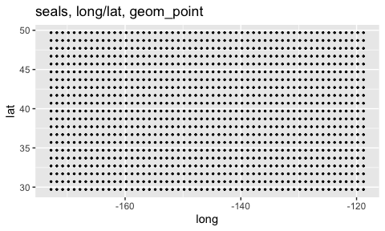
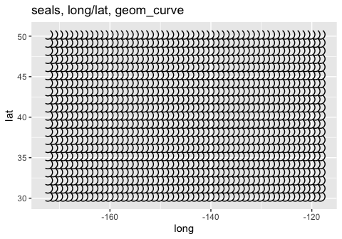
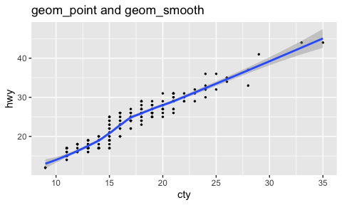

ggplot_demo
================
Janet Young

2023-12-11

Show some examples from the [ggplot2
cheatsheet](https://rstudio.github.io/cheatsheets/html/data-visualization.html)

Graphical primitives

``` r
## economics is a 574-row 6-col tibble. colnames:
# date, pce, pop, psavert, uempmed, unemploy
a <- ggplot(economics, aes(date,unemploy))

## seals is a 1155-row 4-col tibble. colnames:
# lat  long delta_long delta_lat
b <- ggplot(seals, aes(x=long, y=lat))
# ?seals 
# "This vector field was produced from the data described in..."
### each longitude value in seals is present 21 times, each latitude 55 times
# seals %>% count(long) %>% count(n)
# seals %>% count(lat)  %>% count(n)
# it's simply a grid in x-y space
```

``` r
# Ensure limits include values across all plots.
a + geom_blank()
```

<!-- -->

``` r
## they also show + expand_limits()
```

``` r
b + geom_point()
```

<!-- -->

``` r
## this is a wierd thing to demo
b + geom_curve(aes(xend = long + 1, 
                   yend = lat + 1), 
               curvature = 1)
```

<!-- -->

``` r
# Draw a curved line from (x, y) to (xend, yend). 
# aes() arguments: x, xend, y, yend, alpha, angle, color, curvature, linetype, size.
# x and y already existed in b
```

``` r
a + geom_path(lineend = "butt", linejoin = "round", linemitre = 1)
```

<!-- -->

``` r
# Connect observations in the order they appear. aes() arguments: x, y, alpha, color, group, linetype, size.
```

`geom_line()` connects points from left to right `geom_path()` is
similar but connects points in the order they appear in the data so if
data are sorted, the graphs look the same

``` r
a + 
    geom_path(lineend = "butt", linejoin = "round", linemitre = 1) +
    coord_cartesian(xlim=c(date("1970-01-01"),date("1975-01-01")))
```

<!-- -->

``` r
# Connect observations in the order they appear. aes() arguments: x, y, alpha, color, group, linetype, size.
```

Same thing with geom_line - looks the same (because data are sorted,
geom_path IS connected left-to-right, just like geom_line)

``` r
a + 
    geom_line(lineend = "butt", linejoin = "round", linemitre = 1) +
    coord_cartesian(xlim=c(date("1970-01-01"),date("1975-01-01")))
```

<!-- -->

``` r
# Connect observations in the order they appear. aes() arguments: x, y, alpha, color, group, linetype, size.
```

``` r
a + geom_polygon(aes(alpha = 50))
```

<!-- -->

``` r
# Connect points into polygons. aes() arguments: x, y, alpha, color, fill, group, subgroup, linetype, size.
```

geom_rect demo

``` r
## the example given makes it hard to see what's going on , so I sample 30 rows at random
# b + geom_rect(aes(xmin = long, ymin = lat, xmax = long + 1, ymax = lat + 1))
# Draw a rectangle by connecting four corners (xmin, xmax, ymin, ymax). aes() arguments: xmax, xmin, ymax, ymin, alpha, color, fill, linetype, size.
seals %>% 
    slice_sample(n=30) %>% 
    ggplot(aes(xmin = long, ymin = lat, 
               xmax = long + 1, ymax = lat + 1)) + 
    geom_rect()
```

<!-- -->
`geom_ribbon()`

``` r
a + geom_ribbon(aes(ymin = unemploy - 900, 
                    ymax = unemploy + 900))
```

<!-- -->

``` r
# For each x, plot an interval from ymin to ymax. aes() arguments: x, ymax, ymin, alpha, color, fill, group, linetype, size.
```

# two variables

``` r
# mpg is a 234 × 11 tibble, with various car types
e <- ggplot(mpg, aes(cty,hwy))
```

`geom_point()`

``` r
e+geom_point()
```

<!-- -->

``` r
e+geom_point()+geom_smooth()
```

    ## `geom_smooth()` using method = 'loess' and formula = 'y ~ x'

<!-- -->
