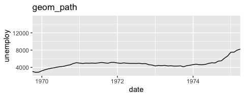
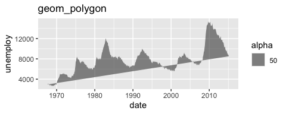

ggplot_demo
================
Janet Young

2025-06-11

``` r
## the above is a good chunk header for chunks that load libraries
library(tidyverse)
```

# Example data and base plots

These commands set up the base plots `a` and `b`, but they have no geom
layer, so nothing is actually plotted

The `economics` dataset is a 574-row 6-col tibble (wide format)
describing how 5 metrics change over time. Column names are date, pce,
pop, psavert, uempmed, unemploy

The `seals` dataset is a 1155-row 4-col tibble that describes how some
animals move. Four columns named lat, long, delta_long, delta_lat

``` r
# date, pce, pop, psavert, uempmed, unemploy
a <- ggplot(economics, aes(date,unemploy))

# lat  long delta_long delta_lat
b <- ggplot(seals, aes(x=long, y=lat))
# ?seals 
# "This vector field was produced from the data described in..."
### each longitude value in seals is present 21 times, each latitude 55 times
# seals %>% count(long) %>% count(n)
# seals %>% count(lat)  %>% count(n)
# it's simply a grid in x-y space
```

# Explore ggplot geoms

Show some examples from the [ggplot2
cheatsheet](https://rstudio.github.io/cheatsheets/html/data-visualization.html)

geom_blank()

``` r
a + geom_blank() + labs(title="economics, date/unemploy, geom_blank")
```

<!-- -->
geom_point()

``` r
b + geom_point(size=0.5) + labs(title="seals, long/lat, geom_point")
```

<!-- -->
geom_curve() draws a curved line from (x, y) to (xend, yend).

aes() arguments: x, xend, y, yend, alpha, angle, color, curvature,
linetype, size.

``` r
## this is a wierd plot
# x and y already existed in b, and we're adding xend and yend
b + geom_curve(aes(xend = long + 1, 
                   yend = lat + 1), 
               curvature = 1) + 
    labs(title="seals, long/lat, geom_curve")
```

<!-- -->
`geom_path()` connects observations in the order they appear.

aes() arguments: x, y, alpha, color, group, linetype, size.

``` r
a + 
    geom_path(lineend = "butt", linejoin = "round", linemitre = 1) +
    labs(title="geom_path")
```

<!-- -->

`geom_line()` connects points from left to right. `geom_path()` is
similar but connects points in the order they appear in the data. If
data are sorted, geom_line() and geom_path plots look the same,
otherwise they’re different.

``` r
a + 
    geom_path(lineend = "butt", linejoin = "round", linemitre = 1) +
    coord_cartesian(xlim=c(date("1970-01-01"),date("1975-01-01"))) +
    labs(title="geom_path")
```

<!-- -->

``` r
# Connect observations in the order they appear. aes() arguments: x, y, alpha, color, group, linetype, size.
```

Same thing with geom_line - looks the same (because data are sorted,
geom_path IS connected left-to-right, just like geom_line)

geom_line() - connect observations in the order they appear. a

geom_line aes() arguments: x, y, alpha, color, group, linetype, size.

``` r
a + 
    geom_line(lineend = "butt", linejoin = "round", linemitre = 1) +
    coord_cartesian(xlim=c(date("1970-01-01"),date("1975-01-01"))) +
    labs(title="geom_line")
```

<!-- -->

`geom_polygon()` - connect points into polygons

aes() arguments: x, y, alpha, color, fill, group, subgroup, linetype,
size.

``` r
a + geom_polygon(aes(alpha = 50)) +
    labs(title="geom_polygon")
```

<!-- -->

`geom_rect()` draws a rectangle by connecting four corners (xmin, xmax,
ymin, ymax).

aes() arguments: xmax, xmin, ymax, ymin, alpha, color, fill, linetype,
size.

the example given makes it hard to see what’s going on, so I sample 30
rows at random

``` r
seals %>% 
    slice_sample(n=30) %>% 
    ggplot(aes(xmin = long, ymin = lat, 
               xmax = long + 1, ymax = lat + 1)) + 
    geom_rect() +
    labs(title="geom_rect")
```

<!-- -->

`geom_ribbon()` - for each x, plot an interval from ymin to ymax.

aes() arguments: x, ymax, ymin, alpha, color, fill, group, linetype,
size.

``` r
a + geom_ribbon(aes(ymin = unemploy - 900, 
                    ymax = unemploy + 900)) +
    labs(title="geom_ribbon")
```

<!-- --> Plots
using `mpg` dataset - a 234 × 11 tibble, showing data for various car
types

``` r
e <- ggplot(mpg, aes(cty,hwy))
```

`geom_point()`

``` r
e + 
    geom_point(size=0.5) +
    labs(title="mpg, geom_point")
```

<!-- -->

geom_smooth()

``` r
e + 
    geom_point(size=0.5) + 
    geom_smooth() +
    labs(title="geom_point and geom_smooth")
```

    ## `geom_smooth()` using method = 'loess' and formula = 'y ~ x'

<!-- -->

# `annotate()` versus `geom_text()`

annotate() is better than geom_text() for some uses.

Demo based on
[rfortherestofus](https://rfortherestofus.com/2023/10/annotate-vs-geoms)

- use geom_text if the data itself should drive text labels
- use annotate if you’re manually adding labels

Example where annotate is better

``` r
scatterplot <- palmerpenguins::penguins |> 
    select(bill_length_mm, flipper_length_mm, species) |> 
    drop_na()|> 
    ggplot(aes(bill_length_mm, flipper_length_mm, col = species)) +
    geom_point(size = 2.5) +
    labs(
        x = 'Bill length (in mm)',
        y = 'Flipper length (in mm)',
        col = 'Species',
        title = 'Measurements of different Penguin Species'
    ) +
    theme_minimal(base_size = 16) +
    theme(legend.position = 'top')
```

Here we use `geom_text()` and it looks bad, because it is still drawing
stuff (color) from the data passed in, and that’s not what we want

``` r
scatterplot +
  geom_text(
    x = 35,
    y = 217.5,
    label = 'Important penguins',
    fontface = 'bold', # makes text bold
    size = 4.5 # font size
  )
```

<!-- -->

Here we use `annotate()` instead and it ignores the data

``` r
scatterplot +
  annotate(
    'text',
    x = 35,
    y = 217.5,
    label = 'Important penguins',
    fontface = 'bold', 
    size = 4.5
  )
```

<!-- -->

# shadowtext package

Demo from
[rfortherestofus](https://rfortherestofus.com/2024/05/shadowtext-ggplot)

Mostly I don’t like the way shadowtext looks, but it could be really
useful if we’re putting words over the top of some other dense data,
e.g. words on top of a map benefit from a white shadow

``` r
### to install missing fonts:
# library(showtext) # For fonts
# font_add_google("Source Sans Pro") ## downloads and installs a font, except I don't think it necessarily makes the font available always?  maybe I need to restart the computer before I can use it?
# grep("Source", system_fonts()$name, value=TRUE)
# grep("Times", system_fonts()$name, value=TRUE)
# grep("Arial", system_fonts()$name, value=TRUE)
```

``` r
library(shadowtext)
library(palmerpenguins)
```

``` r
## define labelling info
species_labels_tib <- tibble(
    species = c('Adelie', 'Gentoo', 'Chinstrap'),
    x = c(35, 43, 53),
    y = c(210, 229, 178)
)
```

We can use geom_shadowtext() pretty much the same as we’d use
geom_label, using bg.color to tell it the color of the shadow.

``` r
## the plot
penguins |> 
    drop_na() |>
    ggplot(
        aes(bill_length_mm, flipper_length_mm, fill = species)
    ) +
    geom_point(shape = 21, size = 2) +
    geom_shadowtext(
        data = species_labels_tib,
        aes(x, y, col = species, label = species),
        size = 6,
        fontface = 'bold',
        family = 'ArialMT',
        bg.color = 'grey10',
    )  +
    theme_minimal(base_size = 16, base_family = 'ArialMT') +
    theme(legend.position = 'none')
```

<!-- -->

# wrapping text in ggplot

`str_wrap()` - you have to figure out width manually, which can be
tedious

``` r
penguins |> 
    count(island) |>
    ggplot(aes(x=island, y=n)) +
    geom_col() +
    labs(title="a short title",
         subtitle=str_wrap("a really long title. kasjdhf ;isjdghf khg kajsxdhf khg alsidgf kjhg ljhags dfj hgkjahsdgfkjhg a  ljhsdgf ljhglsdjhfg", width=50))
```

<!-- -->

Instead use `ggtext` package - the element_textbox_simple will
automatically wrap text to fit whatever space is available.

``` r
library(ggtext)
```

``` r
penguins |> 
    count(island) |>
    ggplot(aes(x=island, y=n)) +
    geom_col() +
    labs(title="a short title",
         subtitle="a really long title. kasjdhf ;isjdghf khg kajsdhf khg alsidgf kjhg ljhags dfj hgkjahsdgfkjhg a  ljhsdgf ljhglsdjhfg") +
    theme(plot.subtitle = element_textbox_simple())
```

<!-- -->

Maybe we need to wrap facet labels - we can use the label_wrap_gen
function

``` r
theme_set(theme_bw(16))
df <- data.frame(measurement = rnorm(20,mean=30), 
                 group = c(rep('A really long group variable name that needs to be wrapped',10),
                           rep('group1',10)), 
                 sex = c(rep(c('M','F'),10)))

df %>%
    ggplot(aes(sex, measurement, color = sex)) +
    geom_boxplot() +
    facet_wrap(~group, labeller = label_wrap_gen(width=24))+
    theme(legend.position="none")
```

<!-- -->

# discontinuous axes using `ggbreak` package

`ggbreak` package
[vignette](https://cran.r-project.org/web/packages/ggbreak/vignettes/ggbreak.html)

``` r
library(ggbreak) 
library(patchwork)
```

there is a blank plot below, as well as the intended plots, but it
doesn’t appear when you knit to html or github_document

``` r
set.seed(2019-01-19)
d <- data.frame(x = 1:20,
                y = c(rnorm(5) + 4, rnorm(5) + 20, rnorm(5) + 5, rnorm(5) + 22)
)

p1 <- ggplot(d, aes(y, x)) + 
    geom_col(orientation="y") +
    theme_minimal() +
    labs(title="ordinary x-axis")
p2 <- p1 + 
    scale_x_break(c(7, 17)) + # from ggbreak
    labs(title="broken x-axis")


p1 + p2
```

<!-- -->

# Finished

``` r
sessionInfo()
```

    ## R version 4.5.0 (2025-04-11)
    ## Platform: aarch64-apple-darwin20
    ## Running under: macOS Sequoia 15.5
    ## 
    ## Matrix products: default
    ## BLAS:   /Library/Frameworks/R.framework/Versions/4.5-arm64/Resources/lib/libRblas.0.dylib 
    ## LAPACK: /Library/Frameworks/R.framework/Versions/4.5-arm64/Resources/lib/libRlapack.dylib;  LAPACK version 3.12.1
    ## 
    ## locale:
    ## [1] en_US.UTF-8/en_US.UTF-8/en_US.UTF-8/C/en_US.UTF-8/en_US.UTF-8
    ## 
    ## time zone: America/Los_Angeles
    ## tzcode source: internal
    ## 
    ## attached base packages:
    ## [1] stats     graphics  grDevices utils     datasets  methods   base     
    ## 
    ## other attached packages:
    ##  [1] patchwork_1.3.0      ggbreak_0.1.4        ggtext_0.1.2        
    ##  [4] palmerpenguins_0.1.1 shadowtext_0.1.4     lubridate_1.9.4     
    ##  [7] forcats_1.0.0        stringr_1.5.1        dplyr_1.1.4         
    ## [10] purrr_1.0.4          readr_2.1.5          tidyr_1.3.1         
    ## [13] tibble_3.2.1         ggplot2_3.5.2        tidyverse_2.0.0     
    ## 
    ## loaded via a namespace (and not attached):
    ##  [1] yulab.utils_0.2.0  generics_0.1.4     ggplotify_0.1.2    xml2_1.3.8        
    ##  [5] stringi_1.8.7      lattice_0.22-6     hms_1.1.3          digest_0.6.37     
    ##  [9] magrittr_2.0.3     evaluate_1.0.3     grid_4.5.0         timechange_0.3.0  
    ## [13] RColorBrewer_1.1-3 fastmap_1.2.0      Matrix_1.7-3       mgcv_1.9-1        
    ## [17] aplot_0.2.5        scales_1.4.0       cli_3.6.5          rlang_1.1.6       
    ## [21] litedown_0.7       commonmark_1.9.5   splines_4.5.0      withr_3.0.2       
    ## [25] yaml_2.3.10        tools_4.5.0        tzdb_0.5.0         gridGraphics_0.5-1
    ## [29] vctrs_0.6.5        R6_2.6.1           lifecycle_1.0.4    ggfun_0.1.8       
    ## [33] fs_1.6.6           pkgconfig_2.0.3    pillar_1.10.2      gtable_0.3.6      
    ## [37] glue_1.8.0         Rcpp_1.0.14        xfun_0.52          tidyselect_1.2.1  
    ## [41] rstudioapi_0.17.1  knitr_1.50         farver_2.1.2       htmltools_0.5.8.1 
    ## [45] nlme_3.1-168       rmarkdown_2.29     labeling_0.4.3     compiler_4.5.0    
    ## [49] markdown_2.0       gridtext_0.1.5
