ggplot_demo
================
Janet Young

2025-06-12

# Goal

Simply explore the different available geoms

``` r
## the above is a good chunk header for chunks that load libraries
library(tidyverse)
```

# Example data and base plots

These commands set up the base plots `a` and `b`, but they have no geom
layer, so nothing is actually plotted

The `economics` dataset is a 574-row 6-col tibble (wide format)
describing how 5 metrics change over time. Column names are date, pce,
pop, psavert, uempmed, unemploy

The `seals` dataset is a 1155-row 4-col tibble that describes how some
animals move. Four columns named lat, long, delta_long, delta_lat

``` r
# date, pce, pop, psavert, uempmed, unemploy
a <- ggplot(economics, aes(date,unemploy))

# lat  long delta_long delta_lat
b <- ggplot(seals, aes(x=long, y=lat))
# ?seals 
# "This vector field was produced from the data described in..."
### each longitude value in seals is present 21 times, each latitude 55 times
# seals |> count(long) |> count(n)
# seals |> count(lat)  |> count(n)
# it's simply a grid in x-y space
```

# Explore ggplot geoms

Show some examples from the [ggplot2
cheatsheet](https://rstudio.github.io/cheatsheets/html/data-visualization.html)

geom_blank()

``` r
a + geom_blank() + labs(title="economics, date/unemploy, geom_blank")
```

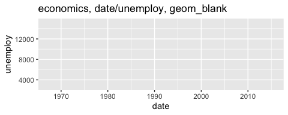<!-- -->
geom_point()

``` r
b + geom_point(size=0.5) + labs(title="seals, long/lat, geom_point")
```

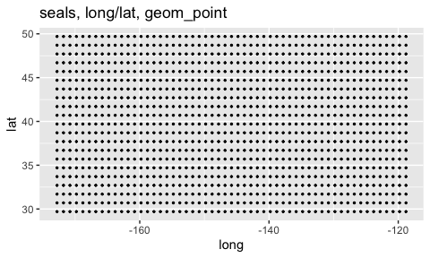<!-- -->
geom_curve() draws a curved line from (x, y) to (xend, yend).

aes() arguments: x, xend, y, yend, alpha, angle, color, curvature,
linetype, size.

``` r
## this is a wierd plot
# x and y already existed in b, and we're adding xend and yend
b + geom_curve(aes(xend = long + 1, 
                   yend = lat + 1), 
               curvature = 1) + 
    labs(title="seals, long/lat, geom_curve")
```

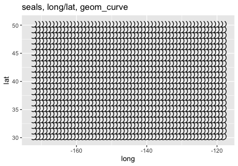<!-- -->
`geom_path()` connects observations in the order they appear.

aes() arguments: x, y, alpha, color, group, linetype, size.

``` r
a + 
    geom_path(lineend = "butt", linejoin = "round", linemitre = 1) +
    labs(title="geom_path")
```

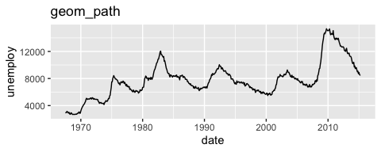<!-- -->

`geom_line()` connects points from left to right. `geom_path()` is
similar but connects points in the order they appear in the data. If
data are sorted, geom_line() and geom_path plots look the same,
otherwise they’re different.

``` r
a + 
    geom_path(lineend = "butt", linejoin = "round", linemitre = 1) +
    coord_cartesian(xlim=c(date("1970-01-01"),date("1975-01-01"))) +
    labs(title="geom_path")
```

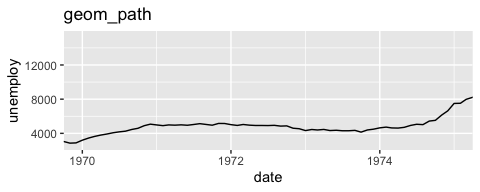<!-- -->

``` r
# Connect observations in the order they appear. aes() arguments: x, y, alpha, color, group, linetype, size.
```

Same thing with geom_line - looks the same (because data are sorted,
geom_path IS connected left-to-right, just like geom_line)

geom_line() - connect observations in the order they appear. a

geom_line aes() arguments: x, y, alpha, color, group, linetype, size.

``` r
a + 
    geom_line(lineend = "butt", linejoin = "round", linemitre = 1) +
    coord_cartesian(xlim=c(date("1970-01-01"),date("1975-01-01"))) +
    labs(title="geom_line")
```

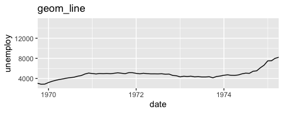<!-- -->

`geom_polygon()` - connect points into polygons

aes() arguments: x, y, alpha, color, fill, group, subgroup, linetype,
size.

``` r
a + geom_polygon(aes(alpha = 50)) +
    labs(title="geom_polygon")
```

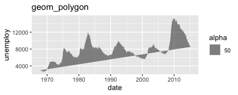<!-- -->

`geom_rect()` draws a rectangle by connecting four corners (xmin, xmax,
ymin, ymax).

aes() arguments: xmax, xmin, ymax, ymin, alpha, color, fill, linetype,
size.

the example given makes it hard to see what’s going on, so I sample 30
rows at random

``` r
seals |> 
    slice_sample(n=30) |> 
    ggplot(aes(xmin = long, ymin = lat, 
               xmax = long + 1, ymax = lat + 1)) + 
    geom_rect() +
    labs(title="geom_rect")
```

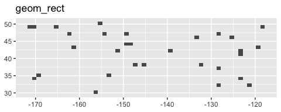<!-- -->

`geom_ribbon()` - for each x, plot an interval from ymin to ymax.

aes() arguments: x, ymax, ymin, alpha, color, fill, group, linetype,
size.

``` r
a + geom_ribbon(aes(ymin = unemploy - 900, 
                    ymax = unemploy + 900)) +
    labs(title="geom_ribbon")
```

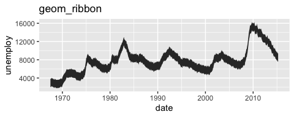<!-- -->
Plots using `mpg` dataset - a 234 × 11 tibble, showing data for various
car types

``` r
e <- ggplot(mpg, aes(cty,hwy))
```

`geom_point()`

``` r
e + 
    geom_point(size=0.5) +
    labs(title="mpg, geom_point")
```

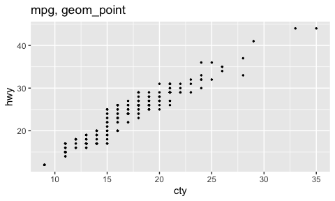<!-- -->

geom_smooth()

``` r
e + 
    geom_point(size=0.5) + 
    geom_smooth() +
    labs(title="geom_point and geom_smooth")
```

    ## `geom_smooth()` using method = 'loess' and formula = 'y ~ x'

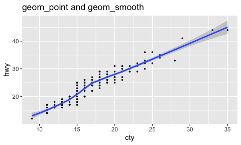<!-- -->

# Finished

``` r
sessionInfo()
```

    ## R version 4.5.0 (2025-04-11)
    ## Platform: aarch64-apple-darwin20
    ## Running under: macOS Sequoia 15.5
    ## 
    ## Matrix products: default
    ## BLAS:   /Library/Frameworks/R.framework/Versions/4.5-arm64/Resources/lib/libRblas.0.dylib 
    ## LAPACK: /Library/Frameworks/R.framework/Versions/4.5-arm64/Resources/lib/libRlapack.dylib;  LAPACK version 3.12.1
    ## 
    ## locale:
    ## [1] en_US.UTF-8/en_US.UTF-8/en_US.UTF-8/C/en_US.UTF-8/en_US.UTF-8
    ## 
    ## time zone: America/Los_Angeles
    ## tzcode source: internal
    ## 
    ## attached base packages:
    ## [1] stats     graphics  grDevices utils     datasets  methods   base     
    ## 
    ## other attached packages:
    ##  [1] lubridate_1.9.4 forcats_1.0.0   stringr_1.5.1   dplyr_1.1.4    
    ##  [5] purrr_1.0.4     readr_2.1.5     tidyr_1.3.1     tibble_3.2.1   
    ##  [9] ggplot2_3.5.2   tidyverse_2.0.0
    ## 
    ## loaded via a namespace (and not attached):
    ##  [1] Matrix_1.7-3       gtable_0.3.6       compiler_4.5.0     tidyselect_1.2.1  
    ##  [5] splines_4.5.0      scales_1.4.0       yaml_2.3.10        fastmap_1.2.0     
    ##  [9] lattice_0.22-6     R6_2.6.1           labeling_0.4.3     generics_0.1.4    
    ## [13] knitr_1.50         pillar_1.10.2      RColorBrewer_1.1-3 tzdb_0.5.0        
    ## [17] rlang_1.1.6        stringi_1.8.7      xfun_0.52          timechange_0.3.0  
    ## [21] cli_3.6.5          mgcv_1.9-1         withr_3.0.2        magrittr_2.0.3    
    ## [25] digest_0.6.37      grid_4.5.0         rstudioapi_0.17.1  hms_1.1.3         
    ## [29] nlme_3.1-168       lifecycle_1.0.4    vctrs_0.6.5        evaluate_1.0.3    
    ## [33] glue_1.8.0         farver_2.1.2       rmarkdown_2.29     tools_4.5.0       
    ## [37] pkgconfig_2.0.3    htmltools_0.5.8.1
