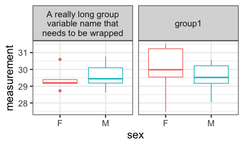

ggplot_tips_and_tricks
================
Janet Young

2025-10-29

# Goal

A place to collect various ggplot tips and tricks

``` r
## the above is a good chunk header for chunks that load libraries
knitr::opts_chunk$set(echo = TRUE)
library(tidyverse)
```

# Public ggplot2 resources

[ggplot2 gallery](https://www.r-graph-gallery.com/ggplot2-package.html)

[ggplot2 extensions
gallery](https://exts.ggplot2.tidyverse.org/gallery/) - shows various
packages that extent ggplot. Examples (but there are many many more): -
patchwork and cowplot to combine plots - gganimate - ggstatsplot (and
ggsignif) to add results of statistical tests, - gggenomes and gggenes

A ggplot
[tutorial](https://rgup.gitlab.io/research_cycle/02_ggplot.html)

[Demos](https://www.datanovia.com/en/lessons/combine-multiple-ggplots-into-a-figure/#google_vignette)
of how to combine \>1 plot into a figure. Packages:

- gridExtra::grid.arrange()
- cowplot::plot_grid()
- patchwork::plot_layout()
- ggpubr::ggarrange()

<https://www.thoughtworks.com/insights/blog/coding-habits-data-scientists>

# ggplot2 versions

ggplot2 version 4 is a big change, and may break some things in other
packages.

I don’t want to update to it yet. That may mean I need to use older
versions of some other packages.

Here’s how I can install a particular archive version of a package once
I identify the URL on CRAN:

``` r
# ### revert back to ggplot 3.5.2 - this is from 2025-04-09 
# ## version 4.0.0 is
# packageurl <- "http://cran.r-project.org/src/contrib/Archive/ggplot2/ggplot2_3.5.2.tar.gz"
# install.packages(packageurl, repos=NULL, type="source")

### revert back to GGally 2.2.1 (2024-02-14). Newer versions need ggplot2 version 4.4.0
# # GGally_2.2.0.tar.gz
# packageurl <- "http://cran.r-project.org/src/contrib/Archive/GGally/GGally_2.2.1.tar.gz"
# install.packages(packageurl, repos=NULL, type="source")
```

# Adding median dots to violin plots: geom_violin + stat_summary

Purpose: make violin plots, and add statistical summaries (e.g. a dot
for the median)

I often have trouble getting the statistical summary (median dot) to
line up correctly if I’ve got subgroupings for the violins. The trick is
something to do with putting `position=position_dodge(width=0.9)` in the
stat_summary call

``` r
mtcars %>% ggplot(aes(x=factor(cyl), y=mpg, fill = factor(am))) + 
    geom_violin(scale = "width") + 
    stat_summary(fun = "mean", colour = "black", 
                 position=position_dodge(width=0.9),
                 size = 2, geom = "point")
```

<!-- -->

# Annotating plots - `annotate()` versus `geom_text()`

`annotate()` is better than `geom_text()` for some uses.

Demo based on
[rfortherestofus](https://rfortherestofus.com/2023/10/annotate-vs-geoms)

- use geom_text if the data itself should drive text labels
- use annotate if you’re manually adding labels

Example where annotate is better

``` r
scatterplot <- palmerpenguins::penguins |> 
    select(bill_length_mm, flipper_length_mm, species) |> 
    drop_na()|> 
    ggplot(aes(bill_length_mm, flipper_length_mm, col = species)) +
    geom_point(size = 2.5) +
    labs(
        x = 'Bill length (in mm)',
        y = 'Flipper length (in mm)',
        col = 'Species',
        title = 'Measurements of different Penguin Species'
    ) +
    theme_minimal(base_size = 16) +
    theme(legend.position = 'top')
```

Here we use `geom_text()` and it looks bad, because it is still drawing
stuff (color) from the data passed in, and that’s not what we want

``` r
scatterplot +
  geom_text(
    x = 35,
    y = 217.5,
    label = 'Important penguins',
    fontface = 'bold', # makes text bold
    size = 4.5 # font size
  )
```

<!-- -->

Here we use `annotate()` instead and it ignores the data

``` r
scatterplot +
  annotate(
    'text',
    x = 35,
    y = 217.5,
    label = 'Important penguins',
    fontface = 'bold', 
    size = 4.5
  )
```

<!-- -->

# Explore `shadowtext` package

Demo from
[rfortherestofus](https://rfortherestofus.com/2024/05/shadowtext-ggplot)

Mostly I don’t like the way shadowtext looks, but it could be really
useful if we’re putting words over the top of some other dense data,
e.g. words on top of a map benefit from a white shadow

``` r
### revert back to shadowtext 0.1.4 (2024-07-18). Newer versions need ggplot2 version 4.4.0
# packageurl <- "https://cran.r-project.org/src/contrib/Archive/shadowtext/shadowtext_0.1.4.tar.gz"
# install.packages(packageurl, repos=NULL, type="source")
```

``` r
### to install missing fonts:
# library(showtext) # For fonts
# font_add_google("Source Sans Pro") ## downloads and installs a font, except I don't think it necessarily makes the font available always?  maybe I need to restart the computer before I can use it?
# grep("Source", system_fonts()$name, value=TRUE)
# grep("Times", system_fonts()$name, value=TRUE)
# grep("Arial", system_fonts()$name, value=TRUE)
```

``` r
library(shadowtext)
library(palmerpenguins)
```

``` r
## define labelling info
species_labels_tib <- tibble(
    species = c('Adelie', 'Gentoo', 'Chinstrap'),
    x = c(35, 43, 53),
    y = c(210, 229, 178)
)
```

We can use geom_shadowtext() pretty much the same as we’d use
geom_label, using bg.color to tell it the color of the shadow.

``` r
## the plot
penguins |> 
    drop_na() |>
    ggplot(
        aes(bill_length_mm, flipper_length_mm, fill = species)
    ) +
    geom_point(shape = 21, size = 2) +
    geom_shadowtext(
        data = species_labels_tib,
        aes(x, y, col = species, label = species),
        size = 6,
        fontface = 'bold',
        family = 'ArialMT',
        bg.color = 'grey10',
    )  +
    theme_minimal(base_size = 16, base_family = 'ArialMT') +
    theme(legend.position = 'none')
```

<!-- -->

# Wrapping text over \>1 line in ggplot

`str_wrap()` - you have to figure out width manually, which can be
tedious

``` r
penguins |> 
    count(island) |>
    ggplot(aes(x=island, y=n)) +
    geom_col() +
    labs(title="a short title",
         subtitle=str_wrap("a really long title. kasjdhf ;isjdghf khg kajsxdhf khg alsidgf kjhg ljhags dfj hgkjahsdgfkjhg a  ljhsdgf ljhglsdjhfg", width=50))
```

<!-- -->

Instead use `ggtext` package - the element_textbox_simple will
automatically wrap text to fit whatever space is available.

``` r
library(ggtext)
```

``` r
penguins |> 
    count(island) |>
    ggplot(aes(x=island, y=n)) +
    geom_col() +
    labs(title="a short title",
         subtitle="a really long title. kasjdhf ;isjdghf khg kajsdhf khg alsidgf kjhg ljhags dfj hgkjahsdgfkjhg a  ljhsdgf ljhglsdjhfg") +
    theme(plot.subtitle = element_textbox_simple())
```

<!-- -->

Maybe we need to wrap facet labels - we can use the label_wrap_gen
function

``` r
theme_set(theme_bw(16))
df <- data.frame(measurement = rnorm(20,mean=30), 
                 group = c(rep('A really long group variable name that needs to be wrapped',10),
                           rep('group1',10)), 
                 sex = c(rep(c('M','F'),10)))

df %>%
    ggplot(aes(sex, measurement, color = sex)) +
    geom_boxplot() +
    facet_wrap(~group, labeller = label_wrap_gen(width=24))+
    theme(legend.position="none")
```

<!-- -->

# Discontinuous axes using `ggbreak` package

`ggbreak` package
[vignette](https://cran.r-project.org/web/packages/ggbreak/vignettes/ggbreak.html)

``` r
library(ggbreak) 
library(patchwork)
```

there is a blank plot below, as well as the intended plots, but it
doesn’t appear when you knit to html or github_document

``` r
set.seed(2019-01-19)
d <- data.frame(x = 1:20,
                y = c(rnorm(5) + 4, rnorm(5) + 20, rnorm(5) + 5, rnorm(5) + 22)
)

p1 <- ggplot(d, aes(y, x)) + 
    geom_col(orientation="y") +
    theme_minimal() +
    labs(title="ordinary x-axis")
p2 <- p1 + 
    scale_x_break(c(7, 17)) + # from ggbreak
    labs(title="broken x-axis")


p1 + p2
```

<!-- -->

# Finished

``` r
sessionInfo()
```

    ## R version 4.5.1 (2025-06-13)
    ## Platform: aarch64-apple-darwin20
    ## Running under: macOS Sequoia 15.7.1
    ## 
    ## Matrix products: default
    ## BLAS:   /Library/Frameworks/R.framework/Versions/4.5-arm64/Resources/lib/libRblas.0.dylib 
    ## LAPACK: /Library/Frameworks/R.framework/Versions/4.5-arm64/Resources/lib/libRlapack.dylib;  LAPACK version 3.12.1
    ## 
    ## locale:
    ## [1] en_US.UTF-8/en_US.UTF-8/en_US.UTF-8/C/en_US.UTF-8/en_US.UTF-8
    ## 
    ## time zone: America/Los_Angeles
    ## tzcode source: internal
    ## 
    ## attached base packages:
    ## [1] stats     graphics  grDevices utils     datasets  methods   base     
    ## 
    ## other attached packages:
    ##  [1] patchwork_1.3.2      ggbreak_0.1.6        ggtext_0.1.2        
    ##  [4] palmerpenguins_0.1.1 shadowtext_0.1.4     lubridate_1.9.4     
    ##  [7] forcats_1.0.0        stringr_1.5.2        dplyr_1.1.4         
    ## [10] purrr_1.1.0          readr_2.1.5          tidyr_1.3.1         
    ## [13] tibble_3.3.0         ggplot2_3.5.2        tidyverse_2.0.0     
    ## 
    ## loaded via a namespace (and not attached):
    ##  [1] yulab.utils_0.2.1  rappdirs_0.3.3     generics_0.1.4     ggplotify_0.1.3   
    ##  [5] xml2_1.4.0         stringi_1.8.7      hms_1.1.3          digest_0.6.37     
    ##  [9] magrittr_2.0.4     evaluate_1.0.5     grid_4.5.1         timechange_0.3.0  
    ## [13] RColorBrewer_1.1-3 fastmap_1.2.0      aplot_0.2.9        scales_1.4.0      
    ## [17] cli_3.6.5          rlang_1.1.6        litedown_0.7       commonmark_2.0.0  
    ## [21] withr_3.0.2        yaml_2.3.10        tools_4.5.1        tzdb_0.5.0        
    ## [25] gridGraphics_0.5-1 vctrs_0.6.5        R6_2.6.1           lifecycle_1.0.4   
    ## [29] ggfun_0.2.0        fs_1.6.6           pkgconfig_2.0.3    pillar_1.11.1     
    ## [33] gtable_0.3.6       glue_1.8.0         Rcpp_1.1.0         xfun_0.53         
    ## [37] tidyselect_1.2.1   rstudioapi_0.17.1  knitr_1.50         farver_2.1.2      
    ## [41] htmltools_0.5.8.1  rmarkdown_2.29     labeling_0.4.3     compiler_4.5.1    
    ## [45] markdown_2.0       gridtext_0.1.5
