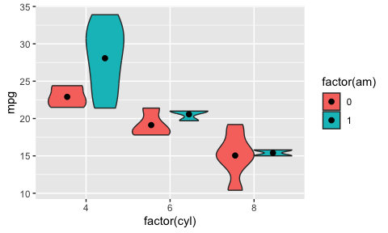
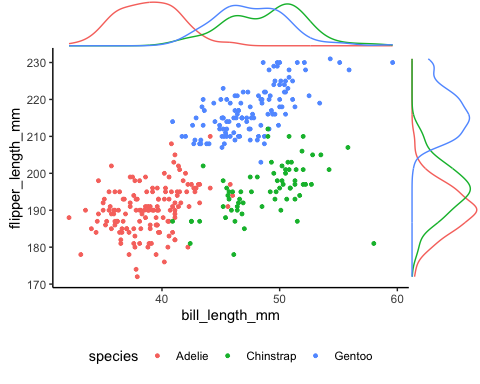
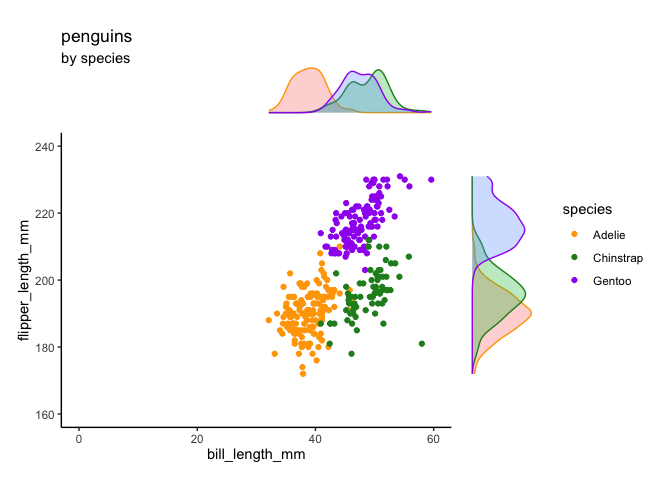

ggplot_tips_and_tricks
================
Janet Young

2025-11-03

# Goal

A place to collect various ggplot tips and tricks

``` r
## the above is a good chunk header for chunks that load libraries
knitr::opts_chunk$set(echo = TRUE)
library(tidyverse)
library(patchwork)
library(here)
library(palmerpenguins)

library(ggExtra)  ## for ggMarginal
library(shadowtext)
library(ggtext)
library(ggbreak) 

### for my_ggMarginal:
source(here("useful_functions/other_functions.R"))
```

# Public ggplot2 resources

[ggplot2 gallery](https://www.r-graph-gallery.com/ggplot2-package.html)

[ggplot2 extensions
gallery](https://exts.ggplot2.tidyverse.org/gallery/) - shows various
packages that extent ggplot. Examples (but there are many many more): -
patchwork and cowplot to combine plots - gganimate - ggstatsplot (and
ggsignif) to add results of statistical tests, - gggenomes and gggenes

A ggplot
[tutorial](https://rgup.gitlab.io/research_cycle/02_ggplot.html)

[Demos](https://www.datanovia.com/en/lessons/combine-multiple-ggplots-into-a-figure/#google_vignette)
of how to combine \>1 plot into a figure. Packages:

- gridExtra::grid.arrange()
- cowplot::plot_grid()
- patchwork::plot_layout()
- ggpubr::ggarrange()

<https://www.thoughtworks.com/insights/blog/coding-habits-data-scientists>

# ggplot2 versions

ggplot2 version 4 is a big change, and may break some things in other
packages.

I don’t want to update to it yet. That may mean I need to use older
versions of some other packages.

Here’s how I can install a particular archive version of a package once
I identify the URL on CRAN:

``` r
# ### revert back to ggplot 3.5.2 - this is from 2025-04-09 
# ## version 4.0.0 is
# packageurl <- "http://cran.r-project.org/src/contrib/Archive/ggplot2/ggplot2_3.5.2.tar.gz"
# install.packages(packageurl, repos=NULL, type="source")

### revert back to GGally 2.2.1 (2024-02-14). Newer versions need ggplot2 version 4.4.0
# # GGally_2.2.0.tar.gz
# packageurl <- "http://cran.r-project.org/src/contrib/Archive/GGally/GGally_2.2.1.tar.gz"
# install.packages(packageurl, repos=NULL, type="source")
```

# Adding individual data points to grouped/filled boxplots and getting the aligned

The trick is that we need to ‘dodge’ the points, using
`geom_point(position=position_jitterdodge())` (or we could have used
`position_dodge` if we don’t want the jitter)

``` r
iris_plus_groups <- iris %>% 
    as_tibble() %>% 
    mutate(group = sample(1:2, size=nrow(iris), replace=TRUE)) %>% 
    mutate(group=paste0("group_", group)) 

iris_plus_groups %>% 
    ggplot(aes(x=Species, y=Sepal.Length, color=group)) +
    geom_boxplot() +
    geom_point(position=position_jitterdodge(jitter.width = 0.12)) +
    theme_classic()
```

<!-- -->

If there’s an empty group, widths and spacing get weird (see left plot
below), so we do
`geom_boxplot(position = position_dodge(preserve = "single"))` (see
right plot below).

``` r
p1 <- iris_plus_groups %>% 
    filter( ! (Species=="versicolor" & group=="group_2")  ) %>% 
    ggplot(aes(x=Species, y=Sepal.Length, color=group)) +
    geom_boxplot() +
    theme_classic()
 p2 <- iris_plus_groups %>% 
    filter( ! (Species=="versicolor" & group=="group_2")  ) %>% 
    ggplot(aes(x=Species, y=Sepal.Length, color=group)) +
    geom_boxplot(position = position_dodge(preserve = "single")) +
    theme_classic()
(p1 + p2) +
     plot_layout(guides="collect")
```

<!-- -->

The `position_dodge2` function gives ALMOST the same outputas
`position_dodge`, but the alignment of the ‘versicolor’ box is
different:

``` r
iris_plus_groups %>% 
    filter( ! (Species=="versicolor" & group=="group_2")  ) %>% 
    ggplot(aes(x=Species, y=Sepal.Length, color=group)) +
    geom_boxplot(position = position_dodge2(preserve = "single")) +
    theme_classic()
```

<!-- -->

To ALSO add geom_point and keep them lined up is tricky! This might be
fixed in newer versions of ggplot2 - there are a few related bug
reports. In the meantime this is a workaround (given
[here](https://github.com/tidyverse/ggplot2/issues/2712)) - we have to
use `position_dodge2` for the boxplots and `position_jitterdodge` for
the points:

``` r
iris_plus_groups %>% 
    filter( ! (Species=="versicolor" & group=="group_2")  ) %>% 
    ggplot(aes(x=Species, y=Sepal.Length, color=group)) + 
    geom_boxplot(position = position_dodge2(0.75, preserve = 'single')) +
    geom_point(position = position_jitterdodge(dodge.width=0.75, jitter.width=0.15))+
    theme_classic()
```

<!-- -->

# Adding median dots to violin plots: geom_violin + stat_summary

Purpose: make violin plots, and add statistical summaries (e.g. a dot
for the median)

I often have trouble getting the statistical summary (median dot) to
line up correctly if I’ve got subgroupings for the violins. The trick is
something to do with putting `position=position_dodge(width=0.9)` in the
stat_summary call

``` r
mtcars %>% ggplot(aes(x=factor(cyl), y=mpg, fill = factor(am))) + 
    geom_violin(scale = "width") + 
    stat_summary(fun = "mean", colour = "black", 
                 position=position_dodge(width=0.9),
                 size = 2, geom = "point")
```

<!-- -->

# Annotating plots - `annotate()` versus `geom_text()`

`annotate()` is better than `geom_text()` for some uses.

Demo based on
[rfortherestofus](https://rfortherestofus.com/2023/10/annotate-vs-geoms)

- use geom_text if the data itself should drive text labels
- use annotate if you’re manually adding labels

Example where annotate is better

``` r
scatterplot <- palmerpenguins::penguins %>% 
    select(bill_length_mm, flipper_length_mm, species) %>% 
    drop_na()%>% 
    ggplot(aes(bill_length_mm, flipper_length_mm, col = species)) +
    geom_point(size = 2.5) +
    labs(
        x = 'Bill length (in mm)',
        y = 'Flipper length (in mm)',
        col = 'Species',
        title = 'Measurements of different Penguin Species'
    ) +
    theme_minimal(base_size = 16) +
    theme(legend.position = 'top')
```

Here we use `geom_text()` and it looks bad, because it is still drawing
stuff (color) from the data passed in, and that’s not what we want

``` r
scatterplot +
    geom_text(
        x = 35,
        y = 217.5,
        label = 'Important penguins',
        fontface = 'bold', # makes text bold
        size = 4.5 # font size
    )
```

<!-- -->

Here we use `annotate()` instead and it ignores the data

``` r
scatterplot +
    annotate(
        'text',
        x = 35,
        y = 217.5,
        label = 'Important penguins',
        fontface = 'bold', 
        size = 4.5
    )
```

<!-- -->

# Explore `shadowtext` package

Demo from
[rfortherestofus](https://rfortherestofus.com/2024/05/shadowtext-ggplot)

Mostly I don’t like the way shadowtext looks, but it could be really
useful if we’re putting words over the top of some other dense data,
e.g. words on top of a map benefit from a white shadow

``` r
### revert back to shadowtext 0.1.4 (2024-07-18). Newer versions need ggplot2 version 4.4.0
# packageurl <- "https://cran.r-project.org/src/contrib/Archive/shadowtext/shadowtext_0.1.4.tar.gz"
# install.packages(packageurl, repos=NULL, type="source")
```

``` r
### to install missing fonts:
# library(showtext) # For fonts
# font_add_google("Source Sans Pro") ## downloads and installs a font, except I don't think it necessarily makes the font available always?  maybe I need to restart the computer before I can use it?
# grep("Source", system_fonts()$name, value=TRUE)
# grep("Times", system_fonts()$name, value=TRUE)
# grep("Arial", system_fonts()$name, value=TRUE)
```

``` r
## define labelling info
species_labels_tib <- tibble(
    species = c('Adelie', 'Gentoo', 'Chinstrap'),
    x = c(35, 43, 53),
    y = c(210, 229, 178)
)
```

We can use geom_shadowtext() pretty much the same as we’d use
geom_label, using bg.color to tell it the color of the shadow.

``` r
## the plot
penguins %>% 
    drop_na() %>%
    ggplot(
        aes(bill_length_mm, flipper_length_mm, fill = species)
    ) +
    geom_point(shape = 21, size = 2) +
    geom_shadowtext(
        data = species_labels_tib,
        aes(x, y, col = species, label = species),
        size = 6,
        fontface = 'bold',
        family = 'ArialMT',
        bg.color = 'grey10',
    )  +
    theme_minimal(base_size = 16, base_family = 'ArialMT') +
    theme(legend.position = 'none')
```

<!-- -->

# Wrapping text over \>1 line in ggplot

`str_wrap()` - you have to figure out width manually, which can be
tedious

``` r
penguins %>% 
    count(island) %>%
    ggplot(aes(x=island, y=n)) +
    geom_col() +
    labs(title="a short title",
         subtitle=str_wrap("a really long title. kasjdhf ;isjdghf khg kajsxdhf khg alsidgf kjhg ljhags dfj hgkjahsdgfkjhg a  ljhsdgf ljhglsdjhfg", width=50))
```

<!-- -->

Instead use `ggtext` package - the element_textbox_simple will
automatically wrap text to fit whatever space is available.

``` r
penguins %>% 
    count(island) %>%
    ggplot(aes(x=island, y=n)) +
    geom_col() +
    labs(title="a short title",
         subtitle="a really long title. kasjdhf ;isjdghf khg kajsdhf khg alsidgf kjhg ljhags dfj hgkjahsdgfkjhg a  ljhsdgf ljhglsdjhfg") +
    theme(plot.subtitle = element_textbox_simple())
```

<!-- -->

Maybe we need to wrap facet labels - we can use the label_wrap_gen
function

``` r
theme_set(theme_bw(16))
df <- data.frame(measurement = rnorm(20,mean=30), 
                 group = c(rep('A really long group variable name that needs to be wrapped',10),
                           rep('group1',10)), 
                 sex = c(rep(c('M','F'),10)))

df %>%
    ggplot(aes(sex, measurement, color = sex)) +
    geom_boxplot() +
    facet_wrap(~group, labeller = label_wrap_gen(width=24))+
    theme(legend.position="none")
```

<!-- -->

# Discontinuous axes using `ggbreak` package

`ggbreak` package
[vignette](https://cran.r-project.org/web/packages/ggbreak/vignettes/ggbreak.html)

there is a blank plot below, as well as the intended plots, but it
doesn’t appear when you knit to html or github_document

``` r
set.seed(2019-01-19)
d <- data.frame(x = 1:20,
                y = c(rnorm(5) + 4, rnorm(5) + 20, rnorm(5) + 5, rnorm(5) + 22)
)

p1 <- ggplot(d, aes(y, x)) + 
    geom_col(orientation="y") +
    theme_minimal() +
    labs(title="ordinary x-axis")
p2 <- p1 + 
    scale_x_break(c(7, 17)) + # from ggbreak
    labs(title="broken x-axis")


p1 + p2
```

<!-- -->

# Add marginal density plots

We use [`ggExtra::ggMarginal`](https://github.com/daattali/ggExtra) to
add marginal density plots.

We do it a slightly weird way because it’s a ggExtraPlot object not a
regular ggplot object - see [this
note](https://github.com/daattali/ggExtra?tab=readme-ov-file#using-ggmarginal-in-r-notebooks-or-rmarkdown)

``` r
## first make a basic plot
p1 <- penguins %>% 
    drop_na() %>%
    ggplot(
        aes(bill_length_mm, flipper_length_mm, color = species)
    ) +
    geom_point(size = 1) +
    theme_classic() + 
    ## legend needs to be at bottom (or left) so it doesn't push the density plot away from the main plot
    theme(legend.position="bottom") 

## then use ggMarginal
p1a <- ggMarginal(p1, type="density", groupColour = TRUE)
```

``` r
p1a
```

<!-- -->

If we want to use patchwork to combine \>1 ggMarginal plot, we need to
use the `wrap_elements()` function:

``` r
patchwork::wrap_elements(p1a) + patchwork::wrap_elements(p1a)
```

<!-- -->

[A known issue with
ggMarginal](https://github.com/daattali/ggExtra/issues/128) - it doesn’t
respect coord_cartesian settings on the main plot:

``` r
p1b <- p1 +
    coord_cartesian(xlim=c(0,60)) 
p1b <- ggMarginal(p1b, type="density", groupColour = TRUE)
```

``` r
p1b
```

<!-- -->

A workaround is to use `xlim` rather than coord_cartesian. The downside
of that is that it actually REMOVES data outside the specified range, so
the density plots are not accurate.

``` r
p1b <- p1 +
    xlim(c(0,60))
p1b <- ggMarginal(p1b, type="density", groupColour = TRUE)
```

``` r
p1b
```

<!-- -->

We can also do it in basic ggplot (including changing the axis limits).
I made a function to do that - it’s called `my_ggMarginal()` and is in
`useful_functions/other_functions.R`

Show that function:

``` r
print(my_ggMarginal)
```

    ## function (df, x_var = NULL, y_var = NULL, color_var = NULL, my_xlim = NULL, 
    ##     my_ylim = NULL, my_color_scheme = NULL, my_title = NULL, 
    ##     my_subtitle = NULL, combine_plots = TRUE, ...) 
    ## {
    ##     if (is.null(x_var) | is.null(y_var)) {
    ##         stop("\n\nYou must supply x_var and y_var\n\n")
    ##     }
    ##     if (!x_var %in% colnames(df)) {
    ##         stop("\n\nYour x variable name ", x_var, " is not in the data frame you supplied\n\n")
    ##     }
    ##     if (!y_var %in% colnames(df)) {
    ##         stop("\n\nYour y variable name ", y_var, " is not in the data frame you supplied\n\n")
    ##     }
    ##     if (!color_var %in% colnames(df)) {
    ##         stop("\n\nYour colors variable name ", color_var, " is not in the data frame you supplied\n\n")
    ##     }
    ##     if (is.null(color_var)) {
    ##         p1 <- df %>% ggplot(aes(x = .data[[x_var]], y = .data[[y_var]]))
    ##         dens_x <- df %>% ggplot(aes(x = .data[[x_var]]))
    ##         dens_y <- df %>% ggplot(aes(y = .data[[y_var]]))
    ##     }
    ##     else {
    ##         p1 <- df %>% ggplot(aes(x = .data[[x_var]], y = .data[[y_var]], 
    ##             color = .data[[color_var]]))
    ##         dens_x <- df %>% ggplot(aes(x = .data[[x_var]], color = .data[[color_var]], 
    ##             fill = .data[[color_var]]))
    ##         dens_y <- df %>% ggplot(aes(y = .data[[y_var]], color = .data[[color_var]], 
    ##             fill = .data[[color_var]]))
    ##     }
    ##     p1 <- p1 + geom_point(...) + theme_classic()
    ##     dens_x <- dens_x + geom_density(show.legend = FALSE, alpha = 0.3) + 
    ##         theme_void()
    ##     dens_y <- dens_y + geom_density(show.legend = FALSE, alpha = 0.3) + 
    ##         theme_void()
    ##     if (!is.null(my_xlim) & !is.null(my_ylim)) {
    ##         p1 <- p1 + coord_cartesian(xlim = my_xlim, ylim = my_ylim)
    ##     }
    ##     if (!is.null(my_xlim)) {
    ##         if (is.null(my_ylim)) {
    ##             p1 <- p1 + coord_cartesian(xlim = my_xlim)
    ##         }
    ##         dens_x <- dens_x + coord_cartesian(xlim = my_xlim)
    ##     }
    ##     if (!is.null(my_ylim)) {
    ##         if (is.null(my_xlim)) {
    ##             p1 <- p1 + coord_cartesian(ylim = my_ylim)
    ##         }
    ##         dens_y <- dens_y + coord_cartesian(ylim = my_ylim)
    ##     }
    ##     if (!is.null(my_color_scheme)) {
    ##         p1 <- p1 + scale_color_manual(values = my_color_scheme)
    ##         dens_x <- dens_x + scale_color_manual(values = my_color_scheme)
    ##         dens_y <- dens_y + scale_color_manual(values = my_color_scheme)
    ##     }
    ##     if (!is.null(my_title)) {
    ##         dens_x <- dens_x + labs(title = my_title)
    ##     }
    ##     if (!is.null(my_subtitle)) {
    ##         dens_x <- dens_x + labs(subtitle = my_subtitle)
    ##     }
    ##     if (!combine_plots) {
    ##         return(list(main_plot = p1, dens_x = dens_x, dens_y = dens_y))
    ##     }
    ##     all_plots <- (dens_x + plot_spacer() + p1 + dens_y) + plot_layout(ncol = 2, 
    ##         nrow = 2, widths = c(6, 1), heights = c(1, 6), guides = "collect")
    ##     return(all_plots)
    ## }

``` r
my_penguin_colors <- c(Adelie="orange",
                       Gentoo="purple",
                       Chinstrap="forestgreen")
penguins %>%  
    drop_na() %>% 
    my_ggMarginal(x_var="bill_length_mm",
                  y_var="flipper_length_mm", color_var="species",
                  my_xlim=c(0,60), my_ylim=c(160,240),
                  my_color_scheme=my_penguin_colors,
                  my_title="penguins",
                  my_subtitle = "by species")
```

<!-- -->

`geom_rug()` is an alternative way to show the marginal distributions:

``` r
p1 +
    geom_rug(alpha=.2,
             length = unit(0.1, "inches")) 
```

<!-- -->

``` r
## default length is unit(0.03, "npc"), i.e. 0.03* the plot dimensions (so the x and y axis rugs might be different lengths, unless we control that)
```

# Finished

``` r
sessionInfo()
```

    ## R version 4.5.1 (2025-06-13)
    ## Platform: aarch64-apple-darwin20
    ## Running under: macOS Sequoia 15.7.1
    ## 
    ## Matrix products: default
    ## BLAS:   /Library/Frameworks/R.framework/Versions/4.5-arm64/Resources/lib/libRblas.0.dylib 
    ## LAPACK: /Library/Frameworks/R.framework/Versions/4.5-arm64/Resources/lib/libRlapack.dylib;  LAPACK version 3.12.1
    ## 
    ## locale:
    ## [1] en_US.UTF-8/en_US.UTF-8/en_US.UTF-8/C/en_US.UTF-8/en_US.UTF-8
    ## 
    ## time zone: America/Los_Angeles
    ## tzcode source: internal
    ## 
    ## attached base packages:
    ## [1] stats     graphics  grDevices utils     datasets  methods   base     
    ## 
    ## other attached packages:
    ##  [1] ggbreak_0.1.6        ggtext_0.1.2         shadowtext_0.1.4    
    ##  [4] ggExtra_0.11.0       palmerpenguins_0.1.1 here_1.0.2          
    ##  [7] patchwork_1.3.2      lubridate_1.9.4      forcats_1.0.0       
    ## [10] stringr_1.5.2        dplyr_1.1.4          purrr_1.1.0         
    ## [13] readr_2.1.5          tidyr_1.3.1          tibble_3.3.0        
    ## [16] ggplot2_3.5.2        tidyverse_2.0.0     
    ## 
    ## loaded via a namespace (and not attached):
    ##  [1] gtable_0.3.6       xfun_0.53          tzdb_0.5.0         vctrs_0.6.5       
    ##  [5] tools_4.5.1        generics_0.1.4     yulab.utils_0.2.1  pkgconfig_2.0.3   
    ##  [9] ggplotify_0.1.3    RColorBrewer_1.1-3 lifecycle_1.0.4    compiler_4.5.1    
    ## [13] farver_2.1.2       ggfun_0.2.0        httpuv_1.6.16      litedown_0.7      
    ## [17] htmltools_0.5.8.1  yaml_2.3.10        later_1.4.4        pillar_1.11.1     
    ## [21] mime_0.13          commonmark_2.0.0   tidyselect_1.2.1   aplot_0.2.9       
    ## [25] digest_0.6.37      stringi_1.8.7      labeling_0.4.3     rprojroot_2.1.1   
    ## [29] fastmap_1.2.0      grid_4.5.1         cli_3.6.5          magrittr_2.0.4    
    ## [33] withr_3.0.2        scales_1.4.0       promises_1.3.3     rappdirs_0.3.3    
    ## [37] timechange_0.3.0   rmarkdown_2.29     hms_1.1.3          shiny_1.11.1      
    ## [41] evaluate_1.0.5     knitr_1.50         miniUI_0.1.2       markdown_2.0      
    ## [45] gridGraphics_0.5-1 rlang_1.1.6        gridtext_0.1.5     Rcpp_1.1.0        
    ## [49] xtable_1.8-4       glue_1.8.0         xml2_1.4.0         rstudioapi_0.17.1 
    ## [53] R6_2.6.1           fs_1.6.6
