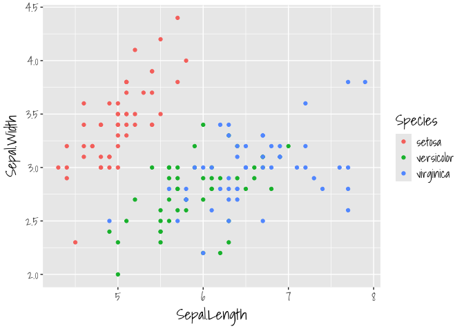
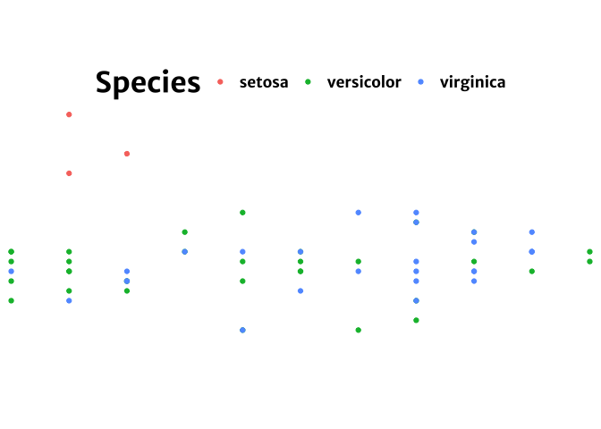
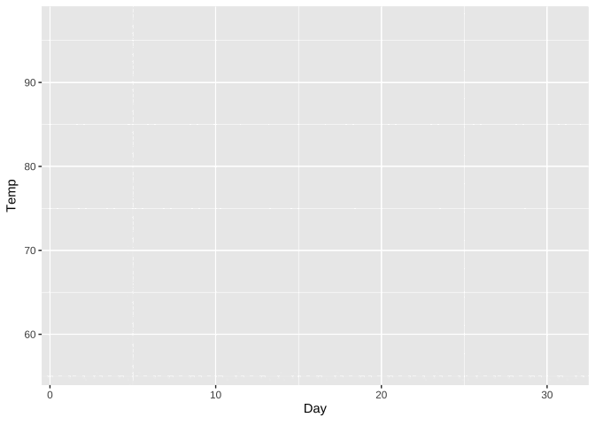
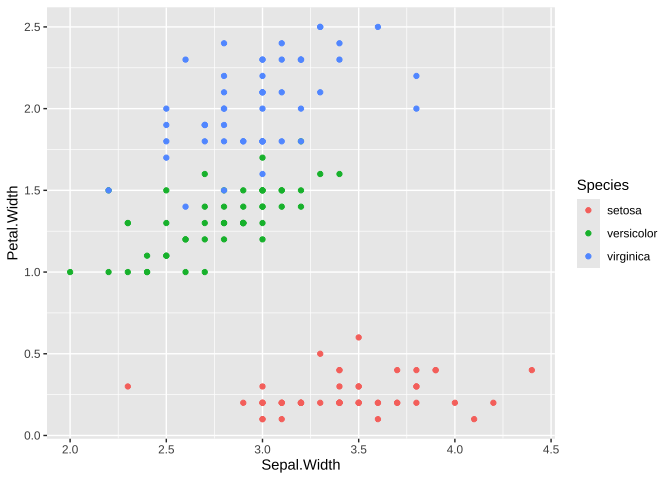
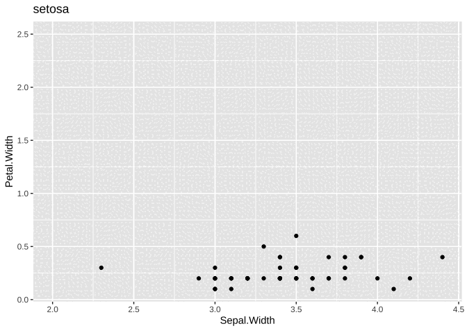

jazz_ggplots
================
Janet Young
2024-03-06

Learning from a [USGS blog
post](https://waterdata.usgs.gov/blog/ggplot-jazz/?ck_subscriber_id=2523933977&utm_source=convertkit&utm_medium=email&utm_campaign=What%27s+New+in+R%3A+February+20%2C+2024%20-%2013131084)

``` r
### installed some packages
# install.packages(c('tidyverse', 'remotes','showtext', 'sysfonts', 'cowplot',
# 'dataRetrieval', 'geomtextpath', 'ggimage', 'rnpn', 'terra', 'raster', 'sf',
# 'colorspace', 'lubridate', 'geofacet', 'ggfx','gghighlight', 'gganimate',
# 'snotelr', 'sbtools', 'spData'))
# remotes::install_github("hrbrmstr/waffle")
```

``` r
library(showtext) # For fonts
```

    ## Loading required package: sysfonts

    ## Loading required package: showtextdb

``` r
# Supply custom fonts using `showtext` 
font_legend <- 'Merriweather Sans'
font_add_google(font_legend) ## downloads and installs a font
showtext_opts(dpi = 300, regular.wt = 300, bold.wt = 800)
showtext_auto(enable = TRUE)

annotate_text <-"Shadows Into Light"
font_add_google(annotate_text)

# Custom plotting theme to apply to waffle chart below
theme_fe <- function(text_size = 16, font_legend){
  theme_void() +
  theme(text = element_text(size = text_size, family = font_legend, 
                            color = "black", face = "bold"),
        strip.text = element_text(size = text_size, margin = margin(b = 10)),
        legend.key.width = unit(0.75, "cm"),
        legend.key.height = unit(0.75, "cm"),
        legend.spacing.x = unit(0.65, 'cm'),
        legend.title = element_text(size = text_size*1.5, hjust = 0.5),
        legend.direction = "horizontal",
        legend.position = "top", 
        plot.title = element_text(size = text_size*2, hjust = 0.5, margin = margin(t = -10)),
        plot.subtitle = element_text(size = text_size*1.2, hjust = 0.5),
        plot.margin = unit(c(2, -25, 2, -25), "cm"),
        strip.text.x = element_text(hjust = .5),
        panel.spacing = unit(1, "lines"))
}
```

use the annotate_text font (“Shadows Into Light”) for everything in the
plot

``` r
iris %>% 
    ggplot(aes(x=Sepal.Length, y=Sepal.Width, color=Species)) +
    geom_point() +
    theme(text = element_text(size = 16, family = annotate_text, 
                            color = "black", face = "bold"))
```

<!-- -->

use the entire theme_fe (now uses font_legend, ‘Merriweather Sans’) :

``` r
iris %>% 
    ggplot(aes(x=Sepal.Length, y=Sepal.Width, color=Species)) +
    geom_point() +
    theme_fe(font_legend = font_legend)
```

<!-- --> \##
gghighlight

``` r
library(snotelr) # To download data from SNOTEL network
library(gghighlight)

# Download data for SNOTEL site 574
# See https://www.nrcs.usda.gov/wps/portal/wcc/home/quicklinks/imap for map of 
# SNOTEL sites
site_data <- snotelr::snotel_download(site_id = 574, internal = TRUE)
```

    ## Downloading site: leavitt lake , with id: 574

``` r
# Munge data, converting units, determining water year, and setting up a plot 
# ate variable
munged_snotel_data <- site_data |> 
  mutate(snow_water_equivalent_in = snow_water_equivalent*(1/25.4),
         elev_ft = elev*(1/0.3048),
         date = as.Date(date),
         month = month(date),
         year = year(date),
         # determine water year, for grouping
         wy = case_when(
           month > 9 ~ year + 1,
           TRUE ~ year
         ),
         # fake date for plotting water year on x-axis
         plot_date = case_when(
           month > 9 ~ update(date, year = 2021),
           TRUE ~ update(date, year = 2022)
         ),
         .after = date)

 # munged_snotel_data is a 12574x24 data frame
```

uses gghighlight to highlight the 2023 data, and show the rest in gray.
it also labels the highlighted data

``` r
snotel_plot <- ggplot(munged_snotel_data) +
  geom_line(aes(x = plot_date, y = snow_water_equivalent_in, group = wy),
            color = 'dodgerblue2', lwd = 0.5) +
  # Highlight timeseries line for WY 2023
  # specify color for unhighlighted lines and for highlighted line label
  gghighlight::gghighlight(wy == 2023,  ## wy is a year (although it is different to the 'year' column)
                           unhighlighted_params = list(color = 'grey90'),
                           label_params = list(color = "dodgerblue2", size = 5,
                           # nudge text label based on desired placement
                                               nudge_y = 6, nudge_x = 13, 
                                               min.segment.length = Inf)) +
  scale_x_date(date_labels = "%b %d", expand = c(0,0)) +
  theme_minimal() +
  ylab('Snow water equivalent (inches)') +
  theme(
    axis.title.x = element_blank(),
    panel.grid.minor = element_blank(),
    axis.text = element_text(size = 10),
    axis.title.y = element_text(size = 14),
    plot.subtitle = element_text(size = 14),
    plot.title = element_text(size = 18, face = 'bold')
  ) +
  labs(
    title = sprintf('Snow water equivalent at the %sSNOTEL site, %s - %s',
                    str_to_title(unique(munged_snotel_data$site_name)),
                    min(munged_snotel_data$wy),
                    max(munged_snotel_data$wy)),
    subtitle = sprintf('%s county, %s. Elevation: %s feet',
                       unique(munged_snotel_data$county),
                       unique(munged_snotel_data$state),
                       round(unique(munged_snotel_data$elev_ft))))
```

    ## Warning: Tried to calculate with group_by(), but the calculation failed.
    ## Falling back to ungrouped filter operation...

    ## label_key: wy

``` r
ggsave("gghighlight.png", plot = snotel_plot, width = 9, 
       height = 5, dpi = 300, bg = "white")
```

``` r
library(gganimate)

### this produces blank gif - not sure why
# Add a transition to the plot so that the timeseries line for the highlighted 
# year gradually appears
snotel_plot_w_transition <- snotel_plot +
  gganimate::transition_reveal(plot_date)

# Build the animation, pausing on the last frame
animation <- gganimate::animate(snotel_plot_w_transition, end_pause = 20, 
                                width = 9, height = 5, units = "in", res = 300)
```

    ## Warning: Cannot get dimensions of plot table. Plot region might not be fixed
    ## Caused by error in `guides[[i]]$draw`:
    ## ! $ operator is invalid for atomic vectors

    ## Warning: Failed to plot frame
    ## Failed to plot frame
    ## Failed to plot frame
    ## Failed to plot frame
    ## Failed to plot frame
    ## Failed to plot frame
    ## Failed to plot frame
    ## Failed to plot frame
    ## Failed to plot frame
    ## Failed to plot frame
    ## Failed to plot frame
    ## Failed to plot frame
    ## Failed to plot frame
    ## Failed to plot frame
    ## Failed to plot frame
    ## Failed to plot frame
    ## Failed to plot frame
    ## Failed to plot frame
    ## Failed to plot frame
    ## Failed to plot frame
    ## Failed to plot frame
    ## Failed to plot frame
    ## Failed to plot frame
    ## Failed to plot frame
    ## Failed to plot frame
    ## Failed to plot frame
    ## Failed to plot frame
    ## Failed to plot frame
    ## Failed to plot frame
    ## Failed to plot frame
    ## Failed to plot frame
    ## Failed to plot frame
    ## Failed to plot frame
    ## Failed to plot frame
    ## Failed to plot frame
    ## Failed to plot frame
    ## Failed to plot frame
    ## Failed to plot frame
    ## Failed to plot frame
    ## Failed to plot frame
    ## Failed to plot frame
    ## Failed to plot frame
    ## Failed to plot frame
    ## Failed to plot frame
    ## Failed to plot frame
    ## Failed to plot frame
    ## Failed to plot frame
    ## Failed to plot frame
    ## Failed to plot frame
    ## Failed to plot frame
    ## Failed to plot frame
    ## Failed to plot frame
    ## Failed to plot frame
    ## Failed to plot frame
    ## Failed to plot frame
    ## Failed to plot frame
    ## Failed to plot frame
    ## Failed to plot frame
    ## Failed to plot frame
    ## Failed to plot frame
    ## Failed to plot frame
    ## Failed to plot frame
    ## Failed to plot frame
    ## Failed to plot frame
    ## Failed to plot frame
    ## Failed to plot frame
    ## Failed to plot frame
    ## Failed to plot frame
    ## Failed to plot frame
    ## Failed to plot frame
    ## Failed to plot frame
    ## Failed to plot frame
    ## Failed to plot frame
    ## Failed to plot frame
    ## Failed to plot frame
    ## Failed to plot frame
    ## Failed to plot frame
    ## Failed to plot frame
    ## Failed to plot frame
    ## Failed to plot frame
    ## Caused by error in `guides[[i]]$draw`:
    ## ! $ operator is invalid for atomic vectors

``` r
# Save the animation
gganimate::anim_save(here("Rscripts/ggplot/gganimate.gif"), animation = animation)
```

``` r
anim <- ggplot(airquality, aes(Day, Temp, group = Month)) +
  geom_line() +
  transition_reveal(Day)
anim
```

    ## `geom_line()`: Each group consists of only one observation.
    ## ℹ Do you need to adjust the group aesthetic?
    ## `geom_line()`: Each group consists of only one observation.
    ## ℹ Do you need to adjust the group aesthetic?

<!-- -->

``` r
anim <- ggplot(mtcars, aes(mpg, disp)) +
  geom_point(aes(color = gear)) +
  transition_states(gear, transition_length = 2, state_length = 1) +
  enter_fade() +
  exit_fade()
# anim
```

``` r
ggplot(iris, aes(x=Sepal.Width, y=Petal.Width, color=Species)) +
  geom_point() 
```

<!-- -->

``` r
anim <- ggplot(iris, aes(Sepal.Width, Petal.Width)) +
  geom_point() +
  labs(title = "{closest_state}") +
  transition_states(Species, transition_length = 3, state_length = 1)
anim
```

<!-- -->
