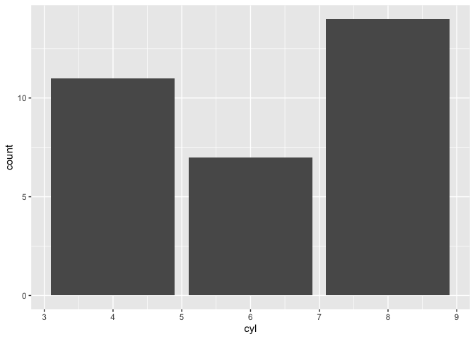

miscellaneous_testCode
================
Janet Young

2024-05-08

# basic tidyverse

``` r
m <- mtcars %>% as_tibble()

## show counts in each category
m %>% 
    count(cyl)
```

    ## # A tibble: 3 × 2
    ##     cyl     n
    ##   <dbl> <int>
    ## 1     4    11
    ## 2     6     7
    ## 3     8    14

## barplots of counts in each category

``` r
m %>% 
    ggplot(aes(x=cyl)) +
    geom_bar()
```

<!-- -->

## tribble - a way to manually create small tibbles, row-wise

``` r
tribble(
    ~colA, ~colB,
    "a",   1,
    "b",   2,
    "c",   3
)
```

    ## # A tibble: 3 × 2
    ##   colA   colB
    ##   <chr> <dbl>
    ## 1 a         1
    ## 2 b         2
    ## 3 c         3

``` r
# same as:
tibble(colA=c("A","B","C"), 
       colB=1:3)
```

    ## # A tibble: 3 × 2
    ##   colA   colB
    ##   <chr> <int>
    ## 1 A         1
    ## 2 B         2
    ## 3 C         3

## the purrr::map functions are a bit like lapply / apply

``` r
1:10 %>%
    map(rnorm, n = 10)
```

    ## [[1]]
    ##  [1]  0.2863934509  0.0003194143  0.5036530300  1.0499259038  0.3852173151
    ##  [6]  0.9342642120  1.6209876343 -0.0240488426  1.8295425453  2.3386221530
    ## 
    ## [[2]]
    ##  [1] 0.2732099 3.3688349 1.2508843 2.8195332 2.8056767 2.8282587 1.2443090
    ##  [8] 2.3066104 3.8735786 3.1337018
    ## 
    ## [[3]]
    ##  [1] 1.743808 3.745484 2.591001 5.115063 3.102968 4.328014 5.420887 2.745653
    ##  [9] 3.877567 2.303032
    ## 
    ## [[4]]
    ##  [1] 4.926047 3.254853 5.266826 4.430592 3.626081 3.335661 3.691142 4.279810
    ##  [9] 4.378710 3.607787
    ## 
    ## [[5]]
    ##  [1] 5.586523 3.575123 4.699233 5.690687 3.888095 3.559652 5.815607 5.440398
    ##  [9] 5.171654 4.467759
    ## 
    ## [[6]]
    ##  [1] 5.643916 6.234045 5.634966 6.590624 5.505803 5.782384 5.122866 3.757380
    ##  [9] 6.274389 5.062901
    ## 
    ## [[7]]
    ##  [1] 6.512955 5.790712 6.795858 7.628602 5.271772 6.178338 6.018490 6.610359
    ##  [9] 7.146822 6.474520
    ## 
    ## [[8]]
    ##  [1] 8.267076 9.744602 8.023286 7.522871 8.898164 8.249720 6.880391 7.989959
    ##  [9] 8.573944 7.160810
    ## 
    ## [[9]]
    ##  [1]  9.634270  8.594348  9.332796  9.580321 10.309411  8.595059  8.719005
    ##  [8]  8.822991  9.845023  9.513724
    ## 
    ## [[10]]
    ##  [1] 12.023252  8.213301 10.802024 10.452795 10.665514  9.236976 10.577592
    ##  [8] 10.087780 10.549467 10.138710

``` r
# do something to each column
mtcars %>% map_dbl(sum)
```

    ##      mpg      cyl     disp       hp     drat       wt     qsec       vs 
    ##  642.900  198.000 7383.100 4694.000  115.090  102.952  571.160   14.000 
    ##       am     gear     carb 
    ##   13.000  118.000   90.000

``` r
# split into list, then map.  
# map_dbl simplify output, in this case to a dbl (or numeric)
# same for map_lgl(), map_int() and map_chr()
mtcars %>%
    split(.$cyl) %>%
    map(~ lm(mpg ~ wt, data = .x)) %>%
    map(summary) %>%
    map_dbl("r.squared")
```

    ##         4         6         8 
    ## 0.5086326 0.4645102 0.4229655

``` r
# map_dfr tries to return a data.frame (binding by rows)  (map_dfc is similar but binds by columns)
mtcars %>%
    split(.$cyl) %>%
    map(~ lm(mpg ~ wt, data = .x)) %>%
    map_dfr(~ as.data.frame(t(as.matrix(coef(.)))))
```

    ##   (Intercept)        wt
    ## 1    39.57120 -5.647025
    ## 2    28.40884 -2.780106
    ## 3    23.86803 -2.192438

# some tidbit for Phoebe’s gtf/gff question

``` r
library(rtracklayer)
```

    ## Loading required package: GenomicRanges

    ## Loading required package: stats4

    ## Loading required package: BiocGenerics

    ## 
    ## Attaching package: 'BiocGenerics'

    ## The following objects are masked from 'package:lubridate':
    ## 
    ##     intersect, setdiff, union

    ## The following objects are masked from 'package:dplyr':
    ## 
    ##     combine, intersect, setdiff, union

    ## The following objects are masked from 'package:stats':
    ## 
    ##     IQR, mad, sd, var, xtabs

    ## The following objects are masked from 'package:base':
    ## 
    ##     anyDuplicated, aperm, append, as.data.frame, basename, cbind,
    ##     colnames, dirname, do.call, duplicated, eval, evalq, Filter, Find,
    ##     get, grep, grepl, intersect, is.unsorted, lapply, Map, mapply,
    ##     match, mget, order, paste, pmax, pmax.int, pmin, pmin.int,
    ##     Position, rank, rbind, Reduce, rownames, sapply, setdiff, table,
    ##     tapply, union, unique, unsplit, which.max, which.min

    ## Loading required package: S4Vectors

    ## 
    ## Attaching package: 'S4Vectors'

    ## The following objects are masked from 'package:lubridate':
    ## 
    ##     second, second<-

    ## The following objects are masked from 'package:dplyr':
    ## 
    ##     first, rename

    ## The following object is masked from 'package:tidyr':
    ## 
    ##     expand

    ## The following object is masked from 'package:utils':
    ## 
    ##     findMatches

    ## The following objects are masked from 'package:base':
    ## 
    ##     expand.grid, I, unname

    ## Loading required package: IRanges

    ## 
    ## Attaching package: 'IRanges'

    ## The following object is masked from 'package:lubridate':
    ## 
    ##     %within%

    ## The following objects are masked from 'package:dplyr':
    ## 
    ##     collapse, desc, slice

    ## The following object is masked from 'package:purrr':
    ## 
    ##     reduce

    ## Loading required package: GenomeInfoDb

``` r
?GFFFile
```

# variable names - using variables

## bang-bang

“bang-bang” , a.ka. !! performs “name injection”

it’s explained more
[here](https://dplyr.tidyverse.org/articles/programming.html#name-injection)

To see more info: ?rlang::`!!`

here I use it in dplyr::rename - we use `!!` to interpret the variable
and then we have to use `:=` (instead of =)

``` r
newVarName <- "sepalLen_new"
iris %>% 
    dplyr::rename(!!newVarName := Sepal.Length) %>% 
    head()
```

    ##   sepalLen_new Sepal.Width Petal.Length Petal.Width Species
    ## 1          5.1         3.5          1.4         0.2  setosa
    ## 2          4.9         3.0          1.4         0.2  setosa
    ## 3          4.7         3.2          1.3         0.2  setosa
    ## 4          4.6         3.1          1.5         0.2  setosa
    ## 5          5.0         3.6          1.4         0.2  setosa
    ## 6          5.4         3.9          1.7         0.4  setosa

There’s also something called
[“bang-bang-bang”](https://www.reddit.com/r/Rlanguage/comments/g5m5bh/what_does_the_bang_bang_bang_do/?rdt=45180)

## embracing operator

The ‘embracing’ operator (`{{ }}`) is useful when we want to pass in
variable(s) that we want to be interpreted before being used. It’s
related to !! and !!!

more discussion
[here](https://rlang.r-lib.org/reference/embrace-operator.html),
[here](https://rlang.r-lib.org/reference/topic-data-mask.html) and
[here](https://adv-r.hadley.nz/quasiquotation.html)

The embracing operator is [similar
to](https://www.r-bloggers.com/2019/07/bang-bang-how-to-program-with-dplyr/),
but not identical to !! (“bang-bang”). It’s also [similar
to](https://www.reddit.com/r/Rlanguage/comments/g5m5bh/what_does_the_bang_bang_bang_do/?rdt=45180),
but not identical to !!! (“bang-bang-bang”)

Example:

``` r
### this wouldn't work
## first define a function
get_var0 <- function(data, column, value) {
    data %>% filter(column == value)
}
## then use it - gives an error this way
# get_var0(mtcars, cyl, 6)
#> Error: Problem with `filter()` input `..1`.
#> x object 'cyl' not found
#> i Input `..1` is `column == value`.

## gives empty tbl output this way (wrong, should be 7):
# get_var0(mtcars, "cyl", 6)

### this DOES work
get_var1 <- function(data, column, value) {
    data %>% filter({{ column }} == value)
}
get_var1(mtcars, cyl, 6)
```

    ##                 mpg cyl  disp  hp drat    wt  qsec vs am gear carb
    ## Mazda RX4      21.0   6 160.0 110 3.90 2.620 16.46  0  1    4    4
    ## Mazda RX4 Wag  21.0   6 160.0 110 3.90 2.875 17.02  0  1    4    4
    ## Hornet 4 Drive 21.4   6 258.0 110 3.08 3.215 19.44  1  0    3    1
    ## Valiant        18.1   6 225.0 105 2.76 3.460 20.22  1  0    3    1
    ## Merc 280       19.2   6 167.6 123 3.92 3.440 18.30  1  0    4    4
    ## Merc 280C      17.8   6 167.6 123 3.92 3.440 18.90  1  0    4    4
    ## Ferrari Dino   19.7   6 145.0 175 3.62 2.770 15.50  0  1    5    6

### !!! example:

from
[here](https://www.reddit.com/r/Rlanguage/comments/g5m5bh/what_does_the_bang_bang_bang_do/?rdt=45180)

To see more info: ?rlang::`!!!`

``` r
## Let's say we want to select the first 3 columns of a data frame. So you can do something like this:
test_df <- tibble(a = 1, b = 1, c = 1, d = 1)
test_df %>%
    select(1, 2, 3)
```

    ## # A tibble: 1 × 3
    ##       a     b     c
    ##   <dbl> <dbl> <dbl>
    ## 1     1     1     1

``` r
## Easy enough. Now let's say we have a list of values that we want to use to replicate the code above. Now if you pass this to the select function it fails:
our_list <- list(1, 2, 3)
# test_df %>%
#     select(our_list)
## That's because that code essentially translates to this, which doesn't work.
# test_df %>%
#     select(list(1, 2, 3))

# What we need to do is "unpack" the list using !!!.
test_df %>%
    select(!!!our_list)
```

    ## # A tibble: 1 × 3
    ##       a     b     c
    ##   <dbl> <dbl> <dbl>
    ## 1     1     1     1

``` r
# which translates to this:
# test_df %>%
#     select(1, 2, 3)
```

# adding metadata / attributes

I had a use case where I wanted to associate a few bits of info with a
tibble of data. The actual example is that my tibble contained
genome-wide t-test results, and I wanted to record eaxctly what method
I’d used to do the t-tests)

Note that `attr()` and `atrributes()` are different functions

``` r
# make example tibble:
a <- 1:5
b <- tibble(a, a * 2)

### add attributes under the methods tag (there can be:
attr(b, "methods") <- "here's some text about the method"
attr(b, "details") <- "here's some more detail about the method"

## access the metadata:
attr(b, "methods")
```

    ## [1] "here's some text about the method"

``` r
## show all attributes:
attributes(b)
```

    ## $class
    ## [1] "tbl_df"     "tbl"        "data.frame"
    ## 
    ## $row.names
    ## [1] 1 2 3 4 5
    ## 
    ## $names
    ## [1] "a"     "a * 2"
    ## 
    ## $methods
    ## [1] "here's some text about the method"
    ## 
    ## $details
    ## [1] "here's some more detail about the method"
