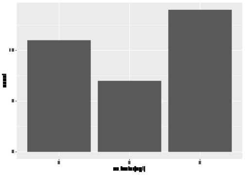

miscellaneous\_testCode
================
Janet Young

2025-09-17

# basic tidyverse

``` r
m <- mtcars %>% as_tibble()

## show counts in each category
m %>% 
    count(cyl)
```

    ## # A tibble: 3 × 2
    ##     cyl     n
    ##   <dbl> <int>
    ## 1     4    11
    ## 2     6     7
    ## 3     8    14

## pivot\_longer with multiple columns

Example data from
[stackoverflow](https://stackoverflow.com/questions/61367186/pivot-longer-into-multiple-columns)

``` r
dat <- tribble(
    ~group,  ~BP,  ~HS,  ~BB, ~lowerBP, ~upperBP, ~lowerHS, ~upperHS, ~lowerBB, ~upperBB,
    "1", 0.51, 0.15, 0.05,     0.16,     0.18,      0.5,     0.52,     0.14,     0.16,
    "2.1", 0.67, 0.09, 0.06,     0.09,     0.11,     0.66,     0.68,     0.08,      0.1,
    "2.2", 0.36, 0.13, 0.07,     0.12,     0.15,     0.34,     0.38,     0.12,     0.14,
    "2.3", 0.09, 0.17, 0.09,     0.13,     0.16,     0.08,     0.11,     0.15,     0.18,
    "2.4", 0.68, 0.12, 0.07,     0.12,     0.14,     0.66,     0.69,     0.11,     0.13,
    "3", 0.53, 0.15, 0.06,     0.14,     0.16,     0.52,     0.53,     0.15,     0.16)

dat
```

    ## # A tibble: 6 × 10
    ##   group    BP    HS    BB lowerBP upperBP lowerHS upperHS lowerBB upperBB
    ##   <chr> <dbl> <dbl> <dbl>   <dbl>   <dbl>   <dbl>   <dbl>   <dbl>   <dbl>
    ## 1 1      0.51  0.15  0.05    0.16    0.18    0.5     0.52    0.14    0.16
    ## 2 2.1    0.67  0.09  0.06    0.09    0.11    0.66    0.68    0.08    0.1 
    ## 3 2.2    0.36  0.13  0.07    0.12    0.15    0.34    0.38    0.12    0.14
    ## 4 2.3    0.09  0.17  0.09    0.13    0.16    0.08    0.11    0.15    0.18
    ## 5 2.4    0.68  0.12  0.07    0.12    0.14    0.66    0.69    0.11    0.13
    ## 6 3      0.53  0.15  0.06    0.14    0.16    0.52    0.53    0.15    0.16

First we pivot\_longer using names\_pattern argument

``` r
longer <- dat %>% 
    pivot_longer(cols=-group, 
                 names_pattern = "(.*)(..)$", 
                 names_to = c("limit", "name")) %>% 
    mutate(limit=ifelse(limit=="", "value", limit))
longer
```

    ## # A tibble: 54 × 4
    ##    group limit name  value
    ##    <chr> <chr> <chr> <dbl>
    ##  1 1     value BP     0.51
    ##  2 1     value HS     0.15
    ##  3 1     value BB     0.05
    ##  4 1     lower BP     0.16
    ##  5 1     upper BP     0.18
    ##  6 1     lower HS     0.5 
    ##  7 1     upper HS     0.52
    ##  8 1     lower BB     0.14
    ##  9 1     upper BB     0.16
    ## 10 2.1   value BP     0.67
    ## # ℹ 44 more rows

Then we pivot wider to get the data how we really want it to look:

``` r
answer <- longer %>% 
    pivot_wider(id_cols = c(group, name), 
                names_from = limit, values_from = value, 
                names_repair = "check_unique")
answer
```

    ## # A tibble: 18 × 5
    ##    group name  value lower upper
    ##    <chr> <chr> <dbl> <dbl> <dbl>
    ##  1 1     BP     0.51  0.16  0.18
    ##  2 1     HS     0.15  0.5   0.52
    ##  3 1     BB     0.05  0.14  0.16
    ##  4 2.1   BP     0.67  0.09  0.11
    ##  5 2.1   HS     0.09  0.66  0.68
    ##  6 2.1   BB     0.06  0.08  0.1 
    ##  7 2.2   BP     0.36  0.12  0.15
    ##  8 2.2   HS     0.13  0.34  0.38
    ##  9 2.2   BB     0.07  0.12  0.14
    ## 10 2.3   BP     0.09  0.13  0.16
    ## 11 2.3   HS     0.17  0.08  0.11
    ## 12 2.3   BB     0.09  0.15  0.18
    ## 13 2.4   BP     0.68  0.12  0.14
    ## 14 2.4   HS     0.12  0.66  0.69
    ## 15 2.4   BB     0.07  0.11  0.13
    ## 16 3     BP     0.53  0.14  0.16
    ## 17 3     HS     0.15  0.52  0.53
    ## 18 3     BB     0.06  0.15  0.16

Alternative in one step, using the special `.value` tag for the
`names_to` argument:

``` r
dat %>% 
    rename_with(~sub("^(BP|HS|BB)$", "values\\1", .)) %>%     # add prefix values
    pivot_longer(cols= -1,
                 names_pattern = "(.*)(BP|HS|BB)$",
                 names_to = c(".value", "names")) 
```

    ## # A tibble: 18 × 5
    ##    group names values lower upper
    ##    <chr> <chr>  <dbl> <dbl> <dbl>
    ##  1 1     BP      0.51  0.16  0.18
    ##  2 1     HS      0.15  0.5   0.52
    ##  3 1     BB      0.05  0.14  0.16
    ##  4 2.1   BP      0.67  0.09  0.11
    ##  5 2.1   HS      0.09  0.66  0.68
    ##  6 2.1   BB      0.06  0.08  0.1 
    ##  7 2.2   BP      0.36  0.12  0.15
    ##  8 2.2   HS      0.13  0.34  0.38
    ##  9 2.2   BB      0.07  0.12  0.14
    ## 10 2.3   BP      0.09  0.13  0.16
    ## 11 2.3   HS      0.17  0.08  0.11
    ## 12 2.3   BB      0.09  0.15  0.18
    ## 13 2.4   BP      0.68  0.12  0.14
    ## 14 2.4   HS      0.12  0.66  0.69
    ## 15 2.4   BB      0.07  0.11  0.13
    ## 16 3     BP      0.53  0.14  0.16
    ## 17 3     HS      0.15  0.52  0.53
    ## 18 3     BB      0.06  0.15  0.16

## separate\_longer trick (for list-like columns), and str\_replace\_all trick (multiple find-replaces)

From [here](https://rfortherestofus.com/2024/04/seperate-fcts)

``` r
details <- readr::read_csv("https://raw.githubusercontent.com/rfordatascience/tidytuesday/master/data/2022/2022-01-25/details.csv",
                           show_col_types = FALSE)
board_games <- details |>
    select(id, name = primary, boardgamecategory)

board_games %>% 
    head(3)
```

    ## # A tibble: 3 × 3
    ##      id name        boardgamecategory                                  
    ##   <dbl> <chr>       <chr>                                              
    ## 1 30549 Pandemic    ['Medical']                                        
    ## 2   822 Carcassonne ['City Building', 'Medieval', 'Territory Building']
    ## 3    13 Catan       ['Economic', 'Negotiation']

``` r
board_games |>
    separate_longer_delim(cols = boardgamecategory, delim = ", ") |>
    mutate(
        boardgamecategory = str_replace_all(
            boardgamecategory,
            c(
                # pattern_to_replace = replacement
                # We have to wrap the names in backticks because all of the things we want to replace are special characters and R doesn’t like them in vector names if they’re not in backticks
                `[` = "",
                `]` = "",
                `"` = "",
                `'` = ""
            ) |> 
                coll() ## coll() tells str_replace_all() that we explicitly do not want to use regular expressions.
        ))
```

    ## # A tibble: 56,915 × 3
    ##       id name        boardgamecategory 
    ##    <dbl> <chr>       <chr>             
    ##  1 30549 Pandemic    Medical           
    ##  2   822 Carcassonne City Building     
    ##  3   822 Carcassonne Medieval          
    ##  4   822 Carcassonne Territory Building
    ##  5    13 Catan       Economic          
    ##  6    13 Catan       Negotiation       
    ##  7 68448 7 Wonders   Ancient           
    ##  8 68448 7 Wonders   Card Game         
    ##  9 68448 7 Wonders   City Building     
    ## 10 68448 7 Wonders   Civilization      
    ## # ℹ 56,905 more rows

## barplots of counts in each category

``` r
m %>% 
    ggplot(aes(x=as.factor(cyl))) +
    geom_bar()
```

<!-- -->

## adding number of observations (or other statistical summaries) to faceted plot

### Example 1 - geom\_point, with n= labels in each facet

Here the statistical summary applies to all observations in the facet
together.

``` r
## calculate the summary stats separately.
# note that the facetting variable (Species) is a column in the summary 
iris_summary <- iris %>% 
    group_by(Species) %>% 
    summarize(label = dplyr::n()) %>% 
    mutate(label=paste0("n = ", label)) %>% 
    ## use the entire dataset (not grouped) to get x and y coords for the n= labels
    mutate(x=min(iris$Sepal.Length)*1.1) %>% 
    mutate(y=max(iris$Petal.Length)*1.1)

## then make the plot
iris %>% 
    ggplot(aes(x=Sepal.Length, y=Petal.Length, color=Species)) +
    geom_point() +
    geom_text(data=iris_summary, 
              aes(label=label, y=y, x=x)) +
    facet_wrap(vars(Species)) +
    theme_classic() +
    guides(color="none")
```

<!-- -->

### Example 2

Each facet is a geom\_boxplot.

Here the statistical summary applies to each group within each facet.

``` r
## get example data in long format
iris_long <- iris %>% 
    pivot_longer(cols=-Species, names_to="variable", values_to="value")

## make a function to produce the labels we want
stat_box_data <- function(y) {
    ## weirdly this works fine if I return a data.frame, but if I make it a tibble the count and mean are both wrong
    # data_summary <- tibble(
    data_summary <- data.frame(
        y = 0.5+1.1*max(y),  # may need to modify this depending on your data
        label = paste('count =', length(y), '\n',
                      'mean =', round(mean(y), 1), '\n') )
    return(data_summary)
}

ggplot(data = iris_long, aes(x=Species, y=value)) + 
    geom_boxplot(aes(fill=Species)) +
    stat_summary(
        fun.data = stat_box_data, 
        geom = "text", 
        hjust = 0.5,  vjust = 0.9 ) + 
    facet_wrap( ~ variable, scales="free")
```

<!-- -->

## tribble - a way to manually create small tibbles, row-wise

``` r
tribble(
    ~colA, ~colB,
    "a",   1,
    "b",   2,
    "c",   3
)
```

    ## # A tibble: 3 × 2
    ##   colA   colB
    ##   <chr> <dbl>
    ## 1 a         1
    ## 2 b         2
    ## 3 c         3

``` r
# same as:
tibble(colA=c("A","B","C"), 
       colB=1:3)
```

    ## # A tibble: 3 × 2
    ##   colA   colB
    ##   <chr> <int>
    ## 1 A         1
    ## 2 B         2
    ## 3 C         3

## the purrr::map functions are a bit like lapply / apply

``` r
1:10 %>%
    map(rnorm, n = 10)
```

    ## [[1]]
    ##  [1] 0.7994761 3.2024685 0.1897428 0.2600658 2.7048133 1.9885187 1.7167190
    ##  [8] 2.0321713 0.7799675 0.9308101
    ## 
    ## [[2]]
    ##  [1] 1.413025 2.416112 2.168077 2.265626 1.620736 3.596568 3.348280 2.453686
    ##  [9] 3.036318 2.696138
    ## 
    ## [[3]]
    ##  [1] 4.358165 3.392939 4.944223 2.046946 3.893871 1.906327 3.380921 1.660290
    ##  [9] 2.257931 3.192295
    ## 
    ## [[4]]
    ##  [1] 3.117022 3.186210 3.683481 4.253755 3.532065 2.708653 3.597682 4.600555
    ##  [9] 3.458915 2.749981
    ## 
    ## [[5]]
    ##  [1] 5.591847 5.762847 4.397840 5.885003 5.785240 3.028793 6.617885 3.721593
    ##  [9] 4.552562 4.629021
    ## 
    ## [[6]]
    ##  [1] 5.655206 5.264833 6.885651 6.577583 5.333750 4.533169 4.714905 7.335851
    ##  [9] 4.385170 6.802606
    ## 
    ## [[7]]
    ##  [1] 6.681980 6.997035 8.565096 7.302910 8.933443 6.523371 7.512763 6.047169
    ##  [9] 6.441390 6.949077
    ## 
    ## [[8]]
    ##  [1] 7.668497 9.023654 8.531238 7.706305 6.045157 9.052952 8.421327 7.319265
    ##  [9] 8.101537 7.714075
    ## 
    ## [[9]]
    ##  [1]  9.809170  9.576583  9.045603 10.222793  9.352017 10.784812  9.810245
    ##  [8]  7.702504  9.649015 10.769725
    ## 
    ## [[10]]
    ##  [1] 10.466105  9.521758  8.888687 10.243233  8.479043  8.238803 11.322849
    ##  [8] 11.371750 10.607055  8.209686

``` r
# do something to each column
mtcars %>% map_dbl(sum)
```

    ##      mpg      cyl     disp       hp     drat       wt     qsec       vs 
    ##  642.900  198.000 7383.100 4694.000  115.090  102.952  571.160   14.000 
    ##       am     gear     carb 
    ##   13.000  118.000   90.000

``` r
# split into list, then map.  
# map_dbl simplify output, in this case to a dbl (or numeric)
# same for map_lgl(), map_int() and map_chr()
mtcars %>%
    split(.$cyl) %>%
    map(~ lm(mpg ~ wt, data = .x)) %>%
    map(summary) %>%
    map_dbl("r.squared")
```

    ##         4         6         8 
    ## 0.5086326 0.4645102 0.4229655

``` r
# map_dfr tries to return a data.frame (binding by rows)  (map_dfc is similar but binds by columns)
mtcars %>%
    split(.$cyl) %>%
    map(~ lm(mpg ~ wt, data = .x)) %>%
    map_dfr(~ as.data.frame(t(as.matrix(coef(.)))))
```

    ##   (Intercept)        wt
    ## 1    39.57120 -5.647025
    ## 2    28.40884 -2.780106
    ## 3    23.86803 -2.192438

`setNames()` is a way to set names on a list - can be used in a pipe as
an alternative to adding a separate `names(x) <- y` after a set of piped
commands

# variable names - using variables

## bang-bang

“bang-bang” , a.ka. !! performs “name injection”

it’s explained more
[here](https://dplyr.tidyverse.org/articles/programming.html#name-injection)

To see more info: ?rlang::`!!`

here I use it in dplyr::rename - we use `!!` to interpret the variable
and then we have to use `:=` (instead of =)

``` r
newVarName <- "sepalLen_new"
iris %>% 
    dplyr::rename(!!newVarName := Sepal.Length) %>% 
    head()
```

    ##   sepalLen_new Sepal.Width Petal.Length Petal.Width Species
    ## 1          5.1         3.5          1.4         0.2  setosa
    ## 2          4.9         3.0          1.4         0.2  setosa
    ## 3          4.7         3.2          1.3         0.2  setosa
    ## 4          4.6         3.1          1.5         0.2  setosa
    ## 5          5.0         3.6          1.4         0.2  setosa
    ## 6          5.4         3.9          1.7         0.4  setosa

There’s also something called
[“bang-bang-bang”](https://www.reddit.com/r/Rlanguage/comments/g5m5bh/what_does_the_bang_bang_bang_do/?rdt=45180)

## embracing operator

The ‘embracing’ operator (`{{ }}`) is useful when we want to pass in
variable(s) that we want to be interpreted before being used. It’s
related to !! and !!!

more discussion
[here](https://rlang.r-lib.org/reference/embrace-operator.html),
[here](https://rlang.r-lib.org/reference/topic-data-mask.html) and
[here](https://adv-r.hadley.nz/quasiquotation.html)

The embracing operator is [similar
to](https://www.r-bloggers.com/2019/07/bang-bang-how-to-program-with-dplyr/),
but not identical to !! (“bang-bang”). It’s also [similar
to](https://www.reddit.com/r/Rlanguage/comments/g5m5bh/what_does_the_bang_bang_bang_do/?rdt=45180),
but not identical to !!! (“bang-bang-bang”)

Example:

``` r
### this wouldn't work
## first define a function
get_var0 <- function(data, column, value) {
    data %>% filter(column == value)
}
## then use it - gives an error this way
# get_var0(mtcars, cyl, 6)
#> Error: Problem with `filter()` input `..1`.
#> x object 'cyl' not found
#> i Input `..1` is `column == value`.

## gives empty tbl output this way (wrong, should be 7):
# get_var0(mtcars, "cyl", 6)

### this DOES work
get_var1 <- function(data, column, value) {
    data %>% filter({{ column }} == value)
}
get_var1(mtcars, cyl, 6)
```

    ##                 mpg cyl  disp  hp drat    wt  qsec vs am gear carb
    ## Mazda RX4      21.0   6 160.0 110 3.90 2.620 16.46  0  1    4    4
    ## Mazda RX4 Wag  21.0   6 160.0 110 3.90 2.875 17.02  0  1    4    4
    ## Hornet 4 Drive 21.4   6 258.0 110 3.08 3.215 19.44  1  0    3    1
    ## Valiant        18.1   6 225.0 105 2.76 3.460 20.22  1  0    3    1
    ## Merc 280       19.2   6 167.6 123 3.92 3.440 18.30  1  0    4    4
    ## Merc 280C      17.8   6 167.6 123 3.92 3.440 18.90  1  0    4    4
    ## Ferrari Dino   19.7   6 145.0 175 3.62 2.770 15.50  0  1    5    6

### !!! example:

from
[here](https://www.reddit.com/r/Rlanguage/comments/g5m5bh/what_does_the_bang_bang_bang_do/?rdt=45180)

To see more info: ?rlang::`!!!`

``` r
## Let's say we want to select the first 3 columns of a data frame. So you can do something like this:
test_df <- tibble(a = 1, b = 1, c = 1, d = 1)
test_df %>%
    select(1, 2, 3)
```

    ## # A tibble: 1 × 3
    ##       a     b     c
    ##   <dbl> <dbl> <dbl>
    ## 1     1     1     1

``` r
## Easy enough. Now let's say we have a list of values that we want to use to replicate the code above. Now if you pass this to the select function it fails:
our_list <- list(1, 2, 3)
# test_df %>%
#     select(our_list)
## That's because that code essentially translates to this, which doesn't work.
# test_df %>%
#     select(list(1, 2, 3))

# What we need to do is "unpack" the list using !!!.
test_df %>%
    select(!!!our_list)
```

    ## # A tibble: 1 × 3
    ##       a     b     c
    ##   <dbl> <dbl> <dbl>
    ## 1     1     1     1

``` r
# which translates to this:
# test_df %>%
#     select(1, 2, 3)
```

# adding metadata / attributes

I had a use case where I wanted to associate a few bits of info with a
tibble of data. The actual example is that my tibble contained
genome-wide t-test results, and I wanted to record exactly what method
I’d used to do the t-tests)

Note that `attr()` and `atrributes()` are different functions

``` r
# make example tibble:
a <- 1:5
b <- tibble(a, a * 2)

### add attributes under the methods tag (there can be:
attr(b, "methods") <- "here's some text about the method"
attr(b, "details") <- "here's some more detail about the method"

## access the metadata:
attr(b, "methods")
```

    ## [1] "here's some text about the method"

``` r
## show all attributes:
attributes(b)
```

    ## $class
    ## [1] "tbl_df"     "tbl"        "data.frame"
    ## 
    ## $row.names
    ## [1] 1 2 3 4 5
    ## 
    ## $names
    ## [1] "a"     "a * 2"
    ## 
    ## $methods
    ## [1] "here's some text about the method"
    ## 
    ## $details
    ## [1] "here's some more detail about the method"

<https://github.com/sfirke/packagemetrics?tab=readme-ov-file>

``` r
# devtools::install_github("sfirke/packagemetrics")
library("packagemetrics")
dplyr_and_dt <- package_list_metrics(c("dplyr", "data.table"))
# data frame
```

``` r
metrics_table(dplyr_and_dt)
```

    ## Warning in gradient(as.numeric(x), ...): NAs introduced by coercion

<table class="table table-condensed">
<thead>
<tr>
<th style="text-align:right;">
package
</th>
<th style="text-align:right;">
published
</th>
<th style="text-align:right;">
dl\_last\_month
</th>
<th style="text-align:right;">
stars
</th>
<th style="text-align:right;">
tidyverse\_happy
</th>
<th style="text-align:right;">
has\_tests
</th>
<th style="text-align:right;">
vignette
</th>
<th style="text-align:right;">
last\_commit
</th>
<th style="text-align:right;">
last\_issue\_closed
</th>
<th style="text-align:right;">
contributors
</th>
<th style="text-align:right;">
depends\_count
</th>
<th style="text-align:right;">
reverse\_count
</th>
</tr>
</thead>
<tbody>
<tr>
<td style="text-align:right;">
<span style="font-weight: bold">dplyr </span>
</td>
<td style="text-align:right;">
2023-11-17
</td>
<td style="text-align:right;">
<span
style="display: inline-block; direction: rtl; unicode-bidi: plaintext; border-radius: 4px; padding-right: 2px; background-color: #56A33E; width: 100.00%">1563017</span>
</td>
<td style="text-align:right;">
<span
style="display: block; padding: 0 4px; border-radius: 4px; background-color: #ffffff">4.9k</span>
</td>
<td style="text-align:right;">
<span style="color: purple"> <i class="glyphicon glyphicon-glass"></i>
</span>
</td>
<td style="text-align:right;">
<span style="color: green"> <i class="glyphicon glyphicon-ok"></i>
</span>
</td>
<td style="text-align:right;">
<span style="color: green"> <i class="glyphicon glyphicon-ok"></i>
</span>
</td>
<td style="text-align:right;">
<span
style="display: block; padding: 0 4px; border-radius: 4px; background-color: #ffffff">22.3</span>
</td>
<td style="text-align:right;">
<span
style="display: block; padding: 0 4px; border-radius: 4px; background-color: #f06b13"></span>
</td>
<td style="text-align:right;">
<span
style="display: block; padding: 0 4px; border-radius: 4px; background-color: #1cc2e3">271</span>
</td>
<td style="text-align:right;">
<span
style="display: block; padding: 0 4px; border-radius: 4px; background-color: #1cc2e3">1</span>
</td>
<td style="text-align:right;">
<span
style="display: block; padding: 0 4px; border-radius: 4px; background-color: #1cc2e3">4907</span>
</td>
</tr>
<tr>
<td style="text-align:right;">
<span style="font-weight: bold">data.table</span>
</td>
<td style="text-align:right;">
2025-07-10
</td>
<td style="text-align:right;">
<span
style="display: inline-block; direction: rtl; unicode-bidi: plaintext; border-radius: 4px; padding-right: 2px; background-color: #56A33E; width: 59.11%">923903</span>
</td>
<td style="text-align:right;">
<span
style="display: block; padding: 0 4px; border-radius: 4px; background-color: #ffffff">3.8k</span>
</td>
<td style="text-align:right;">
<span style="color: white"> <i class="glyphicon glyphicon-glass"></i>
</span>
</td>
<td style="text-align:right;">
<span style="color: red"> <i class="glyphicon glyphicon-remove"></i>
</span>
</td>
<td style="text-align:right;">
<span style="color: green"> <i class="glyphicon glyphicon-ok"></i>
</span>
</td>
<td style="text-align:right;">
<span
style="display: block; padding: 0 4px; border-radius: 4px; background-color: #ffffff">
</span>
</td>
<td style="text-align:right;">
<span
style="display: block; padding: 0 4px; border-radius: 4px; background-color: #f06b13"></span>
</td>
<td style="text-align:right;">
<span
style="display: block; padding: 0 4px; border-radius: 4px; background-color: #ffffff">168</span>
</td>
<td style="text-align:right;">
<span
style="display: block; padding: 0 4px; border-radius: 4px; background-color: #1cc2e3">1</span>
</td>
<td style="text-align:right;">
<span
style="display: block; padding: 0 4px; border-radius: 4px; background-color: #ffffff">1788</span>
</td>
</tr>
</tbody>
</table>
