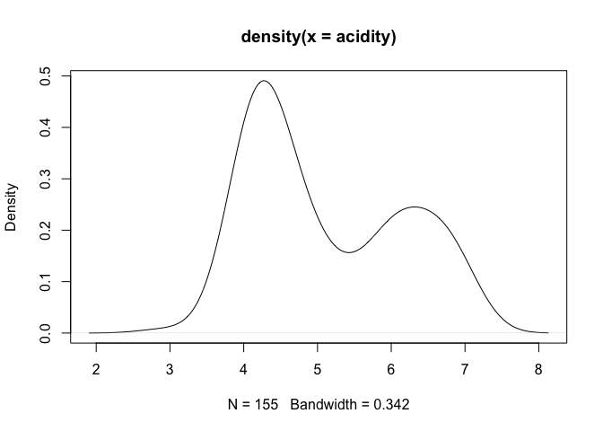
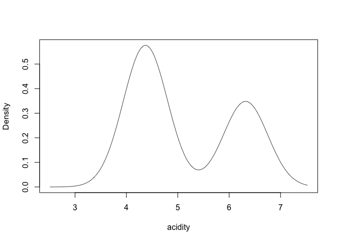
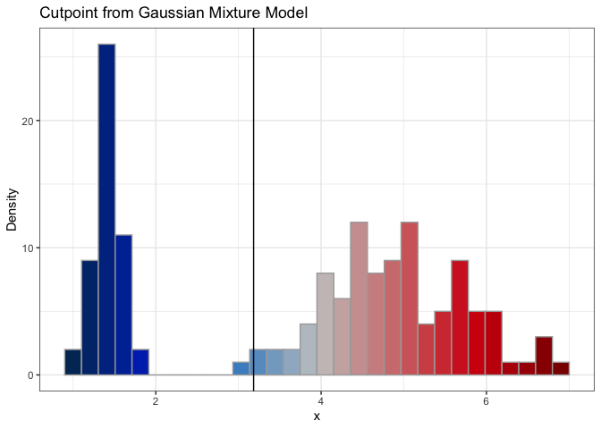
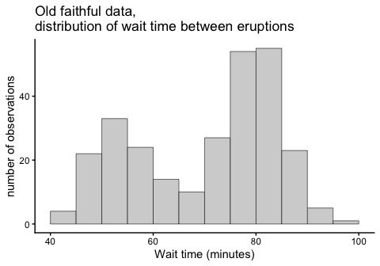

mixture_models_learning
================
Janet Young

2026-05-18

# Goal

Learn about mixture modelling and explore related R packages.

<https://en.wikipedia.org/wiki/Mixture_model>

<https://yifengedms.github.io/EDMS657-R-Tutorials/Mixture.html>

## General notes

Often we model a mixture of subpopulations that all follow the same type
of distribution (e.g. all normal) but it is also possible to model
mixtures of different types of distribution.

Expectation maximization algorithms are often used to do the modeling

## try mclust

### mclust on example data

<https://cran.r-project.org/web/packages/mclust/vignettes/mclust.html>

``` r
### multivariate
## example data for mclust package
# 145 rows, 4 columns
data(diabetes)

# diabetes |> dplyr::count(class)
#      class  n
# 1 Chemical 36
# 2   Normal 76
# 3    Overt 33
```

``` r
### univariate

## 155 numeric values
data(acidity)
plot(density(acidity))
```

<!-- -->

``` r
mod4 <- densityMclust(acidity)
```

<!-- -->

``` r
summary(mod4)
```

    ## ------------------------------------------------------- 
    ## Density estimation via Gaussian finite mixture modeling 
    ## ------------------------------------------------------- 
    ## 
    ## Mclust E (univariate, equal variance) model with 2 components: 
    ## 
    ##  log-likelihood   n df       BIC       ICL
    ##       -185.9493 155  4 -392.0723 -398.5554

I think E means the components have equal variance and V means they
don’t

``` r
plot(mod4, what = "BIC")
```

<!-- -->
Try [plotmm
package](https://packages.oit.ncsu.edu/cran/web/packages/plotmm/vignettes/Getting-Started.html)
for plotting model results

``` r
set.seed(576)

## normalmixEM is from mixtools
mixmdl <- normalmixEM(iris$Petal.Length, k = 2)
```

    ## number of iterations= 9

``` r
# mixmdl$x |> length()

# visualize
plot_mm(mixmdl, 2) +
  labs(title = "Univariate Gaussian Mixture Model",
       subtitle = "Mixtools Object")
```

<!-- -->

``` r
plot_cut_point(mixmdl, plot = TRUE, color = "amerika") # produces plot
```

    ## Registered S3 method overwritten by 'wesanderson':
    ##   method        from   
    ##   print.palette amerika

    ## `stat_bin()` using `bins = 30`. Pick better value `binwidth`.

<!-- -->
\### mixtools on example old faithful data

Show the data we are modelling

``` r
wait_histo <- faithful |> 
  ggplot(aes(x=waiting)) +
  geom_histogram(breaks=seq(from=40, to=100, by=5),
                 fill="lightgray", color="black", linewidth=0.2) +
  theme_classic() +
  labs(x="Wait time (minutes)",
       y="number of observations",
       title="Old faithful data,\ndistribution of wait time between eruptions")
wait_histo
```

<!-- -->

Do the modelling using `normalmixEM`:

-the result (`wait1`) is a `mixEM` object - `mu` - we provide initial
estimates for the means of each distribution. Because we start with a
vector of 2 for mu, it models a mix of 2 normal distributions - `lambda`
is the initial mixing proportion. (if you don’t specify, it’ll start
with equal shares) - it does 9 interations as it optimizes the
proportions and means and sigma - `sigma` is the starting standard
deviation - you can use `mean.constr` to constrain one or more of the
means, which could be useful in our case, where we could use the cir0
distribution to guess at one of the components. Same for `sd.constr`

``` r
wait1 <- normalmixEM(faithful$waiting, 
                     lambda = .5, 
                     mu = c(55, 80), 
                     sigma = 5)
```

    ## number of iterations= 9

``` r
summary(wait1)
```

    ## summary of normalmixEM object:
    ##          comp 1   comp 2
    ## lambda  0.36085  0.63915
    ## mu     54.61364 80.09031
    ## sigma   5.86909  5.86909
    ## loglik at estimate:  -1034.002

Show the model:

``` r
## plot() calls plot.mixEM 
# ?plot.mixEM
## by default this  makes two plots (loglik and density) and requires the user to hit return between each
## but we can control that and only plot one of those at time
plot(wait1, 
     loglik=FALSE, density=TRUE,
     cex.axis=1.4, cex.lab=1.4, cex.main=1.8, 
     main2="Time between Old Faithful eruptions", 
     xlab2="Minutes")
```

<!-- -->

Show how the log-likelihood of the model changed as the ME iterated -
after 2 iterations it didn’t improve much

``` r
plot(wait1, 
     loglik=TRUE, density=FALSE,
     cex.axis=1.4, cex.lab=1.4, cex.main=1.8)
```

<!-- -->

plot_mm can plot the model. the gray shape is the distribution of the
data being modelled, and the colors are the actual data

``` r
p1 <- plot_mm(wait1, 2) +
  labs(title = "Univariate Gaussian Mixture Model",
       subtitle = "Mixtools Object") +
  coord_cartesian(xlim=c(40,100)) 

##  I checked - tthe gray shows density of the data that was modeled:
# p1 +
#   geom_density(data=faithful, aes(x=waiting), 
#                color="forestgreen", lty=2)

p1
```

<!-- -->

``` r
# Fit a univariate mixture model via mixtools. 
# This time around we allow the sigma (standard dev) to vary - we do tell it to expect 2 components but we don't give any other priors

set.seed(576)

mixmdl <- normalmixEM(faithful$waiting, k = 2)
```

    ## number of iterations= 24

# Customize a plot with `plot_mix_comps_normal()`

``` r
data.frame(x = mixmdl$x) |>
  ggplot() +
  ## show distribution of the actual data
  geom_histogram(aes(x, after_stat(density)), 
                 binwidth = 5, colour = "black", fill="lightgray") +
  ### plot component 1
  stat_function(geom = "line", 
                fun = plot_mix_comps_normal, # here is the function
                args = list(mixmdl$mu[1], mixmdl$sigma[1], lam = mixmdl$lambda[1]),
                colour = "red", lwd = 1.5) +
  ### plot component 2
  stat_function(geom = "line", 
                fun = plot_mix_comps_normal, # here again as k = 2
                args = list(mixmdl$mu[2], mixmdl$sigma[2], lam = mixmdl$lambda[2]),
                colour = "blue", lwd = 1.5) +
  ylab("Density") +
  theme_classic()
```

<!-- -->

# Finished

``` r
sessionInfo()
```

    ## R version 4.5.3 (2026-03-11)
    ## Platform: aarch64-apple-darwin20
    ## Running under: macOS Tahoe 26.5
    ## 
    ## Matrix products: default
    ## BLAS:   /Library/Frameworks/R.framework/Versions/4.5-arm64/Resources/lib/libRblas.0.dylib 
    ## LAPACK: /Library/Frameworks/R.framework/Versions/4.5-arm64/Resources/lib/libRlapack.dylib;  LAPACK version 3.12.1
    ## 
    ## locale:
    ## [1] en_US.UTF-8/en_US.UTF-8/en_US.UTF-8/C/en_US.UTF-8/en_US.UTF-8
    ## 
    ## time zone: America/Los_Angeles
    ## tzcode source: internal
    ## 
    ## attached base packages:
    ## [1] stats     graphics  grDevices utils     datasets  methods   base     
    ## 
    ## other attached packages:
    ##  [1] mixtools_2.0.0.1 plotmm_0.1.2     mclust_6.1.2     patchwork_1.3.2 
    ##  [5] here_1.0.2       kableExtra_1.4.0 lubridate_1.9.5  forcats_1.0.1   
    ##  [9] stringr_1.6.0    dplyr_1.2.1      purrr_1.2.1      readr_2.2.0     
    ## [13] tidyr_1.3.2      tibble_3.3.1     ggplot2_4.0.2    tidyverse_2.0.0 
    ## 
    ## loaded via a namespace (and not attached):
    ##  [1] gtable_0.3.6        xfun_0.57           htmlwidgets_1.6.4  
    ##  [4] lattice_0.22-9      tzdb_0.5.0          vctrs_0.7.2        
    ##  [7] tools_4.5.3         generics_0.1.4      stats4_4.5.3       
    ## [10] flexmix_2.3-20      wesanderson_0.3.7   pkgconfig_2.0.3    
    ## [13] Matrix_1.7-5        data.table_1.18.2.1 RColorBrewer_1.1-3 
    ## [16] S7_0.2.1            amerika_0.1.1       lifecycle_1.0.5    
    ## [19] compiler_4.5.3      farver_2.1.2        textshaping_1.0.5  
    ## [22] htmltools_0.5.9     yaml_2.3.12         lazyeval_0.2.3     
    ## [25] plotly_4.12.0       pillar_1.11.1       MASS_7.3-65        
    ## [28] nlme_3.1-169        tidyselect_1.2.1    digest_0.6.39      
    ## [31] stringi_1.8.7       kernlab_0.9-33      labeling_0.4.3     
    ## [34] splines_4.5.3       rprojroot_2.1.1     fastmap_1.2.0      
    ## [37] grid_4.5.3          cli_3.6.5           magrittr_2.0.5     
    ## [40] survival_3.8-6      EMCluster_0.2-17    withr_3.0.2        
    ## [43] scales_1.4.0        segmented_2.2-1     timechange_0.4.0   
    ## [46] rmarkdown_2.31      httr_1.4.8          nnet_7.3-20        
    ## [49] otel_0.2.0          modeltools_0.2-24   hms_1.1.4          
    ## [52] evaluate_1.0.5      knitr_1.51          viridisLite_0.4.3  
    ## [55] rlang_1.1.7         glue_1.8.0          xml2_1.5.2         
    ## [58] svglite_2.2.2       rstudioapi_0.18.0   jsonlite_2.0.0     
    ## [61] R6_2.6.1            systemfonts_1.3.2
