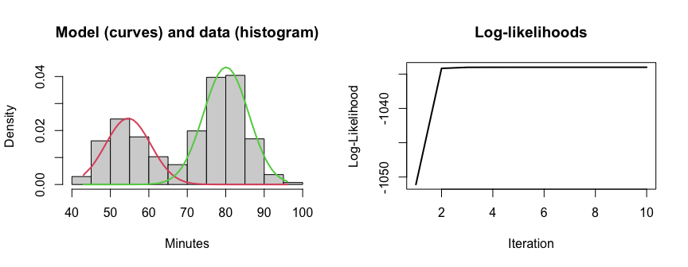
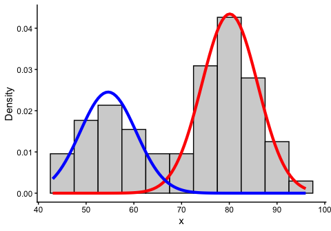

mixture_models_learning
================
Janet Young

2026-05-18

# Goal

Learn about mixture modelling and explore related R packages.

<https://en.wikipedia.org/wiki/Mixture_model>

<https://yifengedms.github.io/EDMS657-R-Tutorials/Mixture.html>

# General notes

Often we model a mixture of subpopulations that all follow the same type
of distribution (e.g. all normal) but it is also possible to model
mixtures of different types of distribution.

Expectation maximization algorithms are often used to do the modeling

# Packages used

mclust
[vignette](https://cran.r-project.org/web/packages/mclust/vignettes/mclust.html)

mixtools
[vignette](https://cran.r-project.org/web/packages/mixtools/vignettes/mixtools.pdf)
and [github](https://github.com/dsy109/mixtools) page

[plotmm
package](https://packages.oit.ncsu.edu/cran/web/packages/plotmm/vignettes/Getting-Started.html)
for plotting model results

# Example data

The classic example dataset is the wait times between eruptions of the
Old Faithful geyser, which seems to follow a bimodal distribution. See
`?faithful` for more information.

Show the data we are modelling:

``` r
wait_histo <- faithful |> 
    ggplot(aes(x=waiting)) +
    geom_histogram(breaks=seq(from=40, to=100, by=5),
                   fill="lightgray", color="black", linewidth=0.2) +
    theme_classic() +
    labs(x="Wait time (minutes)",
         y="number of observations",
         title="(histogram)")

wait_density <- faithful |> 
    ggplot(aes(x=waiting)) +
    geom_density() +
    theme_classic() +
    labs(x="Wait time (minutes)",
         y="Relative frequency",
         title="density plot")

(wait_histo + wait_density) +
    plot_annotation(title="Old Faithful data,\ndistribution of wait time between eruptions")
```

<!-- -->

# Try mclust package

Use the `densityMclust` function to model the data. The default setup
(for univariate data, like we have) is:

- it returns a `densityMclust` class object
- it models different numbers of classes (components), from 1-9
- it models using equal “E” or unequal (“V”) variance
- it can produces a bunch of other plot types, see `?plot.densityMclust`

``` r
faithful_mclust <- densityMclust(faithful$waiting,
                                 plot=FALSE, # default is to plot the density of the data
                                 verbose=FALSE)
```

`summary()` is inelegant but shows me the best model:

``` r
summary(faithful_mclust, parameters = TRUE)
```

    ## ------------------------------------------------------- 
    ## Density estimation via Gaussian finite mixture modeling 
    ## ------------------------------------------------------- 
    ## 
    ## Mclust E (univariate, equal variance) model with 2 components: 
    ## 
    ##  log-likelihood   n df       BIC       ICL
    ##       -1034.002 272  4 -2090.427 -2099.576
    ## 
    ## Mixing probabilities:
    ##         1         2 
    ## 0.3609461 0.6390539 
    ## 
    ## Means:
    ##        1        2 
    ## 54.61675 80.09239 
    ## 
    ## Variances:
    ##        1        2 
    ## 34.44093 34.44093

We can also ask it to plot the BIC of each model it considered.

Here we see that two classes is the the most likely solution fit, and
that equal variance is slightly more likely than unequal variance.

BIC is a metric that includes some penalty for each additional parameter
in the model, so that it tries to avoid overfitting.

We can show the model and the underlying data together:

``` r
par(mfrow=c(1,2))
plot(faithful_mclust, what = "BIC")
title(main="model selection", outer=FALSE, line=0.5)

plot(faithful_mclust, what = "density", data = faithful$waiting)
title(main="best model", outer=FALSE, line=0.5)

title(main="mclust modelling", outer=TRUE, line=-2)
```

<!-- -->

“Diagnostic” plots show actual and modeled distributions.

``` r
par(mfrow=c(1,2))

plot(faithful_mclust, what = "diagnostic", type="cdf")
title(main="CDF diagnostic plot", line=0.5)

plot(faithful_mclust, what = "diagnostic", type="qq")
title(main="QQ diagnostic plot", line=0.5)
```

<!-- -->

# Try mixtools package

Do the modelling using `mixtools::normalmixEM`:

- the result (`wait1`) is a `mixEM` object
- `mu` - we provide initial estimates for the means of each
  distribution. Because we start with a vector of 2 for mu, it models a
  mix of 2 normal distributions
- `lambda` is the initial mixing proportion. (if you don’t specify,
  it’ll start with equal shares)
- it does 9 interations as it optimizes the proportions and means and
  sigma
- `sigma` is the starting standard deviation
- you can use `mean.constr` to constrain one or more of the means, which
  could be useful in our case, where we could use the cir0 distribution
  to guess at one of the components. Same for `sd.constr`

Let’s tell it there are 2 categories, but nothing else (normalmixEM does
not allow us to try different k all in one call, like mclust does). By
default, the variance to be different on the two components but you can
constrain it to be the same. You can specify starting mu (mean) and
sigma (standard deviation), and you can constrain some components but
not others (using mean.constr and sd.constr, see ?normalmixEM)

Show a summary of the model:

``` r
summary(wait1)
```

    ## summary of normalmixEM object:
    ##          comp 1   comp 2
    ## lambda  0.36085  0.63915
    ## mu     54.61364 80.09031
    ## sigma   5.86909  5.86909
    ## loglik at estimate:  -1034.002

Plot the model and the input data:

- plot() calls plot.mixEM (`?plot.mixEM`)
- by default this makes two plots (density and loglik) and requires the
  user to hit return between each, but we can control that:
- density plot (left) shows the component distributions
- `loglik` plot (right) shows how the log-likelihood of the model
  changed as the ME iterated - after 2 iterations it didn’t improve much

``` r
par(mfrow=c(1,2))
plot(wait1, 
     loglik=FALSE, density=TRUE,
     main2="Model (curves) and data (histogram)" ,
     xlab2="Minutes")

plot(wait1, 
     loglik=TRUE, density=FALSE, main1="Log-likelihoods")
```

<!-- -->

plotmm::plot_mm can also plot the model (uses ggplot approach). the gray
shape is the distribution of the data being modelled, and the colors are
the actual data

``` r
p1 <- plot_mm(wait1, 2) +
    labs(title = "normalmixEM model for faithful$waiting",
         subtitle = "Plotted using plot_mm") +
    coord_cartesian(xlim=c(40,100)) 

##  I checked - the gray shows density of the data that was modeled:
# p1 +
#   geom_density(data=faithful, aes(x=waiting), 
#                color="forestgreen", lty=2)

p1
```

<!-- -->

Can also customize that using `plot_mix_comps_normal()` as follows:

``` r
data.frame(x = wait2$x) |>
    ggplot() +
    ## show distribution of the actual data
    geom_histogram(aes(x, after_stat(density)), 
                   binwidth = 5, colour = "black", fill="lightgray") +
    ### plot component 1
    stat_function(geom = "line", 
                  fun = plot_mix_comps_normal, # here is the function
                  args = list(wait2$mu[1], wait2$sigma[1], lam = wait2$lambda[1]),
                  colour = "red", lwd = 1.5) +
    ### plot component 2
    stat_function(geom = "line", 
                  fun = plot_mix_comps_normal, # here again as k = 2
                  args = list(wait2$mu[2], wait2$sigma[2], lam = wait2$lambda[2]),
                  colour = "blue", lwd = 1.5) +
    ylab("Density") +
    theme_classic()
```

<!-- -->

`plot_cut_point()` - if we want to use the model to predict which class
each datapoint is in, we might want to determine the thresholds between
classes:

``` r
## message=FALSE otherwise I get a message about the binwidth
plot_cut_point(wait1, plot = TRUE, color = "amerika") + # produces plot
    labs(x="Wait time (minutes)")
```

<!-- -->

mixtools has a function called multmixmodel.sel that assesses how many
components are in the data, but that’s only for multivariate data. I
don’t see an equivalent function for univariate data, unless we have \>1
sample of the data. I think maybe we are supposed to subsample for a
bootstrapping approach, see ?boot.se

### mixtools::mixturegram

See ?mixturegram

We generate some example data that’s a 30:70 mix of two normal
distributions, with means of -6 and 0, and standard deviation of 1 for
both

``` r
set.seed(100)
n <- 100
w <- rmultinom(n,1,c(.3,.7))
y <- sapply(1:n, function(i)  {
    w[1,i]*rnorm(1,-6,1) + w[2,i]*rnorm(1,0,1)
})
```

Show the distribution of the data:

``` r
tibble(y=y) |> 
    ggplot(aes(x=y)) +
    geom_density() +
    theme_classic()
```

<!-- -->

Show a ‘mixturegram’. I don’t understand what the “PC score” is here.

``` r
selection <- function(i, data, rep=30){
    out <- replicate(rep,normalmixEM(data,epsilon=1e-06,
                                     k=i,maxit=5000),simplify=FALSE)
    counts <- lapply(1:rep,function(j) 
        table(apply(out[[j]]$posterior,1,
                    which.max)))
    counts.length <- sapply(counts, length)
    counts.min <- sapply(counts, min)
    counts.test <- (counts.length != i)|(counts.min < 5)
    if(sum(counts.test) > 0 & sum(counts.test) < rep) 
        out <- out[!counts.test]
    l <- unlist(lapply(out, function(x) x$loglik))
    tmp <- out[[which.max(l)]]
}

### does mixture modelling with 2:5 classes, replicating each 30 times
all.out <- lapply(2:5, selection, data = y, rep = 2)
```

    ## number of iterations= 7 
    ## number of iterations= 7 
    ## number of iterations= 52 
    ## number of iterations= 88 
    ## number of iterations= 266 
    ## number of iterations= 111 
    ## number of iterations= 262 
    ## number of iterations= 69

``` r
## pmbs is a list of length 4, each is a matrix, 100 rows by 2,3,4,5 columns
pmbs <- lapply(1:length(all.out), function(i) 
    all.out[[i]]$post)


mixturegram(y, pmbs, method = "pca", all.n = FALSE,
            id.con = NULL, score = 1, 
            main = "Mixturegram (Well-Separated Data)")
```

<!-- -->

    ## $stopping
    ## [1] 1.000000000 0.012826548 0.005056038 0.004510841 0.003132543

# Finished

``` r
sessionInfo()
```

    ## R version 4.5.3 (2026-03-11)
    ## Platform: aarch64-apple-darwin20
    ## Running under: macOS Tahoe 26.5
    ## 
    ## Matrix products: default
    ## BLAS:   /Library/Frameworks/R.framework/Versions/4.5-arm64/Resources/lib/libRblas.0.dylib 
    ## LAPACK: /Library/Frameworks/R.framework/Versions/4.5-arm64/Resources/lib/libRlapack.dylib;  LAPACK version 3.12.1
    ## 
    ## locale:
    ## [1] en_US.UTF-8/en_US.UTF-8/en_US.UTF-8/C/en_US.UTF-8/en_US.UTF-8
    ## 
    ## time zone: America/Los_Angeles
    ## tzcode source: internal
    ## 
    ## attached base packages:
    ## [1] stats     graphics  grDevices utils     datasets  methods   base     
    ## 
    ## other attached packages:
    ##  [1] mixtools_2.0.0.1 plotmm_0.1.2     mclust_6.1.2     patchwork_1.3.2 
    ##  [5] here_1.0.2       kableExtra_1.4.0 lubridate_1.9.5  forcats_1.0.1   
    ##  [9] stringr_1.6.0    dplyr_1.2.1      purrr_1.2.1      readr_2.2.0     
    ## [13] tidyr_1.3.2      tibble_3.3.1     ggplot2_4.0.2    tidyverse_2.0.0 
    ## 
    ## loaded via a namespace (and not attached):
    ##  [1] gtable_0.3.6        xfun_0.57           htmlwidgets_1.6.4  
    ##  [4] lattice_0.22-9      tzdb_0.5.0          vctrs_0.7.2        
    ##  [7] tools_4.5.3         generics_0.1.4      stats4_4.5.3       
    ## [10] flexmix_2.3-20      wesanderson_0.3.7   pkgconfig_2.0.3    
    ## [13] Matrix_1.7-5        data.table_1.18.2.1 RColorBrewer_1.1-3 
    ## [16] S7_0.2.1            amerika_0.1.1       lifecycle_1.0.5    
    ## [19] compiler_4.5.3      farver_2.1.2        textshaping_1.0.5  
    ## [22] htmltools_0.5.9     yaml_2.3.12         lazyeval_0.2.3     
    ## [25] plotly_4.12.0       pillar_1.11.1       MASS_7.3-65        
    ## [28] nlme_3.1-169        tidyselect_1.2.1    digest_0.6.39      
    ## [31] stringi_1.8.7       kernlab_0.9-33      labeling_0.4.3     
    ## [34] splines_4.5.3       rprojroot_2.1.1     fastmap_1.2.0      
    ## [37] grid_4.5.3          cli_3.6.5           magrittr_2.0.5     
    ## [40] survival_3.8-6      EMCluster_0.2-17    withr_3.0.2        
    ## [43] scales_1.4.0        segmented_2.2-1     timechange_0.4.0   
    ## [46] rmarkdown_2.31      httr_1.4.8          nnet_7.3-20        
    ## [49] otel_0.2.0          modeltools_0.2-24   hms_1.1.4          
    ## [52] evaluate_1.0.5      knitr_1.51          viridisLite_0.4.3  
    ## [55] rlang_1.1.7         glue_1.8.0          xml2_1.5.2         
    ## [58] svglite_2.2.2       rstudioapi_0.18.0   jsonlite_2.0.0     
    ## [61] R6_2.6.1            systemfonts_1.3.2
