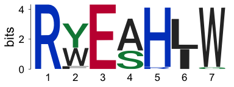
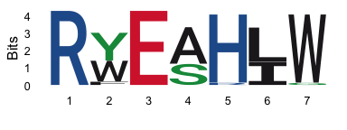
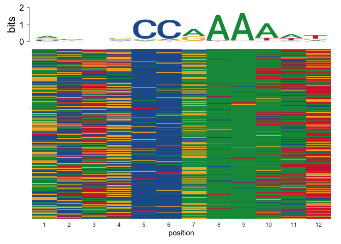
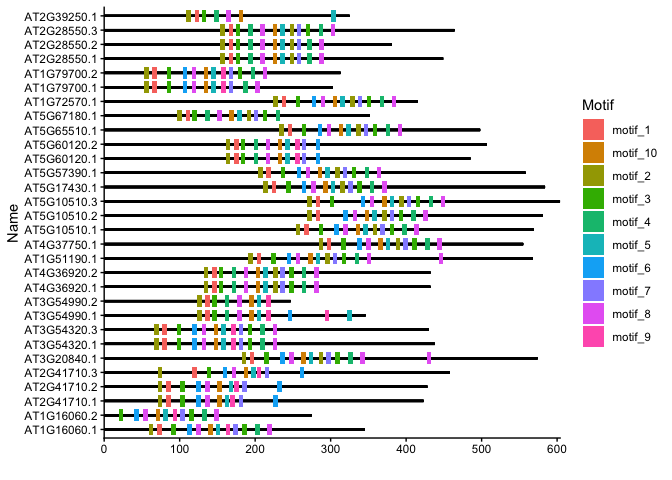

MEME_output_parsing
================
Janet Young

2026-02-12

# Goal

Understand how to parse output files from MEME motif finder.

Several R packages exist for this, incluing `memes`, `ggmotif`, and
`universalmotif`

For EZHIP I decided I preferred to use the `universalmotif::read_meme`
function, with custom downstream analysis. See script
[here](https://github.com/jayoung/EZHIP_janet/tree/main/Rscripts/EZHIP_motifStuff.md)

# Motif package documentation links:

`universalmotif` package:

- [github page](https://github.com/bjmt/universalmotif)
- [motif manipulation
  vignette](https://bioconductor.org/packages/release/bioc/vignettes/universalmotif/inst/doc/MotifManipulation.pdf)

`memes` package:

- [vignettes](https://bioconductor.org/packages//release/bioc/html/memes.html)
- [manual](https://snystrom.com/memes-manual/)
- [github](https://github.com/snystrom/memes)

`ggmotif` package:

- [PLoS
  paper](https://journals.plos.org/plosone/article?id=10.1371/journal.pone.0276979)
  by Li et al, 2022

# Try memes::importMeme to read meme.txt

Test `memes` function called `importMeme`. It is able to import the
`meme.txt` example file from `ggmotif` but not the `meme.xml` file. The
help page says that `memes::importMeme` is a wrapper for
`universalmotif::read_meme()` - I think it may just help in cases where
query seq names need to be parsed further (e.g. “chr:start-end” style
names)

It returns an object of class `universalmotif_df`, with 10 rows and 19
columns. One row per motif. Every column is a list.

`motif_info_memes_txt$sites_hits` contains a tibble for each motif
specifying the locations of every motif instance (nice).

``` r
filepath <- system.file("examples", "meme.txt", package = "ggmotif")
motif_info_memes_txt <- importMeme(filepath)
```

    ## Could not find strand info, assuming +.

``` r
## import meme.xml - doesn't work. Get a bunch of warnings and errors
# filepath <- system.file("examples", "meme.xml", package = "ggmotif")
# motif_info_memes_xml <- importMeme(filepath)
```

# Try universalmotif::read_meme to read meme.txt

Now use `universalmotif::read_meme()` directly rather than through
`memes::importMeme`. This returns a list, one `universalmotif` item per
motif found, but I think .

``` r
filepath <- system.file("examples", "meme.txt", package = "ggmotif")
read_memes_txt <- universalmotif::read_meme(filepath)
```

    ## Could not find strand info, assuming +.

Adding the `readsites=TRUE, readsites.meta = TRUE` options returns more
info:

``` r
read_memes_txt_plus <- universalmotif::read_meme(filepath,
                                                 readsites=TRUE, readsites.meta = TRUE)
```

    ## Could not find strand info, assuming +.

Show universalmotif::view_motifs plot function:

``` r
view_motifs(read_memes_txt_plus[["motifs"]][[1]], 
            tryRC=FALSE)
```

<!-- -->

Or, plot using ggseqlogo:

``` r
convert_type(read_memes_txt_plus[["motifs"]][[1]],"PPM")["motif"] |> 
    ggseqlogo() +
    guides(fill = "none") 
```

    ## Warning: `aes_string()` was deprecated in ggplot2 3.0.0.
    ## ℹ Please use tidy evaluation idioms with `aes()`.
    ## ℹ See also `vignette("ggplot2-in-packages")` for more information.
    ## ℹ The deprecated feature was likely used in the ggseqlogo package.
    ##   Please report the issue at <https://github.com/omarwagih/ggseqlogo/issues>.
    ## This warning is displayed once per session.
    ## Call `lifecycle::last_lifecycle_warnings()` to see where this warning was
    ## generated.

<!-- -->

# Explore more functions from the memes package

load `example_fimo` data - GRanges object with 1542 ranges - motif
matches from fimo output

``` r
data(example_fimo, package = "memes") 
```

`add_sequence()` obtains the actual sequence of each motif, and add it
as another column to the GRanges

``` r
genome <- BSgenome.Dmelanogaster.UCSC.dm3::BSgenome.Dmelanogaster.UCSC.dm3 
motifs <- add_sequence(example_fimo, genome) 
```

(plot_sequence_heatmap) - I think each row is a motif instance, with
colors showing which residue it contains

``` r
plot_sequence_heatmap(motifs$sequence) 
```

<!-- -->

# Explore ggmotif package

Explore the ggmotif package and its example data.

Use `getMotifFromMEME()` to read `meme.txt` (a file with 10 motifs in
it).

It returns a data.frame with 291 rows, 4 columns: - raw (strings like
this: “AT1G16060.1 ( 59) HRGVTRH 1”) - presumably some unparsed version
of the meme output for each motif instance - motif.num (Motif.1 -
Motif.10) - input.seq.name (e.g. AT5G67180.1) - input.seq.motif (the
amino acid sequence for each instance)

``` r
filepath <- system.file("examples", "meme.txt", package = "ggmotif")
meme_txt_tbl <- getMotifFromMEME(data = filepath, format = "txt") |> 
    as_tibble()
```

Now use `getMotifFromMEME()` to read `meme.xml` (also contains 10
motifs). It returns a data.frame with 335 rows, 16 columns. This is much
more complete - better to do this than use the meme.txt output, I think.

``` r
## getMotifFromMEME and motifLocation
# use getMotifFromMEME to read meme.xml
# motif_extract is a data.frame, 335 rows, 16 cols
# motifLocation takes the information in 
# plot without phylogenetic tree - we get the cartoon layout of where each motif is within each of the training seqs
filepath <- system.file("examples", "meme.xml", package = "ggmotif")
meme_xml_tbl <- getMotifFromMEME(data = filepath, format="xml")|> 
    as_tibble()
```

It’s weird that why does meme_xml_tbl has 335 rows and meme_txt_tbl only
has 291 rows, but I won’t worry about it for now. I don’t even know
whether they come from the same meme analysis.

``` r
# meme_xml_tbl |> 
#     count(orig_id)
# meme_txt_tbl |> 
#     count(motif.num)
```

Use `motifLocation()` to plot motif locations from the meme_xml_tbl

``` r
motif_plot <- motifLocation(data = meme_xml_tbl)
```

    ## Warning: Using `size` aesthetic for lines was deprecated in ggplot2 3.4.0.
    ## ℹ Please use `linewidth` instead.
    ## ℹ The deprecated feature was likely used in the ggmotif package.
    ##   Please report the issue to the authors.
    ## This warning is displayed once per session.
    ## Call `lifecycle::last_lifecycle_warnings()` to see where this warning was
    ## generated.

``` r
motif_plot
```

<!-- -->

# Finished

``` r
sessionInfo()
```

    ## R version 4.5.2 (2025-10-31)
    ## Platform: aarch64-apple-darwin20
    ## Running under: macOS Tahoe 26.2
    ## 
    ## Matrix products: default
    ## BLAS:   /System/Library/Frameworks/Accelerate.framework/Versions/A/Frameworks/vecLib.framework/Versions/A/libBLAS.dylib 
    ## LAPACK: /Library/Frameworks/R.framework/Versions/4.5-arm64/Resources/lib/libRlapack.dylib;  LAPACK version 3.12.1
    ## 
    ## locale:
    ## [1] en_US.UTF-8/en_US.UTF-8/en_US.UTF-8/C/en_US.UTF-8/en_US.UTF-8
    ## 
    ## time zone: America/Los_Angeles
    ## tzcode source: internal
    ## 
    ## attached base packages:
    ## [1] stats4    stats     graphics  grDevices utils     datasets  methods  
    ## [8] base     
    ## 
    ## other attached packages:
    ##  [1] universalmotif_1.28.0 ggmotif_0.2.1         memes_1.19.1         
    ##  [4] ggseqlogo_0.2.2       GenomicRanges_1.62.1  Biostrings_2.78.0    
    ##  [7] Seqinfo_1.0.0         XVector_0.50.0        IRanges_2.44.0       
    ## [10] S4Vectors_0.48.0      BiocGenerics_0.56.0   generics_0.1.4       
    ## [13] kableExtra_1.4.0      janitor_2.2.1         patchwork_1.3.2      
    ## [16] here_1.0.2            lubridate_1.9.5       forcats_1.0.1        
    ## [19] stringr_1.6.0         dplyr_1.2.0           purrr_1.2.1          
    ## [22] readr_2.1.6           tidyr_1.3.2           tibble_3.3.1         
    ## [25] ggplot2_4.0.2         tidyverse_2.0.0      
    ## 
    ## loaded via a namespace (and not attached):
    ##  [1] bitops_1.0-9                          rlang_1.1.7                          
    ##  [3] magrittr_2.0.4                        snakecase_0.11.1                     
    ##  [5] otel_0.2.0                            matrixStats_1.5.0                    
    ##  [7] compiler_4.5.2                        systemfonts_1.3.1                    
    ##  [9] vctrs_0.7.1                           pkgconfig_2.0.3                      
    ## [11] crayon_1.5.3                          fastmap_1.2.0                        
    ## [13] labeling_0.4.3                        Rsamtools_2.26.0                     
    ## [15] rmarkdown_2.30                        tzdb_0.5.0                           
    ## [17] xfun_0.56                             cigarillo_1.0.0                      
    ## [19] aplot_0.2.9                           jsonlite_2.0.0                       
    ## [21] DelayedArray_0.36.0                   BiocParallel_1.44.0                  
    ## [23] parallel_4.5.2                        R6_2.6.1                             
    ## [25] stringi_1.8.7                         RColorBrewer_1.1-3                   
    ## [27] rtracklayer_1.70.0                    SummarizedExperiment_1.40.0          
    ## [29] Rcpp_1.1.1                            knitr_1.51                           
    ## [31] Matrix_1.7-4                          timechange_0.4.0                     
    ## [33] tidyselect_1.2.1                      abind_1.4-8                          
    ## [35] rstudioapi_0.18.0                     yaml_2.3.12                          
    ## [37] codetools_0.2-20                      curl_7.0.0                           
    ## [39] lattice_0.22-7                        Biobase_2.70.0                       
    ## [41] treeio_1.34.0                         withr_3.0.2                          
    ## [43] S7_0.2.1                              evaluate_1.0.5                       
    ## [45] gridGraphics_0.5-1                    xml2_1.5.2                           
    ## [47] pillar_1.11.1                         ggtree_4.0.1                         
    ## [49] MatrixGenerics_1.22.0                 ggfun_0.2.0                          
    ## [51] rprojroot_2.1.1                       RCurl_1.98-1.17                      
    ## [53] hms_1.1.4                             BSgenome.Dmelanogaster.UCSC.dm3_1.4.0
    ## [55] scales_1.4.0                          tidytree_0.4.6                       
    ## [57] glue_1.8.0                            gdtools_0.4.4                        
    ## [59] lazyeval_0.2.2                        tools_4.5.2                          
    ## [61] BiocIO_1.20.0                         data.table_1.18.2.1                  
    ## [63] GenomicAlignments_1.46.0              BSgenome_1.78.0                      
    ## [65] ggiraph_0.9.2                         fs_1.6.6                             
    ## [67] XML_3.99-0.22                         grid_4.5.2                           
    ## [69] ape_5.8-1                             nlme_3.1-168                         
    ## [71] restfulr_0.0.16                       cli_3.6.5                            
    ## [73] rappdirs_0.3.4                        textshaping_1.0.4                    
    ## [75] fontBitstreamVera_0.1.1               S4Arrays_1.10.1                      
    ## [77] viridisLite_0.4.3                     svglite_2.2.2                        
    ## [79] gtable_0.3.6                          yulab.utils_0.2.2                    
    ## [81] digest_0.6.39                         fontquiver_0.2.1                     
    ## [83] SparseArray_1.10.6                    ggplotify_0.1.3                      
    ## [85] rjson_0.2.23                          htmlwidgets_1.6.4                    
    ## [87] farver_2.1.2                          htmltools_0.5.9                      
    ## [89] lifecycle_1.0.5                       httr_1.4.7                           
    ## [91] fontLiberation_0.1.0                  MASS_7.3-65
