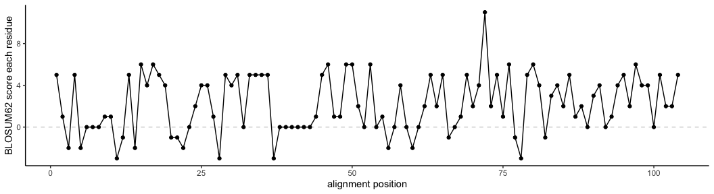

divergence_metrics
================
Janet Young

2025-10-24

# Goal

Play with code to look at divergence metrics in a multiple sequence
alignment

``` r
knitr::opts_chunk$set(echo = TRUE)
library(tidyverse)
library(Biostrings)
library(pwalign)
library(here)
library(patchwork)
source(here("useful_functions/multiple_sequence_alignments_functions.R"))
```

# Read/create example alignments (DNA and protein)

Histone amino acid alignment

``` r
aa_aln_histone <- here("Rscripts/multiple_sequence_alignments/example_alignment_files/exampleProtAln_shortH2As_histoneFoldDomain.fa") |> 
    readAAStringSet()

names(aa_aln_histone) <- sapply(strsplit(names(aa_aln_histone), " "), "[[", 1)

aa_aln_histone
```

    ## AAStringSet object of length 37:
    ##      width seq                                              names               
    ##  [1]    82 SRSSRAGLQFPVGRVHRLLRKGN...TRIIPRHLQLAIRNDEELNKLL H2A_panda
    ##  [2]    82 TRSSRAGLQFPVGRVHRLLRKGN...TRIIPRHLQLAIRNDEELNKLL H2A_armadillo
    ##  [3]    82 TRSSRAGLQFPVGRVHRLLRKGN...TRIIPRHLQLAIRNDEELNKLL H2A_chineseHamster
    ##  [4]    82 SRSSRAGLQFPVGRVHRLLRKGN...TRIIPRHLQLAIRNDEELNKLL H2A_leopard
    ##  [5]    82 TRSSRAGLQFPVGRVHRLLRKGN...TRIIPRHLQLAIRNDEELNKLL H2A_mouse
    ##  ...   ... ...
    ## [33]    82 THLTTTEPQVPVSFVDHLLQEDQ...MQMTPQDVERAVDSNAEPHRQV H2A.P_pig
    ## [34]    82 SHLIRSELQCPLSYVDRLLLEDQ...MHTVPQD-DRGVGSNGQRPQNL H2A.P_leopard
    ## [35]    82 AHLITTELQVPVSYVDRLLQENQ...MPTAPQDVERAVDSSGEPYHRS H2A.P_panda
    ## [36]    82 ACLPTAELQFPVSYLDRLLQKDE...SSSVAQDVEGGVNNNREPQRQV H2A.P_rhino
    ## [37]    82 SLSARTEMEFSPSGLERLLQEDR...SHIAPLDVERGVRNNRLLRHLL H2A.P_armadillo

Get a smaller alignment, for testing

``` r
aa_aln_h2a_l <- aa_aln_histone[ grep("H2A.L", names(aa_aln_histone)) ] |> 
    degapAln()
aa_aln_h2a_l
```

    ## AAStringSet object of length 8:
    ##     width seq                                               names               
    ## [1]    82 SRITRGQLQFSLDRIERFFRDGN...TRLITPEHVTQVVQNNDQLREVF H2A.L_chineseHamster
    ## [2]    82 SRSRRAELQFPVSRVDRFLREGN...RKRISPEHLCRVVQNNDQLHQLF H2A.L_rat
    ## [3]    82 TRSQRGEL--PLSLVDRFLREEF...RKRVTPEDVRLVVQNNEQLRQLF H2A.L_mouse
    ## [4]    82 SCSSRAELQFPMSSLDCVLPEGQ...KVRITPEHVQRALNNNETLSRLF H2A.L_pig
    ## [5]    82 SRSRRAELQFPVSRVERLLREGR...KMRITPEHVQRALGSNQHLRGLL H2A.L_leopard
    ## [6]    82 SRSMRAKLQFPVSRVDRLLREGC...KMRITPEHVQRALVNNQHLSCLF H2A.L_panda
    ## [7]    82 SRSTRAELQFPVSRVDHFLRQGP...KIRITPEHVQRAVDNNLNLSHLF H2A.L_rhino
    ## [8]    82 SRSTRAELQFPVSRVDRVLRESH...RKRITPENVEKAVSKNPQLSRVF H2A.L_armadillo

``` r
aa_aln_h2a_l_firstBit <- aa_aln_h2a_l |> 
    narrow(start=1, end=12)
aa_aln_h2a_l_firstBit <- aa_aln_h2a_l_firstBit[1:4]

aa_aln_h2a_l_firstBit
```

    ## AAStringSet object of length 4:
    ##     width seq                                               names               
    ## [1]    12 SRITRGQLQFSL                                      H2A.L_chineseHamster
    ## [2]    12 SRSRRAELQFPV                                      H2A.L_rat
    ## [3]    12 TRSQRGEL--PL                                      H2A.L_mouse
    ## [4]    12 SCSSRAELQFPM                                      H2A.L_pig

Very simple protein alignment

``` r
simple_aa_aln <- AAStringSet(c(seq1="SRSRRAE",
                               seq2a="SRS-RAE", ## same as seq1 but with 1 gap
                               seq2b="SRS-RAE", ## same as seq2a
                               seq3="SRSRCAE", ## same as seq1 but with 1 substitution
                               seq4="SRS-CAE")) ## same as seq1 but with 1 gap and 1 substitution
simple_aa_aln
```

    ## AAStringSet object of length 5:
    ##     width seq                                               names               
    ## [1]     7 SRSRRAE                                           seq1
    ## [2]     7 SRS-RAE                                           seq2a
    ## [3]     7 SRS-RAE                                           seq2b
    ## [4]     7 SRSRCAE                                           seq3
    ## [5]     7 SRS-CAE                                           seq4

## stringDist function

`stringDist()` (was in Biostrings, moved to pwalign package)

It counts number of changes between all pairs of sequences, using
various methods - “levenshtein”, “hamming”, “quality”, or
“substitutionMatrix”.

Show Hamming distances for the simple alignment. This shows that an
indel gets counted as 1 difference, as does a substitution, and that a
gap aligned to a gap is scored as 0 difference

``` r
simple_aa_aln |> 
    stringDist(diag=TRUE, upper=TRUE, method="hamming")
```

    ##       seq1 seq2a seq2b seq3 seq4
    ## seq1     0     1     1    1    2
    ## seq2a    1     0     0    2    1
    ## seq2b    1     0     0    2    1
    ## seq3     1     2     2    0    1
    ## seq4     2     1     1    1    0

## Hamming versus Levenshtein distances

This [wikipedia
page](https://en.wikipedia.org/wiki/Levenshtein_distance) explains the
difference between hamming and Levenshtein distances.

Levenshtein distance is essentially the minimal Hamming distance
considering all possible gapless local alignments.

Example - lawn versus flaw, where Hamming distance is 4:

``` r
y <- c("lawn","flaw")
x <- BStringSet(y)
names(x) <- y
x
```

    ## BStringSet object of length 2:
    ##     width seq                                               names               
    ## [1]     4 lawn                                              lawn
    ## [2]     4 flaw                                              flaw

``` r
x |> stringDist(diag=TRUE, upper=TRUE, method="hamming")
```

    ##      lawn flaw
    ## lawn    0    4
    ## flaw    4    0

Levenstein distance is 2, because you can realign like this to yield an
alignment with 2 diffs at the ends:

    -lawn
    flaw-

``` r
x |> stringDist(diag=TRUE, upper=TRUE, method="levenshtein")
```

    ##      lawn flaw
    ## lawn    0    2
    ## flaw    2    0

From the stringDist help, I can see that when method is anything other
than “hamming” it realign the sequences.

I initially thought I might use stringDist to score an alignment using
BLOSUM62, but then understood that it doesn’t handle gaps, because in
this mode it actually realigns the underlying seqs.

## alignedStringDistMatrix

After submitting a github issue or two, Herve wrote a new function
called `alignedStringDistMatrix` that does NOT realign the input, and
simp <https://github.com/Bioconductor/pwalign/issues/15>

``` r
simple_aa_aln |> 
    alignedStringDistMatrix()
```

    ##       seq1 seq2a seq2b seq3 seq4
    ## seq1     0     1     1    1    2
    ## seq2a    1     0     0    2    1
    ## seq2b    1     0     0    2    1
    ## seq3     1     2     2    0    1
    ## seq4     2     1     1    1    0

``` r
## here's how we make BLOSUM62 available (it's from the ppwalign package)
data(BLOSUM62)
```

We can use Herve’s new function to score an existing alignment using
BLOSUM62.

BLOSUM62 contains positive numbers for matches and negative for
mismatch. Given that the function’s goal is to yield DISTANCES, we take
the negative of BLOSUM62 to be a distance rather than a similarity
score:

``` r
simple_aa_aln |> 
    alignedStringDistMatrix(weightmat=-BLOSUM62)
```

    ##       seq1 seq2a seq2b seq3 seq4
    ## seq1   -32   -26   -26  -24  -18
    ## seq2a  -26   -27   -27  -18  -19
    ## seq2b  -26   -27   -27  -18  -19
    ## seq3   -24   -18   -18  -36  -30
    ## seq4   -18   -19   -19  -30  -31

Indels have a default distance score of 1 but we can change that:

``` r
simple_aa_aln |> 
    alignedStringDistMatrix(weightmat=-BLOSUM62, indel.weight = 0)
```

    ##       seq1 seq2a seq2b seq3 seq4
    ## seq1   -32   -27   -27  -24  -19
    ## seq2a  -27   -27   -27  -19  -19
    ## seq2b  -27   -27   -27  -19  -19
    ## seq3   -24   -19   -19  -36  -31
    ## seq4   -19   -19   -19  -31  -31

``` r
simple_aa_aln |> 
    alignedStringDistMatrix(weightmat=-BLOSUM62, indel.weight = 10)
```

    ##       seq1 seq2a seq2b seq3 seq4
    ## seq1   -32   -17   -17  -24   -9
    ## seq2a  -17   -27   -27   -9  -19
    ## seq2b  -17   -27   -27   -9  -19
    ## seq3   -24    -9    -9  -36  -21
    ## seq4    -9   -19   -19  -21  -31

# Protein idenity versus similarity

For Priya Shah’s YFV project we talked about sliding window similarity
rather than identity.

Blastp gives two % scores: identity, and % positives (by default using
BLOSUM62). By looking at blast output, I think it is counting any pair
of amino acids with positive BLOSUM score as a ‘positive’, and using
total positive count to get the %.

So BLAST is less fancy than protr’s % similarity score. Blast treats a
match as all or nothing, whereas protr actually uses the total score and
normalizes it to the geometric mean of the two possible perfect scores.

Let’s actually look at BLOSUM62

``` r
BLOSUM62[AA_ALPHABET[1:20],AA_ALPHABET[1:20]]
```

    ##    A  R  N  D  C  Q  E  G  H  I  L  K  M  F  P  S  T  W  Y  V
    ## A  4 -1 -2 -2  0 -1 -1  0 -2 -1 -1 -1 -1 -2 -1  1  0 -3 -2  0
    ## R -1  5  0 -2 -3  1  0 -2  0 -3 -2  2 -1 -3 -2 -1 -1 -3 -2 -3
    ## N -2  0  6  1 -3  0  0  0  1 -3 -3  0 -2 -3 -2  1  0 -4 -2 -3
    ## D -2 -2  1  6 -3  0  2 -1 -1 -3 -4 -1 -3 -3 -1  0 -1 -4 -3 -3
    ## C  0 -3 -3 -3  9 -3 -4 -3 -3 -1 -1 -3 -1 -2 -3 -1 -1 -2 -2 -1
    ## Q -1  1  0  0 -3  5  2 -2  0 -3 -2  1  0 -3 -1  0 -1 -2 -1 -2
    ## E -1  0  0  2 -4  2  5 -2  0 -3 -3  1 -2 -3 -1  0 -1 -3 -2 -2
    ## G  0 -2  0 -1 -3 -2 -2  6 -2 -4 -4 -2 -3 -3 -2  0 -2 -2 -3 -3
    ## H -2  0  1 -1 -3  0  0 -2  8 -3 -3 -1 -2 -1 -2 -1 -2 -2  2 -3
    ## I -1 -3 -3 -3 -1 -3 -3 -4 -3  4  2 -3  1  0 -3 -2 -1 -3 -1  3
    ## L -1 -2 -3 -4 -1 -2 -3 -4 -3  2  4 -2  2  0 -3 -2 -1 -2 -1  1
    ## K -1  2  0 -1 -3  1  1 -2 -1 -3 -2  5 -1 -3 -1  0 -1 -3 -2 -2
    ## M -1 -1 -2 -3 -1  0 -2 -3 -2  1  2 -1  5  0 -2 -1 -1 -1 -1  1
    ## F -2 -3 -3 -3 -2 -3 -3 -3 -1  0  0 -3  0  6 -4 -2 -2  1  3 -1
    ## P -1 -2 -2 -1 -3 -1 -1 -2 -2 -3 -3 -1 -2 -4  7 -1 -1 -4 -3 -2
    ## S  1 -1  1  0 -1  0  0  0 -1 -2 -2  0 -1 -2 -1  4  1 -3 -2 -2
    ## T  0 -1  0 -1 -1 -1 -1 -2 -2 -1 -1 -1 -1 -2 -1  1  5 -2 -2  0
    ## W -3 -3 -4 -4 -2 -2 -3 -2 -2 -3 -2 -3 -1  1 -4 -3 -2 11  2 -3
    ## Y -2 -2 -2 -3 -2 -1 -2 -3  2 -1 -1 -2 -1  3 -3 -2 -2  2  7 -1
    ## V  0 -3 -3 -3 -1 -2 -2 -3 -3  3  1 -2  1 -1 -2 -2  0 -3 -1  4

``` r
tiny_aln <- aa_aln_h2a_l[1:4] |>
    narrow(start=81, end=82)
names(tiny_aln) <- paste0("seq",1:4)
tiny_aln
```

    ## AAStringSet object of length 4:
    ##     width seq                                               names               
    ## [1]     2 VF                                                seq1
    ## [2]     2 LF                                                seq2
    ## [3]     2 LF                                                seq3
    ## [4]     2 LF                                                seq4

``` r
tiny_aln |> 
    alignedStringDistMatrix(weightmat=BLOSUM62)
```

    ##      seq1 seq2 seq3 seq4
    ## seq1   10    7    7    7
    ## seq2    7   10   10   10
    ## seq3    7   10   10   10
    ## seq4    7   10   10   10

Just to make sure I understand how the off-diagonal scores come about,
here are the relevant bits of the BLOSUM62 matrix:

``` r
BLOSUM62[c("F","L","V"),c("F","L","V")]
```

    ##    F L  V
    ## F  6 0 -1
    ## L  0 4  1
    ## V -1 1  4

# Sliding window identity and similarity

I create functions that take a pair of aligned protein seqs, and score
each residue using a matrix (e.g. BLOSUM62). Can then get
identities/positives/scores over the entire alignment or over sliding
windows

I also want a nice example alignment (e.g. capsid YFV) to try this on
(where I have the known answer from blast)

``` r
if (Sys.info()["sysname"] == "Darwin") {
    malik_h <- "/Volumes/malik_h/"
} else {
    malik_h <- "/fh/fast/malik_h/"
}

## CapsidTrim - 26 seqs, 124aa wide
aln_capsid <- paste0(malik_h, "user/jayoung/paml_screen/Priya_Shah_YFV/janet_analysis/viral_genomes/get_genomes/genome_alignments/more_genomes_v3_YFVcomplexPlusOneMore/t_coffee/alignments_each_gene/CapsidTrim_more_genomes_v3_slice.sorted.fa") |> 
    readAAStringSet()
names(aln_capsid) <- gsub("CapsidTrim_","",names(aln_capsid))

## CapsidFull - 26 seqs, 146aa wide
# aln_capsid <- paste0(malik_h, "user/jayoung/paml_screen/Priya_Shah_YFV/janet_analysis/viral_genomes/get_genomes/genome_alignments/more_genomes_v3_YFVcomplexPlusOneMore/t_coffee/alignments_each_gene/CapsidFull_more_genomes_v3_slice.sorted.fa") |> 
# readAAStringSet()
# names(aln_capsid) <- gsub("CapsidFull_","",names(aln_capsid))

#### get just 5 seqs alignment
## CapsidTrim - 5 seqs, 124aa wide
## CapsidFull - 5 seqs, 132aa wide
aln_capsid_small <- aln_capsid[c("JN628281_17D_reference",
                                 "AY632543.1_Sepik_virus",
                                 "ZIKVug_MR766_ZIKVug_LC002520",
                                 "WNV_2000crow_3356_AF404756",
                                 "DENV2_16681_KU725663")] |> 
    degapAln()
```

``` r
## 124aa wide (YFV and Sepik)
aln_capsid_one_pair <- aln_capsid_small[1:2] |> 
    degapAln()
```

``` r
#### getPairAlnStatsByResidue is a function that takes individual pairwise alignments, and for each position returns various scores (matrix_score, identical, positive) as well as a tbl formatted alignment
### not sure how I would normalize. maybe I need to get the max possible score at each position?
getPairAlnStatsByResidue <- function(twoSeqAln, 
                                     gapScore=NA_integer_,
                                     substitutionMatrix=BLOSUM62) {
    ## up-front checks
    if(length(twoSeqAln)!=2) { stop ("\n\nERROR - getPairAlnStatsByResidue function is designed for a two-sequence alignment\n\n") }
    aln_lens <- width(twoSeqAln) |> unique()
    if(length(aln_lens)>1) { stop("\n\nERROR - your sequences are not aligned - they have different lengths\n\n")}
    
    ### add gap to the substitutionMatrix
    substitutionMatrix <- as.data.frame(substitutionMatrix)
    substitutionMatrix[,"-"] <- gapScore
    substitutionMatrix["-",] <- gapScore
    
    ## start output 
    output <- alnToTibble(twoSeqAln) 
    colnames(output)[2:3] <- c("seq1","seq2") 
    output <- output |> 
        mutate(seq1_id=names(twoSeqAln[1])) |> 
        mutate(seq2_id=names(twoSeqAln)[2]) |> 
        relocate(seq1_id, seq2_id)
    
    pos_tbl <- getAlnPosLookupTable(twoSeqAln)
    colnames(pos_tbl)[2:3] <- c("seq1_pos","seq2_pos") 
    output <- left_join(output, pos_tbl, by="aln_pos")|> 
        relocate(seq1_pos, seq2_pos, .after=aln_pos)
    
    ### split seqs into individual residues
    each_seq <- strsplit(as.character(twoSeqAln), "") 
    ### check for things that aren't in the scoring matrix
    unrecognized_residues <- setdiff( unlist(each_seq, use.names = FALSE), 
                                      rownames(substitutionMatrix)) |> 
        unique()
    if(length(unrecognized_residues)> 0) {
        stop("\n\nERROR - there are unrecognized residues in the sequences: ", paste(unrecognized_residues, collapse=","), "\n\n")
    }
    
    ## use substitutionMatrix to get score for each aligned position
    scores <- sapply(1:aln_lens, function(i) {
        substitutionMatrix[ each_seq[[1]][i], each_seq[[2]][i] ]
    })
    
    output <- output |> 
        mutate(matrix_score=scores) |> 
        mutate(identical = each_seq[[1]]==each_seq[[2]]) |> 
        mutate(positive = matrix_score > 0)
    
    if(is.na(gapScore)) {
        ## if we score gaps as NAs, we need to fix the 'identical' column for the positions - they will have FALSE rather than NA
        output <- output |> 
            mutate(identical = case_when( (is.na(seq1_pos) | is.na(seq2_pos)) ~ NA, 
                                          TRUE ~ identical))
    }
    
    return(output)
}

## default gapScore is NA, in which case gap positions get NA for all three columns (matrix_score, identical, positive)
aln_capsid_one_pair_position_scores_gapNA <- getPairAlnStatsByResidue(aln_capsid_one_pair)

## or, if we set gapScore=0, gap positions get matrix_score=0 and identical=positive=FALSE
aln_capsid_one_pair_position_scores_gap0 <- getPairAlnStatsByResidue(aln_capsid_one_pair, gapScore=0)

## position 2 - S:A scores 1.  SS scores 4. AA scores 4
## position 3 - G:T scores -2.  GG scores 6, TT scores 5

aln_capsid_one_pair_position_scores_gapNA
```

    ## # A tibble: 104 × 10
    ##    seq1_id  seq2_id aln_pos seq1_pos seq2_pos seq1  seq2  matrix_score identical
    ##    <chr>    <chr>     <int>    <int>    <int> <chr> <chr>        <int> <lgl>    
    ##  1 JN62828… AY6325…       1        1        1 M     M                5 TRUE     
    ##  2 JN62828… AY6325…       2        2        2 S     A                1 FALSE    
    ##  3 JN62828… AY6325…       3        3        3 G     T               -2 FALSE    
    ##  4 JN62828… AY6325…       4        4        4 R     R                5 TRUE     
    ##  5 JN62828… AY6325…       5        5        5 K     G               -2 FALSE    
    ##  6 JN62828… AY6325…       6       NA        6 -     A               NA NA       
    ##  7 JN62828… AY6325…       7       NA        7 -     S               NA NA       
    ##  8 JN62828… AY6325…       8       NA        8 -     K               NA NA       
    ##  9 JN62828… AY6325…       9        6        9 A     S                1 FALSE    
    ## 10 JN62828… AY6325…      10        7       10 Q     R                1 FALSE    
    ## # ℹ 94 more rows
    ## # ℹ 1 more variable: positive <lgl>

``` r
# aln_capsid_one_pair_position_scores_gap0 
```

``` r
#### alnStats_toSlidingWindowResults is a function that takes the output of getPairAlnStatsByResidue and generates sliding window stats
## you could imagine wanting different stats (e.g. divergence rather than identity)

### for now we deal with 0/1 scores (e.g. identical or positive) and divide by the number of positions
### we need to decide whether windows slide with respect to the alignment, or with respect to one of the sequences
alnStats_toSlidingWindowResults <- function(alnStatsTbl, 
                                            alnStatsTblwindowSize=5, windowSlide=1, 
                                            pos_colname = "aln_pos", 
                                            score_colname = "identical") {
    ## up-front checks
    if (!pos_colname %in% colnames(alnStatsTbl)) {
        stop("\n\nERROR - which column contains the positions to use for sliding windows? Cannot find ",pos_colname,"\n\n")
    }
    if (!score_colname %in% colnames(alnStatsTbl)) {
        stop("\n\nERROR - which column contains the scores to use for sliding windows? Cannot find ",score_colname,"\n\n")
    }
    ## create windows
    max_pos <- alnStatsTbl |> pull(!!pos_colname) |> max(na.rm = TRUE)
    
    ## restructure the score as Views, each region is a sliding window
    my_views <- Views(subject=alnStatsTbl |> filter(!is.na(!!pos_colname)) |> pull(score_colname) |> as.integer(),
                      start= seq(from=1, to=max_pos+1-alnStatsTblwindowSize, by=windowSlide),
                      width=alnStatsTblwindowSize)
    ## calculate stuff in each window
    output <- as(my_views, "IRanges") |> 
        as.data.frame() |> ## get an error if I skip this intermediate step
        as_tibble() |>
        dplyr::rename(win_start=start, win_end=end) |> 
        mutate(win_mid= (win_start + win_end)/2) |> 
        relocate(win_mid, .after=win_end) |> 
        mutate(mean_score = viewApply(my_views, function(x) { mean(as.integer(x), na.rm=TRUE) }),
               # median_score = viewApply(my_views, function(x) { median(as.integer(x), na.rm=TRUE) }),
               tot_score = viewSums(my_views, na.rm = TRUE))
    ### rename columns
    colnames(output) <- gsub("score",score_colname,colnames(output) )
    colnames(output) <- gsub("win",pos_colname,colnames(output) )
    return(output)
}

### seems to be working. 
aln_capsid_one_pair_position_scores_windows_identical_gapNA <- aln_capsid_one_pair_position_scores_gapNA |>
    alnStats_toSlidingWindowResults()
aln_capsid_one_pair_position_scores_windows_identical_gap0 <- aln_capsid_one_pair_position_scores_gap0 |>
    alnStats_toSlidingWindowResults()
aln_capsid_one_pair_position_scores_windows_positive_gapNA <- aln_capsid_one_pair_position_scores_gapNA |>
    alnStats_toSlidingWindowResults(score_colname="positive")
aln_capsid_one_pair_position_scores_windows_positive_gap0 <- aln_capsid_one_pair_position_scores_gap0 |>
    alnStats_toSlidingWindowResults(score_colname="positive")

# 
# temp <- aln_capsid_one_pair_position_scores_gap0 |>  
#     alnStats_toSlidingWindowResults(pos_colname="seq1_pos", score_colname="positive")
# temp
# aln_capsid_one_pair_position_scores_windows_identical_gap0
```

``` r
aln_capsid_one_pair
```

    ## AAStringSet object of length 2:
    ##     width seq                                               names               
    ## [1]   104 MSGRK---AQGKTLGVNMVRRGV...AVLRKVKRVVASLMRGLSSRKRR JN628281_17D_refe...
    ## [2]   104 MATRGASKSRVTTRGVNMVTAKA...KILKKLRNIVTNLMKGLSGRRKR AY632543.1_Sepik_...

``` r
aln_capsid_one_pair_position_scores_gap0 |> 
    ggplot(aes(x=aln_pos, y=matrix_score)) +
    geom_hline(yintercept = 0, lty=2, color="lightgray") +
    geom_line() +
    geom_point() +
    theme_classic() +
    labs(x="alignment position", y="BLOSUM62 score each residue")
```

<!-- -->

``` r
my_color_scheme <- c("FALSE"="gray", "TRUE"="red")
p1 <- aln_capsid_one_pair_position_scores_gap0 |> 
    mutate(seq1_gap = is.na(seq1_pos)) |> 
    mutate(seq2_gap = is.na(seq2_pos)) |> 
    select(aln_pos, identical, positive, seq1_gap, seq2_gap) |> 
    pivot_longer(cols=-aln_pos, names_to="statistic") |> 
    mutate(statistic=factor(statistic, levels = c("seq1_gap", "seq2_gap", "positive", "identical"))) |> 
    ggplot(aes(x=aln_pos, y=statistic, color=value)) +
    geom_point() +
    theme_classic() +
    scale_color_manual(values=my_color_scheme) +
    coord_cartesian(xlim=c(0,105))
# labs(x="alignment position", y="positive each residue")


p2 <- aln_capsid_one_pair_position_scores_gap0 |> 
    ggplot(aes(x=aln_pos, y=matrix_score)) +
    geom_hline(yintercept = 0, lty=2, color="lightgray") +
    geom_point(size=0.5) +
    theme_classic()  +
    coord_cartesian(xlim=c(0,105))

p3 <- aln_capsid_one_pair_position_scores_windows_identical_gap0 |> 
    ggplot(aes(x=aln_pos_mid, y=tot_identical)) +
    geom_point(size=0.5) +
    theme_classic() +
    labs(title="5aa windows sliding 1aa, total identical") +
    coord_cartesian(xlim=c(0,105))


p4 <- aln_capsid_one_pair_position_scores_windows_positive_gap0 |> 
    ggplot(aes(x=aln_pos_mid, y=tot_positive)) +
    geom_point(size=0.5) +
    theme_classic() +
    labs(title="5aa windows sliding 1aa, total positives") +
    coord_cartesian(xlim=c(0,105))

p1 / p2 / p3 / p4
```

<!-- -->

# Play with `pwalign` package to create alignments

See
[documentation](https://bioconductor.org/packages/release/bioc/vignettes/pwalign/inst/doc/PairwiseAlignments.pdf)

`PairwiseAlignmentsSingleSubject()` :

``` r
temp <- aa_aln_h2a_l_firstBit[1:2]
temp2 <- temp |> PairwiseAlignmentsSingleSubject()
nmatch(temp2)
```

    ## [1] 6

``` r
nmismatch(temp2)
```

    ## [1] 6

``` r
# mismatchTable(temp2)
deletion(temp2)
```

    ## IRangesList object of length 1:
    ## [[1]]
    ## IRanges object with 0 ranges and 0 metadata columns:
    ##        start       end     width
    ##    <integer> <integer> <integer>

``` r
insertion(temp2)
```

    ## IRangesList object of length 1:
    ## [[1]]
    ## IRanges object with 0 ranges and 0 metadata columns:
    ##        start       end     width
    ##    <integer> <integer> <integer>

``` r
indel(temp2)
```

    ## An object of class "InDel"
    ## Slot "insertion":
    ## IRangesList object of length 1:
    ## [[1]]
    ## IRanges object with 0 ranges and 0 metadata columns:
    ##        start       end     width
    ##    <integer> <integer> <integer>
    ## 
    ## 
    ## Slot "deletion":
    ## IRangesList object of length 1:
    ## [[1]]
    ## IRanges object with 0 ranges and 0 metadata columns:
    ##        start       end     width
    ##    <integer> <integer> <integer>

``` r
nchar(temp2)
```

    ## [1] 12

``` r
pid(temp2)
```

    ## [1] 50

The `pid()` (Percent Sequence Identity) function has a `type` option.
Possible values:

- “PID1”: 100 \* (identical positions) / (aligned positions + internal
  gap positions)
- “PID2”: 100 \* (identical positions) / (aligned positions)
- “PID3”: 100 \* (identical positions) / (length shorter sequence)
- “PID4”: 100 \* (identical positions) / (average length of the two
  sequences)

# Try protr package, which can calculate % identity and % similarity using BLOSUM matrix

``` r
library(protr)
```

`protr::readFASTA` reads FASTA file. Returns a named list, using fasta
header as names. Contents are sequence(s) as character objects.

``` r
s1 <- readFASTA(system.file("protseq/P00750.fasta", package = "protr"))[[1]]
s2 <- readFASTA(system.file("protseq/P08218.fasta", package = "protr"))[[1]]
s3 <- readFASTA(system.file("protseq/P10323.fasta", package = "protr"))[[1]]
s4 <- readFASTA(system.file("protseq/P20160.fasta", package = "protr"))[[1]]
s5 <- readFASTA(system.file("protseq/Q9NZP8.fasta", package = "protr"))[[1]]

plist <- list(s1, s2, s3, s4, s5)

# sapply(plist, nchar)
# [1] 562 269 421 251 487
```

`protr::twoSeqSim` aligns two protein sequences. By default it’s a local
aln, BLOSUM62, with gap.opening = 10, gap.extension = 4, but can change
any of those.

``` r
twoSeqSim(s1, s2)
```

    ## Local PairwiseAlignmentsSingleSubject (1 of 1)
    ## pattern: [293] VPSCSTCGLRQYSQPQFRIKGGLFADIASHP...VGI--ISWGLGCGQKDVPGVYTKVTNYLDWI
    ## subject:  [11] VAGALSCGVSTYAPDMSRMLGGEEARPNSWP...HGIGSLTSVLGCNYYYKPSIFTRVSNYNDWI
    ## score: 253

`protr::parSeqSim` performs every possible pairwise alignment within one
seq set (in parallel) and returns a similarity matrix

``` r
psimmat <- parSeqSim(plist, cores = 4, type = "local", submat = "BLOSUM62")
psimmat
```

    ##            [,1]       [,2]       [,3]       [,4]       [,5]
    ## [1,] 1.00000000 0.11825938 0.10236985 0.04921696 0.03943488
    ## [2,] 0.11825938 1.00000000 0.18858241 0.12124217 0.06391103
    ## [3,] 0.10236985 0.18858241 1.00000000 0.05819984 0.06175942
    ## [4,] 0.04921696 0.12124217 0.05819984 1.00000000 0.05714638
    ## [5,] 0.03943488 0.06391103 0.06175942 0.05714638 1.00000000

`protr::crossSetSim` performs every possible pairwise alignment between
two different seq sets (in parallel) and returns a similarity matrix

``` r
plist1 <- list(s1 = s1, s2 = s2, s4 = s4)
plist2 <- list(s3 = s3, s4_again = s4, s5 = s5, s1_again = s1)
psimmat <- crossSetSim(plist1, plist2)
colnames(psimmat) <- names(plist1)
rownames(psimmat) <- names(plist2)

psimmat
```

    ##          s1         s2         s4        
    ## s3       0.1023699  0.1885824  0.05819984
    ## s4_again 0.04921696 0.1212422  1         
    ## s5       0.03943488 0.06391103 0.05714638
    ## s1_again 1          0.1182594  0.04921696

I am curious how it’s calculating the pairwise similarity. Looks like
that happens with a different function: `.seqPairSim`. Code is
[here](https://github.com/nanxstats/protr/blob/master/R/par-01-parSeqSim.R)
(line 541).

Similarity is defined as follows, where s12 is the score for the
alignment between seq1 and seq2. s11 and s22 are the scores you’d get
from each self-alignment.

    sim <- s12 / sqrt(s11 * s22)

Each score derives from using pwalign::pairwiseAlignment on a pair of
sequences

# Finished

``` r
sessionInfo()
```

    ## R version 4.5.1 (2025-06-13)
    ## Platform: aarch64-apple-darwin20
    ## Running under: macOS Sequoia 15.6.1
    ## 
    ## Matrix products: default
    ## BLAS:   /Library/Frameworks/R.framework/Versions/4.5-arm64/Resources/lib/libRblas.0.dylib 
    ## LAPACK: /Library/Frameworks/R.framework/Versions/4.5-arm64/Resources/lib/libRlapack.dylib;  LAPACK version 3.12.1
    ## 
    ## locale:
    ## [1] en_US.UTF-8/en_US.UTF-8/en_US.UTF-8/C/en_US.UTF-8/en_US.UTF-8
    ## 
    ## time zone: America/Los_Angeles
    ## tzcode source: internal
    ## 
    ## attached base packages:
    ## [1] stats4    stats     graphics  grDevices utils     datasets  methods  
    ## [8] base     
    ## 
    ## other attached packages:
    ##  [1] protr_1.7-5         patchwork_1.3.2     here_1.0.2         
    ##  [4] pwalign_1.4.0       Biostrings_2.76.0   GenomeInfoDb_1.44.1
    ##  [7] XVector_0.48.0      IRanges_2.42.0      S4Vectors_0.46.0   
    ## [10] BiocGenerics_0.54.0 generics_0.1.4      lubridate_1.9.4    
    ## [13] forcats_1.0.0       stringr_1.5.2       dplyr_1.1.4        
    ## [16] purrr_1.1.0         readr_2.1.5         tidyr_1.3.1        
    ## [19] tibble_3.3.0        ggplot2_3.5.2       tidyverse_2.0.0    
    ## 
    ## loaded via a namespace (and not attached):
    ##  [1] utf8_1.2.6              stringi_1.8.7           hms_1.1.3              
    ##  [4] digest_0.6.37           magrittr_2.0.4          evaluate_1.0.5         
    ##  [7] grid_4.5.1              timechange_0.3.0        RColorBrewer_1.1-3     
    ## [10] iterators_1.0.14        fastmap_1.2.0           foreach_1.5.2          
    ## [13] doParallel_1.0.17       rprojroot_2.1.1         jsonlite_2.0.0         
    ## [16] httr_1.4.7              UCSC.utils_1.4.0        scales_1.4.0           
    ## [19] codetools_0.2-20        cli_3.6.5               rlang_1.1.6            
    ## [22] crayon_1.5.3            withr_3.0.2             yaml_2.3.10            
    ## [25] parallel_4.5.1          tools_4.5.1             tzdb_0.5.0             
    ## [28] GenomeInfoDbData_1.2.14 vctrs_0.6.5             R6_2.6.1               
    ## [31] lifecycle_1.0.4         pkgconfig_2.0.3         pillar_1.11.1          
    ## [34] gtable_0.3.6            glue_1.8.0              xfun_0.53              
    ## [37] tidyselect_1.2.1        rstudioapi_0.17.1       knitr_1.50             
    ## [40] farver_2.1.2            htmltools_0.5.8.1       labeling_0.4.3         
    ## [43] rmarkdown_2.29          compiler_4.5.1
