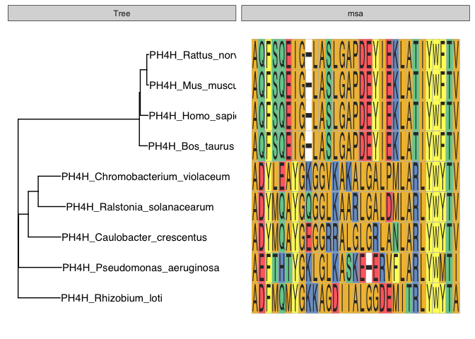
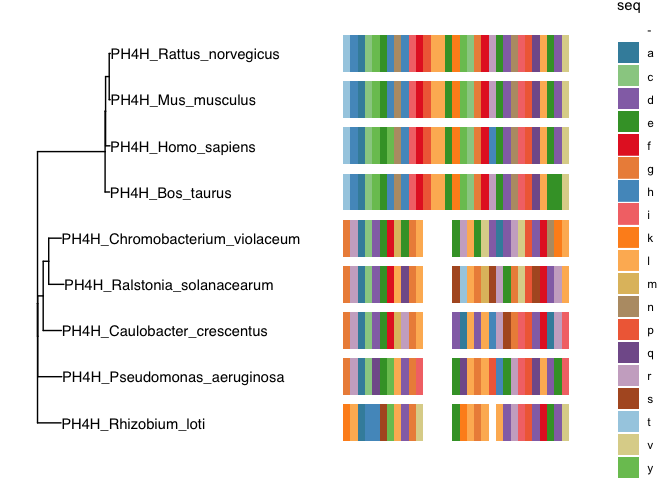
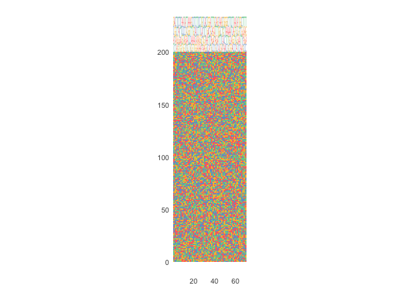
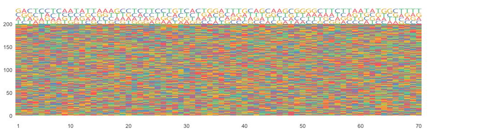

ggmsa_demo
================
Janet Young

2025-01-21

[ggmsa](https://www.bioconductor.org/packages/release/bioc/vignettes/ggmsa/inst/doc/ggmsa.html)
is a package designed to plot multiple sequence alignments.

# Load libraries

``` r
knitr::opts_chunk$set(echo = TRUE)
library(ggtree)
library(ape)
library(Biostrings)
library(ggmsa)
library(here)
```

# Read in some example data

``` r
## examples adapted from here:
# https://github.com/YuLab-SMU/ggmsa/issues/15
# https://github.com/YuLab-SMU/ggmsa/issues/56
prot_aln_file <- system.file("extdata", "sample.fasta", package = "ggmsa")
prot_aln <- readAAStringSet(prot_aln_file)
dist_matrix <- as.dist(pwalign::stringDist(prot_aln, method = "hamming")/width(prot_aln)[1])
tree <- bionj(dist_matrix)

dna_aln <- readDNAStringSet(here("Rscripts/multiple_sequence_alignments/example_alignment_files/ggmsa_tests_example_for_github.fa"))
```

# Plot tree+aln using ggmsa::geom_msa

``` r
## first make a simple ggtree plot
plain_tree_plot <- ggtree(tree) + 
    geom_tiplab() #tree

## now use ggmsa function tidy_msa() to prep a chunk of the alignment. This returns a data.frame, three columns: seqname, position and amino acid
prot_aln_DF <- tidy_msa(prot_aln, start = 300, end = 330)  

## add alignment to the tree using geom_msa (a ggmsa function)
plain_tree_plot + 
    geom_facet(geom = geom_msa, 
               data = prot_aln_DF,
               panel = 'msa', 
               ## font = NULL, use NULL if we're zoomed way out and only want to show colors
               color = "Chemistry_AA")  +
    xlim_tree(1)
```

    ## Warning: No shared levels found between `names(values)` of the manual scale and the
    ## data's fill values.

<!-- -->

# Plot tree+aln using ggtree::msaplot

it’s pretty, but I wish it would write the letters of the seqs, rather
than just using colors

``` r
msaplot(plain_tree_plot,
        prot_aln_file,
        offset=2, width=3, window=c(200,230))
```

<!-- -->

# Add logo plot using geom_seqlogo

``` r
# example from here: https://github.com/YuLab-SMU/ggmsa/issues/56
ggmsa(dna_aln, seq_name = F,
      char_width = 0.5,
      font = NULL, border = NA, color = "Chemistry_NT") +
    geom_seqlogo(color = "Chemistry_NT")
```

    ## Warning: No shared levels found between `names(values)` of the manual scale and the
    ## data's fill values.

<!-- -->

# Playing around with the sizing of the plot

I had some trouble with resizing to change dimensions when saving
files - played around until I found a solution

``` r
test_msa_plot <- ggmsa(dna_aln, seq_name = F,
                       char_width = 0.5,
                       font = NULL, border = NA, color = "Chemistry_NT") +
    facet_msa(field=80) +
    geom_seqlogo(color = "Chemistry_NT")
```

    ## Scale for x is already present.
    ## Adding another scale for x, which will replace the existing scale.
    ## Coordinate system already present. Adding new coordinate system, which will
    ## replace the existing one.

``` r
ggsave(filename = here("Rscripts/multiple_sequence_alignments/ggmsa_testPlot.pdf"), plot=test_msa_plot, height=3, width=11)
```

    ## Warning: No shared levels found between `names(values)` of the manual scale and the
    ## data's fill values.

``` r
test_msa_plot
```

    ## Warning: No shared levels found between `names(values)` of the manual scale and the
    ## data's fill values.

<!-- -->
