ggmsa_useful_tricks_and_testCode
================
Janet Young

2026-09-02

[ggmsa](https://www.bioconductor.org/packages/release/bioc/vignettes/ggmsa/inst/doc/ggmsa.html)
is a package designed to plot multiple sequence alignments.

ggmsa code does seem to generate a lot of warnings - I am suppressing
them here.

# Load libraries

``` r
knitr::opts_chunk$set(echo = TRUE)
library(tidyverse)
library(ggtree)
library(ape)
library(Biostrings)
library(ggmsa)
library(here)
```

# Read in some example data

``` r
## examples adapted from here:
# https://github.com/YuLab-SMU/ggmsa/issues/15
# https://github.com/YuLab-SMU/ggmsa/issues/56
prot_aln_file <- system.file("extdata", "sample.fasta", package = "ggmsa")
prot_aln <- readAAStringSet(prot_aln_file)
dist_matrix <- as.dist(pwalign::stringDist(prot_aln, method = "hamming")/width(prot_aln)[1])
tree <- bionj(dist_matrix)

dna_aln <- readDNAStringSet(here("Rscripts/multiple_sequence_alignments/example_alignment_files/ggmsa_tests_example_for_github.fa"))
```

# Simple ggmsa

``` r
ggmsa(prot_aln, start=1, end = 50, seq_name=TRUE, border=FALSE) 
```

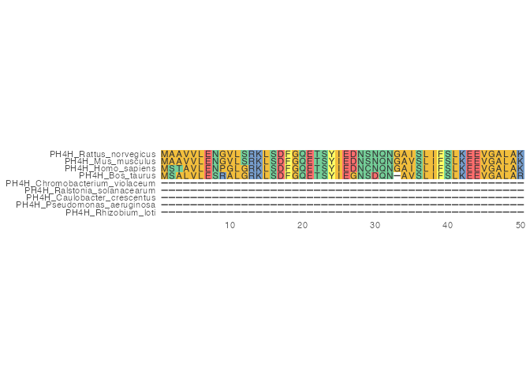<!-- -->

Wrap a longer alignment over multiple rows (this alignment is ~450aa
long)

``` r
ggmsa(prot_aln, seq_name=TRUE, border=FALSE) + 
    facet_msa(field = 100)
```

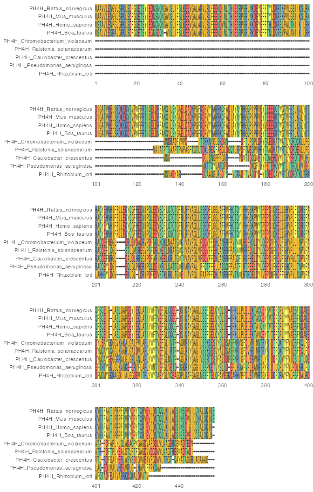<!-- -->

# Turn background shading off

`none_bg=TRUE` works to turn off the background, but it also turns off
the sequence names which is unhelpful

``` r
ggmsa(prot_aln, start=1, end = 50, none_bg=TRUE, seq_name=TRUE, border=FALSE) 
```

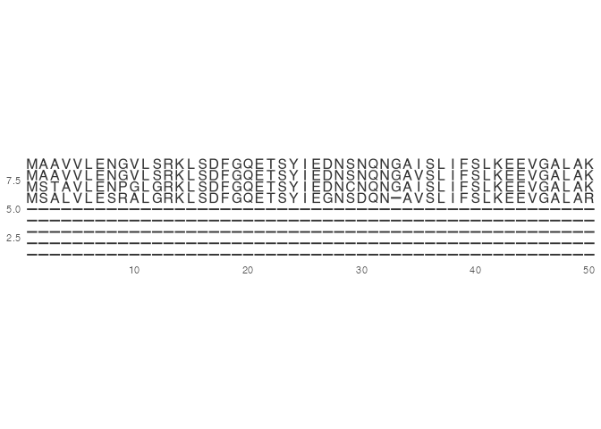<!-- -->

instead we can set up an all-white color scheme and use it in the
`custom_color` argument

``` r
### make a custom color scheme
all_white_df <- data.frame(names = c(LETTERS[1:26],"-"), 
                           color = "#FFFFFF", 
                           stringsAsFactors = FALSE)

ggmsa(prot_aln, start=1, end = 50, custom_color=all_white_df, seq_name=TRUE, border=FALSE) 
```

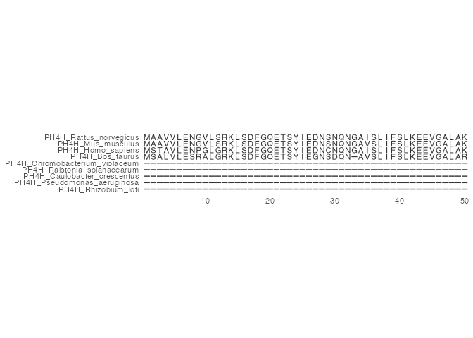<!-- -->

# Plot tree+aln using ggmsa::geom_msa

``` r
## first make a simple ggtree plot
plain_tree_plot <- ggtree(tree) + 
    geom_tiplab() #tree

## now use ggmsa function tidy_msa() to prep a chunk of the alignment. This returns a data.frame, three columns: seqname, position and amino acid
prot_aln_DF <- tidy_msa(prot_aln, start = 300, end = 330)  

## add alignment to the tree using geom_msa (a ggmsa function)
plain_tree_plot + 
    geom_facet(geom = geom_msa, 
               data = prot_aln_DF,
               panel = 'msa', 
               ## font = NULL, use NULL if we're zoomed way out and only want to show colors
               color = "Chemistry_AA")  +
    xlim_tree(1)
```

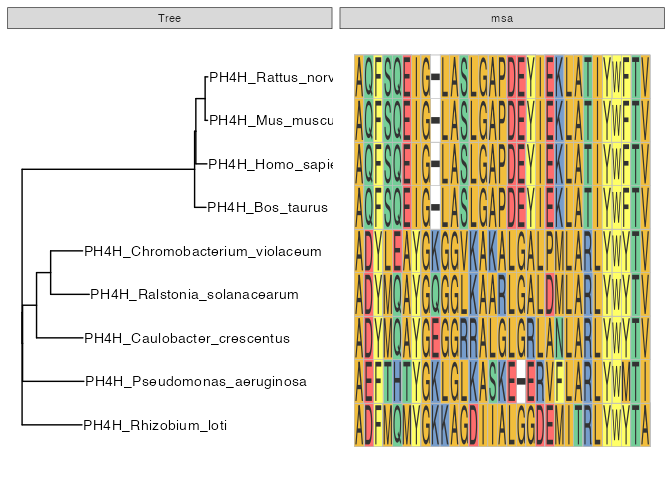<!-- -->

# Plot tree+aln using ggtree::msaplot

it’s pretty, but I wish it would write the letters of the seqs, rather
than just using colors

``` r
msaplot(plain_tree_plot,
        prot_aln_file,
        offset=2, width=3, window=c(200,230))
```

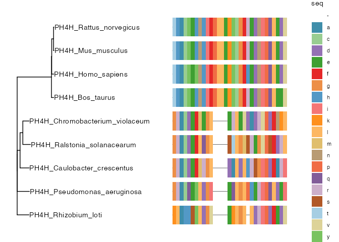<!-- -->

# Add logo plot using geom_seqlogo

``` r
# example from here: https://github.com/YuLab-SMU/ggmsa/issues/56
ggmsa(dna_aln, seq_name = F,
      char_width = 0.5,
      font = NULL, border = NA, color = "Chemistry_NT") +
    geom_seqlogo(color = "Chemistry_NT")
```

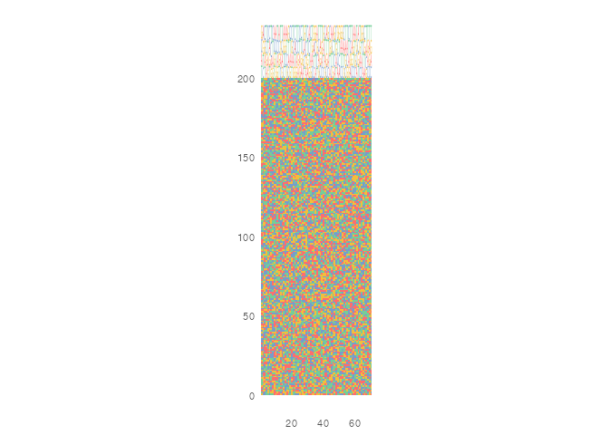<!-- -->

# Playing around with the sizing of the plot

I had some trouble with resizing to change dimensions when saving
files - played around until I found a solution

``` r
test_msa_plot <- ggmsa(dna_aln, seq_name = F,
                       char_width = 0.5,
                       font = NULL, border = NA, color = "Chemistry_NT") +
    facet_msa(field=80) +
    geom_seqlogo(color = "Chemistry_NT")
```

    ## Scale for x is already present.
    ## Adding another scale for x, which will replace the existing scale.
    ## Coordinate system already present.
    ## ℹ Adding new coordinate system, which will replace the existing one.

``` r
ggsave(filename = here("Rscripts/multiple_sequence_alignments/ggmsa_testPlot.pdf"), plot=test_msa_plot, height=3, width=11)
test_msa_plot
```

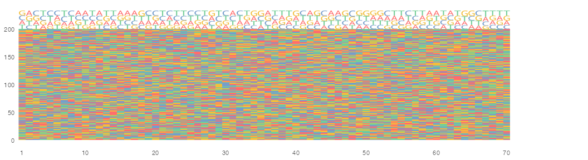<!-- -->

# Try position_highlight

``` r
prot_aln[1:2] |> 
    ggmsa(start=1, end=50, 
          position_highlight = c(10, 12),
          seq_name = TRUE)
```

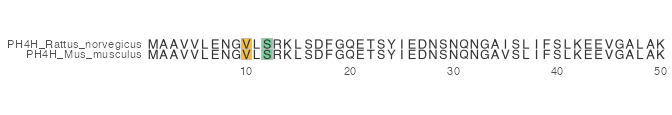<!-- -->

Can have color brightness reflect conservation, although it seems to
work with some color schemes and not others. Not sure how useful this
is.

``` r
prot_aln |> 
    ggmsa(start=200, end=250, seq_name = TRUE,
          color = "Hydrophobicity", 
          by_conservation=TRUE)
```

    ## Warning: No shared levels found between `names(values)` of the manual scale and the
    ## data's fill values.

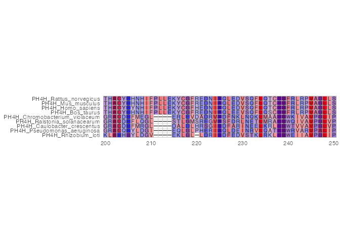<!-- -->

# Maybe we want to add our own layers to the ggmsa

``` r
annot_tbl <- tibble(x=c(10,20)) 

prot_aln[1:2] |> 
    ggmsa(start=1, end=50, 
          custom_color=all_white_df, border=FALSE,
          position_highlight = c(),
          seq_name = TRUE) +
    ### tick marks above the alignment
    geom_segment(data=annot_tbl,
                 aes(x=x, xend=x, y=3, yend=4),
                 linewidth=4) +
    ### red highlight
    geom_rect(data=annot_tbl,
              aes(xmin=x-0.5, xmax=x+0.5, ymin=0, ymax=3),
              fill = "red", alpha = 0.3) 
```

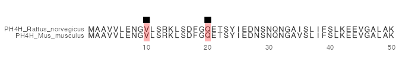<!-- -->

# explore the ggplot layers a bit more

``` r
library(gginnards)
```

``` r
p <- prot_aln[1:5] |> 
    ggmsa(start=200, end=250, seq_name = TRUE)
p
```

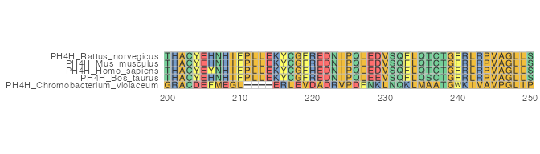<!-- -->

That plot has two layers - layer 1 is the colored tiles - layer 2 has
the letters and x and y axis labels - x range in each tbl is roughly
1-50 in both - y range in each tbl is 1-2 in layer 1, 0.7-2.3 in layer 2

[gginnards
help](https://cran.rstudio.com/web/packages/gginnards/vignettes/user-guide-2.html)

``` r
# summary(p)
summary(p$layers)
```

    ##              Length Class         Mode       
    ## geom_tile    17     LayerInstance environment
    ## geom_polygon 17     LayerInstance environment

Delete layer 1 (the background) shows us that layer 2 is the letters, x
and y axis labels

``` r
delete_layers(p, idx=1L)
```

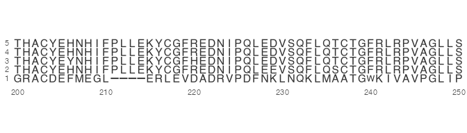<!-- -->

Delete layer 1 (the colored tiles background) shows us that layer 2 is
the letters, x and y axis labels Deleting layer 2 (the letters etc)
shows us that layer 1 is the colored tiles

``` r
delete_layers(p, idx=2L)
```

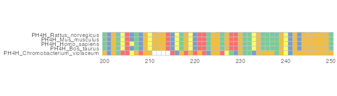<!-- -->

``` r
## looks like there are 2 tbls
plot_tbls <- lapply(1:2, function(x) {
  layer_data(p, i=x)
})
# get x range and y range
# sapply(plot_tbls, function(one_tbl) {
#   range(one_tbl$x)
# })
# 
# sapply(plot_tbls, function(one_tbl) {
#   range(one_tbl$y)
# })

# sapply(plot_tbls, dim)
#       [,1]  [,2]
# [1,] 13028 13028
# [2,]    15     9
```

First layer tbl (the tiles), first two rows:

``` r
head(plot_tbls[[1]], 2)
```

    ##     x y PANEL group  xmin  xmax ymin ymax    fill colour linewidth linetype
    ## 1 200 5     1     5 199.5 200.5  4.5  5.5 #74ce98   grey       0.2        1
    ## 2 200 5     1     5 199.5 200.5  4.5  5.5 #74ce98   grey       0.2        1
    ##   alpha width height
    ## 1    NA     1      1
    ## 2    NA     1      1

Second tbl (the letters, and axes), first two rows:

``` r
head(plot_tbls[[2]], 2)
```

    ##   group        x        y PANEL colour      fill linewidth linetype alpha
    ## 1     5 200.3651 5.450000     1     NA #333333FF       0.5        1    NA
    ## 2     5 200.3651 5.342784     1     NA #333333FF       0.5        1    NA

PANEL is always 1 in each tbl

``` r
sapply(plot_tbls, function(one_tbl) {
  table(one_tbl$PANEL==1)
})
```

    ##  TRUE  TRUE 
    ## 24996 24996

# Finished

``` r
sessionInfo()
```

    ## R version 4.6.1 (2026-06-24)
    ## Platform: aarch64-apple-darwin23
    ## Running under: macOS Tahoe 26.6.2
    ## 
    ## Matrix products: default
    ## BLAS:   /Library/Frameworks/R.framework/Versions/4.6/Resources/lib/libRblas.0.dylib 
    ## LAPACK: /Library/Frameworks/R.framework/Versions/4.6/Resources/lib/libRlapack.dylib;  LAPACK version 3.12.1
    ## 
    ## locale:
    ## [1] en_US.UTF-8/en_US.UTF-8/en_US.UTF-8/C/en_US.UTF-8/en_US.UTF-8
    ## 
    ## time zone: America/Los_Angeles
    ## tzcode source: internal
    ## 
    ## attached base packages:
    ## [1] stats4    stats     graphics  grDevices utils     datasets  methods  
    ## [8] base     
    ## 
    ## other attached packages:
    ##  [1] gginnards_0.2.0-2   here_1.0.2          ggmsa_1.18.0       
    ##  [4] Biostrings_2.80.1   Seqinfo_1.2.0       XVector_0.52.0     
    ##  [7] IRanges_2.46.0      S4Vectors_0.50.2    BiocGenerics_0.58.1
    ## [10] generics_0.1.4      ape_5.8-1           ggtree_4.2.0       
    ## [13] lubridate_1.9.5     forcats_1.0.1       stringr_1.6.0      
    ## [16] dplyr_1.2.1         purrr_1.2.2         readr_2.2.0        
    ## [19] tidyr_1.3.2         tibble_3.3.1        ggplot2_4.0.3      
    ## [22] tidyverse_2.0.0    
    ## 
    ## loaded via a namespace (and not attached):
    ##  [1] gtable_0.3.6            xfun_0.60               htmlwidgets_1.6.4      
    ##  [4] lattice_0.23-1          tzdb_0.5.0              vctrs_0.7.3            
    ##  [7] tools_4.6.1             yulab.utils_0.2.5       parallel_4.6.1         
    ## [10] pkgconfig_2.0.3         ggplotify_0.1.3         RColorBrewer_1.1-3     
    ## [13] S7_0.2.2                lifecycle_1.0.5         compiler_4.6.1         
    ## [16] farver_2.1.2            treeio_1.36.1           textshaping_1.0.5      
    ## [19] ggforce_0.5.0           ggfun_0.2.1             fontquiver_0.2.1       
    ## [22] fontLiberation_0.1.0    htmltools_0.5.9         yaml_2.3.12            
    ## [25] lazyeval_0.2.3          crayon_1.5.3            pillar_1.11.1          
    ## [28] MASS_7.3-66             seqmagick_0.1.9         nlme_3.1-171           
    ## [31] fontBitstreamVera_0.1.1 tidyselect_1.2.1        aplot_0.3.1            
    ## [34] digest_0.6.39           stringi_1.8.9           labeling_0.4.3         
    ## [37] rprojroot_2.1.1         polyclip_1.10-7         fastmap_1.2.0          
    ## [40] grid_4.6.1              cli_3.6.6               magrittr_2.0.5         
    ## [43] patchwork_1.3.2         withr_3.0.3             gdtools_0.5.1          
    ## [46] scales_1.4.0            rappdirs_0.3.4          timechange_0.4.0       
    ## [49] pwalign_1.8.0           rmarkdown_2.32          otel_0.2.0             
    ## [52] ragg_1.5.2              hms_1.1.4               evaluate_1.0.5         
    ## [55] knitr_1.51              gridGraphics_0.5-1      rlang_1.3.0            
    ## [58] ggiraph_0.9.6           Rcpp_1.1.2              R4RNA_1.40.0           
    ## [61] glue_1.8.1              tidytree_0.4.8          tweenr_2.0.3           
    ## [64] rstudioapi_0.19.0       jsonlite_2.0.0          R6_2.6.1               
    ## [67] systemfonts_1.3.2       fs_2.1.0
