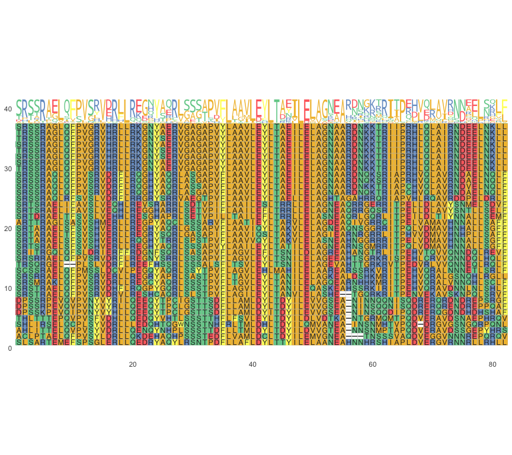

sequence logo plots
================
Janet Young

2025-01-21

Goal - show how to make logo plots

# Load libraries

``` r
knitr::opts_chunk$set(echo = TRUE)
library(tidyverse)
library(Biostrings)
library(ggseqlogo)
library(DiffLogo)
library(ggmsa)
```

# Logo plots

There are many packages that can make logo plots. Some are:  
\* [ggseqlogo](https://omarwagih.github.io/ggseqlogo/) - see demo
below.  
\*
[DiffLogo](https://bioconductor.org/packages/release/bioc/html/DiffLogo.html) -
see demo below  
\* [ggmsa](http://yulab-smu.top/ggmsa/) - see demo below  
\* [RWebLogo](https://github.com/WebLogo/weblogo) - see
[manual](http://weblogo.threeplusone.com/manual.html). Was not available
for R version 3.4.0 - I haven’t checked more recent versions. Seems more
a python thing. I think it does regular logos but not difference logos  
\*
[motifStack](https://bioconductor.org/packages/release/bioc/vignettes/motifStack/inst/doc/motifStack_HTML.html) -
I don’t think it does difference logos (although there is something
called affinity logos, for TF affinities)  
\*
[seqLogo](https://bioconductor.org/packages/release/bioc/vignettes/seqLogo/inst/doc/seqLogo.html) -
I think this only works with DNAseqs

## Define some utility functions

First we define a function called `getAlnCounts()` that takes an
alignment and returns a count or frequency matrix

``` r
# a tiny function that makes sure all seqs in an alignment are the same length as each other
checkAlnLengths <- function(aln) {
    if(length(unique(width(aln))) != 1) {
        stop("\n\nERROR - you supplied a ragged alignment (seqs not all the same length)\n\n")
    } else {
        return(TRUE)
    } 
}

## define the letters we want to count
# AA_STANDARD is defined in the Biostrings package and includes the usual 20 amino acids. I want to add the gap character ("-")
myAAtoTabulate <- c("-", AA_STANDARD)

## define the function
getAlnCounts <- function(aln, letters=myAAtoTabulate, as.prob=FALSE) {
    # check for ragged alns (seqs not all the same length)
    checkAlnLengths(aln)
    
    # get counts
    countsEachSeq <- lapply(1:length(aln), function(i) {
        letterFrequencyInSlidingView(aln[[i]], view.width = 1, letters=letters)
    })
    
    # if there were letters in the alignment that are not accounted for in the letters argument, the totals won't be correct.
    expectedTotals <- width(aln)[1]
    totalCountsEachSeq <- sapply(countsEachSeq, sum)
    if ( sum(totalCountsEachSeq != expectedTotals) > 0) {
        stop("\n\nERROR - the total counts didn't add up correctly. Are there letters in the alignment that are not present in the letters argument you supplied?\n\n")
    }
    
    # get total counts by position - the Reduce function takes a list object and uses the specified function on all the elements
    countTotals <- Reduce("+", countsEachSeq)
    
    # transpose so columns are positions and rows are each letter type
    countTotals <- t(countTotals)
    
    # perhaps get frequencies not counts
    if(as.prob) {
        freqs <- countTotals / colSums(countTotals)
        return(freqs)
    } else {
        return(countTotals)
    }
}
```

## Read in example data: short H2A alignment (Antoine)

In this example I have a single alignment of the histone fold domain of
various H2A family members. It contains canonical H2A, H2A.B, H2A.L,
H2A.P (8 species each) and the marsupial-specific H2A.R (5 sequences)
(total of 37 sequences).

I read in the alignment, figure out which H2A variant each sequence is
from, and split the single master alignment into 5 individual
alignments, one for each H2A variant.

``` r
## same code is found in jensenShannonDistance.Rmd
aln_file <- "example_alignment_files/exampleProtAln_shortH2As_histoneFoldDomain.fa"

masterAln <- readAAStringSet(aln_file)
# simplify the sequence names by removing the description
names(masterAln) <- sapply(strsplit(names(masterAln), " "), "[[", 1)

## figure out which variant each sequence is from
masterAlnSeqTypes <- sapply(strsplit(names(masterAln), "_"), "[[", 1)
masterAlnSeqTypes <- gsub("R[12]$","R", masterAlnSeqTypes)

## split the alignment into those categories. We get a list object containing all 5 alignments
masterAlnSplit <- split(masterAln, masterAlnSeqTypes)

## I add a sixth alignment, which is the combined B, L and P alignment
masterAlnSplit[["BandLandP"]] <- c(masterAlnSplit[["H2A.B"]], masterAlnSplit[["H2A.L"]], masterAlnSplit[["H2A.P"]])

masterAlnSplit_freqs <- lapply( masterAlnSplit, getAlnCounts, letters=myAAtoTabulate, as.prob=TRUE)
```

## ggmsa quick demo

Makes a basic logo plot above the corresponding alignment.

See [ggmsa documentation](http://yulab-smu.top/ggmsa/).

Not sure if there’s a way to get rid of the alignment. I don’t think
there’s a way to make the height of each letter stack reflect the
entropy. This is probably too basic for our use.

``` r
ggmsa(masterAlnSplit[["H2A.B"]],
      # font = NULL,
      color = "Chemistry_AA") + 
    geom_seqlogo(adaptive=FALSE)  # adaptive=FALSE makes the logo plot taller, but whether T or F the overall heights of each stack are the same
```

<!-- -->

## ggseqlogo package - quick demo

See [ggseqlogo documentation](https://omarwagih.github.io/ggseqlogo/).

Nice.

Looks like you can make custom color scheme (see `?make_col_scheme`) but
I haven’t tried it.

You can make ‘custom height’ logos that allow negative values. This may
provide a way to make difference logos, but I think we’d have to do the
calculations ourselves about letter heights.

I think you can also supply frequency or count matrices (but I haven’t
tried it)

``` r
# ?ggseqlogo
# ?geom_logo
# ?list_col_schemes
# ?make_col_scheme
ggseqlogo(as.character(masterAlnSplit[["H2A.B"]]),
          col_scheme="chemistry2") +
    # turn the x axis labels 90 degrees and change font size
    theme(axis.text.x=element_text(angle = 90, hjust=1, vjust=0.5, size=7)) +
    # suppress the color scheme legend:
    guides(fill = "none")  
```

<!-- -->

To show several ggseqlogo plots above each other:

``` r
masterAlnSplit_chars <- lapply(masterAlnSplit, as.character)
ggseqlogo(masterAlnSplit_chars, ncol=1) +
    theme(axis.text.x=element_text(angle = 90, hjust=1, vjust=0.5, size=7)) +
    guides(fill = "none")  
```

<!-- -->

## DiffLogo demo, default color scheme

See [DiffLogo
documentation](https://bioconductor.org/packages/release/bioc/html/DiffLogo.html).

I used DiffLogo for Rossana’s data, because I was very motivated to make
**difference** logos, not just single-alignment logo plots. In Mar 21,
2022 I think some of the code given in the vignette may have been broken

(it always gives an annoying bonus message, “pwm must be of class matrix
or data.frame. Trying to convert”, but if there are no other errors we
can ignore it)

    ## [1] "pwm must be of class matrix or data.frame. Trying to convert"

<!-- -->

## DiffLogo plot, controlling the color scheme

### first, set up a custom color scheme

this color scheme mimics the “chemistry” color scheme from motifStack
(defined
[here](https://github.com/jianhong/motif%20Stack/blob/5aa80388b44bc8f93738315310cfb56c3495130c/R/publicUtilities.R))

``` r
# changeColors is a function I wrote that works on objects of class "Alphabet" to change the colors for some amino acids (or nucleotides)
# myAlphabet is the Alphabet object (the color scheme we're working on)
# myAA is a vector of the AA (or nuc) we want to change
# myCol is the new color (e.g. "black")
changeColors <- function(myAlphabet, myAA, myCol) {
    # get indices of things we want to change
    whichChar <- which(myAlphabet$chars %in% myAA)
    # get existing color scheme
    tempColors <- myAlphabet$cols
    # change the ones we selected
    tempColors[whichChar] <- myCol
    # add the altered color scheme back to the Alphabet object
    myAlphabet$cols <- tempColors
    # done
    return(myAlphabet)
}

### ASN is a DiffLogo object (see ?ASN) that defines their default color scheme
### make custom version of the ASN Alphabet object called FULL_ALPHABET_JYchemistryColors
ASN_JYchemistryColors <- ASN

ASN_JYchemistryColors <- changeColors(ASN_JYchemistryColors,
                                      c("A","F","I","L","M","P","V","W"), 
                                      "black")

ASN_JYchemistryColors <- changeColors(ASN_JYchemistryColors, 
                                      c("C","G","S","T","Y"), 
                                      "forest green")

ASN_JYchemistryColors <- changeColors(ASN_JYchemistryColors, 
                                      c("D","E"), 
                                      "red3")

ASN_JYchemistryColors <- changeColors(ASN_JYchemistryColors, 
                                      c("H","K","R"), 
                                      "blue3")

ASN_JYchemistryColors <- changeColors(ASN_JYchemistryColors, 
                                      c("N","Q"), 
                                      "magenta4")
```

``` r
DiffLogo::seqLogo(pwm=masterAlnSplit_freqs_justASN[["H2A.B"]], 
                  alphabet=ASN_JYchemistryColors, 
                  drawLines=20) 
```

    ## [1] "pwm must be of class matrix or data.frame. Trying to convert"

<!-- -->

# Difference logos (DiffLogo package)

``` r
diffLogoFromPwm(
    pwm1 = masterAlnSplit_freqs_justASN[["H2A"]],
    pwm2 = masterAlnSplit_freqs_justASN[["H2A.B"]],
    # ymin=0.1, ymax=-0.1,
    alphabet = ASN_JYchemistryColors)
```

    ## [1] "pwm must be of class matrix or data.frame. Trying to convert"
    ## [1] "pwm must be of class matrix or data.frame. Trying to convert"

<!-- -->

# Finished

show R version used, and package versions

``` r
sessionInfo()
```

    ## R version 4.4.2 (2024-10-31)
    ## Platform: aarch64-apple-darwin20
    ## Running under: macOS Sequoia 15.2
    ## 
    ## Matrix products: default
    ## BLAS:   /Library/Frameworks/R.framework/Versions/4.4-arm64/Resources/lib/libRblas.0.dylib 
    ## LAPACK: /Library/Frameworks/R.framework/Versions/4.4-arm64/Resources/lib/libRlapack.dylib;  LAPACK version 3.12.0
    ## 
    ## locale:
    ## [1] en_US.UTF-8/en_US.UTF-8/en_US.UTF-8/C/en_US.UTF-8/en_US.UTF-8
    ## 
    ## time zone: America/Los_Angeles
    ## tzcode source: internal
    ## 
    ## attached base packages:
    ## [1] grid      stats4    stats     graphics  grDevices utils     datasets 
    ## [8] methods   base     
    ## 
    ## other attached packages:
    ##  [1] ggmsa_1.12.0        DiffLogo_2.30.0     cba_0.2-25         
    ##  [4] proxy_0.4-27        ggseqlogo_0.2       Biostrings_2.74.1  
    ##  [7] GenomeInfoDb_1.42.1 XVector_0.46.0      IRanges_2.40.1     
    ## [10] S4Vectors_0.44.0    BiocGenerics_0.52.0 lubridate_1.9.4    
    ## [13] forcats_1.0.0       stringr_1.5.1       dplyr_1.1.4        
    ## [16] purrr_1.0.2         readr_2.1.5         tidyr_1.3.1        
    ## [19] tibble_3.2.1        ggplot2_3.5.1       tidyverse_2.0.0    
    ## 
    ## loaded via a namespace (and not attached):
    ##  [1] tidyselect_1.2.1        farver_2.1.2            lazyeval_0.2.2         
    ##  [4] fastmap_1.2.0           ash_1.0-15              tweenr_2.0.3           
    ##  [7] digest_0.6.37           R4RNA_1.34.0            timechange_0.3.0       
    ## [10] lifecycle_1.0.4         tidytree_0.4.6          magrittr_2.0.3         
    ## [13] compiler_4.4.2          rlang_1.1.4             tools_4.4.2            
    ## [16] yaml_2.3.10             knitr_1.49              labeling_0.4.3         
    ## [19] RColorBrewer_1.1-3      aplot_0.2.4             KernSmooth_2.23-26     
    ## [22] withr_3.0.2             polyclip_1.10-7         proj4_1.0-14           
    ## [25] colorspace_2.1-1        extrafontdb_1.0         seqmagick_0.1.7        
    ## [28] scales_1.3.0            MASS_7.3-64             cli_3.6.3              
    ## [31] rmarkdown_2.29          crayon_1.5.3            treeio_1.30.0          
    ## [34] generics_0.1.3          rstudioapi_0.17.1       ggtree_3.14.0          
    ## [37] httr_1.4.7              tzdb_0.4.0              ape_5.8-1              
    ## [40] ggforce_0.4.2           zlibbioc_1.52.0         maps_3.4.2.1           
    ## [43] ggalt_0.4.0             parallel_4.4.2          ggplotify_0.1.2        
    ## [46] yulab.utils_0.1.9       vctrs_0.6.5             jsonlite_1.8.9         
    ## [49] gridGraphics_0.5-1      hms_1.1.3               patchwork_1.3.0        
    ## [52] glue_1.8.0              stringi_1.8.4           gtable_0.3.6           
    ## [55] UCSC.utils_1.2.0        extrafont_0.19          munsell_0.5.1          
    ## [58] pillar_1.10.1           htmltools_0.5.8.1       GenomeInfoDbData_1.2.13
    ## [61] R6_2.5.1                evaluate_1.0.3          lattice_0.22-6         
    ## [64] ggfun_0.1.8             Rcpp_1.0.14             nlme_3.1-166           
    ## [67] Rttf2pt1_1.3.12         xfun_0.50               fs_1.6.5               
    ## [70] pkgconfig_2.0.3
