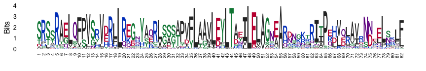
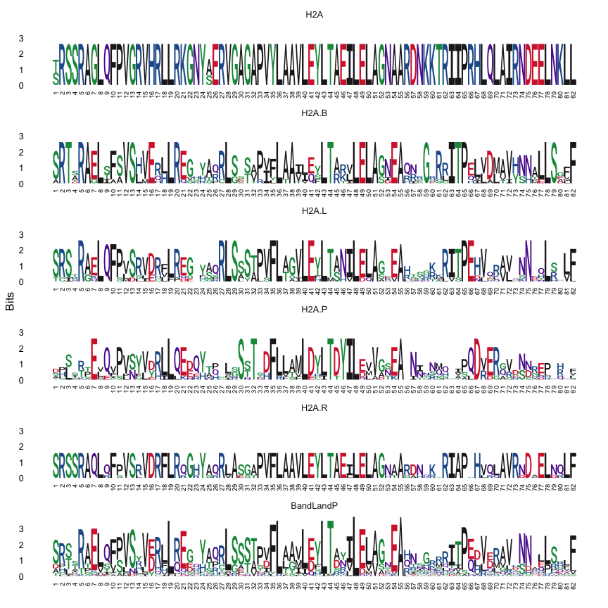

sequence logo plots
================
Janet Young

2026-02-12

Goal - show how to make logo plots

# Load libraries

``` r
knitr::opts_chunk$set(echo=TRUE)
library(tidyverse)
library(Biostrings)
library(ggseqlogo)
library(DiffLogo)
library(ggmsa)
```

# Logo plots

There are many packages that can make logo plots. Some are:  
\* [ggseqlogo](https://omarwagih.github.io/ggseqlogo/) - see demo
below.  
\*
[DiffLogo](https://bioconductor.org/packages/release/bioc/html/DiffLogo.html) -
see demo below  
\* [ggmsa](http://yulab-smu.top/ggmsa/) - see demo below  
\* [RWebLogo](https://github.com/WebLogo/weblogo) - see
[manual](http://weblogo.threeplusone.com/manual.html). Was not available
for R version 3.4.0 - I haven’t checked more recent versions. Seems more
a python thing. I think it does regular logos but not difference logos  
\*
[motifStack](https://bioconductor.org/packages/release/bioc/vignettes/motifStack/inst/doc/motifStack_HTML.html) -
I don’t think it does difference logos (although there is something
called affinity logos, for TF affinities)  
\*
[seqLogo](https://bioconductor.org/packages/release/bioc/vignettes/seqLogo/inst/doc/seqLogo.html) -
I think this only works with DNAseqs

## Read in example data: short H2A alignment (Antoine)

In this example I have a single alignment of the histone fold domain of
various H2A family members.

I read in the alignment

``` r
## same code is found in jensenShannonDistance.Rmd
aln_file <- "example_alignment_files/exampleProtAln_shortH2As_histoneFoldDomain.fa"

shortH2Aaln <- readAAStringSet(aln_file)
# simplify the sequence names by removing the description
names(shortH2Aaln) <- sapply(strsplit(names(shortH2Aaln), " "), "[[", 1)
```

## ggseqlogo package - quick demo

See [ggseqlogo documentation](https://omarwagih.github.io/ggseqlogo/).

Nice.

You can make custom color scheme (see `?make_col_scheme`, and example
below).

You can make ‘custom height’ logos that allow negative values. This may
provide a way to make difference logos, but I think we’d have to do the
calculations ourselves about letter heights.

Note that ggseqlogo ALWAYS uses small sample corrections, and there
doesn’t seem to be a way to turn it off. I requested that in a [github
issue](https://github.com/omarwagih/ggseqlogo/issues/19). The effect of
this is to reduce the total stack height of the logo plot when the
number of sequences is low.

You can also supply a frequency matrix (must be a matrix not a
data.frame). That works to avoid the small sample correction.

``` r
# ?ggseqlogo
# ?geom_logo
# ?list_col_schemes
# ?make_col_scheme
ggseqlogo(as.character(shortH2Aaln),
          col_scheme="chemistry2") +
    # turn the x axis labels 90 degrees and change font size
    theme(axis.text.x=element_text(angle = 90, hjust=1, vjust=0.5, size=7)) +
    # suppress the color scheme legend:
    guides(fill = "none")  
```

    ## Warning: `aes_string()` was deprecated in ggplot2 3.0.0.
    ## ℹ Please use tidy evaluation idioms with `aes()`.
    ## ℹ See also `vignette("ggplot2-in-packages")` for more information.
    ## ℹ The deprecated feature was likely used in the ggseqlogo package.
    ##   Please report the issue at <https://github.com/omarwagih/ggseqlogo/issues>.
    ## This warning is displayed once per session.
    ## Call `lifecycle::last_lifecycle_warnings()` to see where this warning was
    ## generated.

<!-- -->

The default is to scale the plot by the information content
(conservation) of each position, but we can turn that off using
`method="probability"`:

``` r
ggseqlogo(as.character(shortH2Aaln),
          method="probability",
          col_scheme="chemistry2") +
    theme(axis.text.x=element_text(angle = 90, hjust=1, vjust=0.5, size=7)) +
    guides(fill = "none")  
```

<!-- -->

We can use custom color schemes using the `ggseqlogo::make_col_scheme`
function.

Here I use the `DiffLogo::ASN` color scheme

``` r
ASN_ggseqlogo_color_scheme <- make_col_scheme(chars=ASN$chars,
                                              cols=ASN$cols)

ggseqlogo(as.character(shortH2Aaln),
          col_scheme=ASN_ggseqlogo_color_scheme) +
    theme(axis.text.x=element_text(angle = 90, hjust=1, vjust=0.5, size=7)) +
    guides(fill = "none") 
```

    ## Warning: The `<scale>` argument of `guides()` cannot be `FALSE`. Use "none" instead as
    ## of ggplot2 3.3.4.
    ## ℹ The deprecated feature was likely used in the ggseqlogo package.
    ##   Please report the issue at <https://github.com/omarwagih/ggseqlogo/issues>.
    ## This warning is displayed once per session.
    ## Call `lifecycle::last_lifecycle_warnings()` to see where this warning was
    ## generated.

<!-- -->

Example using a frequency matrix as input to ggseqlogo:

``` r
Biostrings::consensusMatrix(shortH2Aaln)[1:20,] |> 
    motifStack::pcm2pfm() |> 
    ggseqlogo()  +
    theme(axis.text.x=element_text(angle = 90, hjust=1, vjust=0.5, size=7)) +
    guides(fill = "none") 
```

<!-- -->

ggseqlogo can make [two-sided (up-down) logo
plots](https://omarwagih.github.io/ggseqlogo/#custom-height_logos) that
look a bit like DiffLogo plots, although you have to calculate the
heights yourself.

xxx how?

## ggmsa quick demo

Makes a basic logo plot above the corresponding alignment.

See [ggmsa documentation](http://yulab-smu.top/ggmsa/).

Not sure if there’s a way to get rid of the alignment. I don’t think
there’s a way to make the height of each letter stack reflect the
entropy. This is probably too basic for our use.

``` r
ggmsa(shortH2Aaln,
      # font = NULL,
      color = "Chemistry_AA") + 
    geom_seqlogo(adaptive=FALSE)  # adaptive=FALSE makes the logo plot taller, but whether T or F the overall heights of each stack are the same
```

<!-- -->

## Comparing several alignments

To get example data, I’ll first split the short H2A alignment into
groups.

It contains canonical H2A, H2A.B, H2A.L, H2A.P (8 species each) and the
marsupial-specific H2A.R (5 sequences) (total of 37 sequences).

Here I figure out which H2A variant each sequence is from and split the
single master alignment into 5 individual alignments accordingly.

``` r
## figure out which variant each sequence is from
shortH2AalnSeqTypes <- sapply(strsplit(names(shortH2Aaln), "_"), "[[", 1)
shortH2AalnSeqTypes <- gsub("R[12]$","R", shortH2AalnSeqTypes)

## split the alignment into those categories. We get a list object containing all 5 alignments
shortH2AalnSplit <- split(shortH2Aaln, shortH2AalnSeqTypes)

## I add a sixth alignment, which is the combined B, L and P alignment
shortH2AalnSplit[["BandLandP"]] <- c(shortH2AalnSplit[["H2A.B"]], shortH2AalnSplit[["H2A.L"]], shortH2AalnSplit[["H2A.P"]])
```

To show several ggseqlogo plots above each other:

``` r
shortH2AalnSplit_chars <- lapply(shortH2AalnSplit, as.character)

ggseqlogo(shortH2AalnSplit_chars, ncol=1) +
    theme(axis.text.x=element_text(angle = 90, hjust=1, vjust=0.5, size=7)) +
    guides(fill = "none")  
```

<!-- -->

## DiffLogo demo, default color scheme

Difflogo is helpful in looking at frequency differences between groups,
but it wants the data in frequency matrix format, rather than as
sequence alignments.

So first we define a function called `getAlnCounts()` that takes an
alignment and returns a count or frequency matrix

``` r
# checkAlnLengths is a tiny function that makes sure all seqs in an alignment are the same length as each other
checkAlnLengths <- function(aln) {
    if(length(unique(width(aln))) != 1) {
        stop("\n\nERROR - you supplied a ragged alignment (seqs not all the same length)\n\n")
    } else {
        return(TRUE)
    } 
}

## define the letters we want to count
# AA_STANDARD is defined in the Biostrings package and includes the usual 20 amino acids. I want to add the gap character ("-")
myAAtoTabulate <- c("-", AA_STANDARD)

## define the function
getAlnCounts <- function(aln, letters=myAAtoTabulate, as.prob=FALSE) {
    # check for ragged alns (seqs not all the same length)
    checkAlnLengths(aln)
    
    # get counts
    countsEachSeq <- lapply(1:length(aln), function(i) {
        letterFrequencyInSlidingView(aln[[i]], view.width = 1, letters=letters)
    })
    
    # if there were letters in the alignment that are not accounted for in the letters argument, the totals won't be correct.
    expectedTotals <- width(aln)[1]
    totalCountsEachSeq <- sapply(countsEachSeq, sum)
    if ( sum(totalCountsEachSeq != expectedTotals) > 0) {
        stop("\n\nERROR - the total counts didn't add up correctly. Are there letters in the alignment that are not present in the letters argument you supplied?\n\n")
    }
    
    # get total counts by position - the Reduce function takes a list object and uses the specified function on all the elements
    countTotals <- Reduce("+", countsEachSeq)
    
    # transpose so columns are positions and rows are each letter type
    countTotals <- t(countTotals)
    
    # perhaps get frequencies not counts
    if(as.prob) {
        freqs <- countTotals / colSums(countTotals)
        return(freqs)
    } else {
        return(countTotals)
    }
}
```

Now use the `getAlnCounts()` function on each of our alignments to get
frequency matrices:

``` r
shortH2AalnSplit_freqs <- lapply( shortH2AalnSplit, 
                                  getAlnCounts, 
                                  letters=myAAtoTabulate, 
                                  as.prob=TRUE)
```

See [DiffLogo
documentation](https://bioconductor.org/packages/release/bioc/html/DiffLogo.html).

I used DiffLogo for Rossana’s data, because I was very motivated to make
**difference** logos, not just single-alignment logo plots. In Mar 21,
2022 I think some of the code given in the vignette may have been broken

DiffLogo always gives an annoying bonus message, “pwm must be of class
matrix or data.frame. Trying to convert”, but if there are no other
errors we can ignore it. Looks like it really requires a data.frame (not
a matrix) - using as.data.frame() can make that warning go away.

First try a simple seqLogo plot for the H2A.B alignment

``` r
## ASN is an "Alphabet" object defined in the DiffLogo package
# get a version of the frequency matrices that contain only the 20 amino acids (not the gap)
# we also put rows in a very specific order: ASN[["chars"]] otherwise we'll get a logo plot with the wrong letters
shortH2AalnSplit_freqs_justASN <- lapply(shortH2AalnSplit_freqs, function(x) {
    x[ ASN[["chars"]], ]
})

DiffLogo::seqLogo(pwm=as.data.frame(shortH2AalnSplit_freqs_justASN[["H2A.B"]]), 
                  alphabet=ASN, 
                  drawLines=20,
                  main="H2A.B") 
```

<!-- -->

IMPORTANT NOTE - if our frequency matrix has the rows (each amino acid)
in a different order than the alphabet supplied, it produces a logo plot
that at first glance LOOKS OK but is actually wrong (the wrong letters
get plotted).

Can check the matrix and alphabet orders are the same as follows:

``` r
identical (rownames(as.data.frame(shortH2AalnSplit_freqs_justASN[["H2A.B"]])), 
           ASN$chars)
```

    ## [1] TRUE

# Enrichment+depletion logo plots

Options:

- Difflogo
- ggseqlogo
- Logolas package for EDLogo-style plots
  <https://link.springer.com/article/10.1186/s12859-018-2489-3>

## DiffLogo plot, controlling the color scheme

### first, set up a custom color scheme

this color scheme mimics the “chemistry” color scheme from motifStack
(defined
[here](https://github.com/jianhong/motif%20Stack/blob/5aa80388b44bc8f93738315310cfb56c3495130c/R/publicUtilities.R))

``` r
# changeColors is a function I wrote that works on objects of class "Alphabet" to change the colors for some amino acids (or nucleotides)
# myAlphabet is the Alphabet object (the color scheme we're working on)
# myAA is a vector of the AA (or nuc) we want to change
# myCol is the new color (e.g. "black")
changeColors <- function(myAlphabet, myAA, myCol) {
    # get indices of things we want to change
    whichChar <- which(myAlphabet$chars %in% myAA)
    # get existing color scheme
    tempColors <- myAlphabet$cols
    # change the ones we selected
    tempColors[whichChar] <- myCol
    # add the altered color scheme back to the Alphabet object
    myAlphabet$cols <- tempColors
    # done
    return(myAlphabet)
}

### ASN is a DiffLogo object (see ?ASN) that defines their default color scheme
### make custom version of the ASN Alphabet object called FULL_ALPHABET_JYchemistryColors
ASN_JYchemistryColors <- ASN

ASN_JYchemistryColors <- changeColors(ASN_JYchemistryColors,
                                      c("A","F","I","L","M","P","V","W"), 
                                      "black")

ASN_JYchemistryColors <- changeColors(ASN_JYchemistryColors, 
                                      c("C","G","S","T","Y"), 
                                      "forest green")

ASN_JYchemistryColors <- changeColors(ASN_JYchemistryColors, 
                                      c("D","E"), 
                                      "red3")

ASN_JYchemistryColors <- changeColors(ASN_JYchemistryColors, 
                                      c("H","K","R"), 
                                      "blue3")

ASN_JYchemistryColors <- changeColors(ASN_JYchemistryColors, 
                                      c("N","Q"), 
                                      "magenta4")
```

``` r
DiffLogo::seqLogo(pwm=as.data.frame(shortH2AalnSplit_freqs_justASN[["H2A.B"]]), 
                  alphabet=ASN_JYchemistryColors, 
                  drawLines=20) 
```

<!-- -->

# Now show difference logos

``` r
## include as.data.frame() to avoid warnings
diffLogoFromPwm(
    pwm1 = as.data.frame(shortH2AalnSplit_freqs_justASN[["H2A"]]),
    pwm2 = as.data.frame(shortH2AalnSplit_freqs_justASN[["H2A.B"]]),
    # ymin=0.5, ymax=-0.5,
    alphabet = ASN_JYchemistryColors)
```

<!-- -->

Try to mimic DiffLogo plots using ggseqlogo. This works sort of, but I
still want to figure out how to scale the heights correctly. In order to
match DiffLogo heights, I think we need to scale the total (absolute)
stack height by JS divergence, rather than using the absolute diffs for
each letter.

``` r
### tried ratios too. Definitely need a pseudocount so we don't divide by zero, and pseudocount choice would make a big difference to the ratio.
# pseudocount <- 0.01
# log2( (shortH2AalnSplit_freqs_justASN[["H2A.B"]]+pseudocount) / (shortH2AalnSplit_freqs_justASN[["H2A"]]+pseudocount) )


### diffs here is subtracting freq in one set from freq in the other
diffs <- shortH2AalnSplit_freqs_justASN[["H2A.B"]] - shortH2AalnSplit_freqs_justASN[["H2A"]]

diffs |> 
    ggseqlogo(method="custom") +
    theme(axis.text.x=element_text(angle = 90, hjust=1, vjust=0.5, size=7)) +
    guides(fill = "none") +
    geom_hline(yintercept = 0, color="gray")
```

<!-- -->

# Finished

show R version used, and package versions

``` r
sessionInfo()
```

    ## R version 4.5.2 (2025-10-31)
    ## Platform: aarch64-apple-darwin20
    ## Running under: macOS Tahoe 26.2
    ## 
    ## Matrix products: default
    ## BLAS:   /System/Library/Frameworks/Accelerate.framework/Versions/A/Frameworks/vecLib.framework/Versions/A/libBLAS.dylib 
    ## LAPACK: /Library/Frameworks/R.framework/Versions/4.5-arm64/Resources/lib/libRlapack.dylib;  LAPACK version 3.12.1
    ## 
    ## locale:
    ## [1] en_US.UTF-8/en_US.UTF-8/en_US.UTF-8/C/en_US.UTF-8/en_US.UTF-8
    ## 
    ## time zone: America/Los_Angeles
    ## tzcode source: internal
    ## 
    ## attached base packages:
    ## [1] grid      stats4    stats     graphics  grDevices utils     datasets 
    ## [8] methods   base     
    ## 
    ## other attached packages:
    ##  [1] ggmsa_1.16.0        DiffLogo_2.34.0     cba_0.2-25         
    ##  [4] proxy_0.4-28        ggseqlogo_0.2.2     Biostrings_2.78.0  
    ##  [7] Seqinfo_1.0.0       XVector_0.50.0      IRanges_2.44.0     
    ## [10] S4Vectors_0.48.0    BiocGenerics_0.56.0 generics_0.1.4     
    ## [13] lubridate_1.9.5     forcats_1.0.1       stringr_1.6.0      
    ## [16] dplyr_1.2.0         purrr_1.2.1         readr_2.1.6        
    ## [19] tidyr_1.3.2         tibble_3.3.1        ggplot2_4.0.2      
    ## [22] tidyverse_2.0.0    
    ## 
    ## loaded via a namespace (and not attached):
    ##   [1] DBI_1.2.3                   bitops_1.0-9               
    ##   [3] rlang_1.1.7                 magrittr_2.0.4             
    ##   [5] ade4_1.7-23                 otel_0.2.0                 
    ##   [7] matrixStats_1.5.0           compiler_4.5.2             
    ##   [9] RSQLite_2.4.5               systemfonts_1.3.1          
    ##  [11] vctrs_0.7.1                 pwalign_1.6.0              
    ##  [13] pkgconfig_2.0.3             crayon_1.5.3               
    ##  [15] fastmap_1.2.0               motifStack_1.54.0          
    ##  [17] labeling_0.4.3              caTools_1.18.3             
    ##  [19] Rsamtools_2.26.0            rmarkdown_2.30             
    ##  [21] tzdb_0.5.0                  seqmagick_0.1.7            
    ##  [23] DirichletMultinomial_1.52.0 bit_4.6.0                  
    ##  [25] xfun_0.56                   cachem_1.1.0               
    ##  [27] cigarillo_1.0.0             aplot_0.2.9                
    ##  [29] jsonlite_2.0.0              blob_1.3.0                 
    ##  [31] DelayedArray_0.36.0         BiocParallel_1.44.0        
    ##  [33] tweenr_2.0.3                parallel_4.5.2             
    ##  [35] R6_2.6.1                    stringi_1.8.7              
    ##  [37] RColorBrewer_1.1-3          rtracklayer_1.70.0         
    ##  [39] GenomicRanges_1.62.1        SummarizedExperiment_1.40.0
    ##  [41] Rcpp_1.1.1                  knitr_1.51                 
    ##  [43] Matrix_1.7-4                timechange_0.4.0           
    ##  [45] tidyselect_1.2.1            abind_1.4-8                
    ##  [47] rstudioapi_0.18.0           yaml_2.3.12                
    ##  [49] codetools_0.2-20            curl_7.0.0                 
    ##  [51] lattice_0.22-7              Biobase_2.70.0             
    ##  [53] treeio_1.34.0               withr_3.0.2                
    ##  [55] S7_0.2.1                    evaluate_1.0.5             
    ##  [57] gridGraphics_0.5-1          polyclip_1.10-7            
    ##  [59] pillar_1.11.1               ggtree_4.0.1               
    ##  [61] MatrixGenerics_1.22.0       ggfun_0.2.0                
    ##  [63] RCurl_1.98-1.17             hms_1.1.4                  
    ##  [65] scales_1.4.0                tidytree_0.4.6             
    ##  [67] gtools_3.9.5                glue_1.8.0                 
    ##  [69] gdtools_0.4.4               lazyeval_0.2.2             
    ##  [71] seqLogo_1.76.0              tools_4.5.2                
    ##  [73] TFMPvalue_0.0.9             BiocIO_1.20.0              
    ##  [75] BSgenome_1.78.0             GenomicAlignments_1.46.0   
    ##  [77] ggiraph_0.9.2               fs_1.6.6                   
    ##  [79] XML_3.99-0.22               TFBSTools_1.48.0           
    ##  [81] ape_5.8-1                   R4RNA_1.38.0               
    ##  [83] nlme_3.1-168                patchwork_1.3.2            
    ##  [85] ggforce_0.5.0               restfulr_0.0.16            
    ##  [87] cli_3.6.5                   rappdirs_0.3.4             
    ##  [89] fontBitstreamVera_0.1.1     S4Arrays_1.10.1            
    ##  [91] gtable_0.3.6                yulab.utils_0.2.2          
    ##  [93] digest_0.6.39               fontquiver_0.2.1           
    ##  [95] SparseArray_1.10.6          ggplotify_0.1.3            
    ##  [97] rjson_0.2.23                htmlwidgets_1.6.4          
    ##  [99] farver_2.1.2                memoise_2.0.1              
    ## [101] htmltools_0.5.9             lifecycle_1.0.5            
    ## [103] httr_1.4.7                  fontLiberation_0.1.0       
    ## [105] bit64_4.6.0-1               MASS_7.3-65
