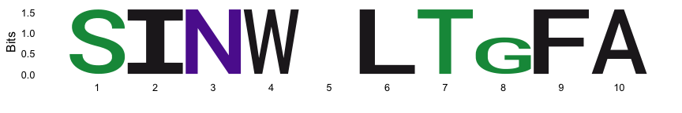
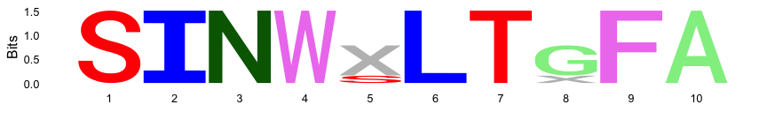
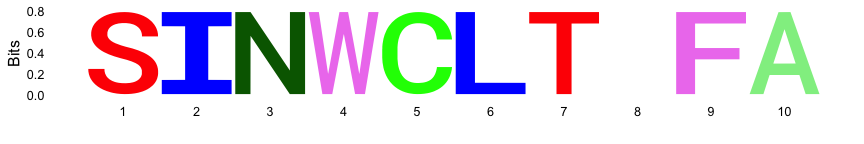
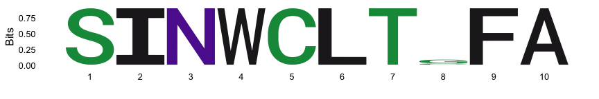

logoPlots_test_gap_char
================
Janet Young

2026-04-01

Goal - test how ggseqlogo behaves with gap characters, and whether I can
make it show up as a visible character in the logo plot

Most of this code is in logoPlots.Rmd but the bit where I test the
possible bug isn’t, so I’ll keep this code around for a bit.

# Load libraries

``` r
knitr::opts_chunk$set(echo=TRUE)
library(tidyverse)
library(Biostrings)
library(ggseqlogo)
# library(DiffLogo)
# library(ggmsa)
```

# Make a test amino acid alignment

One position contains majority gap, another minority gap

``` r
my_seqs <- c(
    "SINW-LTGFA",
    "SINW-LTGFA",
    "SINW-LTGFA",
    "SINW-LT-FA",
    "SINWSLTGFA"
) |> 
    AAStringSet()
names(my_seqs) <- paste0("seq", 1:length(my_seqs))
```

In a ggseqlogo using the defaults, the gap character simply does not
show up

``` r
ggseqlogo(as.character(my_seqs)) +
    guides(fill = "none")    
```

    ## Warning: `aes_string()` was deprecated in ggplot2 3.0.0.
    ## ℹ Please use tidy evaluation idioms with `aes()`.
    ## ℹ See also `vignette("ggplot2-in-packages")` for more information.
    ## ℹ The deprecated feature was likely used in the ggseqlogo package.
    ##   Please report the issue at <https://github.com/omarwagih/ggseqlogo/issues>.
    ## This warning is displayed once per session.
    ## Call `lifecycle::last_lifecycle_warnings()` to see where this warning was
    ## generated.

<!-- -->

The solution is to replace the gap character (-) with X (or something
else), and then using a custom color scheme and namespace

``` r
my_seqs_x <- gsub("-","X",my_seqs) |> 
    AAStringSet()

custom_color_scheme <- make_col_scheme(chars=c(DiffLogo::ASN$chars, "X"),
                                       cols=c(DiffLogo::ASN$cols, "grey"))

ggseqlogo(as.character(my_seqs_x),
          col_scheme=custom_color_scheme,
          seq_type="other",
          namespace=c(DiffLogo::ASN$chars, "X")) +
    guides(fill = "none") 
```

    ## Warning: The `<scale>` argument of `guides()` cannot be `FALSE`. Use "none" instead as
    ## of ggplot2 3.3.4.
    ## ℹ The deprecated feature was likely used in the ggseqlogo package.
    ##   Please report the issue at <https://github.com/omarwagih/ggseqlogo/issues>.
    ## This warning is displayed once per session.
    ## Call `lifecycle::last_lifecycle_warnings()` to see where this warning was
    ## generated.

<!-- -->

I tried using custom color scheme and namespace where I keep the gap
character as “-” but it yields an error:

    Error in findNamespace(letter_mat, seq_type, namespace = namespace) :
    All letters in the namespace must be alphanumeric

``` r
# custom_color_scheme <- make_col_scheme(chars=c(DiffLogo::ASN$chars, "-"),
#                                        cols=c(DiffLogo::ASN$cols, "black"))
# 
# ggseqlogo(as.character(my_seqs),
#           col_scheme=custom_color_scheme,
#           seq_type="other",
#           namespace=c(DiffLogo::ASN$chars, "-")) +
#     guides(fill = "none") 
```

Bug? If the number of sequences is very small, position 8 in this
alignment disappears (it’s the only one that’s not 100% conserved). It
only disappears if I use the custom setup that allows me to include the
gap character. Maybe the expanded namespace made the stack so small it
could not be seen any more. THe information content using a 21-letter
alphabet would be a bit different than using a 20-letter alphabet

Show disappearing position 8:

``` r
my_seqs_c <- gsub("-","C",my_seqs) |> 
    AAStringSet()

custom_color_scheme <- make_col_scheme(chars=c(DiffLogo::ASN$chars, "X"),
                                       cols=c(DiffLogo::ASN$cols, "grey"))

ggseqlogo(as.character(my_seqs_c[1:4]),
          col_scheme=custom_color_scheme,
          seq_type="other",
          namespace=c(DiffLogo::ASN$chars, "X")) +
    guides(fill = "none") 
```

<!-- -->

And now it’s back:

``` r
ggseqlogo(as.character(my_seqs_c[1:4]) ) +
    guides(fill = "none") 
```

<!-- -->

# Finished

show R version used, and package versions

``` r
sessionInfo()
```

    ## R version 4.5.3 (2026-03-11)
    ## Platform: aarch64-apple-darwin20
    ## Running under: macOS Tahoe 26.4
    ## 
    ## Matrix products: default
    ## BLAS:   /Library/Frameworks/R.framework/Versions/4.5-arm64/Resources/lib/libRblas.0.dylib 
    ## LAPACK: /Library/Frameworks/R.framework/Versions/4.5-arm64/Resources/lib/libRlapack.dylib;  LAPACK version 3.12.1
    ## 
    ## locale:
    ## [1] en_US.UTF-8/en_US.UTF-8/en_US.UTF-8/C/en_US.UTF-8/en_US.UTF-8
    ## 
    ## time zone: America/Los_Angeles
    ## tzcode source: internal
    ## 
    ## attached base packages:
    ## [1] stats4    stats     graphics  grDevices utils     datasets  methods  
    ## [8] base     
    ## 
    ## other attached packages:
    ##  [1] ggseqlogo_0.2.2     Biostrings_2.78.0   Seqinfo_1.0.0      
    ##  [4] XVector_0.50.0      IRanges_2.44.0      S4Vectors_0.48.0   
    ##  [7] BiocGenerics_0.56.0 generics_0.1.4      lubridate_1.9.5    
    ## [10] forcats_1.0.1       stringr_1.6.0       dplyr_1.2.0        
    ## [13] purrr_1.2.1         readr_2.2.0         tidyr_1.3.2        
    ## [16] tibble_3.3.1        ggplot2_4.0.2       tidyverse_2.0.0    
    ## 
    ## loaded via a namespace (and not attached):
    ##  [1] stringi_1.8.7      hms_1.1.4          digest_0.6.39      magrittr_2.0.4    
    ##  [5] evaluate_1.0.5     grid_4.5.3         timechange_0.4.0   RColorBrewer_1.1-3
    ##  [9] fastmap_1.2.0      scales_1.4.0       cli_3.6.5          rlang_1.1.7       
    ## [13] crayon_1.5.3       withr_3.0.2        yaml_2.3.12        otel_0.2.0        
    ## [17] tools_4.5.3        tzdb_0.5.0         vctrs_0.7.2        R6_2.6.1          
    ## [21] proxy_0.4-29       lifecycle_1.0.5    cba_0.2-25         pkgconfig_2.0.3   
    ## [25] pillar_1.11.1      gtable_0.3.6       glue_1.8.0         xfun_0.57         
    ## [29] tidyselect_1.2.1   rstudioapi_0.18.0  knitr_1.51         farver_2.1.2      
    ## [33] htmltools_0.5.9    rmarkdown_2.31     labeling_0.4.3     DiffLogo_2.34.0   
    ## [37] compiler_4.5.3     S7_0.2.1
