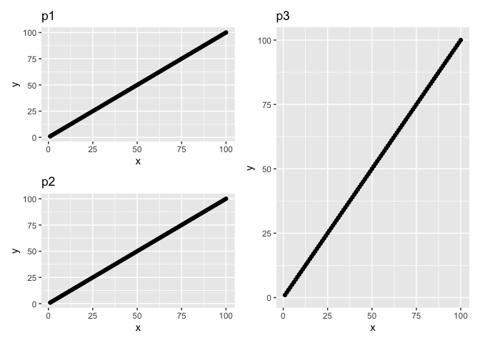
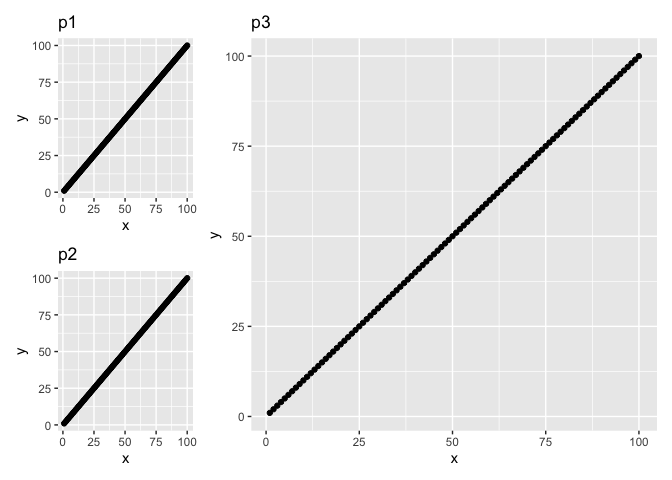
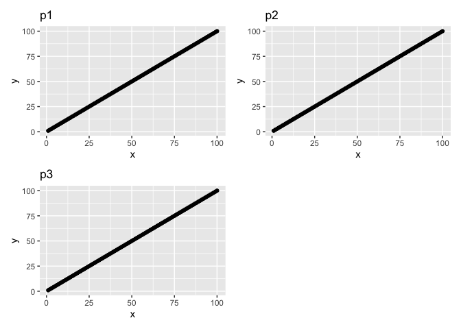

patchwork_package_demo_and_tips
================
Janet Young

2025-06-05

First we make some fake data and plots

``` r
dat <- tibble(x=1:100, y=1:100, type=rep(c("A","B","C","D"), each=25))
p1 <- dat %>% 
    ggplot(aes(x=x, y=y)) +
    geom_point() + 
    labs(title="p1")
p2 <- p1 + labs(title="p2")
p3 <- p1 + labs(title="p3")
```

Show plots in a specific layout:

- use `/` to put plots above each other
- use `|` to put plots side by side
- use `()` to treat plots as a group

``` r
(p1 / p2) | p3
```

<!-- -->

Change widths - note that we NEED the parentheses around the whole plot
layout, otherwise the `plot_layout()` function only applies to `p3`, not
the whole layout

``` r
((p1 / p2) | p3) + plot_layout(widths=c(1,3))
```

<!-- -->

We can also combine plots using `+` but it’s harder to control the
layout precisely (we don’t always care)

``` r
p1 + p2 + p3 + plot_layout(ncol=2)
```

<!-- -->

Show `sessionInfo()`

``` r
sessionInfo()
```

    ## R version 4.5.0 (2025-04-11)
    ## Platform: aarch64-apple-darwin20
    ## Running under: macOS Sequoia 15.5
    ## 
    ## Matrix products: default
    ## BLAS:   /Library/Frameworks/R.framework/Versions/4.5-arm64/Resources/lib/libRblas.0.dylib 
    ## LAPACK: /Library/Frameworks/R.framework/Versions/4.5-arm64/Resources/lib/libRlapack.dylib;  LAPACK version 3.12.1
    ## 
    ## locale:
    ## [1] en_US.UTF-8/en_US.UTF-8/en_US.UTF-8/C/en_US.UTF-8/en_US.UTF-8
    ## 
    ## time zone: America/Los_Angeles
    ## tzcode source: internal
    ## 
    ## attached base packages:
    ## [1] stats     graphics  grDevices utils     datasets  methods   base     
    ## 
    ## other attached packages:
    ##  [1] patchwork_1.3.0 lubridate_1.9.4 forcats_1.0.0   stringr_1.5.1  
    ##  [5] dplyr_1.1.4     purrr_1.0.4     readr_2.1.5     tidyr_1.3.1    
    ##  [9] tibble_3.2.1    ggplot2_3.5.2   tidyverse_2.0.0
    ## 
    ## loaded via a namespace (and not attached):
    ##  [1] gtable_0.3.6       compiler_4.5.0     tidyselect_1.2.1   scales_1.4.0      
    ##  [5] yaml_2.3.10        fastmap_1.2.0      R6_2.6.1           labeling_0.4.3    
    ##  [9] generics_0.1.4     knitr_1.50         pillar_1.10.2      RColorBrewer_1.1-3
    ## [13] tzdb_0.5.0         rlang_1.1.6        stringi_1.8.7      xfun_0.52         
    ## [17] timechange_0.3.0   cli_3.6.5          withr_3.0.2        magrittr_2.0.3    
    ## [21] digest_0.6.37      grid_4.5.0         rstudioapi_0.17.1  hms_1.1.3         
    ## [25] lifecycle_1.0.4    vctrs_0.6.5        evaluate_1.0.3     glue_1.8.0        
    ## [29] farver_2.1.2       rmarkdown_2.29     tools_4.5.0        pkgconfig_2.0.3   
    ## [33] htmltools_0.5.8.1
