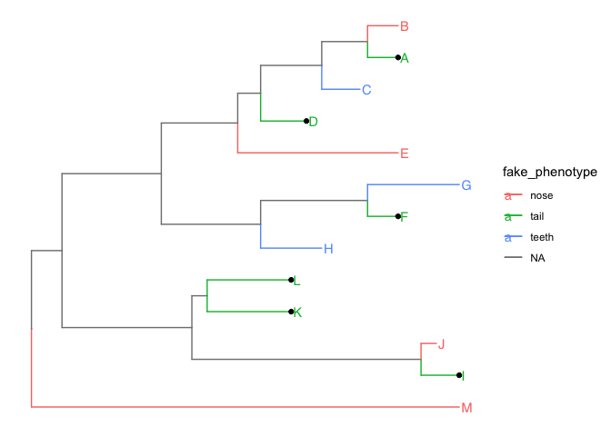

ggtree_demo
================
Janet Young

2024-05-23

# Useful links, general advice

The [ggtree manual](http://yulab-smu.top/treedata-book/index.html) is
great (very detailed). - Chapter 1 looks at reading/writing trees. The
treeio and ape packages both have tree read/write functions).

# Read a tree and plot it

read in a newick tree file:

``` r
nwk_file <- system.file("extdata/sample.nwk", package="treeio") 
nwk_tree <- read.tree( nwk_file )
class(nwk_tree)
```

    ## [1] "phylo"

``` r
nwk_tree
```

    ## 
    ## Phylogenetic tree with 13 tips and 12 internal nodes.
    ## 
    ## Tip labels:
    ##   A, B, C, D, E, F, ...
    ## 
    ## Rooted; includes branch lengths.

plot it using ape’s basic plot function

``` r
plot(nwk_tree)
```

<!-- -->

plot it using ggtree

``` r
nwk_tree %>% 
    ggtree() +
    geom_tiplab()
```

<!-- -->

# Associate a tree with additional data

Make a fake data tibble with info on each of the taxa in nwk_tree

``` r
num_taxa <- length(nwk_tree$tip.label)
tip_dat <- tibble( taxon=nwk_tree$tip.label,
                   fake_height= rnorm(n=num_taxa, mean=100, sd=30 ),
                   fake_phenotype= sample( c("teeth","nose","tail"), 
                                           size=num_taxa, replace=TRUE ),
                   fake_phenotype2=sample( c("fur","scales","spikes"), 
                                           size=num_taxa, replace=TRUE ) )
tip_dat
```

    ## # A tibble: 13 × 4
    ##    taxon fake_height fake_phenotype fake_phenotype2
    ##    <chr>       <dbl> <chr>          <chr>          
    ##  1 A           112.  nose           fur            
    ##  2 B            96.5 tail           fur            
    ##  3 C           101.  teeth          spikes         
    ##  4 D            46.8 teeth          fur            
    ##  5 E            90.8 tail           scales         
    ##  6 F            78.4 teeth          scales         
    ##  7 G            82.3 nose           spikes         
    ##  8 H           116.  teeth          spikes         
    ##  9 I           122.  tail           fur            
    ## 10 J            95.5 tail           scales         
    ## 11 K            94.4 tail           scales         
    ## 12 L           123.  teeth          fur            
    ## 13 M           153.  nose           scales

## combine tree and tbl

We associate info tbl with the tree using `left_join` - this creates a
single `treedata` object that contains info AND tree (we access the tree
like this `nwk_tree_with_info@phylo`)

Advice:  
- this joining process can be flaky - there’s not as much error-checking
built-in as I’d like.  
- BEFORE you combine tree with info tbl:  
- you should manipulate tree to get as close to the final product as you
can (e.g. do any rerooting, subsetting, clade rotation, etc, BEFORE you
left_join)  
- manipulate tbl get as close to the final product as you can (e.g. join
a bunch of info together)  
- CHECK taxon labels in tree and the tbl column you plan to join on
match up OK  
- CHECK the taxon ID in the join column of tbl is UNIQUE - repeated
values will cause trouble

``` r
nwk_tree_with_info <- left_join(nwk_tree, tip_dat, by=c("label"="taxon"))
class(nwk_tree_with_info)
```

    ## [1] "treedata"
    ## attr(,"package")
    ## [1] "tidytree"

``` r
nwk_tree_with_info
```

    ## 'treedata' S4 object'.
    ## 
    ## ...@ phylo:
    ## 
    ## Phylogenetic tree with 13 tips and 12 internal nodes.
    ## 
    ## Tip labels:
    ##   A, B, C, D, E, F, ...
    ## 
    ## Rooted; includes branch lengths.
    ## 
    ## with the following features available:
    ##   '', 'fake_height', 'fake_phenotype', 'fake_phenotype2'.
    ## 
    ## # The associated data tibble abstraction: 25 × 6
    ## # The 'node', 'label' and 'isTip' are from the phylo tree.
    ##     node label isTip fake_height fake_phenotype fake_phenotype2
    ##    <int> <chr> <lgl>       <dbl> <chr>          <chr>          
    ##  1     1 A     TRUE        112.  nose           fur            
    ##  2     2 B     TRUE         96.5 tail           fur            
    ##  3     3 C     TRUE        101.  teeth          spikes         
    ##  4     4 D     TRUE         46.8 teeth          fur            
    ##  5     5 E     TRUE         90.8 tail           scales         
    ##  6     6 F     TRUE         78.4 teeth          scales         
    ##  7     7 G     TRUE         82.3 nose           spikes         
    ##  8     8 H     TRUE        116.  teeth          spikes         
    ##  9     9 I     TRUE        122.  tail           fur            
    ## 10    10 J     TRUE         95.5 tail           scales         
    ## # ℹ 15 more rows

## plot tree with annotations

now we can use ggtree to use column data in the joined treedata object
for labels, colors, etc, etc

``` r
nwk_tree_with_info %>% 
    ggtree(aes(color=fake_phenotype)) +  # color here colors the branches
    geom_tiplab(aes(color=fake_phenotype)) + # color here colors the tip labels
    geom_tippoint(aes(subset= fake_phenotype=="tail"), color="black") # add dots to taxa, using subset
```

<!-- -->

# add heatmap to the right side of a tree

gheatmap is the function for this

## explore gheatmap demo code from ggtree book

gheatmap demo code from the [ggtree online
book](http://yulab-smu.top/treedata-book/chapter7.html#gheatmap):

first read in their example tree, `beast_tree`:

``` r
beast_file <- system.file("examples/MCC_FluA_H3.tree", package="ggtree")
beast_tree <- read.beast(beast_file)
```

`beast_tree` is a treedata/tidytree object with 76 tips

next read in their example genotype data:

``` r
genotype_file <- system.file("examples/Genotype.txt", package="ggtree")
genotype <- read.table(genotype_file, sep="\t", stringsAsFactor=F)
colnames(genotype) <- sub("\\.$", "", colnames(genotype))
```

`genotype` is a data.frame with 76 rows and 8 columns

`?gheatmap` help page says that the heatmap data must be a matrix or
data.frame (not a tibble). I checked - the rownames of `genotype` are
identical to the tip labels of the tree, although they’re not in the
same order

``` r
# identical(rownames(genotype), beast_tree@phylo$tip.label)
# FALSE
# identical(sort(rownames(genotype)), sort(beast_tree@phylo$tip.label))
# TRUE
```

Now plot:

``` r
## save a ggtree plot object
p <- ggtree(beast_tree, mrsd="2013-01-01") + 
    geom_treescale(x=2008, y=1, offset=2) + 
    geom_tiplab(size=2)

## add the heatmap to the righthand side. 
gheatmap(p, genotype, offset=15, width=1.5, font.size=3,
         colnames_offset_y= -1) + 
    # scale_y_continuous makes sure we can see the colnames
    scale_y_continuous(expand=c(0.1, 0.1))
```

    ## Scale for y is already present.
    ## Adding another scale for y, which will replace the existing scale.

<!-- -->

Same thing but also:  
- add x axis scale bar (and heatmap colnames are less ugly now)  
- use a custom color scheme for the heatmap via `scale_fill_manual`.
Default behavior for NAs is that there is no rectangle plotted. If we
use `scale_fill_manual` the default behavior for NAs is now different -
they are dark gray

``` r
p <- ggtree(beast_tree, mrsd="2013-01-01") + 
    geom_tiplab(size=2, align=TRUE, linesize=.5) + 
    theme_tree2()
gheatmap(p, genotype, offset=8, width=0.6, 
         colnames=FALSE, legend_title="genotype") +
    scale_x_ggtree() + 
    scale_y_continuous(expand=c(0, 0.3)) +
    scale_fill_manual(breaks=c("HuH3N2", "pdm", "trig"), 
                      values=c("steelblue", "firebrick", "darkgreen"), 
                      name="genotype")
```

    ## Scale for y is already present.
    ## Adding another scale for y, which will replace the existing scale.
    ## Scale for y is already present.
    ## Adding another scale for y, which will replace the existing scale.
    ## Scale for fill is already present.
    ## Adding another scale for fill, which will replace the existing scale.

<!-- -->

Show that first plot in circle layout (ignore branch lengths)

``` r
## save a ggtree plot object
p <- ggtree(beast_tree, mrsd="2013-01-01", 
            layout="circular",
            branch.length="none") 

## add the heatmap 
gheatmap(p, genotype, 
         offset=1, 
         width=1, font.size=2,
         colnames_offset_y= -1,
         colnames_angle=270) +
    # scale_y_continuous makes sure we can see the colnames
   scale_y_continuous(expand=c(0.01, 0.01))
```

    ## Scale for y is already present.
    ## Adding another scale for y, which will replace the existing scale.

<!-- -->

## gheatmap example with my fake tree and fake data

``` r
## imagine we're plotting amino acid changes, like Maria's trying to do
# here, NA represents "same as taxon A" (same as human in Maria's case)
# and we'll plot each amino acid as a separate color
tip_dat <- data.frame(row.names=nwk_tree_with_info@phylo$tip.label)
tip_dat$pos1 <- NA
tip_dat$pos2 <- NA
tip_dat$pos3 <- NA
tip_dat[6:8,"pos1"] <- "W"
tip_dat[4:13,"pos2"] <- "T"
tip_dat[9:12,"pos3"] <- "C"

## save a ggtree plot object
p <- nwk_tree_with_info %>% 
    ggtree(aes()) + 
    geom_tiplab(aes())

## add the heatmap to the righthand side. the heatmap data must be matrix or data.frame
# this is the original code
gheatmap(p, tip_dat, 
         offset=3,
         width=0.25, font.size=3) 
```

<!-- -->

Or maybe we turn that into WT/ nonWT

``` r
tip_dat2 <- tip_dat %>% 
    mutate(across(everything(),
                  function(x) {
                      case_when( is.na(x) ~ "WT",
                                 TRUE ~ "nonWT")
                  }))
gheatmap(p, tip_dat2, 
         offset=3,
         width=0.25, font.size=3) +
    scale_fill_manual(breaks=c("WT", "nonWT"), 
                      values=c("lightgray", "firebrick"), 
                      name="")
```

    ## Scale for fill is already present.
    ## Adding another scale for fill, which will replace the existing scale.

<!-- -->

It doesn’t work if tip_dat3 is a tibble, although it doesn’t give an
error, it just doesn’t give us a correct heatmap. Also, setting rownames
on a tibble is deprecated.

``` r
tip_dat3 <- tip_dat2 %>% 
    as_tibble(rownames=NA)
## we can check the rownames are present:
# rownames(tip_dat3)

gheatmap(p, tip_dat3, 
         offset=3,
         width=0.25, font.size=3) +
    scale_fill_manual(breaks=c("WT", "nonWT"), 
                      values=c("lightgray", "firebrick"), 
                      name="")
```

    ## Scale for fill is already present.
    ## Adding another scale for fill, which will replace the existing scale.

<!-- -->

``` r
sessionInfo()
```

    ## R version 4.4.0 (2024-04-24)
    ## Platform: x86_64-apple-darwin20
    ## Running under: macOS Ventura 13.6.7
    ## 
    ## Matrix products: default
    ## BLAS:   /Library/Frameworks/R.framework/Versions/4.4-x86_64/Resources/lib/libRblas.0.dylib 
    ## LAPACK: /Library/Frameworks/R.framework/Versions/4.4-x86_64/Resources/lib/libRlapack.dylib;  LAPACK version 3.12.0
    ## 
    ## locale:
    ## [1] en_US.UTF-8/en_US.UTF-8/en_US.UTF-8/C/en_US.UTF-8/en_US.UTF-8
    ## 
    ## time zone: America/Los_Angeles
    ## tzcode source: internal
    ## 
    ## attached base packages:
    ## [1] stats     graphics  grDevices utils     datasets  methods   base     
    ## 
    ## other attached packages:
    ##  [1] tidytree_0.4.6  treeio_1.28.0   ggtree_3.12.0   lubridate_1.9.3
    ##  [5] forcats_1.0.0   stringr_1.5.1   dplyr_1.1.4     purrr_1.0.2    
    ##  [9] readr_2.1.5     tidyr_1.3.1     tibble_3.2.1    ggplot2_3.5.1  
    ## [13] tidyverse_2.0.0
    ## 
    ## loaded via a namespace (and not attached):
    ##  [1] yulab.utils_0.1.4  utf8_1.2.4         generics_0.1.3     ggplotify_0.1.2   
    ##  [5] stringi_1.8.4      lattice_0.22-6     hms_1.1.3          digest_0.6.35     
    ##  [9] magrittr_2.0.3     evaluate_0.23      grid_4.4.0         timechange_0.3.0  
    ## [13] fastmap_1.1.1      jsonlite_1.8.8     ape_5.8            aplot_0.2.2       
    ## [17] fansi_1.0.6        scales_1.3.0       lazyeval_0.2.2     cli_3.6.2         
    ## [21] rlang_1.1.3        munsell_0.5.1      cachem_1.0.8       withr_3.0.0       
    ## [25] yaml_2.3.8         tools_4.4.0        parallel_4.4.0     tzdb_0.4.0        
    ## [29] memoise_2.0.1      colorspace_2.1-0   gridGraphics_0.5-1 vctrs_0.6.5       
    ## [33] R6_2.5.1           lifecycle_1.0.4    ggfun_0.1.4        fs_1.6.4          
    ## [37] pkgconfig_2.0.3    pillar_1.9.0       gtable_0.3.5       glue_1.7.0        
    ## [41] Rcpp_1.0.12        highr_0.10         xfun_0.43          tidyselect_1.2.1  
    ## [45] rstudioapi_0.16.0  knitr_1.46         farver_2.1.2       patchwork_1.2.0   
    ## [49] htmltools_0.5.8.1  nlme_3.1-164       labeling_0.4.3     rmarkdown_2.26    
    ## [53] compiler_4.4.0
