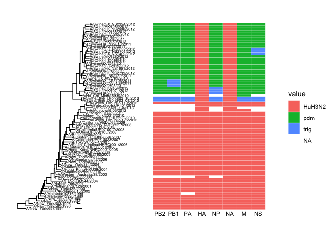
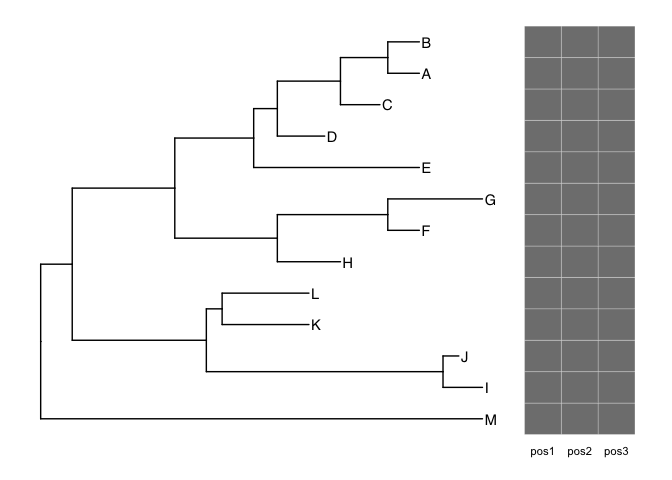
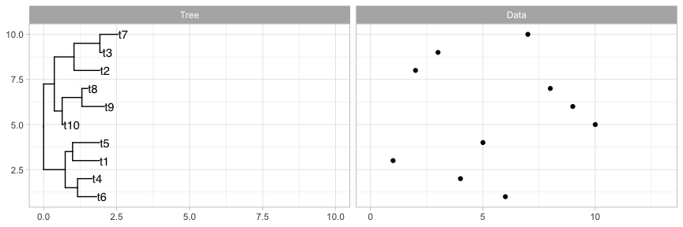
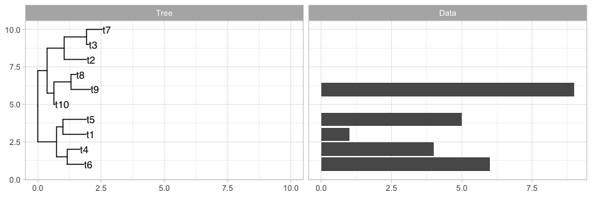

ggtree_demo
================
Janet Young

2025-12-02

The rendered version of this Rmd script is
[here](https://github.com/jayoung/Rtest_and_Rnotes/blob/main/Rscripts/phylogenetics/ggtree_demo.md).

(this doesn’t work on the fhR 4.2.0 I could run via the Hutch Rstudio
server, with the package versions I have there right now. But fhR 4.4.0
is fine)

# Useful links, general advice

The [ggtree manual](http://yulab-smu.top/treedata-book/index.html) is
great (very detailed). - Chapter 1 looks at reading/writing trees. The
treeio and ape packages both have tree read/write functions).

There is a [ggtree google
group](https://groups.google.com/g/bioc-ggtree) for questions.

There is also a [ggtreeExtra
package](https://www.bioconductor.org/packages/release/bioc/vignettes/ggtreeExtra/inst/doc/ggtreeExtra.html)
that provides a function, `geom_fruit`, to align graphs to a tree,
perhaps more easily than with ggtree.

The [ape package](https://cran.r-project.org/web/packages/ape/) is also
useful for phylogenetics

# Read a tree and plot it

Read in a newick tree file:

``` r
nwk_file <- system.file("extdata/sample.nwk", package="treeio") 
nwk_tree <- read.tree( nwk_file )
class(nwk_tree)
```

    ## [1] "phylo"

``` r
nwk_tree
```

    ## 
    ## Phylogenetic tree with 13 tips and 12 internal nodes.
    ## 
    ## Tip labels:
    ##   A, B, C, D, E, F, ...
    ## 
    ## Rooted; includes branch length(s).

Plot it using ape’s basic plot function

``` r
plot(nwk_tree)
```

<!-- -->

Plot it using ggtree

``` r
nwk_tree %>% 
    ggtree() +
    geom_tiplab()
```

<!-- -->

# Associate a tree with additional data

Make a fake data tibble with info on each of the taxa in nwk_tree

``` r
num_taxa <- length(nwk_tree$tip.label)
nwk_tree_tip_dat <- tibble( taxon=nwk_tree$tip.label,
                            fake_height= rnorm(n=num_taxa, mean=100, sd=30 ),
                            fake_phenotype= sample( c("teeth","nose","tail"), 
                                                    size=num_taxa, replace=TRUE ),
                            fake_phenotype2=sample( c("fur","scales","spikes"), 
                                                    size=num_taxa, replace=TRUE ) )
nwk_tree_tip_dat
```

    ## # A tibble: 13 × 4
    ##    taxon fake_height fake_phenotype fake_phenotype2
    ##    <chr>       <dbl> <chr>          <chr>          
    ##  1 A            80.6 teeth          scales         
    ##  2 B           137.  teeth          scales         
    ##  3 C            56.7 teeth          scales         
    ##  4 D            95.4 tail           fur            
    ##  5 E            54.3 teeth          fur            
    ##  6 F           141.  tail           spikes         
    ##  7 G            80.4 tail           scales         
    ##  8 H           104.  teeth          scales         
    ##  9 I           105.  nose           scales         
    ## 10 J            41.4 nose           scales         
    ## 11 K           116.  teeth          fur            
    ## 12 L           118.  teeth          spikes         
    ## 13 M           111.  tail           spikes

## Combine tree and tbl

We associate info tbl with the tree using `left_join` - this creates a
single `treedata` object that contains info AND tree (we access the tree
like this `nwk_tree_with_info@phylo`)

Advice:  
- this joining process can be flaky - there’s not as much error-checking
built-in as I’d like.  
- BEFORE you combine tree with info tbl:  
- you should manipulate tree to get as close to the final product as you
can (e.g. do any rerooting, subsetting, clade rotation, etc, BEFORE you
left_join)  
- manipulate tbl get as close to the final product as you can (e.g. join
a bunch of info together)  
- CHECK taxon labels in tree and the tbl column you plan to join on
match up OK  
- CHECK the taxon ID in the join column of tbl is UNIQUE - repeated
values will cause trouble

ALTERNATIVE - I wrote a function to do these checks, called
`addInfoToTree` - it’s in the [`phylogenetic_tree_functions.R`
file](https://github.com/jayoung/Rtest_and_Rnotes/blob/main/useful_functions/phylogenetic_tree_functions.R)

If you want to UPDATE the info later, see below…. xxxx

Demo using left_join:

``` r
nwk_tree_with_info <- left_join(nwk_tree, nwk_tree_tip_dat, by=c("label"="taxon"))
class(nwk_tree_with_info)
```

    ## [1] "treedata"
    ## attr(,"package")
    ## [1] "tidytree"

``` r
nwk_tree_with_info
```

    ## 'treedata' S4 object'.
    ## 
    ## ...@ phylo:
    ## 
    ## Phylogenetic tree with 13 tips and 12 internal nodes.
    ## 
    ## Tip labels:
    ##   A, B, C, D, E, F, ...
    ## 
    ## Rooted; includes branch length(s).
    ## 
    ## with the following features available:
    ##   '', 'fake_height', 'fake_phenotype', 'fake_phenotype2'.
    ## 
    ## # The associated data tibble abstraction: 25 × 6
    ## # The 'node', 'label' and 'isTip' are from the phylo tree.
    ##     node label isTip fake_height fake_phenotype fake_phenotype2
    ##    <int> <chr> <lgl>       <dbl> <chr>          <chr>          
    ##  1     1 A     TRUE         80.6 teeth          scales         
    ##  2     2 B     TRUE        137.  teeth          scales         
    ##  3     3 C     TRUE         56.7 teeth          scales         
    ##  4     4 D     TRUE         95.4 tail           fur            
    ##  5     5 E     TRUE         54.3 teeth          fur            
    ##  6     6 F     TRUE        141.  tail           spikes         
    ##  7     7 G     TRUE         80.4 tail           scales         
    ##  8     8 H     TRUE        104.  teeth          scales         
    ##  9     9 I     TRUE        105.  nose           scales         
    ## 10    10 J     TRUE         41.4 nose           scales         
    ## # ℹ 15 more rows

Demo using `addInfoToTree` (by default it looks for the tip labels in
the “taxon” column but you can change that using the
`colnameForTaxonLabels` option):

``` r
malik_h_dir <- "/fh/fast/malik_h/"
if (Sys.info()[["sysname"]]=="Darwin") { malik_h_dir <- "/Volumes/malik_h/" }
source( paste0(malik_h_dir, "user/jayoung/git_more_repos/Rtest_and_Rnotes/useful_functions/phylogenetic_tree_functions.R") )

nwk_tree_with_info_2 <- addInfoToTree(nwk_tree, nwk_tree_tip_dat)
class(nwk_tree_with_info_2)
```

    ## [1] "treedata"
    ## attr(,"package")
    ## [1] "tidytree"

``` r
nwk_tree_with_info_2
```

    ## 'treedata' S4 object'.
    ## 
    ## ...@ phylo:
    ## 
    ## Phylogenetic tree with 13 tips and 12 internal nodes.
    ## 
    ## Tip labels:
    ##   A, B, C, D, E, F, ...
    ## 
    ## Rooted; includes branch length(s).
    ## 
    ## with the following features available:
    ##   '', 'fake_height', 'fake_phenotype', 'fake_phenotype2'.
    ## 
    ## # The associated data tibble abstraction: 25 × 6
    ## # The 'node', 'label' and 'isTip' are from the phylo tree.
    ##     node label isTip fake_height fake_phenotype fake_phenotype2
    ##    <int> <chr> <lgl>       <dbl> <chr>          <chr>          
    ##  1     1 A     TRUE         80.6 teeth          scales         
    ##  2     2 B     TRUE        137.  teeth          scales         
    ##  3     3 C     TRUE         56.7 teeth          scales         
    ##  4     4 D     TRUE         95.4 tail           fur            
    ##  5     5 E     TRUE         54.3 teeth          fur            
    ##  6     6 F     TRUE        141.  tail           spikes         
    ##  7     7 G     TRUE         80.4 tail           scales         
    ##  8     8 H     TRUE        104.  teeth          scales         
    ##  9     9 I     TRUE        105.  nose           scales         
    ## 10    10 J     TRUE         41.4 nose           scales         
    ## # ℹ 15 more rows

## Manipulating info tibble in treedata objects

If we want to manipulate the information AFTER we associate it with the
tree, we first use `as_tibble()`, then manipulate, then use
`as.treedata(branch.length, label)`:

``` r
p1 <- nwk_tree_with_info_2 %>% 
    ggtree() +
    geom_tiplab()

p2 <- nwk_tree_with_info_2 %>% 
    as_tibble() %>% 
    mutate(new_label= paste(label, fake_phenotype, sep=" ")) %>% 
    as.treedata(branch.length, label) %>% 
    ggtree() +
    geom_tiplab(aes(label=new_label)) +
    hexpand(0.1)

p1 + p2
```

<!-- -->

## Treat a treedata object like a tibble

There are a few ways get tibble-like information back out of the
`treedata` object. If we use as_tibble() we retain the tiplabels, branch
lengths, etc (in the label column):

``` r
as_tibble(nwk_tree_with_info_2)
```

    ## # A tbl_tree abstraction: 25 × 7
    ## # which can be converted to treedata or phylo 
    ## # via as.treedata or as.phylo
    ##    parent  node branch.length label fake_height fake_phenotype fake_phenotype2
    ##     <int> <int>         <dbl> <chr>       <dbl> <chr>          <chr>          
    ##  1     20     1             4 A            80.6 teeth          scales         
    ##  2     20     2             4 B           137.  teeth          scales         
    ##  3     19     3             5 C            56.7 teeth          scales         
    ##  4     18     4             6 D            95.4 tail           fur            
    ##  5     17     5            21 E            54.3 teeth          fur            
    ##  6     22     6             4 F           141.  tail           spikes         
    ##  7     22     7            12 G            80.4 tail           scales         
    ##  8     21     8             8 H           104.  teeth          scales         
    ##  9     24     9             5 I           105.  nose           scales         
    ## 10     24    10             2 J            41.4 nose           scales         
    ## # ℹ 15 more rows

We can also directly access extraInfo, but that doesn’t contain a column
for the tiplabel, making it hard to do much with it. I don’t like this
method.

``` r
nwk_tree_with_info_2@extraInfo
```

    ## # A tibble: 25 × 4
    ##     node fake_height fake_phenotype fake_phenotype2
    ##    <int>       <dbl> <chr>          <chr>          
    ##  1     1        80.6 teeth          scales         
    ##  2     2       137.  teeth          scales         
    ##  3     3        56.7 teeth          scales         
    ##  4     4        95.4 tail           fur            
    ##  5     5        54.3 teeth          fur            
    ##  6     6       141.  tail           spikes         
    ##  7     7        80.4 tail           scales         
    ##  8     8       104.  teeth          scales         
    ##  9     9       105.  nose           scales         
    ## 10    10        41.4 nose           scales         
    ## # ℹ 15 more rows

## Plot tree with annotations

now we can use ggtree to use column data in the joined treedata object
for labels, colors, etc, etc

``` r
x <- "tail"
nwk_tree_with_info %>% 
    ggtree(aes(color=fake_phenotype)) +  # color here colors the branches
    geom_tiplab(aes(color=fake_phenotype))  + # color here colors the tip labels
    ## there's some weird bug where I got errors if I tried to do fake_phenotype=="tail" but I get around it like this
    geom_tippoint(aes(subset= fake_phenotype==.env$x),
                  color="black") # add dots to taxa, using subset
```

<!-- -->

# Add heatmap to the right side of a tree

gheatmap is the function for this

## Explore gheatmap demo code from ggtree book

gheatmap demo code from the [ggtree online
book](http://yulab-smu.top/treedata-book/chapter7.html#gheatmap):

first read in their example tree, `beast_tree`:

``` r
beast_file <- system.file("examples/MCC_FluA_H3.tree", package="ggtree")
beast_tree <- read.beast(beast_file)
```

`beast_tree` is a treedata/tidytree object with 76 tips

next read in their example genotype data:

``` r
genotype_file <- system.file("examples/Genotype.txt", package="ggtree")
genotype <- read.table(genotype_file, sep="\t", stringsAsFactor=F)
colnames(genotype) <- sub("\\.$", "", colnames(genotype))
```

`genotype` is a data.frame with 76 rows and 8 columns

`?gheatmap` help page says that the heatmap data must be a matrix or
data.frame (not a tibble). I checked - the rownames of `genotype` are
identical to the tip labels of the tree, although they’re not in the
same order

``` r
# identical(rownames(genotype), beast_tree@phylo$tip.label)
# FALSE
# identical(sort(rownames(genotype)), sort(beast_tree@phylo$tip.label))
# TRUE
```

Now plot:

``` r
## save a ggtree plot object
p <- ggtree(beast_tree, mrsd="2013-01-01") + 
    geom_treescale(x=2008, y=1, offset=2) + 
    geom_tiplab(size=2)

## add the heatmap to the righthand side. 
gheatmap(p, genotype, offset=15, width=1.5, font.size=3,
         colnames_offset_y= -1) + 
    # scale_y_continuous makes sure we can see the colnames
    scale_y_continuous(expand=c(0.1, 0.1))
```

    ## Scale for y is already present.
    ## Adding another scale for y, which will replace the existing scale.

<!-- -->

Same thing but also:  
- add x axis scale bar (and heatmap colnames are less ugly now)  
- use a custom color scheme for the heatmap via `scale_fill_manual`.
Default behavior for NAs is that there is no rectangle plotted. If we
use `scale_fill_manual` the default behavior for NAs is now different -
they are dark gray

``` r
p <- ggtree(beast_tree, mrsd="2013-01-01") + 
    geom_tiplab(size=2, align=TRUE, linesize=.5) + 
    theme_tree2()
gheatmap(p, genotype, offset=8, width=0.6, 
         colnames=FALSE, legend_title="genotype") +
    scale_x_ggtree() + 
    scale_y_continuous(expand=c(0, 0.3)) +
    scale_fill_manual(breaks=c("HuH3N2", "pdm", "trig"), 
                      values=c("steelblue", "firebrick", "darkgreen"), 
                      name="genotype")
```

    ## Scale for y is already present.
    ## Adding another scale for y, which will replace the existing scale.
    ## Scale for y is already present.
    ## Adding another scale for y, which will replace the existing scale.
    ## Scale for fill is already present.
    ## Adding another scale for fill, which will replace the existing scale.

<!-- -->

Show that first plot in circle layout (ignore branch lengths)

``` r
## save a ggtree plot object
p <- ggtree(beast_tree, mrsd="2013-01-01", 
            layout="circular",
            branch.length="none") 

## add the heatmap 
gheatmap(p, genotype, 
         offset=1, 
         width=1, font.size=2,
         colnames_offset_y= -1,
         colnames_angle=270) +
    # scale_y_continuous makes sure we can see the colnames
    scale_y_continuous(expand=c(0.01, 0.01))
```

    ## Scale for y is already present.
    ## Adding another scale for y, which will replace the existing scale.

<!-- -->

## gheatmap example with my fake tree and fake data

``` r
## imagine we're plotting amino acid changes, like Maria's trying to do
# here, NA represents "same as taxon A" (same as human in Maria's case)
# and we'll plot each amino acid as a separate color
tip_dat_for_heatmap <- data.frame(row.names=nwk_tree_with_info@phylo$tip.label)
tip_dat_for_heatmap$pos1 <- NA
tip_dat_for_heatmap$pos2 <- NA
tip_dat_for_heatmap$pos3 <- NA
tip_dat_for_heatmap[6:8,"pos1"] <- "W"
tip_dat_for_heatmap[4:13,"pos2"] <- "T"
tip_dat_for_heatmap[9:12,"pos3"] <- "C"

## save a ggtree plot object
p <- nwk_tree_with_info %>% 
    ggtree(aes()) + 
    geom_tiplab(aes())

## add the heatmap to the righthand side. the heatmap data must be matrix or data.frame
# this is the original code
gheatmap(p, tip_dat_for_heatmap, 
         offset=3,
         width=0.25, font.size=3) 
```

<!-- -->

Or maybe we turn that into WT/ nonWT

``` r
tip_dat_for_heatmap2 <- tip_dat_for_heatmap %>% 
    mutate(across(everything(),
                  function(x) {
                      case_when( is.na(x) ~ "WT",
                                 TRUE ~ "nonWT")
                  }))
gheatmap(p, tip_dat_for_heatmap2, 
         offset=3,
         width=0.25, font.size=3) +
    scale_fill_manual(breaks=c("WT", "nonWT"), 
                      values=c("lightgray", "firebrick"), 
                      name="")
```

    ## Scale for fill is already present.
    ## Adding another scale for fill, which will replace the existing scale.

<!-- -->

Note that it doesn’t work if tip_dat_for_heatmap3 is a tibble (see plot
below, not useful), although it doesn’t give an error, it just doesn’t
give us a correct heatmap. Also, setting rownames on a tibble is
deprecated.

``` r
tip_dat_for_heatmap3 <- tip_dat_for_heatmap2 %>% 
    as_tibble(rownames=NA)
## we can check the rownames are present:
# rownames(tip_dat_for_heatmap3)

gheatmap(p, tip_dat_for_heatmap3, 
         offset=3,
         width=0.25, font.size=3) +
    scale_fill_manual(breaks=c("WT", "nonWT"), 
                      values=c("lightgray", "firebrick"), 
                      name="")
```

    ## Scale for fill is already present.
    ## Adding another scale for fill, which will replace the existing scale.

<!-- -->

# Tree plus data to the right

geom_point to the right

``` r
tr <- rtree(10)
dd <- tibble(id=tr$tip.label) %>% 
    mutate(value=as.integer(str_remove(id, "t")))
```

``` r
p <- ggtree(tr) +
    geom_tiplab() +
    geom_facet(panel = "Data", 
               data = dd,  ## the first column of dd, no matter what it's called, is where ggtree looks for the taxon labels
               geom = geom_point, mapping = aes(x = value)) + 
    theme_light() +   # need theme_bw or similar to get the x axis scales to show
    xlim_tree(10) + # alter tree x scale
    xlim_expand(c(0, 13), "Data") # alter points x scale
p
```

<!-- -->

geom_col to the right

``` r
p <- ggtree(tr) +
    geom_tiplab() +
    geom_facet(panel = "Data", data = dd, 
               geom = geom_col, mapping = aes(x = value),
               orientation = "y") + 
    theme_light() +   # need theme_bw or similar to get the x axis scales to show
    xlim_tree(10) + # alter tree x scale
    xlim_expand(c(0, 3), "Data") # alter col x scale
p
```

<!-- -->

It CAN handle missing data:

``` r
dd_slice <- slice_head(dd, n=5)

ggtree(tr) +
    geom_tiplab() +
    geom_facet(panel = "Data", data = dd_slice, 
               geom = geom_col, mapping = aes(x = value),
               orientation = "y") + 
    theme_light() +   # need theme_bw or similar to get the x axis scales to show
    xlim_tree(10) + # alter tree x scale
    xlim_expand(c(0, 3), "Data") # alter col x scale
```

<!-- -->

Simple geom_fruit demo:

``` r
ggtree(tr) +
    geom_tiplab() +
    geom_fruit(
        data=dd, 
        geom=geom_col, 
        mapping=aes(x=value, y=id)
    ) 
```

<!-- -->

Now control how it looks more

``` r
ggtree(tr) +
    geom_tiplab() +
    geom_fruit(
        data=dd, 
        geom=geom_col, 
        mapping=aes(x=value, y=id),
        pwidth=0.8, ## pwidth affects width of the geom_col plot, relative to tree width (default is 0.2)
        offset=0.1, ## add some space between tree and plot
        axis.params = list(
            axis = "x",
            text.size = 4,
            vjust = 1, hjust = 0.5,
            limits = c(0, 10),
            line.size=0.5, line.color = "black",
            title="value", title.size=6
        )
    ) 
```

<!-- -->

## Turning a tibble back into a tree

Sometimes we take a tree, use `as_tibble()` (it becomes a `tbl_tree`
object), do a bunch of manipulation (maybe it becomes a classic `tibble`
object).

It’s not totally obvious how to turn it back into a tree. If we use
`as.treedata()` on a `tbl_tree` object , it works fine. But if we use it
on a pure tibble, the branch lengths are lost unless we do
`as.treedata(branch.length, label)` instead.

Demo code for that:

``` r
x <- "(((Strix_aluco:8.2,Asio_otus:4.2):3.1,Athene_noctua:7.3):6.3,Tyto_alba:13.5);"
tree.owls <- read.tree(text= x)
tree.owls <- as.treedata(tree.owls)
```

Do I lose branch length on coercion? no, I don’t. `as_tibble()` actually
returns a `tbl_tree` object. It’s only for pure tibbles that we need to
do something more to ensure we retain branch lengths:
`as.treedata(branch.length, label)`.

``` r
# Do I lose branch length on coercion? no, I don't
tree.owls %>% 
    as_tibble() %>% 
    as.treedata() %>% 
    ggtree() +
    geom_tiplab() +
    geom_treescale() +
    hexpand(0.3) +
    labs(title="tree.owls coerced")
```

<!-- -->

``` r
(tree.owls %>% 
        as_tibble() %>% 
        as.treedata())@phylo$edge.length
```

    ## [1]  8.2  4.2  7.3 13.5  6.3  3.1

This double coercion is a cheating way to get a pure tibble rather than
a `tbl_tree` object. Now we lose branch lengths:

``` r
tree.owls %>% 
    as_tibble() %>% 
    as_tibble() %>% 
    as.treedata() %>% 
    ggtree() +
    geom_tiplab() +
    geom_treescale() +
    hexpand(0.3) +
    labs(title="tree.owls coerced")
```

<!-- -->

But we can avoid losing branch lengths by supplying a couple of
arguments to `as.treedata()`:

``` r
tree.owls %>% 
    as_tibble() %>% 
    as_tibble() %>% 
    as.treedata(branch.length, label) %>% 
    ggtree() +
    geom_tiplab() +
    geom_treescale() +
    hexpand(0.3) +
    labs(title="tree.owls coerced")
```

<!-- -->

# ggtree layouts

Different ggtree layouts are shown
[here](https://yulab-smu.top/treedata-book/chapter4.html?q=equal_angle#tree-layouts).
This is the same thing but easier to read:

``` r
set.seed(2017-02-16)
my_tree <- rtree(50)  # default is to make rooted trees
# my_mrca <- getMRCA(my_tree, my_tree$tip.label)

my_tree_unrooted <- unroot(my_tree)
# my_mrca_unrooted <- getMRCA(my_tree_unrooted, my_tree$tip.label)
```

``` r
ggtree_params <- list()

ggtree_params[["rectangular"]] <- list(layout = "rectangular")
ggtree_params[["roundrect"]] <- list(layout = "roundrect")
ggtree_params[["slanted"]] <- list(layout = "slanted")
ggtree_params[["ellipse"]] <- list(layout = "ellipse")
ggtree_params[["circular"]] <- list(layout = "circular")
ggtree_params[["fan"]] <- list(layout="fan", open.angle=120)
ggtree_params[["equal_angle"]] <- list(layout = "equal_angle")
ggtree_params[["daylight"]] <- list(layout = "daylight")
ggtree_params[["no_blen_rectang"]] <- list(layout = "rectangular", branch.length="none")
ggtree_params[["no_blen_ellipse"]] <- list(layout="ellipse", branch.length="none")
ggtree_params[["no_blen_circular"]] <- list(branch.length="none", layout="circular")
ggtree_params[["no_blen_daylight"]] <- list(branch.length="none", layout="daylight")

### utility function for troubleshooting
cat_args <- function(my_args_list) {
    all_args <- sapply(names(my_args_list), function(x) {
        paste0("arg_name:",x, " , value:",my_args_list[[x]])
    })
    all_args <- paste(all_args, collapse="\n")
    return(all_args)
}
# cat_args(ggtree_params[["rectangular"]])

make_all_ggtree_layout_plots <- function(one_tree, parameter_list) {
    this_mrca <- getMRCA(one_tree, one_tree$tip.label)
    output_plots <- lapply(names(parameter_list), function(x) {
        # cat ("x ",x," this_mrca2 ", this_mrca, "\n")
        p <- parameter_list[[x]]
        if("branch.length" %in% names(p)) {
            b <- p[["branch.length"]]
        } else {
            b <- "branch.length"  ## ggtree default
        }
        if("open.angle" %in% names(p)) {
            a <- p[["open.angle"]]
        } else {
            a <- 0  ## ggtree default
        }
        ggtree(one_tree, 
               layout=p[["layout"]],
               branch.length=b,
               open.angle=a) +
            geom_nodepoint(aes(subset= (node == !!this_mrca)), 
                           color="red", alpha=0.5, size=2)  + 
            labs(title=x) +
            theme(plot.title = element_text(hjust = 0.5, size=10))
    })
    names(output_plots) <- names(parameter_list)
    return(output_plots)   
}
ggtree_plots <- make_all_ggtree_layout_plots(my_tree, ggtree_params)
ggtree_plots_unrooted <- make_all_ggtree_layout_plots(my_tree_unrooted, ggtree_params)

wrap_plots(ggtree_plots) +
    plot_annotation(title="Rooted tree layouts")
```

<!-- -->

``` r
wrap_plots(ggtree_plots_unrooted) +
    plot_annotation(title="Unrooted tree layouts")
```

<!-- -->

Same plots, but focus just on the circular layout versus the daylight
layout, for both rooted and unrooted trees.

I think the circular layout implicitly implies that there IS a root,
even when the tree is actuall unrooted.

``` r
(ggtree_plots[["circular"]] + labs(title="Rooted circular") +
ggtree_plots[["daylight"]] + labs(title="Rooted daylight")) / 
(ggtree_plots_unrooted[["circular"]] + labs(title="Unrooted circular") +
ggtree_plots_unrooted[["daylight"]] + labs(title="Unrooted daylight")) +
    plot_annotation(caption="Red dot = MRCA of all tips")
```

<!-- -->

# Finished

``` r
sessionInfo()
```

    ## R version 4.5.2 (2025-10-31)
    ## Platform: aarch64-apple-darwin20
    ## Running under: macOS Tahoe 26.1
    ## 
    ## Matrix products: default
    ## BLAS:   /System/Library/Frameworks/Accelerate.framework/Versions/A/Frameworks/vecLib.framework/Versions/A/libBLAS.dylib 
    ## LAPACK: /Library/Frameworks/R.framework/Versions/4.5-arm64/Resources/lib/libRlapack.dylib;  LAPACK version 3.12.1
    ## 
    ## locale:
    ## [1] en_US.UTF-8/en_US.UTF-8/en_US.UTF-8/C/en_US.UTF-8/en_US.UTF-8
    ## 
    ## time zone: America/Los_Angeles
    ## tzcode source: internal
    ## 
    ## attached base packages:
    ## [1] stats     graphics  grDevices utils     datasets  methods   base     
    ## 
    ## other attached packages:
    ##  [1] tidytree_0.4.6     treeio_1.32.0      ggtreeExtra_1.18.0 ggtree_3.16.3     
    ##  [5] ape_5.8-1          patchwork_1.3.2    lubridate_1.9.4    forcats_1.0.0     
    ##  [9] stringr_1.5.2      dplyr_1.1.4        purrr_1.1.0        readr_2.1.5       
    ## [13] tidyr_1.3.1        tibble_3.3.0       ggplot2_3.5.2      tidyverse_2.0.0   
    ## 
    ## loaded via a namespace (and not attached):
    ##  [1] yulab.utils_0.2.1  utf8_1.2.6         rappdirs_0.3.3     generics_0.1.4    
    ##  [5] ggplotify_0.1.3    stringi_1.8.7      lattice_0.22-7     hms_1.1.3         
    ##  [9] digest_0.6.37      magrittr_2.0.4     evaluate_1.0.5     grid_4.5.2        
    ## [13] timechange_0.3.0   RColorBrewer_1.1-3 fastmap_1.2.0      jsonlite_2.0.0    
    ## [17] ggnewscale_0.5.2   aplot_0.2.9        scales_1.4.0       lazyeval_0.2.2    
    ## [21] cli_3.6.5          rlang_1.1.6        withr_3.0.2        yaml_2.3.10       
    ## [25] tools_4.5.2        parallel_4.5.2     tzdb_0.5.0         gridGraphics_0.5-1
    ## [29] vctrs_0.6.5        R6_2.6.1           lifecycle_1.0.4    ggfun_0.2.0       
    ## [33] fs_1.6.6           pkgconfig_2.0.3    pillar_1.11.1      gtable_0.3.6      
    ## [37] glue_1.8.0         Rcpp_1.1.0         xfun_0.53          tidyselect_1.2.1  
    ## [41] rstudioapi_0.17.1  knitr_1.50         farver_2.1.2       htmltools_0.5.8.1 
    ## [45] nlme_3.1-168       labeling_0.4.3     rmarkdown_2.29     compiler_4.5.2
