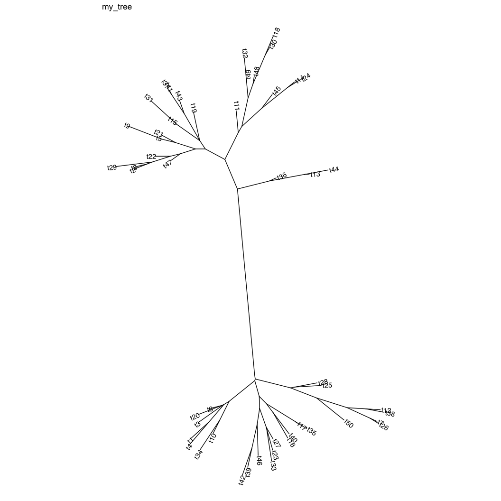
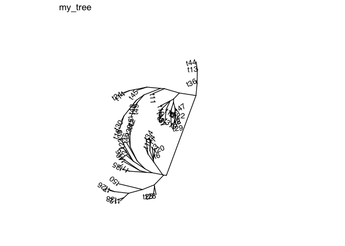
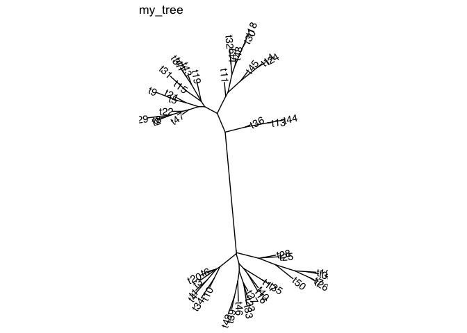
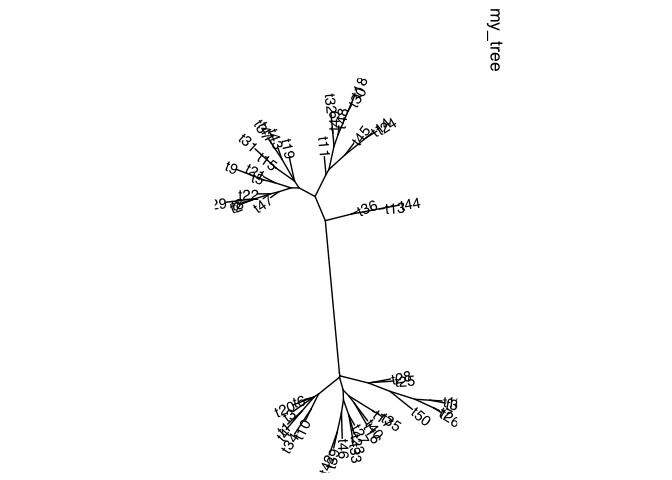
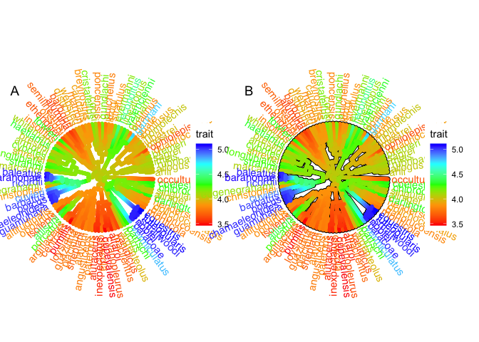
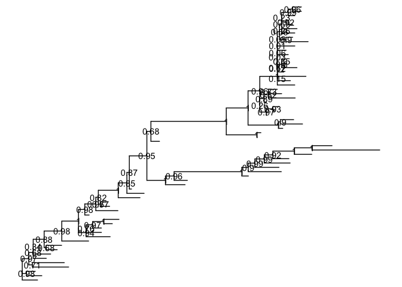

treeTests_miscCodeTroubleshooting
================
Janet Young

2026-04-03

``` r
# ### revert back to ggplot 3.5.2 - this is from 2025-04-09 
# ## version 4.0.0 is
# packageurl <- "http://cran.r-project.org/src/contrib/Archive/ggplot2/ggplot2_3.5.2.tar.gz"
# install.packages(packageurl, repos=NULL, type="source")

### revert back to GGally 2.2.1  (2024-02-14) it says it needs 4.4.0
# # GGally_2.2.0.tar.gz
# packageurl <- "http://cran.r-project.org/src/contrib/Archive/GGally/GGally_2.2.1.tar.gz"
# install.packages(packageurl, repos=NULL, type="source")
```

# rotate_tree equal_angle?

Messing around with an equal_angle tree, looking at clipping of taxon
labels and rotation

``` r
set.seed(76824375)
tree <- rtree(50)

## make one edge long, to make the tree longer than it is wide
tree$edge.length[1] <- 5

p <- ggtree(tree, layout="equal_angle") + 
    geom_tiplab() +
    labs(title="my_tree")
p
```

<!-- -->

ggtree::rotate_tree is not intended for this…

``` r
rotate_tree(p, 180)
```

    ## Coordinate system already present.
    ## ℹ Adding new coordinate system, which will replace the existing one.

<!-- -->

I saw a suggestion that in a Rmd doc we can use out.extra=‘angle=90’ to
rotate the end result of the plot, but it doesn’t seem to work for me:

``` r
p
```


There is a solution using grid newports. Need to mess around more to get
it looking right but it’s a start

``` r
library(grid)

### based on 
### https://stackoverflow.com/questions/39712801/how-to-combine-two-ggplots-with-one-rotated

# want to rotate the plot title for this to look good
p2 <- p +
    theme(plot.title = element_text(
        # hjust = 1000, ## hjust seems to have no effect here
        vjust = 1.2,  ## vjust does have an effect though
        angle=270))

grid.newpage()
print(p2, vp=viewport(angle = 90))
```

<!-- -->

# Mess around with longer tip labels

``` r
## make the tip labels longer
tree$tip.label <- paste0("sequence_", tree$tip.label)
```

# other stuff

``` r
#### tree_anole (phylo object) has 100 tips and 99 internal nodes
### df_svl is a data.frame, 100 rows (named like the tips of tree_anole), 1 column ("svl")
##  `tree_anole` and `df_svl` are from 'TDbook' package

svl <- as.matrix(df_svl)[,1]
fit <- phytools::fastAnc(tree_anole, svl, vars=TRUE, CI=TRUE)

#### make td - data.frame for external nodes
# 100*2 data.frame.
# nodeid() is a tidytree function that converts terminal taxon names to a numeric node ID
td <- data.frame(node = nodeid(tree_anole, names(svl)),
                 trait = svl)
#### make nd - data.frame for internal nodes:
nd <- data.frame(node = names(fit$ace), trait = fit$ace)


#### make d - combined data frame for internal and external nodes
# 199x2 - node IDs and trait value
d <- rbind(td, nd)
d$node <- as.numeric(d$node)

#### add d to the tree to make a treedata object (tree)
## tree is a 'treedata' object - contains the tree (@phylo slot) and a 199*4 tibble generated from d (with an added TRUE/FALSE column called 'isTip')
tree <- full_join(tree_anole, d, by = 'node')

p1 <- ggtree(tree, aes(color=trait), layout = 'circular', 
             ladderize = FALSE, continuous = 'colour', size=2) +
    scale_color_gradientn(colours=c("red", 'orange', 'green', 'cyan', 'blue')) +
    geom_tiplab(hjust = -.1) + 
    xlim(0, 1.2) + 
    theme(legend.position.inside = c(.05, .85)) 
```

    ## Warning: Using `size` aesthetic for lines was deprecated in ggplot2 3.4.0.
    ## ℹ Please use `linewidth` instead.
    ## ℹ The deprecated feature was likely used in the ggtree package.
    ##   Please report the issue at <https://github.com/YuLab-SMU/ggtree/issues>.
    ## This warning is displayed once per session.
    ## Call `lifecycle::last_lifecycle_warnings()` to see where this warning was
    ## generated.

``` r
p2 <- ggtree(tree, layout='circular', ladderize = FALSE, size=2.8) + 
    geom_tree(aes(color=trait), continuous = 'colour', size=2) +  
    scale_color_gradientn(colours=c("red", 'orange', 'green', 'cyan', 'blue')) +
    geom_tiplab(aes(color=trait), hjust = -.1) + 
    xlim(0, 1.2) + 
    theme(legend.position.inside = c(.05, .85)) 

plot_list(p1, p2, ncol=2, tag_levels="A")    
```

<!-- -->

``` r
### ggtree manual http://yulab-smu.top/treedata-book/chapter4.html
## treeio https://yulab-smu.top/treedata-book/chapter1.html
## tree
set.seed(2017-02-16)
tree <- rtree(50)

## beast_tree (treedata object, 76 tips, 75 internal nodes)
beast_file <- system.file("examples/MCC_FluA_H3.tree", 
                          package="ggtree")
beast_tree <- read.beast(beast_file)
# ggtree(beast_tree, mrsd="2013-01-01") + theme_tree2()


## NAG (integer vector, length 151, goes with beast_tree)
NAG_file <- system.file("examples/NAG_inHA1.txt", package="ggtree")

NAG.df <- read.table(NAG_file, sep="\t", header=FALSE, 
                     stringsAsFactors = FALSE)
NAG <- NAG.df[,2]
names(NAG) <- NAG.df[,1]

##
nwk <- system.file("extdata/RAxML","RAxML_bipartitions.H3", package='treeio')
tr <- read.tree(nwk)

ggtree(tr) + 
    geom_text2(aes(label=label, 
                   subset = !is.na(as.numeric(label)) & as.numeric(label) > 80))
```

    ## Warning in FUN(X[[i]], ...): NAs introduced by coercion
    ## Warning in FUN(X[[i]], ...): NAs introduced by coercion

<!-- -->

``` r
raxml_file <- system.file("extdata/RAxML", "RAxML_bipartitionsBranchLabels.H3", package="treeio")
raxml <- read.raxml(raxml_file)
ggtree(raxml) + geom_text(aes(label=bootstrap/100))
```

    ## Warning: Removed 65 rows containing missing values or values outside the scale range
    ## (`geom_text()`).

<!-- -->

# Finished

``` r
sessionInfo()
```

    ## R version 4.5.3 (2026-03-11)
    ## Platform: aarch64-apple-darwin20
    ## Running under: macOS Tahoe 26.4
    ## 
    ## Matrix products: default
    ## BLAS:   /Library/Frameworks/R.framework/Versions/4.5-arm64/Resources/lib/libRblas.0.dylib 
    ## LAPACK: /Library/Frameworks/R.framework/Versions/4.5-arm64/Resources/lib/libRlapack.dylib;  LAPACK version 3.12.1
    ## 
    ## locale:
    ## [1] en_US.UTF-8/en_US.UTF-8/en_US.UTF-8/C/en_US.UTF-8/en_US.UTF-8
    ## 
    ## time zone: America/Los_Angeles
    ## tzcode source: internal
    ## 
    ## attached base packages:
    ## [1] grid      stats     graphics  grDevices utils     datasets  methods  
    ## [8] base     
    ## 
    ## other attached packages:
    ##  [1] TDbook_0.0.6    tidytree_0.4.7  treeio_1.34.0   ggtree_4.0.5   
    ##  [5] lubridate_1.9.5 forcats_1.0.1   stringr_1.6.0   dplyr_1.2.0    
    ##  [9] purrr_1.2.1     readr_2.2.0     tidyr_1.3.2     tibble_3.3.1   
    ## [13] ggplot2_4.0.2   tidyverse_2.0.0
    ## 
    ## loaded via a namespace (and not attached):
    ##  [1] ggiraph_0.9.6           tidyselect_1.2.1        farver_2.1.2           
    ##  [4] phytools_2.5-2          S7_0.2.1                optimParallel_1.0-2    
    ##  [7] fastmap_1.2.0           lazyeval_0.2.2          combinat_0.0-8         
    ## [10] fontquiver_0.2.1        digest_0.6.39           timechange_0.4.0       
    ## [13] lifecycle_1.0.5         magrittr_2.0.4          compiler_4.5.3         
    ## [16] rlang_1.1.7             tools_4.5.3             igraph_2.2.2           
    ## [19] yaml_2.3.12             knitr_1.51              phangorn_2.12.1        
    ## [22] clusterGeneration_1.3.8 labeling_0.4.3          htmlwidgets_1.6.4      
    ## [25] scatterplot3d_0.3-45    mnormt_2.1.2            RColorBrewer_1.1-3     
    ## [28] aplot_0.2.9             expm_1.0-0              withr_3.0.2            
    ## [31] numDeriv_2016.8-1.1     gdtools_0.5.0           scales_1.4.0           
    ## [34] iterators_1.0.14        MASS_7.3-65             cli_3.6.5              
    ## [37] rmarkdown_2.31          generics_0.1.4          otel_0.2.0             
    ## [40] rstudioapi_0.18.0       tzdb_0.5.0              ape_5.8-1              
    ## [43] maps_3.4.3              parallel_4.5.3          ggplotify_0.1.3        
    ## [46] yulab.utils_0.2.4       vctrs_0.7.2             Matrix_1.7-5           
    ## [49] jsonlite_2.0.0          fontBitstreamVera_0.1.1 gridGraphics_0.5-1     
    ## [52] hms_1.1.4               patchwork_1.3.2         systemfonts_1.3.2      
    ## [55] foreach_1.5.2           glue_1.8.0              codetools_0.2-20       
    ## [58] DEoptim_2.2-8           stringi_1.8.7           gtable_0.3.6           
    ## [61] quadprog_1.5-8          pillar_1.11.1           rappdirs_0.3.4         
    ## [64] htmltools_0.5.9         R6_2.6.1                doParallel_1.0.17      
    ## [67] evaluate_1.0.5          lattice_0.22-9          fontLiberation_0.1.0   
    ## [70] ggfun_0.2.0             Rcpp_1.1.1              fastmatch_1.1-8        
    ## [73] coda_0.19-4.1           nlme_3.1-169            xfun_0.57              
    ## [76] fs_2.0.1                pkgconfig_2.0.3
