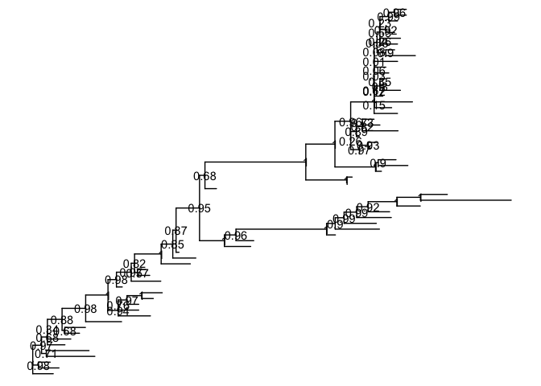

treeTests_miscCodeTroubleshooting
================
Janet Young

2024-04-29

``` r
#### tree_anole (phylo object) has 100 tips and 99 internal nodes
### df_svl is a data.frame, 100 rows (named like the tips of tree_anole), 1 column ("svl")
##  `tree_anole` and `df_svl` are from 'TDbook' package

svl <- as.matrix(df_svl)[,1]
fit <- phytools::fastAnc(tree_anole, svl, vars=TRUE, CI=TRUE)

#### make td - data.frame for external nodes
# 100*2 data.frame.
# nodeid() is a tidytree function that converts terminal taxon names to a numeric node ID
td <- data.frame(node = nodeid(tree_anole, names(svl)),
                 trait = svl)
#### make nd - data.frame for internal nodes:
nd <- data.frame(node = names(fit$ace), trait = fit$ace)


#### make d - combined data frame for internal and external nodes
# 199x2 - node IDs and trait value
d <- rbind(td, nd)
d$node <- as.numeric(d$node)

#### add d to the tree to make a treedata object (tree)
## tree is a 'treedata' object - contains the tree (@phylo slot) and a 199*4 tibble generated from d (with an added TRUE/FALSE column called 'isTip')
tree <- full_join(tree_anole, d, by = 'node')

p1 <- ggtree(tree, aes(color=trait), layout = 'circular', 
             ladderize = FALSE, continuous = 'colour', size=2) +
    scale_color_gradientn(colours=c("red", 'orange', 'green', 'cyan', 'blue')) +
    geom_tiplab(hjust = -.1) + 
    xlim(0, 1.2) + 
    theme(legend.position = c(.05, .85)) 
```

    ## Warning: A numeric `legend.position` argument in `theme()` was deprecated in ggplot2
    ## 3.5.0.
    ## ℹ Please use the `legend.position.inside` argument of `theme()` instead.
    ## This warning is displayed once every 8 hours.
    ## Call `lifecycle::last_lifecycle_warnings()` to see where this warning was
    ## generated.

``` r
p2 <- ggtree(tree, layout='circular', ladderize = FALSE, size=2.8) + 
    geom_tree(aes(color=trait), continuous = 'colour', size=2) +  
    scale_color_gradientn(colours=c("red", 'orange', 'green', 'cyan', 'blue')) +
    geom_tiplab(aes(color=trait), hjust = -.1) + 
    xlim(0, 1.2) + 
    theme(legend.position = c(.05, .85)) 

plot_list(p1, p2, ncol=2, tag_levels="A")    
```

<!-- -->

``` r
### ggtree manual http://yulab-smu.top/treedata-book/chapter4.html
## treeio https://yulab-smu.top/treedata-book/chapter1.html
## tree
set.seed(2017-02-16)
tree <- rtree(50)

## beast_tree (treedata object, 76 tips, 75 internal nodes)
beast_file <- system.file("examples/MCC_FluA_H3.tree", 
                          package="ggtree")
beast_tree <- read.beast(beast_file)
# ggtree(beast_tree, mrsd="2013-01-01") + theme_tree2()


## NAG (integer vector, length 151, goes with beast_tree)
NAG_file <- system.file("examples/NAG_inHA1.txt", package="ggtree")

NAG.df <- read.table(NAG_file, sep="\t", header=FALSE, 
                     stringsAsFactors = FALSE)
NAG <- NAG.df[,2]
names(NAG) <- NAG.df[,1]

##
nwk <- system.file("extdata/RAxML","RAxML_bipartitions.H3", package='treeio')
tr <- read.tree(nwk)

ggtree(tr) + 
    geom_text2(aes(label=label, 
                   subset = !is.na(as.numeric(label)) & as.numeric(label) > 80))
```

    ## Warning in FUN(X[[i]], ...): NAs introduced by coercion

    ## Warning in FUN(X[[i]], ...): NAs introduced by coercion

<!-- -->

``` r
raxml_file <- system.file("extdata/RAxML", "RAxML_bipartitionsBranchLabels.H3", package="treeio")
raxml <- read.raxml(raxml_file)
ggtree(raxml) + geom_text(aes(label=bootstrap/100))
```

    ## Warning: Removed 65 rows containing missing values or values outside the scale range
    ## (`geom_text()`).

<!-- -->
