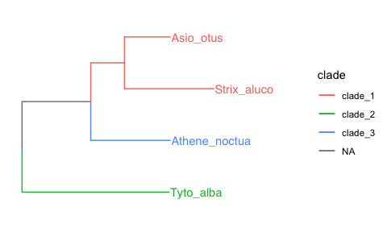

trees_choosing_clades
================
Janet Young

2025-10-20

# Setup

# Some example trees

``` r
x <- "(((Strix_aluco:8.2,Asio_otus:4.2):3.1,Athene_noctua:7.3):6.3,Tyto_alba:13.5);"
tree.owls <- read.tree(text= x)
tree.owls <- as.treedata(tree.owls)
```

Plot tree.owls

``` r
tree.owls %>% 
    ggtree() +
    geom_tiplab() +
    geom_nodelab(aes(label=node), 
                 size=3, color="darkgray",
                 nudge_x= -0.3, nudge_y= 0.2, hjust=1) +
    geom_treescale() +
    hexpand(0.3) +
    labs(title="tree.owls")
```

<!-- -->

See what tree.owls looks like in tibble format:

``` r
tree.owls %>% 
    as_tibble() %>% 
    kable() %>% 
    kable_styling(full_width=FALSE)
```

<table class="table" style="width: auto !important; margin-left: auto; margin-right: auto;">

<thead>

<tr>

<th style="text-align:right;">

parent
</th>

<th style="text-align:right;">

node
</th>

<th style="text-align:right;">

branch.length
</th>

<th style="text-align:left;">

label
</th>

</tr>

</thead>

<tbody>

<tr>

<td style="text-align:right;">

7
</td>

<td style="text-align:right;">

1
</td>

<td style="text-align:right;">

8.2
</td>

<td style="text-align:left;">

Strix_aluco
</td>

</tr>

<tr>

<td style="text-align:right;">

7
</td>

<td style="text-align:right;">

2
</td>

<td style="text-align:right;">

4.2
</td>

<td style="text-align:left;">

Asio_otus
</td>

</tr>

<tr>

<td style="text-align:right;">

6
</td>

<td style="text-align:right;">

3
</td>

<td style="text-align:right;">

7.3
</td>

<td style="text-align:left;">

Athene_noctua
</td>

</tr>

<tr>

<td style="text-align:right;">

5
</td>

<td style="text-align:right;">

4
</td>

<td style="text-align:right;">

13.5
</td>

<td style="text-align:left;">

Tyto_alba
</td>

</tr>

<tr>

<td style="text-align:right;">

5
</td>

<td style="text-align:right;">

5
</td>

<td style="text-align:right;">

NA
</td>

<td style="text-align:left;">

NA
</td>

</tr>

<tr>

<td style="text-align:right;">

5
</td>

<td style="text-align:right;">

6
</td>

<td style="text-align:right;">

6.3
</td>

<td style="text-align:left;">

NA
</td>

</tr>

<tr>

<td style="text-align:right;">

6
</td>

<td style="text-align:right;">

7
</td>

<td style="text-align:right;">

3.1
</td>

<td style="text-align:left;">

NA
</td>

</tr>

</tbody>

</table>

# Create the get_mean_dist_to_tips function

I want a function, that for each internal node, gets the total tree
length of the descendent subtree (as well as mean length per tip within
the clade)

This function is are now stored in
`useful_functions/phylogenetic_tree_functions.R`, but I’ll show it here:

``` r
print(get_mean_dist_to_tips)
```

    ## function (tree) 
    ## {
    ##     my_tbl <- tree %>% as_tibble()
    ##     my_tbl <- my_tbl %>% mutate(isTip = isTip(tree, .node = my_tbl$node))
    ##     all_tip_ids <- my_tbl %>% filter(isTip) %>% pull(node)
    ##     all_node_dists <- dist.nodes(tree@phylo)
    ##     new_info <- lapply(1:nrow(my_tbl), function(i) {
    ##         if (my_tbl$isTip[i]) {
    ##             output <- tibble(num_desc_tips = 1, tot_edgeLen = 0, 
    ##                 tot_distToTip = 0, mean_distToTip = 0, all_descendents = NA_character_, 
    ##                 tip_descendents = NA_character_)
    ##             return(output)
    ##         }
    ##         else {
    ##             my_desc <- phytools::getDescendants(tree@phylo, i)
    ##             my_desc_tips <- intersect(my_desc, all_tip_ids)
    ##             all_dists_to_tips <- all_node_dists[i, my_desc_tips]
    ##             subtree <- extract.clade(tree@phylo, my_tbl$node[i])
    ##             output <- tibble(num_desc_tips = length(my_desc_tips), 
    ##                 tot_edgeLen = sum(subtree$edge.length), tot_distToTip = sum(all_dists_to_tips), 
    ##                 mean_distToTip = mean(all_dists_to_tips), all_descendents = paste(my_desc, 
    ##                   collapse = ","), tip_descendents = paste(my_desc_tips, 
    ##                   collapse = ","))
    ##             return(output)
    ##         }
    ##     }) %>% bind_rows() %>% mutate(norm_edgeLen = tot_edgeLen/num_desc_tips)
    ##     my_tbl <- cbind(my_tbl, new_info) %>% as_tibble() %>% relocate(all_descendents, 
    ##         tip_descendents, .after = isTip)
    ##     return(my_tbl)
    ## }

Use that function on tree.owls and show the result

``` r
my_dists <- get_mean_dist_to_tips(tree.owls)
my_dists %>% 
    kable() %>% 
    kable_styling(full_width=FALSE)
```

<table class="table" style="width: auto !important; margin-left: auto; margin-right: auto;">

<thead>

<tr>

<th style="text-align:right;">

parent
</th>

<th style="text-align:right;">

node
</th>

<th style="text-align:right;">

branch.length
</th>

<th style="text-align:left;">

label
</th>

<th style="text-align:left;">

isTip
</th>

<th style="text-align:left;">

all_descendents
</th>

<th style="text-align:left;">

tip_descendents
</th>

<th style="text-align:right;">

num_desc_tips
</th>

<th style="text-align:right;">

tot_edgeLen
</th>

<th style="text-align:right;">

tot_distToTip
</th>

<th style="text-align:right;">

mean_distToTip
</th>

<th style="text-align:right;">

norm_edgeLen
</th>

</tr>

</thead>

<tbody>

<tr>

<td style="text-align:right;">

7
</td>

<td style="text-align:right;">

1
</td>

<td style="text-align:right;">

8.2
</td>

<td style="text-align:left;">

Strix_aluco
</td>

<td style="text-align:left;">

TRUE
</td>

<td style="text-align:left;">

NA
</td>

<td style="text-align:left;">

NA
</td>

<td style="text-align:right;">

1
</td>

<td style="text-align:right;">

0.0
</td>

<td style="text-align:right;">

0.0
</td>

<td style="text-align:right;">

0.000000
</td>

<td style="text-align:right;">

0.00
</td>

</tr>

<tr>

<td style="text-align:right;">

7
</td>

<td style="text-align:right;">

2
</td>

<td style="text-align:right;">

4.2
</td>

<td style="text-align:left;">

Asio_otus
</td>

<td style="text-align:left;">

TRUE
</td>

<td style="text-align:left;">

NA
</td>

<td style="text-align:left;">

NA
</td>

<td style="text-align:right;">

1
</td>

<td style="text-align:right;">

0.0
</td>

<td style="text-align:right;">

0.0
</td>

<td style="text-align:right;">

0.000000
</td>

<td style="text-align:right;">

0.00
</td>

</tr>

<tr>

<td style="text-align:right;">

6
</td>

<td style="text-align:right;">

3
</td>

<td style="text-align:right;">

7.3
</td>

<td style="text-align:left;">

Athene_noctua
</td>

<td style="text-align:left;">

TRUE
</td>

<td style="text-align:left;">

NA
</td>

<td style="text-align:left;">

NA
</td>

<td style="text-align:right;">

1
</td>

<td style="text-align:right;">

0.0
</td>

<td style="text-align:right;">

0.0
</td>

<td style="text-align:right;">

0.000000
</td>

<td style="text-align:right;">

0.00
</td>

</tr>

<tr>

<td style="text-align:right;">

5
</td>

<td style="text-align:right;">

4
</td>

<td style="text-align:right;">

13.5
</td>

<td style="text-align:left;">

Tyto_alba
</td>

<td style="text-align:left;">

TRUE
</td>

<td style="text-align:left;">

NA
</td>

<td style="text-align:left;">

NA
</td>

<td style="text-align:right;">

1
</td>

<td style="text-align:right;">

0.0
</td>

<td style="text-align:right;">

0.0
</td>

<td style="text-align:right;">

0.000000
</td>

<td style="text-align:right;">

0.00
</td>

</tr>

<tr>

<td style="text-align:right;">

5
</td>

<td style="text-align:right;">

5
</td>

<td style="text-align:right;">

NA
</td>

<td style="text-align:left;">

NA
</td>

<td style="text-align:left;">

FALSE
</td>

<td style="text-align:left;">

6,4,7,3,1,2
</td>

<td style="text-align:left;">

4,3,1,2
</td>

<td style="text-align:right;">

4
</td>

<td style="text-align:right;">

42.6
</td>

<td style="text-align:right;">

58.3
</td>

<td style="text-align:right;">

14.575000
</td>

<td style="text-align:right;">

10.65
</td>

</tr>

<tr>

<td style="text-align:right;">

5
</td>

<td style="text-align:right;">

6
</td>

<td style="text-align:right;">

6.3
</td>

<td style="text-align:left;">

NA
</td>

<td style="text-align:left;">

FALSE
</td>

<td style="text-align:left;">

7,3,1,2
</td>

<td style="text-align:left;">

3,1,2
</td>

<td style="text-align:right;">

3
</td>

<td style="text-align:right;">

22.8
</td>

<td style="text-align:right;">

25.9
</td>

<td style="text-align:right;">

8.633333
</td>

<td style="text-align:right;">

7.60
</td>

</tr>

<tr>

<td style="text-align:right;">

6
</td>

<td style="text-align:right;">

7
</td>

<td style="text-align:right;">

3.1
</td>

<td style="text-align:left;">

NA
</td>

<td style="text-align:left;">

FALSE
</td>

<td style="text-align:left;">

1,2
</td>

<td style="text-align:left;">

1,2
</td>

<td style="text-align:right;">

2
</td>

<td style="text-align:right;">

12.4
</td>

<td style="text-align:right;">

12.4
</td>

<td style="text-align:right;">

6.200000
</td>

<td style="text-align:right;">

6.20
</td>

</tr>

</tbody>

</table>

## Create the choose_clades function

Now we can use distance table that to choose subclades, given a certain
desired distance to tip.

Here’s the function:

``` r
print(choose_clades)
```

    ## function (dist_tbl, dist_threshold, dist_metric = "mean_distToTip", 
    ##     randomize_order = TRUE, seed = NULL, assign_internal_nodes = TRUE, 
    ##     quiet = TRUE) 
    ## {
    ##     dist_tbl_tree <- dist_tbl %>% as.treedata(branch.length, 
    ##         label)
    ##     tree_max_dist <- dist_tbl %>% pull(!!dist_metric) %>% max()
    ##     if (dist_threshold >= tree_max_dist) {
    ##         dist_tbl <- dist_tbl %>% mutate(clade = "clade_1") %>% 
    ##             relocate(clade, .after = label)
    ##         return(dist_tbl)
    ##     }
    ##     all_tip_IDs <- dist_tbl %>% filter(isTip) %>% pull(node)
    ##     if (!quiet) {
    ##         cat("orig all_tip_IDs ", paste(all_tip_IDs, collapse = ","), 
    ##             "\n")
    ##     }
    ##     if (randomize_order) {
    ##         if (!is.null(seed)) {
    ##             set.seed(seed)
    ##         }
    ##         all_tip_IDs <- all_tip_IDs[sample(length(all_tip_IDs), 
    ##             size = length(all_tip_IDs))]
    ##         if (!quiet) {
    ##             cat("rand all_tip_IDs ", paste(all_tip_IDs, collapse = ","), 
    ##                 "\n")
    ##         }
    ##     }
    ##     tip_assignments <- tibble(tip_ID = all_tip_IDs, clade = NA_integer_)
    ##     clade_counter <- 1
    ##     for (each_tip in all_tip_IDs) {
    ##         if (!quiet) {
    ##             cat("Checking tip ", each_tip, "\n")
    ##         }
    ##         assn <- tip_assignments %>% filter(tip_ID == each_tip) %>% 
    ##             pull(clade)
    ##         if (!is.na(assn)) {
    ##             if (!quiet) {
    ##                 cat("    already assigned\n")
    ##             }
    ##             next
    ##         }
    ##         threshold_exceeded <- FALSE
    ##         this_anc_ID <- each_tip
    ##         while (!threshold_exceeded) {
    ##             prev_node_checked <- this_anc_ID
    ##             this_anc_ID <- dist_tbl %>% filter(node == this_anc_ID) %>% 
    ##                 pull(parent)
    ##             this_dist <- dist_tbl %>% filter(node == this_anc_ID) %>% 
    ##                 pull(!!dist_metric)
    ##             if (this_dist > dist_threshold) {
    ##                 if (!quiet) {
    ##                   cat("    node", this_anc_ID, "forms a clade!\n")
    ##                 }
    ##                 all_descendents <- phytools::getDescendants(dist_tbl_tree@phylo, 
    ##                   prev_node_checked)
    ##                 all_descendents <- intersect(all_descendents, 
    ##                   all_tip_IDs)
    ##                 if (!quiet) {
    ##                   cat("       clade members: ", paste(all_descendents, 
    ##                     collapse = ","), "\n")
    ##                 }
    ##                 already_assigned_tips <- tip_assignments %>% 
    ##                   filter(!is.na(clade)) %>% pull(tip_ID)
    ##                 all_descendents <- setdiff(all_descendents, already_assigned_tips)
    ##                 if (!quiet) {
    ##                   cat("       clade members without assignment: ", 
    ##                     paste(all_descendents, collapse = ","), "\n")
    ##                 }
    ##                 tip_assignments <- tip_assignments %>% mutate(clade = case_when(tip_ID %in% 
    ##                   all_descendents ~ clade_counter, TRUE ~ clade))
    ##                 clade_counter <- clade_counter + 1
    ##                 threshold_exceeded <- TRUE
    ##             }
    ##         }
    ##     }
    ##     dist_tbl <- left_join(dist_tbl, tip_assignments, by = c(node = "tip_ID")) %>% 
    ##         relocate(clade, .after = label) %>% arrange(clade) %>% 
    ##         mutate(clade = case_when(!is.na(clade) ~ paste0("clade_", 
    ##             as.character(clade)), TRUE ~ NA_character_)) %>% 
    ##         mutate(clade = as.factor(clade)) %>% arrange(node)
    ##     if (assign_internal_nodes) {
    ##         for (each_node in dist_tbl$node) {
    ##             dat <- dist_tbl %>% filter(node == each_node)
    ##             if (dat$isTip) {
    ##                 next
    ##             }
    ##             if (!is.na(dat$clade)) {
    ##                 next
    ##             }
    ##             if (!quiet) {
    ##                 cat("## assigning internal node ", each_node, 
    ##                   "\n")
    ##             }
    ##             all_descendents <- phytools::getDescendants(dist_tbl_tree@phylo, 
    ##                 each_node) %>% as.integer()
    ##             if (!quiet) {
    ##                 cat("    all_descendents ", paste(all_descendents, 
    ##                   collapse = ","), "\n")
    ##             }
    ##             all_desc_clades <- dist_tbl %>% dplyr::filter(node %in% 
    ##                 .env$all_descendents) %>% filter(!is.na(clade)) %>% 
    ##                 pull(clade) %>% unique()
    ##             if (!quiet) {
    ##                 cat("    all_desc_clades ", paste(all_desc_clades, 
    ##                   collapse = ","), "\n")
    ##             }
    ##             if (length(all_desc_clades) == 1) {
    ##                 if (!quiet) {
    ##                   cat("        UNIQUE!\n")
    ##                 }
    ##                 dist_tbl <- dist_tbl %>% mutate(clade = case_when(node == 
    ##                   each_node ~ all_desc_clades, TRUE ~ clade))
    ##             }
    ##         }
    ##     }
    ##     return(dist_tbl)
    ## }

Now I use it to choose clades, with mean distance to tip of \<7 (it adds
a column called `clade` to the tibble), which we can use to color the
tree when we plot it:

``` r
my_dists2 <- choose_clades(my_dists, dist_threshold=7)
# my_dists2 %>% 
#     kable() %>% 
#     kable_styling(full_width=FALSE)

my_dists2 %>% 
    as.treedata(branch.length, label) %>% 
    ggtree(aes(color=clade)) +
    hexpand(0.3) +
    geom_tiplab(show.legend=FALSE)
```

<!-- -->

# Now try that on a bigger example tree

``` r
nwk <- system.file("extdata", "sample.nwk", package="treeio")
tree <- read.tree(nwk) %>%  as.treedata()
tree %>% 
    ggtree() +
    geom_tiplab() +
    geom_treescale(width=10) +
    labs(title="treeio's sample.nwk tree")
```

<!-- -->

Choose clades a couple of different ways, and show the results

``` r
tree_dists <- tree %>% 
    get_mean_dist_to_tips()

tree2_tbl_1 <- tree_dists %>% 
    choose_clades(dist_threshold=20)
p1 <- tree2_tbl_1 %>% 
    as.treedata(branch.length, label) %>% 
    ggtree(aes(color=clade)) +
    geom_tiplab(show.legend=FALSE) +
    geom_treescale(width=10) +
    labs(title="subtree mean dist to tip < 20")

tree2_tbl_2 <- tree_dists %>% 
    choose_clades(dist_metric = "tot_edgeLen", 
                  dist_threshold=20)
p2 <- tree2_tbl_2 %>% 
    as.treedata(branch.length, label) %>% 
    ggtree(aes(color=clade)) +
    geom_tiplab(show.legend=FALSE) +
    geom_treescale(width=10) +
    labs(title="subtree tot length <20")

(p1 + p2) +
    plot_annotation(title="treeio's sample.nwk tree")
```

<!-- -->

We might have an idea of roughly how many clades we want to slice the
tree into. We can use this function to check a few slice distances to
pick a good one:

``` r
choose_clades_several_thresholds_report(tree_dists, 
                                        distances_to_try=c(10,15,20,25,30,35,40,45,50)) %>% 
    kable(caption="Choose clades results, with several thresholds",
          digits=1) %>% 
    kable_styling(full_width=FALSE)
```

<table class="table" style="width: auto !important; margin-left: auto; margin-right: auto;">

<caption>

Choose clades results, with several thresholds
</caption>

<thead>

<tr>

<th style="text-align:right;">

dist_threshold
</th>

<th style="text-align:right;">

num_clades
</th>

<th style="text-align:right;">

tree_num_tips
</th>

<th style="text-align:right;">

tree_max_dist
</th>

</tr>

</thead>

<tbody>

<tr>

<td style="text-align:right;">

10
</td>

<td style="text-align:right;">

9
</td>

<td style="text-align:right;">

13
</td>

<td style="text-align:right;">

46
</td>

</tr>

<tr>

<td style="text-align:right;">

15
</td>

<td style="text-align:right;">

7
</td>

<td style="text-align:right;">

13
</td>

<td style="text-align:right;">

46
</td>

</tr>

<tr>

<td style="text-align:right;">

20
</td>

<td style="text-align:right;">

5
</td>

<td style="text-align:right;">

13
</td>

<td style="text-align:right;">

46
</td>

</tr>

<tr>

<td style="text-align:right;">

25
</td>

<td style="text-align:right;">

4
</td>

<td style="text-align:right;">

13
</td>

<td style="text-align:right;">

46
</td>

</tr>

<tr>

<td style="text-align:right;">

30
</td>

<td style="text-align:right;">

3
</td>

<td style="text-align:right;">

13
</td>

<td style="text-align:right;">

46
</td>

</tr>

<tr>

<td style="text-align:right;">

35
</td>

<td style="text-align:right;">

3
</td>

<td style="text-align:right;">

13
</td>

<td style="text-align:right;">

46
</td>

</tr>

<tr>

<td style="text-align:right;">

40
</td>

<td style="text-align:right;">

3
</td>

<td style="text-align:right;">

13
</td>

<td style="text-align:right;">

46
</td>

</tr>

<tr>

<td style="text-align:right;">

45
</td>

<td style="text-align:right;">

2
</td>

<td style="text-align:right;">

13
</td>

<td style="text-align:right;">

46
</td>

</tr>

<tr>

<td style="text-align:right;">

50
</td>

<td style="text-align:right;">

1
</td>

<td style="text-align:right;">

13
</td>

<td style="text-align:right;">

46
</td>

</tr>

</tbody>

</table>

Now we see those results, we can easily choose a threshold that results
in e.g. 3 clades, if that’s what we want:

``` r
tree_dists_three_clades <- choose_clades(tree_dists, 
                                         dist_threshold=40) 
tree_dists_three_clades %>% 
    as.treedata(branch.length, label) %>% 
    ggtree(aes(color=clade)) +
    geom_tiplab(show.legend=FALSE) +
    geom_treescale(width=10) +
    labs(title="subtree mean dist to tip < 40")
```

<!-- -->

# Alternatives to play around with

## Try dispRity::tree.age function

This function assumes that the tree is ultrametric, which is often
untrue. So I won’t use it.

Age starting from present

``` r
dispRity::tree.age(tree.owls@phylo, order = "past") %>% 
    kable() %>% 
    kable_styling(full_width=FALSE)
```

<table class="table" style="width: auto !important; margin-left: auto; margin-right: auto;">

<thead>

<tr>

<th style="text-align:right;">

ages
</th>

<th style="text-align:left;">

elements
</th>

</tr>

</thead>

<tbody>

<tr>

<td style="text-align:right;">

0.0
</td>

<td style="text-align:left;">

Strix_aluco
</td>

</tr>

<tr>

<td style="text-align:right;">

4.0
</td>

<td style="text-align:left;">

Asio_otus
</td>

</tr>

<tr>

<td style="text-align:right;">

4.0
</td>

<td style="text-align:left;">

Athene_noctua
</td>

</tr>

<tr>

<td style="text-align:right;">

4.1
</td>

<td style="text-align:left;">

Tyto_alba
</td>

</tr>

<tr>

<td style="text-align:right;">

17.6
</td>

<td style="text-align:left;">

5
</td>

</tr>

<tr>

<td style="text-align:right;">

11.3
</td>

<td style="text-align:left;">

6
</td>

</tr>

<tr>

<td style="text-align:right;">

8.2
</td>

<td style="text-align:left;">

7
</td>

</tr>

</tbody>

</table>

Age starting from root

``` r
dispRity::tree.age(tree.owls@phylo, order = "present") %>% 
    kable() %>% 
    kable_styling(full_width=FALSE)
```

<table class="table" style="width: auto !important; margin-left: auto; margin-right: auto;">

<thead>

<tr>

<th style="text-align:right;">

ages
</th>

<th style="text-align:left;">

elements
</th>

</tr>

</thead>

<tbody>

<tr>

<td style="text-align:right;">

17.6
</td>

<td style="text-align:left;">

Strix_aluco
</td>

</tr>

<tr>

<td style="text-align:right;">

13.6
</td>

<td style="text-align:left;">

Asio_otus
</td>

</tr>

<tr>

<td style="text-align:right;">

13.6
</td>

<td style="text-align:left;">

Athene_noctua
</td>

</tr>

<tr>

<td style="text-align:right;">

13.5
</td>

<td style="text-align:left;">

Tyto_alba
</td>

</tr>

<tr>

<td style="text-align:right;">

0.0
</td>

<td style="text-align:left;">

5
</td>

</tr>

<tr>

<td style="text-align:right;">

6.3
</td>

<td style="text-align:left;">

6
</td>

</tr>

<tr>

<td style="text-align:right;">

9.4
</td>

<td style="text-align:left;">

7
</td>

</tr>

</tbody>

</table>

# Finished

``` r
sessionInfo()
```

    ## R version 4.5.1 (2025-06-13)
    ## Platform: aarch64-apple-darwin20
    ## Running under: macOS Sequoia 15.6.1
    ## 
    ## Matrix products: default
    ## BLAS:   /Library/Frameworks/R.framework/Versions/4.5-arm64/Resources/lib/libRblas.0.dylib 
    ## LAPACK: /Library/Frameworks/R.framework/Versions/4.5-arm64/Resources/lib/libRlapack.dylib;  LAPACK version 3.12.1
    ## 
    ## locale:
    ## [1] en_US.UTF-8/en_US.UTF-8/en_US.UTF-8/C/en_US.UTF-8/en_US.UTF-8
    ## 
    ## time zone: America/Los_Angeles
    ## tzcode source: internal
    ## 
    ## attached base packages:
    ## [1] stats     graphics  grDevices utils     datasets  methods   base     
    ## 
    ## other attached packages:
    ##  [1] kableExtra_1.4.0 phytools_2.5-2   maps_3.4.3       dispRity_1.9    
    ##  [5] ape_5.8-1        treeio_1.32.0    ggtree_3.16.3    patchwork_1.3.2 
    ##  [9] janitor_2.2.1    lubridate_1.9.4  forcats_1.0.0    stringr_1.5.2   
    ## [13] dplyr_1.1.4      purrr_1.1.0      readr_2.1.5      tidyr_1.3.1     
    ## [17] tibble_3.3.0     ggplot2_3.5.2    tidyverse_2.0.0  here_1.0.2      
    ## 
    ## loaded via a namespace (and not attached):
    ##   [1] Rdpack_2.6.4            mnormt_2.1.1            phylolm_2.6.5          
    ##   [4] pbapply_1.7-4           polynom_1.4-1           gridExtra_2.3          
    ##   [7] phangorn_2.12.1         permute_0.9-8           rlang_1.1.6            
    ##  [10] magrittr_2.0.4          Claddis_0.7.0           ade4_1.7-23            
    ##  [13] snakecase_0.11.1        strap_1.6-1             compiler_4.5.1         
    ##  [16] mgcv_1.9-3              systemfonts_1.2.3       vctrs_0.6.5            
    ##  [19] combinat_0.0-8          quadprog_1.5-8          pkgconfig_2.0.3        
    ##  [22] fastmap_1.2.0           labeling_0.4.3          magic_1.6-1            
    ##  [25] rmarkdown_2.29          tzdb_0.5.0              xfun_0.53              
    ##  [28] aplot_0.2.9             clusterGeneration_1.3.8 jsonlite_2.0.0         
    ##  [31] gmp_0.7-5               cluster_2.1.8.1         parallel_4.5.1         
    ##  [34] R6_2.6.1                stringi_1.8.7           RColorBrewer_1.1-3     
    ##  [37] multicool_1.0.1         parallelly_1.45.1       numDeriv_2016.8-1.1    
    ##  [40] Rcpp_1.1.0              iterators_1.0.14        knitr_1.50             
    ##  [43] future.apply_1.20.0     optimParallel_1.0-2     zoo_1.8-14             
    ##  [46] splines_4.5.1           Matrix_1.7-4            igraph_2.1.4           
    ##  [49] timechange_0.3.0        tidyselect_1.2.1        rstudioapi_0.17.1      
    ##  [52] abind_1.4-8             yaml_2.3.10             vegan_2.7-2            
    ##  [55] doParallel_1.0.17       codetools_0.2-20        partitions_1.10-9      
    ##  [58] listenv_0.9.1           GET_1.0-7               lattice_0.22-7         
    ##  [61] withr_3.0.2             coda_0.19-4.1           evaluate_1.0.5         
    ##  [64] gridGraphics_0.5-1      future_1.67.0           xml2_1.4.0             
    ##  [67] geoscale_2.0.1          pillar_1.11.1           foreach_1.5.2          
    ##  [70] geometry_0.5.2          ellipse_0.5.0           ggfun_0.2.0            
    ##  [73] generics_0.1.4          rprojroot_2.1.1         hms_1.1.3              
    ##  [76] scales_1.4.0            tidytree_0.4.6          globals_0.18.0         
    ##  [79] glue_1.8.0              clipr_0.8.0             scatterplot3d_0.3-44   
    ##  [82] lazyeval_0.2.2          tools_4.5.1             RSpectra_0.16-2        
    ##  [85] fs_1.6.6                fastmatch_1.1-6         grid_4.5.1             
    ##  [88] rbibutils_2.3           phyclust_0.1-34         naturalsort_0.1.3      
    ##  [91] castor_1.8.4            nlme_3.1-168            cli_3.6.5              
    ##  [94] rappdirs_0.3.3          DEoptim_2.2-8           textshaping_1.0.3      
    ##  [97] expm_1.0-0              viridisLite_0.4.2       svglite_2.2.1          
    ## [100] gtable_0.3.6            yulab.utils_0.2.1       digest_0.6.37          
    ## [103] ggplotify_0.1.3         farver_2.1.2            htmltools_0.5.8.1      
    ## [106] lifecycle_1.0.4         MASS_7.3-65
