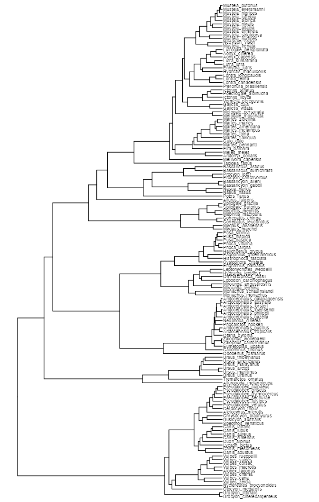
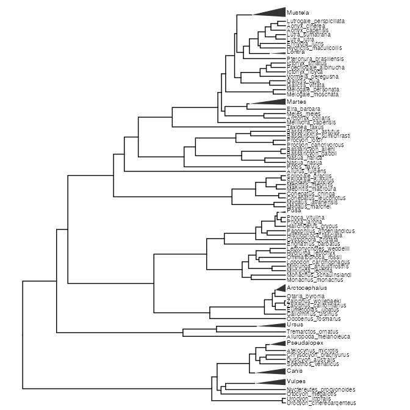

trees_collapse_clades
================
Janet Young

2026-09-01

# Goal

Run demo code from [Luis D. Verde
Arregoitia](https://luisdva.github.io/rstats/reduce-tree/) to collapse
some clades of a displayed tree.

Also see code in the FAM90A1 repo - [genomes.Rmd
script](https://github.com/jayoung/FAM90A1/blob/main/Rscripts/genomes.md#big-tree-aln10-but-collapse-some-clades)

Get example tree and display it:

``` r
data("caniformia")
caniftree <- caniformia$phy

full_plot <- caniftree |> 
    ggtree() +
    geom_tiplab(size=2.5) +
    hexpand(0.3)

full_plot
```

<!-- -->

Get tree in tibble format, and figure out which clades to collapse

``` r
canif_df <- as_tibble(caniftree)
canif_df <- canif_df %>% 
    mutate(genus=str_extract(label,".*?(?=_)")) %>% # regex!
    filter(!is.na(genus)) # drops internal nodes
```

``` r
# process nodes for label placement
formrca <- canif_df %>%
    add_count(genus, name = "numnodes") %>% ## add_count is a dplyr function - like count, but adds a new column to the dataframe
    filter(numnodes>2)

## 9 genus have >2 nodes
# formrca$genus |> unique() |> length()

### get node numbers per genus 
## returns a list, one item per genus, containing all node numbers of tips per genus 
gen_nodes <- formrca %>%
    group_split(genus) %>%
    purrr::map(pull, node)

#### get genus names
## returns a list, one item per genus, containing genus name
gnamesvec <- formrca %>%
    group_split(genus) %>%
    purrr::map(pull, genus) %>%
    purrr::map(unique)
```

``` r
### make a simple tibble - one row per genus, with mrca node

# define function for getting MRCA node
getCladeNode <- function(tree, nodesvec, gname) {
    nodenum <- getMRCA(tree, tip = nodesvec)
    tibble(clade = gname, node = nodenum)
}
genNodes <- purrr::map2_df(gen_nodes, gnamesvec,
                           ~ getCladeNode(caniftree, .x, .y)) # formula notation
```

Now we can use that to first scale clades (shrink vertically) then to
collapse them (turn them into triangles). Need to do all the scaling
first, then the collapsing afterwards, otherwise it doesn’t work.

``` r
#### scale each clade
full_plot_scaled <- purrr::reduce(
    genNodes$node,
    \(x,y) x |> 
        scaleClade(y, 0.2),
    .init = full_plot
)
# full_plot_scaled

#### collapse nodes and add clade labels
full_plot_scaled_collapsed <- purrr::reduce2(
    genNodes$node,
    genNodes$clade,
    \(x,y,z) x |> 
        ggtree::collapse(y, mode="max") + 
        geom_cladelab(
            node=y,label=z,
            barsize = 1, 
            offset.text = -1.25,
            vjust = 0,
            align= TRUE,
            fontsize = 2.75
        ),
    .init = full_plot_scaled
)
```

    ## Warning: Using `size` aesthetic for lines was deprecated in ggplot2 3.4.0.
    ## ℹ Please use `linewidth` instead.
    ## ℹ The deprecated feature was likely used in the ggtree package.
    ##   Please report the issue at <https://github.com/YuLab-SMU/ggtree/issues>.
    ## This warning is displayed once per session.
    ## Call `lifecycle::last_lifecycle_warnings()` to see where this warning was
    ## generated.

``` r
full_plot_scaled_collapsed
```

<!-- -->

# Finished

``` r
sessionInfo()
```

    ## R version 4.6.1 (2026-06-24)
    ## Platform: aarch64-apple-darwin23
    ## Running under: macOS Tahoe 26.6.2
    ## 
    ## Matrix products: default
    ## BLAS:   /Library/Frameworks/R.framework/Versions/4.6/Resources/lib/libRblas.0.dylib 
    ## LAPACK: /Library/Frameworks/R.framework/Versions/4.6/Resources/lib/libRlapack.dylib;  LAPACK version 3.12.1
    ## 
    ## locale:
    ## [1] en_US.UTF-8/en_US.UTF-8/en_US.UTF-8/C/en_US.UTF-8/en_US.UTF-8
    ## 
    ## time zone: America/Los_Angeles
    ## tzcode source: internal
    ## 
    ## attached base packages:
    ## [1] stats     graphics  grDevices utils     datasets  methods   base     
    ## 
    ## other attached packages:
    ##  [1] ggtree_4.2.0    geiger_2.0.12   phytools_2.5-2  maps_3.4.3     
    ##  [5] ape_5.8-1       lubridate_1.9.5 forcats_1.0.1   stringr_1.6.0  
    ##  [9] dplyr_1.2.1     purrr_1.2.2     readr_2.2.0     tidyr_1.3.2    
    ## [13] tibble_3.3.1    ggplot2_4.0.3   tidyverse_2.0.0
    ## 
    ## loaded via a namespace (and not attached):
    ##  [1] ggiraph_0.9.6           tidyselect_1.2.1        subplex_1.9            
    ##  [4] farver_2.1.2            S7_0.2.2                optimParallel_1.0-3    
    ##  [7] fastmap_1.2.0           lazyeval_0.2.3          combinat_0.0-8         
    ## [10] fontquiver_0.2.1        digest_0.6.39           timechange_0.4.0       
    ## [13] lifecycle_1.0.5         tidytree_0.4.8          magrittr_2.0.5         
    ## [16] compiler_4.6.1          rlang_1.3.0             tools_4.6.1            
    ## [19] igraph_2.3.3            yaml_2.3.12             knitr_1.51             
    ## [22] phangorn_2.12.1         clusterGeneration_1.3.8 labeling_0.4.3         
    ## [25] htmlwidgets_1.6.4       mnormt_2.1.2            scatterplot3d_0.3-45   
    ## [28] RColorBrewer_1.1-3      aplot_0.3.1             expm_1.0-1             
    ## [31] withr_3.0.3             numDeriv_2016.8-1.1     grid_4.6.1             
    ## [34] gdtools_0.5.1           scales_1.4.0            iterators_1.0.14       
    ## [37] MASS_7.3-66             cli_3.6.6               mvtnorm_1.4-2          
    ## [40] rmarkdown_2.31          treeio_1.36.1           ragg_1.5.2             
    ## [43] generics_0.1.4          otel_0.2.0              rstudioapi_0.19.0      
    ## [46] tzdb_0.5.0              parallel_4.6.1          ggplotify_0.1.3        
    ## [49] vctrs_0.7.3             yulab.utils_0.2.5       Matrix_1.7-6           
    ## [52] jsonlite_2.0.0          fontBitstreamVera_0.1.1 patchwork_1.3.2        
    ## [55] gridGraphics_0.5-1      hms_1.1.4               systemfonts_1.3.2      
    ## [58] foreach_1.5.2           glue_1.8.1              codetools_0.2-20       
    ## [61] DEoptim_2.2-8           stringi_1.8.9           gtable_0.3.6           
    ## [64] quadprog_1.5-8          pillar_1.11.1           rappdirs_0.3.4         
    ## [67] htmltools_0.5.9         deSolve_1.42            R6_2.6.1               
    ## [70] textshaping_1.0.5       doParallel_1.0.17       evaluate_1.0.5         
    ## [73] lattice_0.23-1          fontLiberation_0.1.0    ggfun_0.2.1            
    ## [76] Rcpp_1.1.2              fastmatch_1.1-8         coda_0.19-4.1          
    ## [79] nlme_3.1-171            xfun_0.60               fs_2.1.0               
    ## [82] pkgconfig_2.0.3
