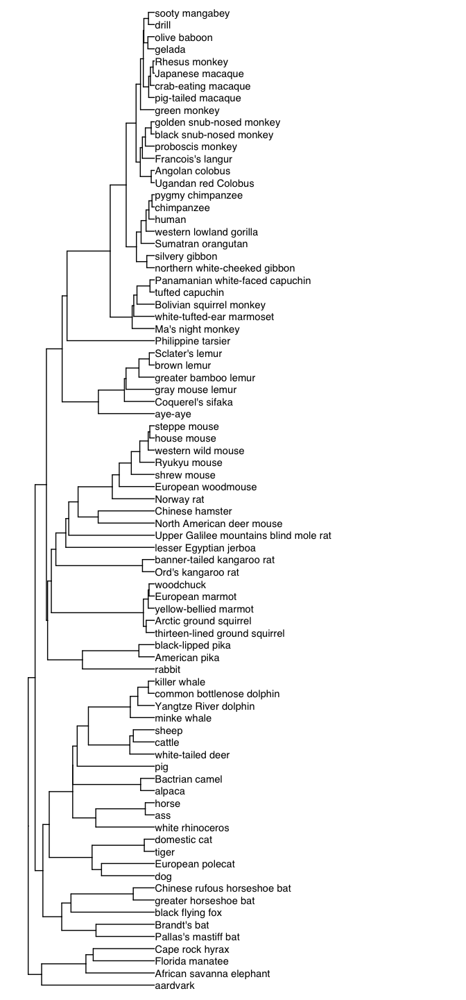

trees_usingDownloadedSpeciesTree
================
Janet Young

2024-02-09

``` r
knitr::opts_chunk$set(echo = TRUE)
library(tidyverse)
library(Biostrings)
library(snakecase)
library(taxize)
library(here)
library(ape)
library(ggtree)
```

I used a mammalian species tree from this paper: Upham, N. S., J. A.
Esselstyn, and W. Jetz. 2019. Inferring the mammal tree: species-level
sets of phylogenies for questions in ecology, evolution, and
conservation. PLOS Biology.
<https://doi.org/10.1371/journal.pbio.3000494>

first I read tree and metadata I downloaded from [this
website](https://data.vertlife.org)

metadata file was from
[here](https://data.vertlife.org/mammaltree/taxonomy_mamPhy_5911species.csv)

see also notes in
`/fh/fast/malik_h/grp/public_databases/trees/Upham_speciesTrees/Upham_speciesTrees_NOTES.txt`

``` r
mammalTreeFiles <- list.files("/Volumes/malik_h/grp/public_databases/trees/Upham_speciesTrees",
                              pattern="nex$", full.names = TRUE)
mammalTrees <- lapply(mammalTreeFiles, ape::read.nexus)
names(mammalTrees) <- gsub("/Volumes/malik_h/grp/public_databases/trees/Upham_speciesTrees/MamPhy_fullPosterior_BDvr_","",mammalTreeFiles)
names(mammalTrees) <- gsub("_MCC_v2_target.nex","",names(mammalTrees))

mammalTreeTaxonomyInfo <- "/Volumes/malik_h/grp/public_databases/trees/Upham_speciesTrees/taxonomy_mamPhy_5911species.csv" %>% 
    read_csv(show_col_types = FALSE)
```

``` r
## get example species names I want a tree for. This is long-winded but it should be a working example:
RTL3_alnFile <- here("Rscripts/phylogenetics/RTL3_aln2022summer_v28.fa")

RTL3_aln <- readDNAStringSet(RTL3_alnFile)
names(RTL3_aln) <- sapply(strsplit(names(RTL3_aln), " "), "[[", 1)

## now make a seqinfo table - seqname, seqlength, these overlaps, num capsid/protease-overlapping stop-free regions
RTL3_alnInfoTable <- tibble(id=names(RTL3_aln))
## get species name from id
RTL3_alnInfoTable <- RTL3_alnInfoTable %>% 
    separate(id, into=c(NA,"species"), extra="drop", remove=FALSE) %>% 
    mutate(species=str_replace(species, "CapsidHMMhit", "")) %>% 
    mutate(species=str_replace(species, "ProteaseORF", "")) %>% 
    mutate(species=str_replace(species, "BetweenORFsRegion", "")) %>% 
    mutate(species=str_to_sentence(to_snake_case(species))) %>% 
    mutate(species=str_replace_all(species,"_"," "))
```

``` r
specNamesToGetTreeFor <- RTL3_alnInfoTable %>% 
    select(species) %>% 
    deframe() %>% 
    unique()
```

look up common names for each species and add to RTL3_alnInfoTable

``` r
# sci2comm is from the taxize package. it's a bit slow, and very noisy.
commonNameLookup <- sci2comm(sci=specNamesToGetTreeFor)
## I checked - there was 1 character item found for each and none are NA
# class(commonNameLookup)
# table( sapply(commonNameLookup, length))
# table( sapply(commonNameLookup, is.na))

## add commonNameLookup to RTL3_alnInfoTable
commonNameLookup_tbl <- commonNameLookup %>% 
    unlist() %>% 
    as_tibble(rownames="species")
commonNameLookup_tbl <- commonNameLookup_tbl %>% 
    dplyr::rename("common_name"="value")
RTL3_alnInfoTable <- left_join(RTL3_alnInfoTable, commonNameLookup_tbl, by="species") %>% 
    relocate(common_name, .after="species")
```

check they’re in the big tree

``` r
table(tolower(specNamesToGetTreeFor) %in% gsub("_"," ",tolower(mammalTreeTaxonomyInfo$Species_Name)))
```

    ## 
    ## FALSE  TRUE 
    ##    10    71

they’re not all there so I do a bit of wrangling. google and NCBI
taxonomy database helped me find the versions of species names that
Upham used

``` r
RTL3_alnInfoTable <- RTL3_alnInfoTable %>% 
    mutate(upham_name = case_when( species=="Equus asinus" ~ "Equus africanus",
                                   species=="Carlito syrichta" ~ "Tarsius syrichta",
                                   species=="Canis lupus familiaris" ~ "Canis lupus",
                                   species=="Trichechus manatus latirostris" ~ "Trichechus manatus",
                                   species=="Pongo pygmaeus abelii" ~ "Pongo abelii",
                                   species=="Gorilla gorilla gorilla" ~ "Gorilla gorilla",
                                   species=="Cebus imitator" ~ "Cebus capucinus",
                                   species=="Cricetulus griseus" ~ "Cricetulus barabensis",
                                   species=="Piliocolobus tephrosceles" ~ "Colobus guereza", ## not the same species, but I just want it appearing as a sister taxon to  ColobusAngolensism which is present
                                   species=="Nannospalax galili" ~ "Myospalax aspalax", ## really not the same, but any spalax will do
                                   .default = species) )
RTL3_alnInfoTable <- RTL3_alnInfoTable %>% 
    mutate(upham_name=str_replace_all(upham_name, " ", "_"))

## add upham info to my table
RTL3_alnInfoTable <- left_join(RTL3_alnInfoTable, mammalTreeTaxonomyInfo, by=c("upham_name"="Species_Name"))
```

``` r
### check now whether all the species I want are in the big tree - they are
specNamesToGetTreeFor_upham <- RTL3_alnInfoTable %>%
    # filter(!is.na(name_in_fig)) %>%
    # select(upham_name) %>%
    select(tiplabel) %>% 
    deframe() %>%
    unique()
# table( tolower(specNamesToGetTreeFor_upham) %in% tolower(mammalTreeTaxonomyInfo$tiplabel ))
```

subset the giant tree to get just the species I care about

``` r
## get tree
upham_tree_subset <-  keep.tip(mammalTrees[["DNAonly_4098sp_topoFree_NDexp"]], specNamesToGetTreeFor_upham)

## replace names with common name
upham_tree_subset_rename <- upham_tree_subset
upham_tree_subset_rename$tip.label <- RTL3_alnInfoTable[match(upham_tree_subset$tip.label, RTL3_alnInfoTable$tiplabel),"common_name"] %>% deframe()

### write tree to a file
write.tree(upham_tree_subset_rename, file=here("upham_tree_subset_rename.phy"))

### plot it
upham_tree_subset_rename %>% 
    ggtree() +
    geom_tiplab() +
    hexpand(2)
```

<!-- -->

``` r
##  upham_tree_subset_rename_manuallyRotated.nex is where I used figTree to rotate that tree to match species order I wanted and reexported
```

show package versions

``` r
sessionInfo()
```

    ## R version 4.2.3 (2023-03-15)
    ## Platform: x86_64-apple-darwin17.0 (64-bit)
    ## Running under: macOS Big Sur ... 10.16
    ## 
    ## Matrix products: default
    ## BLAS:   /Library/Frameworks/R.framework/Versions/4.2/Resources/lib/libRblas.0.dylib
    ## LAPACK: /Library/Frameworks/R.framework/Versions/4.2/Resources/lib/libRlapack.dylib
    ## 
    ## locale:
    ## [1] en_US.UTF-8/en_US.UTF-8/en_US.UTF-8/C/en_US.UTF-8/en_US.UTF-8
    ## 
    ## attached base packages:
    ## [1] stats4    stats     graphics  grDevices utils     datasets  methods  
    ## [8] base     
    ## 
    ## other attached packages:
    ##  [1] ggtree_3.4.4        ape_5.7-1           here_1.0.1         
    ##  [4] taxize_0.9.100      snakecase_0.11.1    Biostrings_2.64.1  
    ##  [7] GenomeInfoDb_1.32.4 XVector_0.36.0      IRanges_2.30.1     
    ## [10] S4Vectors_0.34.0    BiocGenerics_0.42.0 lubridate_1.9.3    
    ## [13] forcats_1.0.0       stringr_1.5.1       dplyr_1.1.4        
    ## [16] purrr_1.0.2         readr_2.1.4         tidyr_1.3.0        
    ## [19] tibble_3.2.1        ggplot2_3.4.4       tidyverse_2.0.0    
    ## 
    ## loaded via a namespace (and not attached):
    ##  [1] nlme_3.1-164           bitops_1.0-7           fs_1.6.3              
    ##  [4] bold_1.3.0             bit64_4.0.5            rprojroot_2.0.4       
    ##  [7] tools_4.2.3            utf8_1.2.4             R6_2.5.1              
    ## [10] lazyeval_0.2.2         colorspace_2.1-0       withr_3.0.0           
    ## [13] tidyselect_1.2.0       bit_4.0.5              curl_5.2.0            
    ## [16] compiler_4.2.3         cli_3.6.2              xml2_1.3.6            
    ## [19] labeling_0.4.3         triebeard_0.4.1        scales_1.3.0          
    ## [22] digest_0.6.33          yulab.utils_0.1.4      rmarkdown_2.25        
    ## [25] pkgconfig_2.0.3        htmltools_0.5.7        highr_0.10            
    ## [28] fastmap_1.1.1          rlang_1.1.2            rstudioapi_0.15.0     
    ## [31] httpcode_0.3.0         farver_2.1.1           gridGraphics_0.5-1    
    ## [34] generics_0.1.3         zoo_1.8-12             jsonlite_1.8.8        
    ## [37] vroom_1.6.5            RCurl_1.98-1.13        magrittr_2.0.3        
    ## [40] ggplotify_0.1.2        GenomeInfoDbData_1.2.8 patchwork_1.2.0       
    ## [43] Rcpp_1.0.11            munsell_0.5.0          fansi_1.0.6           
    ## [46] lifecycle_1.0.4        stringi_1.8.3          yaml_2.3.8            
    ## [49] zlibbioc_1.42.0        grid_4.2.3             parallel_4.2.3        
    ## [52] crayon_1.5.2           lattice_0.22-5         conditionz_0.1.0      
    ## [55] hms_1.1.3              knitr_1.45             pillar_1.9.0          
    ## [58] uuid_1.1-1             codetools_0.2-19       crul_1.4.0            
    ## [61] glue_1.6.2             evaluate_0.23          ggfun_0.1.4           
    ## [64] data.table_1.14.10     urltools_1.7.3         vctrs_0.6.5           
    ## [67] treeio_1.20.2          tzdb_0.4.0             foreach_1.5.2         
    ## [70] gtable_0.3.4           cachem_1.0.8           xfun_0.41             
    ## [73] tidytree_0.4.6         iterators_1.0.14       aplot_0.2.2           
    ## [76] memoise_2.0.1          timechange_0.2.0
