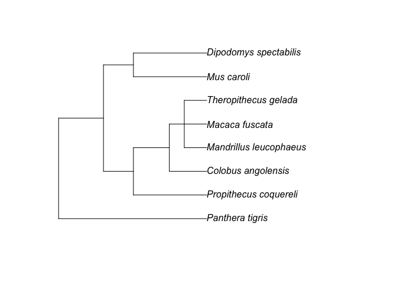
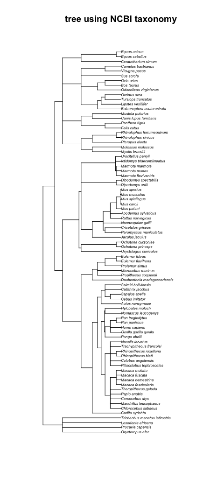

trees_usingPublicTrees
================
Janet Young

2024-05-23

# Goals

I’m trying the [taxize
package](https://docs.ropensci.org/taxize/index.html) to interact with
taxonomic databases.

It can help convert latin species names to common names (and vice
versa?)

It can use taxonomic classifications to infer trees.

I think it might be able to help [resolve ambiguous
names](https://docs.ropensci.org/taxize/articles/name_cleaning.html)

# get example latin names for some species (mammals)

get example species names I want a tree for. This is long-winded but it
should be a working example.

I read in an alignment, and do a bit of processing to get a bunch of
species names (latin). Show the first 5 rows of an info table I’m
building up

``` r
RTL3_alnFile <- here("Rscripts/phylogenetics/RTL3_aln2022summer_v28.fa")

RTL3_aln <- readDNAStringSet(RTL3_alnFile)
names(RTL3_aln) <- sapply(strsplit(names(RTL3_aln), " "), "[[", 1)

## make tibble of seqnames
RTL3_alnInfoTable <- tibble(id=names(RTL3_aln))

## get species name from seqnames
RTL3_alnInfoTable <- RTL3_alnInfoTable %>% 
    separate(id, into=c(NA,"species"), extra="drop", remove=FALSE) %>% 
    mutate(species=str_replace(species, "CapsidHMMhit", "")) %>% 
    mutate(species=str_replace(species, "ProteaseORF", "")) %>% 
    mutate(species=str_replace(species, "BetweenORFsRegion", "")) %>% 
    mutate(species=str_to_sentence(to_snake_case(species))) %>% 
    mutate(species=str_replace_all(species,"_"," "))

## get rid of some redundant species for this purpose - get rid of any seq whose name contains "annotationSeq"
RTL3_alnInfoTable <- RTL3_alnInfoTable %>% 
    filter(!grepl("annotationSeq",id))

RTL3_alnInfoTable %>% 
    head(5) %>% 
    kable() %>% 
    kable_styling()
```

<table class="table" style="margin-left: auto; margin-right: auto;">
<thead>
<tr>
<th style="text-align:left;">
id
</th>
<th style="text-align:left;">
species
</th>
</tr>
</thead>
<tbody>
<tr>
<td style="text-align:left;">
RTL3_HomoSapiens_mergedORFs_fromGenomic.humT2T
</td>
<td style="text-align:left;">
Homo sapiens
</td>
</tr>
<tr>
<td style="text-align:left;">
RTL3_PanPaniscus_mergedORFs_fromGenomic.panPan3
</td>
<td style="text-align:left;">
Pan paniscus
</td>
</tr>
<tr>
<td style="text-align:left;">
RTL3_PanTroglodytes_mergedORFs_fromGenomic.panTro6
</td>
<td style="text-align:left;">
Pan troglodytes
</td>
</tr>
<tr>
<td style="text-align:left;">
RTL3_GorillaGorillaGorilla_mergedORFs_fromGenomic.gorGor6
</td>
<td style="text-align:left;">
Gorilla gorilla gorilla
</td>
</tr>
<tr>
<td style="text-align:left;">
RTL3_PongoPygmaeusAbelii_mergedORFs_fromGenomic.ponAbe3
</td>
<td style="text-align:left;">
Pongo pygmaeus abelii
</td>
</tr>
</tbody>
</table>

get just the species names

``` r
## first get all 81 species names in the table
query_species <- RTL3_alnInfoTable %>% 
    select(species) %>% 
    deframe() %>% 
    unique()

## make a smaller set of species, for quicker testing:
test_query_species <- sample(query_species, 8)

## make a version of that which contains "bad" species names that won't be found in the database
test_query_species_plusBadOnes <- c(test_query_species, 
                                    "fake species name", 
                                    "fake species name2")
```

There were 81 unique species names.

# Look up common names

Now I use the `sci2comm()` function from the `taxize` package to get
common names given latin names as input. It’s a bit slow, and very
noisy.

Use that list to add the common names to the tibble I’m building up

``` r
## add commonNameLookup to RTL3_alnInfoTable
commonNameLookup_tbl <- commonNameLookup %>% 
    unlist() %>% 
    as_tibble(rownames="species") %>% 
    dplyr::rename("common_name"="value")
RTL3_alnInfoTable <- left_join(RTL3_alnInfoTable, commonNameLookup_tbl, by="species") %>% 
    relocate(common_name, .after="species")
RTL3_alnInfoTable %>% 
    head(5) %>% 
    kable() %>% 
    kable_styling()
```

<table class="table" style="margin-left: auto; margin-right: auto;">
<thead>
<tr>
<th style="text-align:left;">
id
</th>
<th style="text-align:left;">
species
</th>
<th style="text-align:left;">
common_name
</th>
</tr>
</thead>
<tbody>
<tr>
<td style="text-align:left;">
RTL3_HomoSapiens_mergedORFs_fromGenomic.humT2T
</td>
<td style="text-align:left;">
Homo sapiens
</td>
<td style="text-align:left;">
human
</td>
</tr>
<tr>
<td style="text-align:left;">
RTL3_PanPaniscus_mergedORFs_fromGenomic.panPan3
</td>
<td style="text-align:left;">
Pan paniscus
</td>
<td style="text-align:left;">
pygmy chimpanzee
</td>
</tr>
<tr>
<td style="text-align:left;">
RTL3_PanTroglodytes_mergedORFs_fromGenomic.panTro6
</td>
<td style="text-align:left;">
Pan troglodytes
</td>
<td style="text-align:left;">
chimpanzee
</td>
</tr>
<tr>
<td style="text-align:left;">
RTL3_GorillaGorillaGorilla_mergedORFs_fromGenomic.gorGor6
</td>
<td style="text-align:left;">
Gorilla gorilla gorilla
</td>
<td style="text-align:left;">
western lowland gorilla
</td>
</tr>
<tr>
<td style="text-align:left;">
RTL3_PongoPygmaeusAbelii_mergedORFs_fromGenomic.ponAbe3
</td>
<td style="text-align:left;">
Pongo pygmaeus abelii
</td>
<td style="text-align:left;">
Sumatran orangutan
</td>
</tr>
</tbody>
</table>

# try taxize classification() function

Look at the `classification()` function of taxize package, using the
NCBI taxonomy database:

It returns a list-like object of class “classification”. The names are
the same as the query species names we provided. Each element is a
data.frame, containing 3 columns (name, rank, taxID) and a bunch of rows
(each level of the taxonomic classification). Exception - if the species
name was not found, it’s `NA` (single element).

``` r
test_query_species_classification <- classification(test_query_species_plusBadOnes,
                                                    db="ncbi")
```

    ## ══  10 queries  ══════════════

    ## 
    ## Retrieving data for taxon 'Propithecus coquereli'

    ## ✔  Found:  Propithecus+coquereli

    ## 
    ## Retrieving data for taxon 'Panthera tigris'

    ## ✔  Found:  Panthera+tigris

    ## 
    ## Retrieving data for taxon 'Mus caroli'

    ## ✔  Found:  Mus+caroli

    ## 
    ## Retrieving data for taxon 'Dipodomys spectabilis'

    ## ✔  Found:  Dipodomys+spectabilis

    ## 
    ## Retrieving data for taxon 'Colobus angolensis'

    ## ✔  Found:  Colobus+angolensis

    ## 
    ## Retrieving data for taxon 'Macaca fuscata'

    ## ✔  Found:  Macaca+fuscata

    ## 
    ## Retrieving data for taxon 'Theropithecus gelada'

    ## ✔  Found:  Theropithecus+gelada

    ## 
    ## Retrieving data for taxon 'Mandrillus leucophaeus'

    ## ✔  Found:  Mandrillus+leucophaeus

    ## 
    ## Retrieving data for taxon 'fake species name'

    ## Not found. Consider checking the spelling or alternate classification

    ## 
    ## Retrieving data for taxon 'fake species name2'

    ## Not found. Consider checking the spelling or alternate classification

    ## ══  Results  ═════════════════
    ## 
    ## • Total: 10 
    ## • Found: 8 
    ## • Not Found: 0

``` r
# numSpeciesNotFound <- sum(sapply(test_query_species_classification, function(x) {!class(x)=="data.frame"}))
```

# try taxize class2tree to get a tree

Using the results of `classification()`, we can ask get a tree using the
`class2tree()` function

``` r
test_query_species_classification_tree <- class2tree(test_query_species_classification)
```

    ## Removed species without classification

    ## Get all ranks and their taxIDs

    ## Align taxonomy hierarchies...

    ## Taxonomy alignment done!

    ## Calculate distance matrix

    ## Add node labels

``` r
plot(test_query_species_classification_tree)
```

<!-- -->

``` r
# ## ggtree didn't like this tree. Maybe because it includes a polytomy? Maybe because there's some weird conflicts between packages and functions?
# test_query_species_classification_tree %>%
#     ggtree() +
#     geom_tiplabel()
```

Get the full tree (all species), using NCBI classifications.

``` r
## get full tree - NCBI classifications
specNames_classification_ncbi <- classification(query_species, db="ncbi")
```

    ## ══  81 queries  ══════════════

    ## 
    ## Retrieving data for taxon 'Homo sapiens'

    ## ✔  Found:  Homo+sapiens

    ## 
    ## Retrieving data for taxon 'Pan paniscus'

    ## ✔  Found:  Pan+paniscus

    ## 
    ## Retrieving data for taxon 'Pan troglodytes'

    ## ✔  Found:  Pan+troglodytes

    ## 
    ## Retrieving data for taxon 'Gorilla gorilla gorilla'

    ## ✔  Found:  Gorilla+gorilla+gorilla

    ## 
    ## Retrieving data for taxon 'Pongo pygmaeus abelii'

    ## ✔  Found:  Pongo+pygmaeus+abelii

    ## 
    ## Retrieving data for taxon 'Nomascus leucogenys'

    ## ✔  Found:  Nomascus+leucogenys

    ## 
    ## Retrieving data for taxon 'Hylobates moloch'

    ## ✔  Found:  Hylobates+moloch

    ## 
    ## Retrieving data for taxon 'Macaca fuscata'

    ## ✔  Found:  Macaca+fuscata

    ## 
    ## Retrieving data for taxon 'Macaca mulatta'

    ## ✔  Found:  Macaca+mulatta

    ## 
    ## Retrieving data for taxon 'Macaca nemestrina'

    ## ✔  Found:  Macaca+nemestrina

    ## 
    ## Retrieving data for taxon 'Macaca fascicularis'

    ## ✔  Found:  Macaca+fascicularis

    ## 
    ## Retrieving data for taxon 'Theropithecus gelada'

    ## ✔  Found:  Theropithecus+gelada

    ## 
    ## Retrieving data for taxon 'Papio anubis'

    ## ✔  Found:  Papio+anubis

    ## 
    ## Retrieving data for taxon 'Cercocebus atys'

    ## ✔  Found:  Cercocebus+atys

    ## 
    ## Retrieving data for taxon 'Mandrillus leucophaeus'

    ## ✔  Found:  Mandrillus+leucophaeus

    ## 
    ## Retrieving data for taxon 'Chlorocebus sabaeus'

    ## ✔  Found:  Chlorocebus+sabaeus

    ## 
    ## Retrieving data for taxon 'Trachypithecus francoisi'

    ## ✔  Found:  Trachypithecus+francoisi

    ## 
    ## Retrieving data for taxon 'Nasalis larvatus'

    ## ✔  Found:  Nasalis+larvatus

    ## 
    ## Retrieving data for taxon 'Rhinopithecus bieti'

    ## ✔  Found:  Rhinopithecus+bieti

    ## 
    ## Retrieving data for taxon 'Rhinopithecus roxellana'

    ## ✔  Found:  Rhinopithecus+roxellana

    ## 
    ## Retrieving data for taxon 'Colobus angolensis'

    ## ✔  Found:  Colobus+angolensis

    ## 
    ## Retrieving data for taxon 'Piliocolobus tephrosceles'

    ## ✔  Found:  Piliocolobus+tephrosceles

    ## 
    ## Retrieving data for taxon 'Callithrix jacchus'

    ## ✔  Found:  Callithrix+jacchus

    ## 
    ## Retrieving data for taxon 'Aotus nancymaae'

    ## ✔  Found:  Aotus+nancymaae

    ## 
    ## Retrieving data for taxon 'Saimiri boliviensis'

    ## ✔  Found:  Saimiri+boliviensis

    ## 
    ## Retrieving data for taxon 'Cebus imitator'

    ## ✔  Found:  Cebus+imitator

    ## 
    ## Retrieving data for taxon 'Sapajus apella'

    ## ✔  Found:  Sapajus+apella

    ## 
    ## Retrieving data for taxon 'Carlito syrichta'

    ## ✔  Found:  Carlito+syrichta

    ## 
    ## Retrieving data for taxon 'Microcebus murinus'

    ## ✔  Found:  Microcebus+murinus

    ## 
    ## Retrieving data for taxon 'Prolemur simus'

    ## ✔  Found:  Prolemur+simus

    ## 
    ## Retrieving data for taxon 'Propithecus coquereli'

    ## ✔  Found:  Propithecus+coquereli

    ## 
    ## Retrieving data for taxon 'Eulemur flavifrons'

    ## ✔  Found:  Eulemur+flavifrons

    ## 
    ## Retrieving data for taxon 'Eulemur fulvus'

    ## ✔  Found:  Eulemur+fulvus

    ## 
    ## Retrieving data for taxon 'Daubentonia madagascariensis'

    ## ✔  Found:  Daubentonia+madagascariensis

    ## 
    ## Retrieving data for taxon 'Oryctolagus cuniculus'

    ## ✔  Found:  Oryctolagus+cuniculus

    ## 
    ## Retrieving data for taxon 'Ochotona princeps'

    ## ✔  Found:  Ochotona+princeps

    ## 
    ## Retrieving data for taxon 'Ochotona curzoniae'

    ## ✔  Found:  Ochotona+curzoniae

    ## 
    ## Retrieving data for taxon 'Ictidomys tridecemlineatus'

    ## ✔  Found:  Ictidomys+tridecemlineatus

    ## 
    ## Retrieving data for taxon 'Urocitellus parryii'

    ## ✔  Found:  Urocitellus+parryii

    ## 
    ## Retrieving data for taxon 'Marmota monax'

    ## ✔  Found:  Marmota+monax

    ## 
    ## Retrieving data for taxon 'Marmota marmota'

    ## ✔  Found:  Marmota+marmota

    ## 
    ## Retrieving data for taxon 'Marmota flaviventris'

    ## ✔  Found:  Marmota+flaviventris

    ## 
    ## Retrieving data for taxon 'Dipodomys ordii'

    ## ✔  Found:  Dipodomys+ordii

    ## 
    ## Retrieving data for taxon 'Dipodomys spectabilis'

    ## ✔  Found:  Dipodomys+spectabilis

    ## 
    ## Retrieving data for taxon 'Jaculus jaculus'

    ## ✔  Found:  Jaculus+jaculus

    ## 
    ## Retrieving data for taxon 'Nannospalax galili'

    ## ✔  Found:  Nannospalax+galili

    ## 
    ## Retrieving data for taxon 'Mus musculus'

    ## ✔  Found:  Mus+musculus

    ## 
    ## Retrieving data for taxon 'Mus spretus'

    ## ✔  Found:  Mus+spretus

    ## 
    ## Retrieving data for taxon 'Mus spicilegus'

    ## ✔  Found:  Mus+spicilegus

    ## 
    ## Retrieving data for taxon 'Mus caroli'

    ## ✔  Found:  Mus+caroli

    ## 
    ## Retrieving data for taxon 'Mus pahari'

    ## ✔  Found:  Mus+pahari

    ## 
    ## Retrieving data for taxon 'Apodemus sylvaticus'

    ## ✔  Found:  Apodemus+sylvaticus

    ## 
    ## Retrieving data for taxon 'Rattus norvegicus'

    ## ✔  Found:  Rattus+norvegicus

    ## 
    ## Retrieving data for taxon 'Peromyscus maniculatus'

    ## ✔  Found:  Peromyscus+maniculatus

    ## 
    ## Retrieving data for taxon 'Cricetulus griseus'

    ## ✔  Found:  Cricetulus+griseus

    ## 
    ## Retrieving data for taxon 'Vicugna pacos'

    ## ✔  Found:  Vicugna+pacos

    ## 
    ## Retrieving data for taxon 'Camelus bactrianus'

    ## ✔  Found:  Camelus+bactrianus

    ## 
    ## Retrieving data for taxon 'Sus scrofa'

    ## ✔  Found:  Sus+scrofa

    ## 
    ## Retrieving data for taxon 'Bos taurus'

    ## ✔  Found:  Bos+taurus

    ## 
    ## Retrieving data for taxon 'Ovis aries'

    ## ✔  Found:  Ovis+aries

    ## 
    ## Retrieving data for taxon 'Odocoileus virginianus'

    ## ✔  Found:  Odocoileus+virginianus

    ## 
    ## Retrieving data for taxon 'Tursiops truncatus'

    ## ✔  Found:  Tursiops+truncatus

    ## 
    ## Retrieving data for taxon 'Orcinus orca'

    ## ✔  Found:  Orcinus+orca

    ## 
    ## Retrieving data for taxon 'Lipotes vexillifer'

    ## ✔  Found:  Lipotes+vexillifer

    ## 
    ## Retrieving data for taxon 'Balaenoptera acutorostrata'

    ## ✔  Found:  Balaenoptera+acutorostrata

    ## 
    ## Retrieving data for taxon 'Equus caballus'

    ## ✔  Found:  Equus+caballus

    ## 
    ## Retrieving data for taxon 'Equus asinus'

    ## ✔  Found:  Equus+asinus

    ## 
    ## Retrieving data for taxon 'Ceratotherium simum'

    ## ✔  Found:  Ceratotherium+simum

    ## 
    ## Retrieving data for taxon 'Felis catus'

    ## ✔  Found:  Felis+catus

    ## 
    ## Retrieving data for taxon 'Panthera tigris'

    ## ✔  Found:  Panthera+tigris

    ## 
    ## Retrieving data for taxon 'Canis lupus familiaris'

    ## ✔  Found:  Canis+lupus+familiaris

    ## 
    ## Retrieving data for taxon 'Mustela putorius'

    ## ✔  Found:  Mustela+putorius

    ## 
    ## Retrieving data for taxon 'Myotis brandtii'

    ## ✔  Found:  Myotis+brandtii

    ## 
    ## Retrieving data for taxon 'Molossus molossus'

    ## ✔  Found:  Molossus+molossus

    ## 
    ## Retrieving data for taxon 'Pteropus alecto'

    ## ✔  Found:  Pteropus+alecto

    ## 
    ## Retrieving data for taxon 'Rhinolophus sinicus'

    ## ✔  Found:  Rhinolophus+sinicus

    ## 
    ## Retrieving data for taxon 'Rhinolophus ferrumequinum'

    ## ✔  Found:  Rhinolophus+ferrumequinum

    ## 
    ## Retrieving data for taxon 'Loxodonta africana'

    ## ✔  Found:  Loxodonta+africana

    ## 
    ## Retrieving data for taxon 'Trichechus manatus latirostris'

    ## ✔  Found:  Trichechus+manatus+latirostris

    ## 
    ## Retrieving data for taxon 'Procavia capensis'

    ## ✔  Found:  Procavia+capensis

    ## 
    ## Retrieving data for taxon 'Orycteropus afer'

    ## ✔  Found:  Orycteropus+afer
    ## ══  Results  ═════════════════
    ## 
    ## • Total: 81 
    ## • Found: 81 
    ## • Not Found: 0

``` r
# check how many species not found:
# numSpeciesNotFound <- sum(sapply(specNames_classification, function(x) {!class(x)=="data.frame"}))
# which(sapply(specNames_classification, function(x) {!class(x)=="data.frame"}))
## using ncbi database, all are found. Tree is not always well-resolved
specNames_tree_ncbi <- class2tree(specNames_classification_ncbi)
```

    ## Get all ranks and their taxIDs

    ## Align taxonomy hierarchies...

    ## Taxonomy alignment done!

    ## Calculate distance matrix

    ## Add node labels

``` r
plot(specNames_tree_ncbi, cex=0.5, main="tree using NCBI taxonomy")
```

<!-- -->

Try using encyclopedia of life classifications instead of NCBI. I can
get classifications OK (ish) but the class2tree function hangs.

``` r
# temp2 <- get_eolid("Pinus contorta", ask=FALSE, rows=1) 
# temp1 <- get_eolid("Pinus contorta") 
# get_eolid(query_species[1:2], ask=FALSE, rows=1) 

# specNames_classification_eol <- classification(query_species[1:2], db="eol", rows=1)
specNames_classification_eol <- classification(query_species, db="eol", rows=1)
```

    ## ══  81 queries  ══════════════

    ## 
    ## Retrieving data for taxon 'Homo sapiens'

    ## ✔  Found:  Homo sapiens

    ## 
    ## Retrieving data for taxon 'Pan paniscus'

    ## ✔  Found:  Pan paniscus

    ## 
    ## Retrieving data for taxon 'Pan troglodytes'

    ## ✔  Found:  Pan troglodytes

    ## 
    ## Retrieving data for taxon 'Gorilla gorilla gorilla'

    ## ✔  Found:  Gorilla gorilla gorilla

    ## 
    ## Retrieving data for taxon 'Pongo pygmaeus abelii'

    ## ✔  Found:  Pongo pygmaeus abelii

    ## 
    ## Retrieving data for taxon 'Nomascus leucogenys'

    ## ✔  Found:  Nomascus leucogenys

    ## 
    ## Retrieving data for taxon 'Hylobates moloch'

    ## ✔  Found:  Hylobates moloch

    ## 
    ## Retrieving data for taxon 'Macaca fuscata'

    ## ✔  Found:  Macaca fuscata

    ## 
    ## Retrieving data for taxon 'Macaca mulatta'

    ## ✔  Found:  Macaca mulatta

    ## 
    ## Retrieving data for taxon 'Macaca nemestrina'

    ## ✔  Found:  Macaca nemestrina

    ## 
    ## Retrieving data for taxon 'Macaca fascicularis'

    ## ✔  Found:  Macaca fascicularis

    ## 
    ## Retrieving data for taxon 'Theropithecus gelada'

    ## ✔  Found:  Theropithecus gelada

    ## 
    ## Retrieving data for taxon 'Papio anubis'

    ## ✔  Found:  Papio anubis

    ## 
    ## Retrieving data for taxon 'Cercocebus atys'

    ## ✔  Found:  Cercocebus atys

    ## 
    ## Retrieving data for taxon 'Mandrillus leucophaeus'

    ## ✔  Found:  Mandrillus leucophaeus

    ## 
    ## Retrieving data for taxon 'Chlorocebus sabaeus'

    ## ✔  Found:  Chlorocebus sabaeus

    ## 
    ## Retrieving data for taxon 'Trachypithecus francoisi'

    ## ✔  Found:  Trachypithecus francoisi

    ## 
    ## Retrieving data for taxon 'Nasalis larvatus'

    ## ✔  Found:  Nasalis larvatus

    ## 
    ## Retrieving data for taxon 'Rhinopithecus bieti'

    ## ✔  Found:  Rhinopithecus bieti

    ## 
    ## Retrieving data for taxon 'Rhinopithecus roxellana'

    ## ✔  Found:  Rhinopithecus roxellana

    ## 
    ## Retrieving data for taxon 'Colobus angolensis'

    ## ✔  Found:  Colobus angolensis

    ## 
    ## Retrieving data for taxon 'Piliocolobus tephrosceles'

    ## ✔  Found:  Piliocolobus tephrosceles

    ## 
    ## Retrieving data for taxon 'Callithrix jacchus'

    ## ✔  Found:  Callithrix jacchus

    ## 
    ## Retrieving data for taxon 'Aotus nancymaae'

    ## ✔  Found:  Aotus nancymaae

    ## 
    ## Retrieving data for taxon 'Saimiri boliviensis'

    ## ✔  Found:  Saimiri boliviensis

    ## 
    ## Retrieving data for taxon 'Cebus imitator'

    ## ✔  Found:  Cebus imitator

    ## 
    ## Retrieving data for taxon 'Sapajus apella'

    ## ✔  Found:  Sapajus apella

    ## 
    ## Retrieving data for taxon 'Carlito syrichta'

    ## ✔  Found:  Carlito syrichta

    ## 
    ## Retrieving data for taxon 'Microcebus murinus'

    ## ✔  Found:  Microcebus murinus

    ## 
    ## Retrieving data for taxon 'Prolemur simus'

    ## ✔  Found:  Prolemur simus

    ## 
    ## Retrieving data for taxon 'Propithecus coquereli'

    ## ✔  Found:  Propithecus coquereli

    ## 
    ## Retrieving data for taxon 'Eulemur flavifrons'

    ## ✔  Found:  Eulemur flavifrons

    ## 
    ## Retrieving data for taxon 'Eulemur fulvus'

    ## ✔  Found:  Eulemur fulvus

    ## 
    ## Retrieving data for taxon 'Daubentonia madagascariensis'

    ## ✔  Found:  Daubentonia madagascariensis

    ## 
    ## Retrieving data for taxon 'Oryctolagus cuniculus'

    ## ✔  Found:  Oryctolagus cuniculus

    ## 
    ## Retrieving data for taxon 'Ochotona princeps'

    ## ✔  Found:  Ochotona princeps

    ## 
    ## Retrieving data for taxon 'Ochotona curzoniae'

    ## ✔  Found:  Ochotona curzoniae

    ## 
    ## Retrieving data for taxon 'Ictidomys tridecemlineatus'

    ## ✔  Found:  Ictidomys tridecemlineatus

    ## 
    ## Retrieving data for taxon 'Urocitellus parryii'

    ## ✔  Found:  Urocitellus parryii

    ## 
    ## Retrieving data for taxon 'Marmota monax'

    ## ✔  Found:  Marmota monax

    ## 
    ## Retrieving data for taxon 'Marmota marmota'

    ## ✔  Found:  Marmota marmota

    ## 
    ## Retrieving data for taxon 'Marmota flaviventris'

    ## ✔  Found:  Marmota flaviventris

    ## 
    ## Retrieving data for taxon 'Dipodomys ordii'

    ## ✔  Found:  Dipodomys ordii

    ## 
    ## Retrieving data for taxon 'Dipodomys spectabilis'

    ## ✔  Found:  Dipodomys spectabilis

    ## 
    ## Retrieving data for taxon 'Jaculus jaculus'

    ## ✔  Found:  Jaculus jaculus

    ## 
    ## Retrieving data for taxon 'Nannospalax galili'

    ## ✔  Found:  Nannospalax galili

    ## 
    ## Retrieving data for taxon 'Mus musculus'

    ## ✔  Found:  Mus musculus

    ## 
    ## Retrieving data for taxon 'Mus spretus'

    ## ✔  Found:  Mus spretus

    ## 
    ## Retrieving data for taxon 'Mus spicilegus'

    ## ✔  Found:  Mus spicilegus

    ## 
    ## Retrieving data for taxon 'Mus caroli'

    ## ✔  Found:  Mus caroli

    ## 
    ## Retrieving data for taxon 'Mus pahari'

    ## ✔  Found:  Mus pahari

    ## 
    ## Retrieving data for taxon 'Apodemus sylvaticus'

    ## ✔  Found:  Apodemus sylvaticus

    ## 
    ## Retrieving data for taxon 'Rattus norvegicus'

    ## ✔  Found:  Rattus norvegicus

    ## 
    ## Retrieving data for taxon 'Peromyscus maniculatus'

    ## ✔  Found:  Peromyscus maniculatus

    ## 
    ## Retrieving data for taxon 'Cricetulus griseus'

    ## ✔  Found:  Cricetulus griseus

    ## 
    ## Retrieving data for taxon 'Vicugna pacos'

    ## ✔  Found:  Vicugna pacos

    ## 
    ## Retrieving data for taxon 'Camelus bactrianus'

    ## ✔  Found:  Camelus bactrianus

    ## 
    ## Retrieving data for taxon 'Sus scrofa'

    ## ✔  Found:  Sus scrofa

    ## 
    ## Retrieving data for taxon 'Bos taurus'

    ## ✔  Found:  Bos taurus

    ## 
    ## Retrieving data for taxon 'Ovis aries'

    ## ✔  Found:  Ovis aries

    ## 
    ## Retrieving data for taxon 'Odocoileus virginianus'

    ## ✔  Found:  Odocoileus virginianus

    ## 
    ## Retrieving data for taxon 'Tursiops truncatus'

    ## ✔  Found:  Tursiops truncatus

    ## 
    ## Retrieving data for taxon 'Orcinus orca'

    ## ✔  Found:  Orcinus orca

    ## 
    ## Retrieving data for taxon 'Lipotes vexillifer'

    ## ✔  Found:  Lipotes vexillifer

    ## 
    ## Retrieving data for taxon 'Balaenoptera acutorostrata'

    ## ✔  Found:  Balaenoptera acutorostrata

    ## 
    ## Retrieving data for taxon 'Equus caballus'

    ## ✔  Found:  Equus caballus

    ## 
    ## Retrieving data for taxon 'Equus asinus'

    ## ✔  Found:  Equus asinus

    ## 
    ## Retrieving data for taxon 'Ceratotherium simum'

    ## ✔  Found:  Ceratotherium simum

    ## 
    ## Retrieving data for taxon 'Felis catus'

    ## ✔  Found:  Felis catus

    ## 
    ## Retrieving data for taxon 'Panthera tigris'

    ## ✔  Found:  Panthera tigris

    ## 
    ## Retrieving data for taxon 'Canis lupus familiaris'

    ## ✔  Found:  Canis lupus familiaris

    ## 
    ## Retrieving data for taxon 'Mustela putorius'

    ## ✔  Found:  Mustela putorius

    ## 
    ## Retrieving data for taxon 'Myotis brandtii'

    ## ✔  Found:  Myotis brandtii

    ## 
    ## Retrieving data for taxon 'Molossus molossus'

    ## ✔  Found:  Molossus molossus

    ## 
    ## Retrieving data for taxon 'Pteropus alecto'

    ## ✔  Found:  Pteropus alecto

    ## 
    ## Retrieving data for taxon 'Rhinolophus sinicus'

    ## ✔  Found:  Rhinolophus sinicus

    ## 
    ## Retrieving data for taxon 'Rhinolophus ferrumequinum'

    ## ✔  Found:  Rhinolophus ferrumequinum

    ## 
    ## Retrieving data for taxon 'Loxodonta africana'

    ## ✔  Found:  Loxodonta africana

    ## 
    ## Retrieving data for taxon 'Trichechus manatus latirostris'

    ## ✔  Found:  Trichechus manatus latirostris

    ## 
    ## Retrieving data for taxon 'Procavia capensis'

    ## ✔  Found:  Procavia capensis

    ## 
    ## Retrieving data for taxon 'Orycteropus afer'

    ## ✔  Found:  Orycteropus afer
    ## ══  Results  ═════════════════
    ## 
    ## • Total: 81 
    ## • Found: 81 
    ## • Not Found: 0

``` r
## I was previous sometimes having trouble with this, getting error:
# Error: Bad Gateway (HTTP 502)
# and no result

## 65 are data.frame and 16 are character. The character ones all look like this "No hierarchy information for 22212420" (with different IDs)

# sapply(specNames_classification_eol, class) %>% table()
# specNames_classification_eol[which(sapply(specNames_classification_eol, class) =="character")]

## get just the 65 data.frame items:
specNames_classification_eol_good <- specNames_classification_eol[ which(sapply(specNames_classification_eol, class)=="data.frame") ]

## still get an error with class2tree because there are some NA. Try getting rid of those:
specNames_classification_eol_good <- lapply(specNames_classification_eol_good, function(x) {
    x %>% 
        filter(!is.na(rank))
})
## some had nothing left after getting rid of the NA.  49 remain after I get rid of those:
specNames_classification_eol_good <- specNames_classification_eol_good[which(sapply(specNames_classification_eol_good, nrow)>0)]

## the class2tree function gets stuck (hangs) at the "Align taxonomy hierarchies..." step on those 49, perhaps because some species don't have enough info (e.g. human, which has only two rows)
# specNames_tree_eol <- class2tree(specNames_classification_eol_good)
# specNames_classification_eol_good[["Homo sapiens"]]
#           name    rank       id
# 1         Homo   genus 13332486
# 2 Homo sapiens species 13332485

## I'll try getting rid of any species that don't have "class". now we have 35 things
specNames_classification_eol_good <- specNames_classification_eol_good[  which(sapply(specNames_classification_eol_good, function(x) { "class" %in% x$rank } )) ]
    
## can get a tree from those 35? no - it still hangs at the "Align taxonomy hierarchies..." step.  I'm not going to try to figure out why.
# specNames_tree_eol <- class2tree(specNames_classification_eol_good)
# plot(specNames_tree_eol, cex=0.5, main="tree using encyclopedia of life taxonomy")
```

Try using Integrated Taxonomic Information Service (itis)
classifications

``` r
## turns out this is slightly tricky - doesn't behave the same way on all queries. the accepted=TRUE parameter seems important (I first thought I needed rows=3 or something, but I think the accepted parameter takes care of that)

# it initially stalls on "Chinchilla lanigera", and I fixed that by changing rows to rows=3.  Turns out there are 2 tsn (like taxID?) for Chinchilla, first one invalid. Using rows>=2 allows the second (valid) ID to be used. 

specNames_classification_itis <- classification(query_species, db="itis", accepted=TRUE)
```

    ## ══  81 queries  ══════════════

    ## 
    ## Retrieving data for taxon 'Homo sapiens'

    ## ✔  Found:  Homo sapiens

    ## 
    ## Retrieving data for taxon 'Pan paniscus'

    ## ✔  Found:  Pan paniscus

    ## 
    ## Retrieving data for taxon 'Pan troglodytes'

    ## ✔  Found:  Pan troglodytes

    ## 
    ## Retrieving data for taxon 'Gorilla gorilla gorilla'

    ## ✔  Found:  Gorilla gorilla gorilla

    ## 
    ## Retrieving data for taxon 'Pongo pygmaeus abelii'

    ## ✖  Not Found:  Pongo pygmaeus abelii

    ## 
    ## Retrieving data for taxon 'Nomascus leucogenys'

    ## ✔  Found:  Nomascus leucogenys

    ## 
    ## Retrieving data for taxon 'Hylobates moloch'

    ## ✔  Found:  Hylobates moloch

    ## 
    ## Retrieving data for taxon 'Macaca fuscata'

    ## ✔  Found:  Macaca fuscata

    ## 
    ## Retrieving data for taxon 'Macaca mulatta'

    ## ✔  Found:  Macaca mulatta

    ## 
    ## Retrieving data for taxon 'Macaca nemestrina'

    ## ✔  Found:  Macaca nemestrina

    ## 
    ## Retrieving data for taxon 'Macaca fascicularis'

    ## ✔  Found:  Macaca fascicularis

    ## 
    ## Retrieving data for taxon 'Theropithecus gelada'

    ## ✔  Found:  Theropithecus gelada

    ## 
    ## Retrieving data for taxon 'Papio anubis'

    ## ✔  Found:  Papio anubis

    ## 
    ## Retrieving data for taxon 'Cercocebus atys'

    ## ✔  Found:  Cercocebus atys

    ## 
    ## Retrieving data for taxon 'Mandrillus leucophaeus'

    ## ✔  Found:  Mandrillus leucophaeus

    ## 
    ## Retrieving data for taxon 'Chlorocebus sabaeus'

    ## ✔  Found:  Chlorocebus sabaeus

    ## 
    ## Retrieving data for taxon 'Trachypithecus francoisi'

    ## ✔  Found:  Trachypithecus francoisi

    ## 
    ## Retrieving data for taxon 'Nasalis larvatus'

    ## ✔  Found:  Nasalis larvatus

    ## 
    ## Retrieving data for taxon 'Rhinopithecus bieti'

    ## ✔  Found:  Rhinopithecus bieti

    ## 
    ## Retrieving data for taxon 'Rhinopithecus roxellana'

    ## ✔  Found:  Rhinopithecus roxellana

    ## 
    ## Retrieving data for taxon 'Colobus angolensis'

    ## ✔  Found:  Colobus angolensis

    ## 
    ## Retrieving data for taxon 'Piliocolobus tephrosceles'

    ## ✔  Found:  Piliocolobus tephrosceles

    ## 
    ## Retrieving data for taxon 'Callithrix jacchus'

    ## ✔  Found:  Callithrix jacchus

    ## 
    ## Retrieving data for taxon 'Aotus nancymaae'

    ## Not found. Consider checking the spelling or alternate classification

    ## ✖  Not Found:  Aotus nancymaae

    ## 
    ## Retrieving data for taxon 'Saimiri boliviensis'

    ## ✔  Found:  Saimiri boliviensis

    ## 
    ## Retrieving data for taxon 'Cebus imitator'

    ## ✔  Found:  Cebus imitator

    ## 
    ## Retrieving data for taxon 'Sapajus apella'

    ## ✔  Found:  Sapajus apella

    ## 
    ## Retrieving data for taxon 'Carlito syrichta'

    ## ✔  Found:  Carlito syrichta

    ## 
    ## Retrieving data for taxon 'Microcebus murinus'

    ## ✔  Found:  Microcebus murinus

    ## 
    ## Retrieving data for taxon 'Prolemur simus'

    ## ✔  Found:  Prolemur simus

    ## 
    ## Retrieving data for taxon 'Propithecus coquereli'

    ## ✔  Found:  Propithecus coquereli

    ## 
    ## Retrieving data for taxon 'Eulemur flavifrons'

    ## ✔  Found:  Eulemur flavifrons

    ## 
    ## Retrieving data for taxon 'Eulemur fulvus'

    ## ✔  Found:  Eulemur fulvus

    ## 
    ## Retrieving data for taxon 'Daubentonia madagascariensis'

    ## ✔  Found:  Daubentonia madagascariensis

    ## 
    ## Retrieving data for taxon 'Oryctolagus cuniculus'

    ## ✔  Found:  Oryctolagus cuniculus

    ## 
    ## Retrieving data for taxon 'Ochotona princeps'

    ## ✔  Found:  Ochotona princeps

    ## 
    ## Retrieving data for taxon 'Ochotona curzoniae'

    ## ✔  Found:  Ochotona curzoniae

    ## 
    ## Retrieving data for taxon 'Ictidomys tridecemlineatus'

    ## ✔  Found:  Ictidomys tridecemlineatus

    ## 
    ## Retrieving data for taxon 'Urocitellus parryii'

    ## ✔  Found:  Urocitellus parryii

    ## 
    ## Retrieving data for taxon 'Marmota monax'

    ## ✔  Found:  Marmota monax

    ## 
    ## Retrieving data for taxon 'Marmota marmota'

    ## ✔  Found:  Marmota marmota

    ## 
    ## Retrieving data for taxon 'Marmota flaviventris'

    ## ✔  Found:  Marmota flaviventris

    ## 
    ## Retrieving data for taxon 'Dipodomys ordii'

    ## ✔  Found:  Dipodomys ordii

    ## 
    ## Retrieving data for taxon 'Dipodomys spectabilis'

    ## ✔  Found:  Dipodomys spectabilis

    ## 
    ## Retrieving data for taxon 'Jaculus jaculus'

    ## ✔  Found:  Jaculus jaculus

    ## 
    ## Retrieving data for taxon 'Nannospalax galili'

    ## ✖  Not Found:  Nannospalax galili

    ## 
    ## Retrieving data for taxon 'Mus musculus'

    ## ✔  Found:  Mus musculus

    ## 
    ## Retrieving data for taxon 'Mus spretus'

    ## ✔  Found:  Mus spretus

    ## 
    ## Retrieving data for taxon 'Mus spicilegus'

    ## ✔  Found:  Mus spicilegus

    ## 
    ## Retrieving data for taxon 'Mus caroli'

    ## ✔  Found:  Mus caroli

    ## 
    ## Retrieving data for taxon 'Mus pahari'

    ## ✔  Found:  Mus pahari

    ## 
    ## Retrieving data for taxon 'Apodemus sylvaticus'

    ## ✔  Found:  Apodemus sylvaticus

    ## 
    ## Retrieving data for taxon 'Rattus norvegicus'

    ## ✔  Found:  Rattus norvegicus

    ## 
    ## Retrieving data for taxon 'Peromyscus maniculatus'

    ## ✔  Found:  Peromyscus maniculatus

    ## 
    ## Retrieving data for taxon 'Cricetulus griseus'
    ## 
    ## Not found. Consider checking the spelling or alternate classification

    ## ✖  Not Found:  Cricetulus griseus

    ## 
    ## Retrieving data for taxon 'Vicugna pacos'

    ## ✔  Found:  Vicugna pacos

    ## 
    ## Retrieving data for taxon 'Camelus bactrianus'

    ## ✔  Found:  Camelus bactrianus

    ## 
    ## Retrieving data for taxon 'Sus scrofa'

    ## ✔  Found:  Sus scrofa

    ## 
    ## Retrieving data for taxon 'Bos taurus'

    ## ✔  Found:  Bos taurus

    ## 
    ## Retrieving data for taxon 'Ovis aries'

    ## ✔  Found:  Ovis aries

    ## 
    ## Retrieving data for taxon 'Odocoileus virginianus'

    ## ✔  Found:  Odocoileus virginianus

    ## 
    ## Retrieving data for taxon 'Tursiops truncatus'

    ## ✔  Found:  Tursiops truncatus

    ## 
    ## Retrieving data for taxon 'Orcinus orca'

    ## ✔  Found:  Orcinus orca

    ## 
    ## Retrieving data for taxon 'Lipotes vexillifer'

    ## ✔  Found:  Lipotes vexillifer

    ## 
    ## Retrieving data for taxon 'Balaenoptera acutorostrata'

    ## ✔  Found:  Balaenoptera acutorostrata

    ## 
    ## Retrieving data for taxon 'Equus caballus'

    ## ✔  Found:  Equus caballus

    ## 
    ## Retrieving data for taxon 'Equus asinus'

    ## ✔  Found:  Equus asinus

    ## 
    ## Retrieving data for taxon 'Ceratotherium simum'

    ## ✔  Found:  Ceratotherium simum

    ## 
    ## Retrieving data for taxon 'Felis catus'

    ## ✔  Found:  Felis catus

    ## 
    ## Retrieving data for taxon 'Panthera tigris'

    ## ✔  Found:  Panthera tigris

    ## 
    ## Retrieving data for taxon 'Canis lupus familiaris'

    ## ✔  Found:  Canis lupus familiaris

    ## 
    ## Retrieving data for taxon 'Mustela putorius'

    ## ✔  Found:  Mustela putorius

    ## 
    ## Retrieving data for taxon 'Myotis brandtii'

    ## ✔  Found:  Myotis brandtii

    ## 
    ## Retrieving data for taxon 'Molossus molossus'

    ## ✔  Found:  Molossus molossus

    ## 
    ## Retrieving data for taxon 'Pteropus alecto'

    ## ✔  Found:  Pteropus alecto

    ## 
    ## Retrieving data for taxon 'Rhinolophus sinicus'

    ## ✔  Found:  Rhinolophus sinicus

    ## 
    ## Retrieving data for taxon 'Rhinolophus ferrumequinum'

    ## ✔  Found:  Rhinolophus ferrumequinum

    ## 
    ## Retrieving data for taxon 'Loxodonta africana'

    ## ✔  Found:  Loxodonta africana

    ## 
    ## Retrieving data for taxon 'Trichechus manatus latirostris'

    ## ✔  Found:  Trichechus manatus latirostris

    ## 
    ## Retrieving data for taxon 'Procavia capensis'

    ## ✔  Found:  Procavia capensis

    ## 
    ## Retrieving data for taxon 'Orycteropus afer'

    ## ✔  Found:  Orycteropus afer
    ## ══  Results  ═════════════════
    ## 
    ## • Total: 81 
    ## • Found: 77 
    ## • Not Found: 4

``` r
## Ochotona curzoniae needs rows=1 (or NA)
# classification("Ochotona curzoniae", db="itis", rows=1)
# classification("Ochotona curzoniae", db="itis", rows=2)
# temp_itis <- classification("Ochotona curzoniae", db="itis", rows=10)

## Chinchilla lanigera needs rows=2 (or more)
# classification("Chinchilla lanigera", db="itis", rows=1)
# classification("Chinchilla lanigera", db="itis", rows=2)
# aha! this works
# classification("Chinchilla lanigera", db="itis", accepted=TRUE)
# itis_acceptname("Chinchilla lanigera")

## check how many species not found:
# table(sapply(specNames_classification_itis, class))
# 4 were not found:
# which(sapply(specNames_classification_itis, function(x) {!class(x)=="data.frame"}))
# Pongo pygmaeus abelii       Aotus nancymaae    Nannospalax galili    Cricetulus griseus 
#                     5                    24                    46                    55 
```

I then tried to get fancy and get classifications first from ITIS then
from NCBI. Not sure why I bothered. I’m not running this code, but
here’s what I tried:

``` r
### use itis when possible, if not, use NCBI
# there's more advice here: https://docs.ropensci.org/taxize/articles/name_cleaning.html
getClassification <- function(oneSpecName) {
    thisClassification <- classification(oneSpecName, db="itis", accepted=TRUE)
    # return(thisClassification)
    if(class(thisClassification[[oneSpecName]]) != "data.frame") {
        cat ("   using NCBI for species ",oneSpecName,"\n")
        thisClassification <- classification(oneSpecName, db="ncbi", accepted=TRUE)
    }
    return(thisClassification)
}
specNames_classification_itisNCBI <- lapply(query_species, getClassification)
names(specNames_classification_itisNCBI) <- query_species
## check how many species not found - all are now found
# table(sapply(specNames_classification_itisNCBI, class))
# table(sapply(specNames_classification_itisNCBI, function(x) {class(x[[1]])}))
# numSpeciesNotFound <- sum(sapply(specNames_classification_itisNCBI, function(x) {!class(x)=="data.frame"}))
# which(sapply(specNames_classification_itisNCBI, function(x) {!class(x)=="data.frame"}))

# myDim <- t(sapply(specNames_classification_itisNCBI, function(x) {dim(x[[1]])}))

specNames_classification_itisNCBI_reformat <- lapply(specNames_classification_itisNCBI, "[[", 1)
attr(specNames_classification_itisNCBI_reformat,"class") <- "classification"
attr(specNames_classification_itisNCBI_reformat,"db") <- "ncbi"

## using ncbi database, all are found. Tree is not always well-resolved
specNames_tree_itisNCBI <- class2tree(specNames_classification_itisNCBI_reformat)
plot(specNames_tree_itisNCBI)
```
