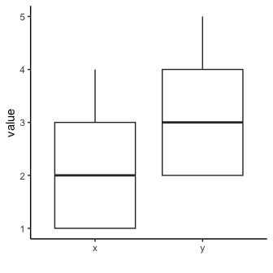

t-tests
================
Janet Young
2025-08-15

xxx here I could put some notes about situations where t-tests fail
(e.g. when neither dataset contains variance)

## Weighted t-tests (weights package)

``` r
library(weights)
```

``` r
dat <- tibble(x = c(1,1,1,1,1,1,2,2,2,3,3,3,4,4),
              wt = c(.5,.5,.5,.5,.5,1,1,1,1,2,2,2,2,2) ) |> 
  mutate(y=rev(x)+1) |> 
  relocate(y, .after=x) 
dat |> 
    kable() |> 
    kable_styling(full_width = FALSE)
```

<table class="table" style="width: auto !important; margin-left: auto; margin-right: auto;">

<thead>

<tr>

<th style="text-align:right;">

x
</th>

<th style="text-align:right;">

y
</th>

<th style="text-align:right;">

wt
</th>

</tr>

</thead>

<tbody>

<tr>

<td style="text-align:right;">

1
</td>

<td style="text-align:right;">

5
</td>

<td style="text-align:right;">

0.5
</td>

</tr>

<tr>

<td style="text-align:right;">

1
</td>

<td style="text-align:right;">

5
</td>

<td style="text-align:right;">

0.5
</td>

</tr>

<tr>

<td style="text-align:right;">

1
</td>

<td style="text-align:right;">

4
</td>

<td style="text-align:right;">

0.5
</td>

</tr>

<tr>

<td style="text-align:right;">

1
</td>

<td style="text-align:right;">

4
</td>

<td style="text-align:right;">

0.5
</td>

</tr>

<tr>

<td style="text-align:right;">

1
</td>

<td style="text-align:right;">

4
</td>

<td style="text-align:right;">

0.5
</td>

</tr>

<tr>

<td style="text-align:right;">

1
</td>

<td style="text-align:right;">

3
</td>

<td style="text-align:right;">

1.0
</td>

</tr>

<tr>

<td style="text-align:right;">

2
</td>

<td style="text-align:right;">

3
</td>

<td style="text-align:right;">

1.0
</td>

</tr>

<tr>

<td style="text-align:right;">

2
</td>

<td style="text-align:right;">

3
</td>

<td style="text-align:right;">

1.0
</td>

</tr>

<tr>

<td style="text-align:right;">

2
</td>

<td style="text-align:right;">

2
</td>

<td style="text-align:right;">

1.0
</td>

</tr>

<tr>

<td style="text-align:right;">

3
</td>

<td style="text-align:right;">

2
</td>

<td style="text-align:right;">

2.0
</td>

</tr>

<tr>

<td style="text-align:right;">

3
</td>

<td style="text-align:right;">

2
</td>

<td style="text-align:right;">

2.0
</td>

</tr>

<tr>

<td style="text-align:right;">

3
</td>

<td style="text-align:right;">

2
</td>

<td style="text-align:right;">

2.0
</td>

</tr>

<tr>

<td style="text-align:right;">

4
</td>

<td style="text-align:right;">

2
</td>

<td style="text-align:right;">

2.0
</td>

</tr>

<tr>

<td style="text-align:right;">

4
</td>

<td style="text-align:right;">

2
</td>

<td style="text-align:right;">

2.0
</td>

</tr>

</tbody>

</table>

``` r
 dat |> 
  pivot_longer(cols=-wt, names_to="class", values_to="value") |> 
  ggplot(aes(x=class, y=value)) +
  geom_boxplot() +
  labs(x="") +
  theme_classic()
```

<!-- -->

Ordinary t-test

``` r
t.test(dat$x, dat$y)
```

    ## 
    ##  Welch Two Sample t-test
    ## 
    ## data:  dat$x and dat$y
    ## t = -2.3185, df = 26, p-value = 0.02855
    ## alternative hypothesis: true difference in means is not equal to 0
    ## 95 percent confidence interval:
    ##  -1.8865703 -0.1134297
    ## sample estimates:
    ## mean of x mean of y 
    ##  2.071429  3.071429

``` r
wtd.t.test(dat$x, dat$y)
```

    ## $test
    ## [1] "Two Sample Weighted T-Test (Welch)"
    ## 
    ## $coefficients
    ##    t.value         df    p.value 
    ## -2.3185184 26.0000000  0.0285483 
    ## 
    ## $additional
    ## Difference     Mean.x     Mean.y   Std. Err 
    ## -1.0000000  2.0714286  3.0714286  0.4313099

``` r
wtd.t.test(dat$x, dat$y, dat$wt)
```

    ## $test
    ## [1] "Two Sample Weighted T-Test (Welch)"
    ## 
    ## $coefficients
    ##    t.value         df    p.value 
    ##  0.2357023 25.1885350  0.8155696 
    ## 
    ## $additional
    ## Difference     Mean.x     Mean.y   Std. Err 
    ## 0.09090909 2.63636364 2.54545455 0.38569461

``` r
wtd.t.test(dat$x, dat$y, dat$wt, bootse=TRUE)
```

    ## $test
    ## [1] "Two Sample Weighted T-Test (Welch)"
    ## 
    ## $coefficients
    ##    t.value         df    p.value 
    ##  0.2461073 25.1885350  0.8075937 
    ## 
    ## $additional
    ## Difference     Mean.x     Mean.y   Std. Err 
    ## 0.09090909 2.63636364 2.54545455 0.36938807
