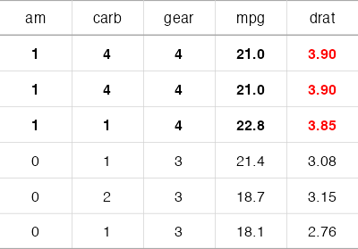
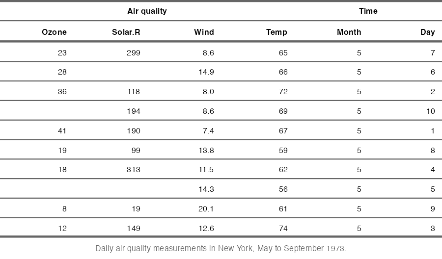
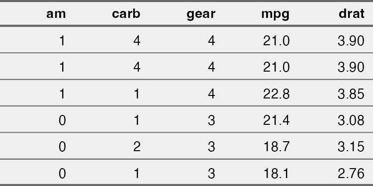
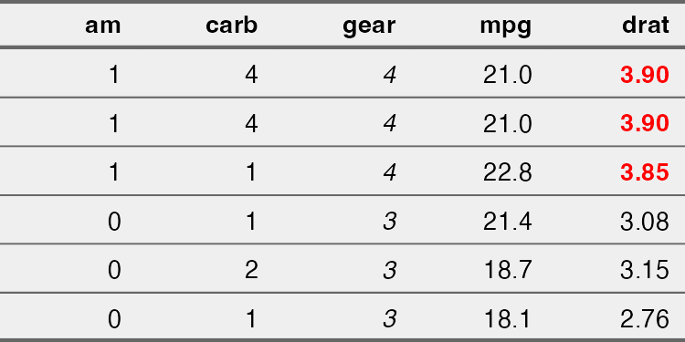

table_display_flextable_demo
================
Janet Young

2025-09-22

Checking out the `flextable` package

# Summary of features I might want to use

The caption displays within my Rstudio session but not when I knit the
doc or sync to github.

Table width also doesn’t seem to be carried through when I knit

``` r
## 
## make sure the package defaults are in place 
init_flextable_defaults()
## set some of my own defaults
set_flextable_defaults(text.align = "center", 
                       font.size = 6,
                       layout = "autofit") # text.align here doesn't seem to work
my_flextable <- flextable(head(mtcars), 
                  col_keys = c("am", "carb", "gear", "mpg", "drat" ))  %>% 
    align(align = "center", part = "all") %>%
    border_inner_h(officer::fp_border(color = "lightgrey", width=0.25), part="all") %>% 
    border_inner_v(officer::fp_border(color = "lightgrey", width=0.25), part="all") %>% 
    ## above and below the header:
    border(border.top=officer::fp_border(color = "darkgrey", width=0.5), 
           border.bottom=officer::fp_border(color = "darkgrey", width=0.5), 
           part="header") %>%
    hline_bottom(border = officer::fp_border(color = "darkgrey", width=0.5), part = "body") %>% 
    ## conditional formatting
    ## add red to just the drat column, based on drat column value
    color(i=  ~ drat > 3.5, j = ~ drat , color = "red") %>% 
    ## bold every cell in the row, based on drat column value
    bold(i = ~ drat > 3.5, j = NULL, bold = TRUE) %>% 
    # width(width=0.4) ## width of the table in inches
    set_table_properties(layout = "autofit", width = .2) #%>% 
    # set_caption(caption =  as_paragraph( as_chunk("Example flextable",
    #                                               props = fp_text_default() )))

my_flextable
```



Try a save-table-as-image cheat (see
<https://github.com/davidgohel/flextable/issues/532>)

``` r
knitr::opts_chunk$set(dev = "ragg_png")
```

``` r
temp <- save_as_image(my_flextable, 
              path=here("Rscripts/table_display_temp_tables/temp_flextable_3.png")) # suppressMessages( )
```


# More code examples

Code comes from the [flextable “book”
website](https://ardata-fr.github.io/flextable-book/index.html).

More examples in the [flextable
gallery](https://ardata.fr/en/flextable-gallery/)

Simple table display (flextable does a bit of formatting, including
autofit on the columns)

``` r
df <- airquality[ sample.int(10),]
flextable(df)
```


Fancier

``` r
ft <- flextable(df)
ft <- add_header_row(ft,
                     colwidths = c(4, 2),
                     values = c("Air quality", "Time")
)

ft <- theme_vanilla(ft)
ft <- add_footer_lines(ft, "Daily air quality measurements in New York, May to September 1973.")
ft <- color(ft, part = "footer", color = "#666666")
ft <- set_caption(ft, caption = "New York Air Quality Measurements")
# center the header row labels
ft <- align(ft,
            i = 1, j = NULL,
            align = "center", part = "header")

ft
```



Use `set_flextable_defaults` to change the default display settings:

``` r
set_flextable_defaults(
    font.size = 10, 
    theme_fun = theme_vanilla,
    padding = 6,
    background.color = "#EFEFEF")
flextable(df)
```


Use col_keys to select some columns

``` r
myft <- flextable(head(mtcars), 
                  col_keys = c("am", "carb", "gear", "mpg", "drat" ))
myft
```



Formatting certain cells/columns  
- use j to specify certain column(s) by index - can use conditional
formatting

``` r
myft <- italic(myft, j = 3)
myft <- color(myft, ~ drat > 3.5, ~ drat, color = "red")
myft <- bold(myft, ~ drat > 3.5, ~ drat, bold = TRUE)
myft
```



Adding header rows that span \>1 column:

``` r
myft <- add_header_row(
    x = myft, values = c("some measures", "other measures"),
    colwidths = c(3, 2))
myft <- align(myft, i = 1, part = "header", align = "center")
myft
```


Aligning within the parent document:

``` r
myft <- set_table_properties(myft, align = "right", layout = "autofit")
myft
```


Ask to display non-existent columns if we want to separate groups of
columns a bit - here we ask for the `col1` column. Also `empty_blanks()`
replaces <na> with blank.

``` r
myft <- flextable(
    data = head(airquality), 
    col_keys = c("Ozone", "Solar.R", "col1", "Month", "Day")) |> 
    width(j = "col1", width = .2) |>
    empty_blanks()
myft
```


Cute table that includes tiny plots:

``` r
## data.table seems to be similar to a data.frame, but cells can contain more complex 
z <- as.data.table(ggplot2::diamonds)

z <- z[, list(
    price = mean(price, na.rm = TRUE),
    list_col = list(.SD$x)
), by = "cut"]

# flextable ----
ft <- flextable(data = z) %>%
    mk_par(j = "list_col", value = as_paragraph(
        plot_chunk(value = list_col, type = "dens", col = "#ec11c2", 
                   width = 1.5, height = .4, free_scale = TRUE)
    )) %>%
    colformat_double(big.mark = " ", suffix = " $") %>% 
    autofit()
ft
```

    ## Warning in (function (img_data, width = NULL, height = NULL) : package 'magick'
    ## is required to read image files
    ## Warning in (function (img_data, width = NULL, height = NULL) : package 'magick'
    ## is required to read image files
    ## Warning in (function (img_data, width = NULL, height = NULL) : package 'magick'
    ## is required to read image files
    ## Warning in (function (img_data, width = NULL, height = NULL) : package 'magick'
    ## is required to read image files
    ## Warning in (function (img_data, width = NULL, height = NULL) : package 'magick'
    ## is required to read image files


Exporting formatted tables: `save_as_docx`, `save_as_pptx`,
`save_as_image`

``` r
save_as_docx(myft, path=here("Rscripts/table_display_flextable_demo_fig1.docx"))
```

Wow - you can put a these lines at the top of a doc, and then any time
you print a dataframe, it will be a flextable formatted using the
defaults:

``` r
set_flextable_defaults(font.size = 11, padding = 3)
use_df_printer()
```

# Finished

``` r
sessionInfo()
```

    ## R version 4.5.1 (2025-06-13)
    ## Platform: aarch64-apple-darwin20
    ## Running under: macOS Sequoia 15.6.1
    ## 
    ## Matrix products: default
    ## BLAS:   /Library/Frameworks/R.framework/Versions/4.5-arm64/Resources/lib/libRblas.0.dylib 
    ## LAPACK: /Library/Frameworks/R.framework/Versions/4.5-arm64/Resources/lib/libRlapack.dylib;  LAPACK version 3.12.1
    ## 
    ## locale:
    ## [1] en_US.UTF-8/en_US.UTF-8/en_US.UTF-8/C/en_US.UTF-8/en_US.UTF-8
    ## 
    ## time zone: America/Los_Angeles
    ## tzcode source: internal
    ## 
    ## attached base packages:
    ## [1] stats     graphics  grDevices utils     datasets  methods   base     
    ## 
    ## other attached packages:
    ## [1] magrittr_2.0.4    data.table_1.17.8 here_1.0.2        flextable_0.9.10 
    ## 
    ## loaded via a namespace (and not attached):
    ##  [1] gtable_0.3.6            dplyr_1.1.4             compiler_4.5.1         
    ##  [4] tidyselect_1.2.1        Rcpp_1.1.0              zip_2.3.3              
    ##  [7] xml2_1.4.0              fontquiver_0.2.1        systemfonts_1.2.3      
    ## [10] scales_1.4.0            textshaping_1.0.3       png_0.1-8              
    ## [13] uuid_1.2-1              yaml_2.3.10             fastmap_1.2.0          
    ## [16] ggplot2_4.0.0           R6_2.6.1                generics_0.1.4         
    ## [19] gdtools_0.4.3           knitr_1.50              tibble_3.3.0           
    ## [22] rprojroot_2.1.1         openssl_2.3.3           pillar_1.11.1          
    ## [25] RColorBrewer_1.1-3      rlang_1.1.6             xfun_0.53              
    ## [28] S7_0.2.0                cli_3.6.5               digest_0.6.37          
    ## [31] grid_4.5.1              rstudioapi_0.17.1       askpass_1.2.1          
    ## [34] lifecycle_1.0.4         vctrs_0.6.5             evaluate_1.0.5         
    ## [37] glue_1.8.0              farver_2.1.2            fontLiberation_0.1.0   
    ## [40] officer_0.7.0           ragg_1.5.0              fontBitstreamVera_0.1.1
    ## [43] rmarkdown_2.29          pkgconfig_2.0.3         tools_4.5.1            
    ## [46] htmltools_0.5.8.1
