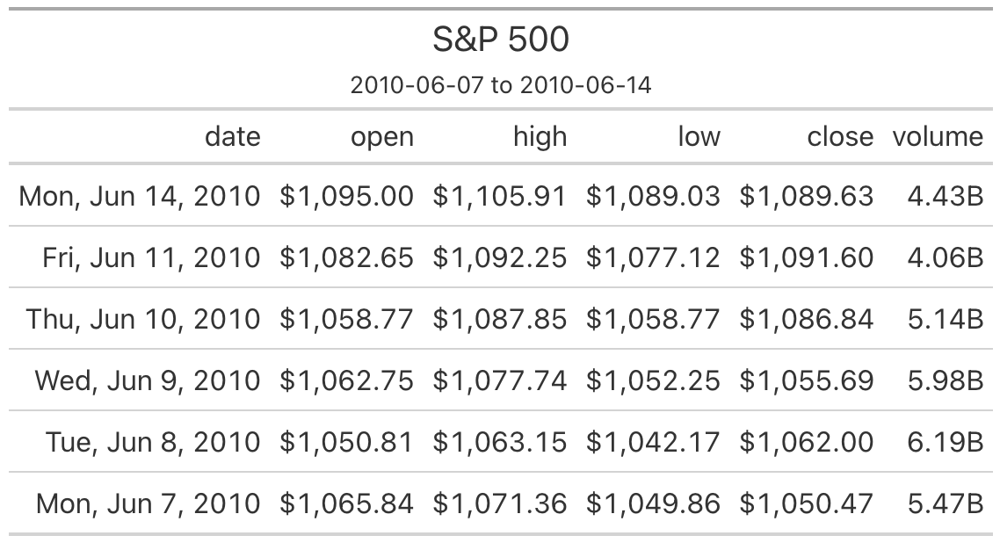
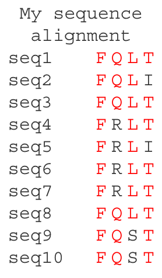

```{r setup, include=TRUE, message=FALSE, warning=FALSE}
knitr::opts_chunk$set(echo = TRUE)
library(tidyverse)
library(here)
library(gt)
```

gt seems great. There's a wrinkle when using github.com to display our knitted Rmd docs though:

- If we just use `gt()`, some of the table formatting is wrong/missing, and we get a bunch of raw html stuff showing above the table
- If we pipe the `gt` object through `as_raw_html()`, that removes the extra raw html stuff, but the formatting isn't quite right.
- A cheat that seems to work is to save our pretty table to an image file (e.g. png) and then embed that in the Rmd document, perhaps (e.g. ``, or with resizing: `{#id .class width=20% height=20%}`)

BUT that cheat doesn't work on rhino/gizmo Rstudio-server, because gtsave fails with this error: `Error in initialize(...) : Invalid path to Chrome`

In the code below I use that cheat.

## S&P example

Create a gt table based on preprocessed `sp500` table data


```{r}
# Define the start and end dates for the data range
start_date <- "2010-06-07"
end_date <- "2010-06-14"

# make gt table
sp500_gt <- sp500 |>
    dplyr::filter(date >= start_date & date <= end_date) |>
    dplyr::select(-adj_close) |>
    gt() |>
    tab_header(
        title = "S&P 500",
        subtitle = glue::glue("{start_date} to {end_date}")
    ) |>
    fmt_currency() |>
    fmt_date(columns = date, date_style = "wd_m_day_year") |>
    fmt_number(columns = volume, suffixing = TRUE) 

# save it as png
suppressMessages( gtsave(sp500_gt, 
                         filename=here("Rscripts/table_display_temp_tables/temp_table_1.png")) )
```

{#id .class width=60% height=60%}

## Sequence alignment example

Show sequence alignment as a table - play around with this as an alternative to ggmsa. 

First we make an example alignment tibble:


```{r}
seq_slice <- c("FQLT",
               "FQLI",
               "FQLT",
               "FRLT",
               "FRLI",
               "FRLT",
               "FRLT",
               "FQLT",
               "FQST",
               "FQST")
seq_slice_tbl <- seq_slice %>% 
    strsplit("") %>% 
    as.data.frame() %>% 
    set_names(nm=paste0("seq", 1:10)) %>%
    t() %>% 
    as.data.frame() %>%
    set_names(nm=paste0("pos", 1:4)) %>%
    as_tibble(rownames="id") 
```


Use gt to format that nicely:


```{r}
seq_slice_gt <- seq_slice_tbl %>% 
    ## gt alone makes a decent-looking table
    gt(caption="My sequence alignment") %>% 
    ## a bunch of formatting things:
    cols_align(align = "center", columns=-id) %>% 
    opt_table_font(font = list(google_font(name = "Courier"))) %>% 
    rm_header() %>% 
    tab_options(column_labels.hidden = TRUE,
                table_body.border.bottom.style = "hidden",
                table_body.hlines.style = "hidden",
                data_row.padding=0,
                data_row.padding.horizontal=2,
                ## row striping not visible until I knit. Options don't seem to work. Might be an Rstudio bug
                row.striping.include_table_body = FALSE,
                row.striping.include_stub=FALSE) %>% 
    ## px is number of pixels
    cols_width(id ~ px(75)) %>% 
    ## conditional formatting
    tab_style(style = cell_text(color = "red"),
              locations = cells_body(columns = pos1, rows = pos1 == "F") ) |>
    tab_style(style = cell_text(color = "red"),
              locations = cells_body(columns = pos2, rows = pos2 == "Q") ) |>
    tab_style(style = cell_text(color = "red"),
              locations = cells_body(columns = pos3, rows = pos3 == "L") ) |>
    tab_style(style = cell_text(color = "red"),
              locations = cells_body(columns = pos4, rows = pos4 == "T") ) 

suppressMessages( gtsave(seq_slice_gt, 
                         filename=here("Rscripts/table_display_temp_tables/temp_table_2.png")) )
```


{#id .class width=20% height=20%}


# Finished

```{r}
sessionInfo()
```
