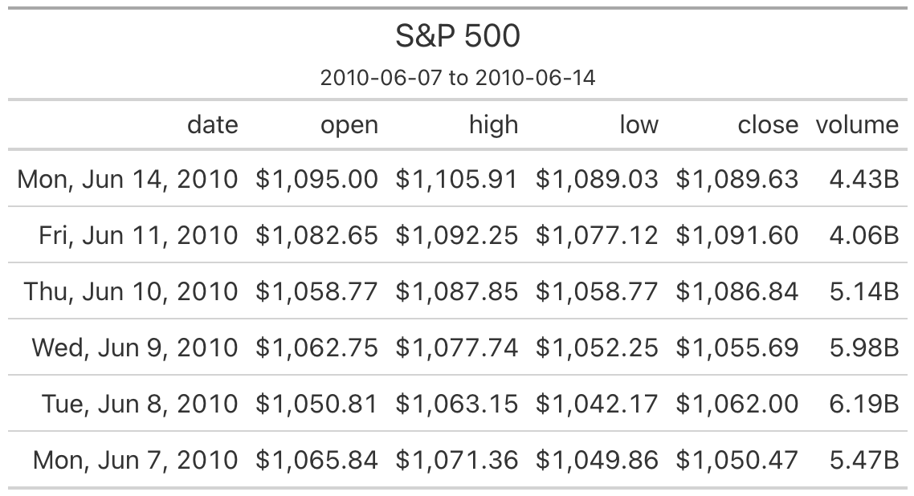

table_display_gt_demo
================
Janet Young

2025-11-06

``` r
knitr::opts_chunk$set(echo = TRUE)
library(tidyverse)
library(here)
library(gt)
library(chromote)
library(patchwork)
```

gt seems great. There’s a wrinkle when using github.com to display our
knitted Rmd docs though:

- If we just use `gt()`, some of the table formatting is wrong/missing,
  and we get a bunch of raw html stuff showing above the table
- If we pipe the `gt` object through `as_raw_html()`, that removes the
  extra raw html stuff, but the formatting isn’t quite right.
- A cheat that seems to work is to save our pretty table to an image
  file (e.g. png) and then embed that in the Rmd document, perhaps
  (e.g. ``, or with resizing:
  `{#id .class width=20% height=20%}`)

BUT that cheat doesn’t work on rhino/gizmo Rstudio-server, because
gtsave fails with this error:
`Error in initialize(...) : Invalid path to Chrome`

In the code below I use that cheat and render the Rmd to md on my Mac.

## S&P example

Create a gt table based on preprocessed `sp500` table data

``` r
# Define the start and end dates for the data range
start_date <- "2010-06-07"
end_date <- "2010-06-14"

# make gt table
sp500_gt <- sp500 |>
    dplyr::filter(date >= start_date & date <= end_date) |>
    dplyr::select(-adj_close) |>
    gt() |>
    tab_header(
        title = "S&P 500",
        subtitle = glue::glue("{start_date} to {end_date}")
    ) |>
    fmt_currency() |>
    fmt_date(columns = date, date_style = "wd_m_day_year") |>
    fmt_number(columns = volume, suffixing = TRUE) 

# save it as png
suppressMessages( gtsave(sp500_gt, 
                         filename=here("Rscripts/table_display_temp_tables/temp_table_1.png")) )
```



Place a table and plot side-by-side:

``` r
p1 <- sp500 %>% 
    ggplot(aes(x=date, y=open, color=date)) + 
    geom_point(size=0.2) +
    theme_classic() +
    labs("S&P 500 opening value by date")

p1 + 
    wrap_table(sp500_gt, panel="full") +
    plot_layout(widths=c(1,3))
```

<!-- -->

## Dealing with long colnames

gt::cols_label() function can help use relabel the columns, including
formatting them:

- `<br>` is a line break
- `<em>` starts italics, `<\em>` ends italics

``` r
## metro is in the gt package. ?metro says "A dataset with information on all 320 Paris Metro stations as of June 2024"
metro |>
  dplyr::select(name, lines, passengers, connect_other) |>
  dplyr::slice_max(passengers, n = 10) |>
  gt() |>
  cols_hide(columns = passengers) |>
  cols_label(
    name = "Name of<br>Metro Station",
    lines = "Metro<br>Lines",
    connect_other = "Train<br>Services",
    .fn = md
  )
```

<div id="jwxyrygeba" style="padding-left:0px;padding-right:0px;padding-top:10px;padding-bottom:10px;overflow-x:auto;overflow-y:auto;width:auto;height:auto;">
<style>#jwxyrygeba table {
  font-family: system-ui, 'Segoe UI', Roboto, Helvetica, Arial, sans-serif, 'Apple Color Emoji', 'Segoe UI Emoji', 'Segoe UI Symbol', 'Noto Color Emoji';
  -webkit-font-smoothing: antialiased;
  -moz-osx-font-smoothing: grayscale;
}
&#10;#jwxyrygeba thead, #jwxyrygeba tbody, #jwxyrygeba tfoot, #jwxyrygeba tr, #jwxyrygeba td, #jwxyrygeba th {
  border-style: none;
}
&#10;#jwxyrygeba p {
  margin: 0;
  padding: 0;
}
&#10;#jwxyrygeba .gt_table {
  display: table;
  border-collapse: collapse;
  line-height: normal;
  margin-left: auto;
  margin-right: auto;
  color: #333333;
  font-size: 16px;
  font-weight: normal;
  font-style: normal;
  background-color: #FFFFFF;
  width: auto;
  border-top-style: solid;
  border-top-width: 2px;
  border-top-color: #A8A8A8;
  border-right-style: none;
  border-right-width: 2px;
  border-right-color: #D3D3D3;
  border-bottom-style: solid;
  border-bottom-width: 2px;
  border-bottom-color: #A8A8A8;
  border-left-style: none;
  border-left-width: 2px;
  border-left-color: #D3D3D3;
}
&#10;#jwxyrygeba .gt_caption {
  padding-top: 4px;
  padding-bottom: 4px;
}
&#10;#jwxyrygeba .gt_title {
  color: #333333;
  font-size: 125%;
  font-weight: initial;
  padding-top: 4px;
  padding-bottom: 4px;
  padding-left: 5px;
  padding-right: 5px;
  border-bottom-color: #FFFFFF;
  border-bottom-width: 0;
}
&#10;#jwxyrygeba .gt_subtitle {
  color: #333333;
  font-size: 85%;
  font-weight: initial;
  padding-top: 3px;
  padding-bottom: 5px;
  padding-left: 5px;
  padding-right: 5px;
  border-top-color: #FFFFFF;
  border-top-width: 0;
}
&#10;#jwxyrygeba .gt_heading {
  background-color: #FFFFFF;
  text-align: center;
  border-bottom-color: #FFFFFF;
  border-left-style: none;
  border-left-width: 1px;
  border-left-color: #D3D3D3;
  border-right-style: none;
  border-right-width: 1px;
  border-right-color: #D3D3D3;
}
&#10;#jwxyrygeba .gt_bottom_border {
  border-bottom-style: solid;
  border-bottom-width: 2px;
  border-bottom-color: #D3D3D3;
}
&#10;#jwxyrygeba .gt_col_headings {
  border-top-style: solid;
  border-top-width: 2px;
  border-top-color: #D3D3D3;
  border-bottom-style: solid;
  border-bottom-width: 2px;
  border-bottom-color: #D3D3D3;
  border-left-style: none;
  border-left-width: 1px;
  border-left-color: #D3D3D3;
  border-right-style: none;
  border-right-width: 1px;
  border-right-color: #D3D3D3;
}
&#10;#jwxyrygeba .gt_col_heading {
  color: #333333;
  background-color: #FFFFFF;
  font-size: 100%;
  font-weight: normal;
  text-transform: inherit;
  border-left-style: none;
  border-left-width: 1px;
  border-left-color: #D3D3D3;
  border-right-style: none;
  border-right-width: 1px;
  border-right-color: #D3D3D3;
  vertical-align: bottom;
  padding-top: 5px;
  padding-bottom: 6px;
  padding-left: 5px;
  padding-right: 5px;
  overflow-x: hidden;
}
&#10;#jwxyrygeba .gt_column_spanner_outer {
  color: #333333;
  background-color: #FFFFFF;
  font-size: 100%;
  font-weight: normal;
  text-transform: inherit;
  padding-top: 0;
  padding-bottom: 0;
  padding-left: 4px;
  padding-right: 4px;
}
&#10;#jwxyrygeba .gt_column_spanner_outer:first-child {
  padding-left: 0;
}
&#10;#jwxyrygeba .gt_column_spanner_outer:last-child {
  padding-right: 0;
}
&#10;#jwxyrygeba .gt_column_spanner {
  border-bottom-style: solid;
  border-bottom-width: 2px;
  border-bottom-color: #D3D3D3;
  vertical-align: bottom;
  padding-top: 5px;
  padding-bottom: 5px;
  overflow-x: hidden;
  display: inline-block;
  width: 100%;
}
&#10;#jwxyrygeba .gt_spanner_row {
  border-bottom-style: hidden;
}
&#10;#jwxyrygeba .gt_group_heading {
  padding-top: 8px;
  padding-bottom: 8px;
  padding-left: 5px;
  padding-right: 5px;
  color: #333333;
  background-color: #FFFFFF;
  font-size: 100%;
  font-weight: initial;
  text-transform: inherit;
  border-top-style: solid;
  border-top-width: 2px;
  border-top-color: #D3D3D3;
  border-bottom-style: solid;
  border-bottom-width: 2px;
  border-bottom-color: #D3D3D3;
  border-left-style: none;
  border-left-width: 1px;
  border-left-color: #D3D3D3;
  border-right-style: none;
  border-right-width: 1px;
  border-right-color: #D3D3D3;
  vertical-align: middle;
  text-align: left;
}
&#10;#jwxyrygeba .gt_empty_group_heading {
  padding: 0.5px;
  color: #333333;
  background-color: #FFFFFF;
  font-size: 100%;
  font-weight: initial;
  border-top-style: solid;
  border-top-width: 2px;
  border-top-color: #D3D3D3;
  border-bottom-style: solid;
  border-bottom-width: 2px;
  border-bottom-color: #D3D3D3;
  vertical-align: middle;
}
&#10;#jwxyrygeba .gt_from_md > :first-child {
  margin-top: 0;
}
&#10;#jwxyrygeba .gt_from_md > :last-child {
  margin-bottom: 0;
}
&#10;#jwxyrygeba .gt_row {
  padding-top: 8px;
  padding-bottom: 8px;
  padding-left: 5px;
  padding-right: 5px;
  margin: 10px;
  border-top-style: solid;
  border-top-width: 1px;
  border-top-color: #D3D3D3;
  border-left-style: none;
  border-left-width: 1px;
  border-left-color: #D3D3D3;
  border-right-style: none;
  border-right-width: 1px;
  border-right-color: #D3D3D3;
  vertical-align: middle;
  overflow-x: hidden;
}
&#10;#jwxyrygeba .gt_stub {
  color: #333333;
  background-color: #FFFFFF;
  font-size: 100%;
  font-weight: initial;
  text-transform: inherit;
  border-right-style: solid;
  border-right-width: 2px;
  border-right-color: #D3D3D3;
  padding-left: 5px;
  padding-right: 5px;
}
&#10;#jwxyrygeba .gt_stub_row_group {
  color: #333333;
  background-color: #FFFFFF;
  font-size: 100%;
  font-weight: initial;
  text-transform: inherit;
  border-right-style: solid;
  border-right-width: 2px;
  border-right-color: #D3D3D3;
  padding-left: 5px;
  padding-right: 5px;
  vertical-align: top;
}
&#10;#jwxyrygeba .gt_row_group_first td {
  border-top-width: 2px;
}
&#10;#jwxyrygeba .gt_row_group_first th {
  border-top-width: 2px;
}
&#10;#jwxyrygeba .gt_summary_row {
  color: #333333;
  background-color: #FFFFFF;
  text-transform: inherit;
  padding-top: 8px;
  padding-bottom: 8px;
  padding-left: 5px;
  padding-right: 5px;
}
&#10;#jwxyrygeba .gt_first_summary_row {
  border-top-style: solid;
  border-top-color: #D3D3D3;
}
&#10;#jwxyrygeba .gt_first_summary_row.thick {
  border-top-width: 2px;
}
&#10;#jwxyrygeba .gt_last_summary_row {
  padding-top: 8px;
  padding-bottom: 8px;
  padding-left: 5px;
  padding-right: 5px;
  border-bottom-style: solid;
  border-bottom-width: 2px;
  border-bottom-color: #D3D3D3;
}
&#10;#jwxyrygeba .gt_grand_summary_row {
  color: #333333;
  background-color: #FFFFFF;
  text-transform: inherit;
  padding-top: 8px;
  padding-bottom: 8px;
  padding-left: 5px;
  padding-right: 5px;
}
&#10;#jwxyrygeba .gt_first_grand_summary_row {
  padding-top: 8px;
  padding-bottom: 8px;
  padding-left: 5px;
  padding-right: 5px;
  border-top-style: double;
  border-top-width: 6px;
  border-top-color: #D3D3D3;
}
&#10;#jwxyrygeba .gt_last_grand_summary_row_top {
  padding-top: 8px;
  padding-bottom: 8px;
  padding-left: 5px;
  padding-right: 5px;
  border-bottom-style: double;
  border-bottom-width: 6px;
  border-bottom-color: #D3D3D3;
}
&#10;#jwxyrygeba .gt_striped {
  background-color: rgba(128, 128, 128, 0.05);
}
&#10;#jwxyrygeba .gt_table_body {
  border-top-style: solid;
  border-top-width: 2px;
  border-top-color: #D3D3D3;
  border-bottom-style: solid;
  border-bottom-width: 2px;
  border-bottom-color: #D3D3D3;
}
&#10;#jwxyrygeba .gt_footnotes {
  color: #333333;
  background-color: #FFFFFF;
  border-bottom-style: none;
  border-bottom-width: 2px;
  border-bottom-color: #D3D3D3;
  border-left-style: none;
  border-left-width: 2px;
  border-left-color: #D3D3D3;
  border-right-style: none;
  border-right-width: 2px;
  border-right-color: #D3D3D3;
}
&#10;#jwxyrygeba .gt_footnote {
  margin: 0px;
  font-size: 90%;
  padding-top: 4px;
  padding-bottom: 4px;
  padding-left: 5px;
  padding-right: 5px;
}
&#10;#jwxyrygeba .gt_sourcenotes {
  color: #333333;
  background-color: #FFFFFF;
  border-bottom-style: none;
  border-bottom-width: 2px;
  border-bottom-color: #D3D3D3;
  border-left-style: none;
  border-left-width: 2px;
  border-left-color: #D3D3D3;
  border-right-style: none;
  border-right-width: 2px;
  border-right-color: #D3D3D3;
}
&#10;#jwxyrygeba .gt_sourcenote {
  font-size: 90%;
  padding-top: 4px;
  padding-bottom: 4px;
  padding-left: 5px;
  padding-right: 5px;
}
&#10;#jwxyrygeba .gt_left {
  text-align: left;
}
&#10;#jwxyrygeba .gt_center {
  text-align: center;
}
&#10;#jwxyrygeba .gt_right {
  text-align: right;
  font-variant-numeric: tabular-nums;
}
&#10;#jwxyrygeba .gt_font_normal {
  font-weight: normal;
}
&#10;#jwxyrygeba .gt_font_bold {
  font-weight: bold;
}
&#10;#jwxyrygeba .gt_font_italic {
  font-style: italic;
}
&#10;#jwxyrygeba .gt_super {
  font-size: 65%;
}
&#10;#jwxyrygeba .gt_footnote_marks {
  font-size: 75%;
  vertical-align: 0.4em;
  position: initial;
}
&#10;#jwxyrygeba .gt_asterisk {
  font-size: 100%;
  vertical-align: 0;
}
&#10;#jwxyrygeba .gt_indent_1 {
  text-indent: 5px;
}
&#10;#jwxyrygeba .gt_indent_2 {
  text-indent: 10px;
}
&#10;#jwxyrygeba .gt_indent_3 {
  text-indent: 15px;
}
&#10;#jwxyrygeba .gt_indent_4 {
  text-indent: 20px;
}
&#10;#jwxyrygeba .gt_indent_5 {
  text-indent: 25px;
}
&#10;#jwxyrygeba .katex-display {
  display: inline-flex !important;
  margin-bottom: 0.75em !important;
}
&#10;#jwxyrygeba div.Reactable > div.rt-table > div.rt-thead > div.rt-tr.rt-tr-group-header > div.rt-th-group:after {
  height: 0px !important;
}
</style>
<table class="gt_table" data-quarto-disable-processing="false" data-quarto-bootstrap="false">
  <thead>
    <tr class="gt_col_headings">
      <th class="gt_col_heading gt_columns_bottom_border gt_left" rowspan="1" colspan="1" scope="col" id="name"><span class='gt_from_md'>Name of<br>Metro Station</span></th>
      <th class="gt_col_heading gt_columns_bottom_border gt_right" rowspan="1" colspan="1" scope="col" id="lines"><span class='gt_from_md'>Metro<br>Lines</span></th>
      <th class="gt_col_heading gt_columns_bottom_border gt_left" rowspan="1" colspan="1" scope="col" id="connect_other"><span class='gt_from_md'>Train<br>Services</span></th>
    </tr>
  </thead>
  <tbody class="gt_table_body">
    <tr><td headers="name" class="gt_row gt_left">Gare du Nord</td>
<td headers="lines" class="gt_row gt_right">4, 5</td>
<td headers="connect_other" class="gt_row gt_left">TGV, TER, Thalys, Eurostar</td></tr>
    <tr><td headers="name" class="gt_row gt_left">Saint-Lazare</td>
<td headers="lines" class="gt_row gt_right">3, 12, 13, 14</td>
<td headers="connect_other" class="gt_row gt_left">TGV, TER, Intercités</td></tr>
    <tr><td headers="name" class="gt_row gt_left">Gare de Lyon</td>
<td headers="lines" class="gt_row gt_right">1, 14</td>
<td headers="connect_other" class="gt_row gt_left">TGV, TGV Lyria, Renfe-SNCF, OUIGO, Frecciarossa</td></tr>
    <tr><td headers="name" class="gt_row gt_left">Montparnasse—Bienvenüe</td>
<td headers="lines" class="gt_row gt_right">4, 6, 12, 13</td>
<td headers="connect_other" class="gt_row gt_left">TGV, TER, Intercités, OUIGO</td></tr>
    <tr><td headers="name" class="gt_row gt_left">Gare de l'Est</td>
<td headers="lines" class="gt_row gt_right">4, 5, 7</td>
<td headers="connect_other" class="gt_row gt_left">TGV, TER, OUIGO, Nightjet</td></tr>
    <tr><td headers="name" class="gt_row gt_left">Bibliothèque François Mitterrand</td>
<td headers="lines" class="gt_row gt_right">14</td>
<td headers="connect_other" class="gt_row gt_left">NA</td></tr>
    <tr><td headers="name" class="gt_row gt_left">République</td>
<td headers="lines" class="gt_row gt_right">3, 5, 8, 9, 11</td>
<td headers="connect_other" class="gt_row gt_left">NA</td></tr>
    <tr><td headers="name" class="gt_row gt_left">Les Halles</td>
<td headers="lines" class="gt_row gt_right">4</td>
<td headers="connect_other" class="gt_row gt_left">NA</td></tr>
    <tr><td headers="name" class="gt_row gt_left">La Défense</td>
<td headers="lines" class="gt_row gt_right">1</td>
<td headers="connect_other" class="gt_row gt_left">NA</td></tr>
    <tr><td headers="name" class="gt_row gt_left">Châtelet</td>
<td headers="lines" class="gt_row gt_right">1, 4, 7, 11, 14</td>
<td headers="connect_other" class="gt_row gt_left">NA</td></tr>
  </tbody>
  &#10;  
</table>
</div>

## Sequence alignment example

Show sequence alignment as a table - play around with this as an
alternative to ggmsa.

First we make an example alignment tibble:

``` r
seq_slice <- c("FQLT",
               "FQLI",
               "FQLT",
               "FRLT",
               "FRLI",
               "FRLT",
               "FRLT",
               "FQLT",
               "FQST",
               "FQST")
seq_slice_tbl <- seq_slice %>% 
    strsplit("") %>% 
    as.data.frame() %>% 
    set_names(nm=paste0("seq", 1:10)) %>%
    t() %>% 
    as.data.frame() %>%
    set_names(nm=paste0("pos", 1:4)) %>%
    as_tibble(rownames="id") 
```

Use gt to format that nicely:

``` r
seq_slice_gt <- seq_slice_tbl %>% 
    ## gt alone makes a decent-looking table
    gt(caption="My sequence alignment") %>% 
    ## a bunch of formatting things:
    cols_align(align = "center", columns=-id) %>% 
    opt_table_font(font = list(google_font(name = "Courier"))) %>% 
    rm_header() %>% 
    tab_options(column_labels.hidden = TRUE,
                table_body.border.bottom.style = "hidden",
                table_body.hlines.style = "hidden",
                data_row.padding=0,
                data_row.padding.horizontal=2,
                ## row striping not visible until I knit. Options don't seem to work. Might be an Rstudio bug
                row.striping.include_table_body = FALSE,
                row.striping.include_stub=FALSE) %>% 
    ## px is number of pixels
    cols_width(id ~ px(75)) %>% 
    ## conditional formatting
    tab_style(style = cell_text(color = "red"),
              locations = cells_body(columns = pos1, rows = pos1 == "F") ) |>
    tab_style(style = cell_text(color = "red"),
              locations = cells_body(columns = pos2, rows = pos2 == "Q") ) |>
    tab_style(style = cell_text(color = "red"),
              locations = cells_body(columns = pos3, rows = pos3 == "L") ) |>
    tab_style(style = cell_text(color = "red"),
              locations = cells_body(columns = pos4, rows = pos4 == "T") ) 

suppressMessages( gtsave(seq_slice_gt, 
                         filename=here("Rscripts/table_display_temp_tables/temp_table_2.png")) )
```


# Finished

``` r
sessionInfo()
```

    ## R version 4.5.1 (2025-06-13)
    ## Platform: aarch64-apple-darwin20
    ## Running under: macOS Sequoia 15.7.1
    ## 
    ## Matrix products: default
    ## BLAS:   /Library/Frameworks/R.framework/Versions/4.5-arm64/Resources/lib/libRblas.0.dylib 
    ## LAPACK: /Library/Frameworks/R.framework/Versions/4.5-arm64/Resources/lib/libRlapack.dylib;  LAPACK version 3.12.1
    ## 
    ## locale:
    ## [1] en_US.UTF-8/en_US.UTF-8/en_US.UTF-8/C/en_US.UTF-8/en_US.UTF-8
    ## 
    ## time zone: America/Los_Angeles
    ## tzcode source: internal
    ## 
    ## attached base packages:
    ## [1] stats     graphics  grDevices utils     datasets  methods   base     
    ## 
    ## other attached packages:
    ##  [1] patchwork_1.3.2 chromote_0.5.1  gt_1.0.0        here_1.0.2     
    ##  [5] lubridate_1.9.4 forcats_1.0.0   stringr_1.5.2   dplyr_1.1.4    
    ##  [9] purrr_1.1.0     readr_2.1.5     tidyr_1.3.1     tibble_3.3.0   
    ## [13] ggplot2_3.5.2   tidyverse_2.0.0
    ## 
    ## loaded via a namespace (and not attached):
    ##  [1] sass_0.4.10        generics_0.1.4     xml2_1.4.0         stringi_1.8.7     
    ##  [5] hms_1.1.3          digest_0.6.37      magrittr_2.0.4     evaluate_1.0.5    
    ##  [9] grid_4.5.1         timechange_0.3.0   RColorBrewer_1.1-3 fastmap_1.2.0     
    ## [13] rprojroot_2.1.1    jsonlite_2.0.0     processx_3.8.6     ps_1.9.1          
    ## [17] promises_1.3.3     scales_1.4.0       cli_3.6.5          rlang_1.1.6       
    ## [21] litedown_0.7       commonmark_2.0.0   bigD_0.3.1         withr_3.0.2       
    ## [25] yaml_2.3.10        tools_4.5.1        tzdb_0.5.0         vctrs_0.6.5       
    ## [29] R6_2.6.1           lifecycle_1.0.4    fs_1.6.6           pkgconfig_2.0.3   
    ## [33] pillar_1.11.1      later_1.4.4        gtable_0.3.6       glue_1.8.0        
    ## [37] Rcpp_1.1.0         xfun_0.53          tidyselect_1.2.1   rstudioapi_0.17.1 
    ## [41] knitr_1.50         farver_2.1.2       htmltools_0.5.8.1  websocket_1.4.4   
    ## [45] labeling_0.4.3     webshot2_0.1.2     rmarkdown_2.29     compiler_4.5.1    
    ## [49] markdown_2.0
