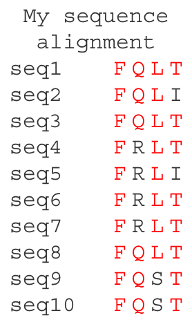

table_display_gt_demo
================
Janet Young

2025-09-18

``` r
knitr::opts_chunk$set(echo = TRUE)
library(tidyverse)
library(here)
library(gt)
```

gt seems great. There’s a wrinkle when using github.com to display our
knitted Rmd docs though:

- If we just use `gt()`, some of the table formatting is wrong/missing,
  and we get a bunch of raw html stuff showing above the table
- If we pipe the `gt` object through `as_raw_html()`, that removes the
  extra raw html stuff, but the formatting isn’t quite right.
- A cheat that seems to work is to save our pretty table to an image
  file (e.g. png) and then embed that in the Rmd document, perhaps
  (e.g. ``, or with resizing:
  `{#id .class width=20% height=20%}`)

In the code below I use that cheat.

## S&P example

Create a gt table based on preprocessed `sp500` table data

``` r
# Define the start and end dates for the data range
start_date <- "2010-06-07"
end_date <- "2010-06-14"

# make gt table
sp500_gt <- sp500 |>
    dplyr::filter(date >= start_date & date <= end_date) |>
    dplyr::select(-adj_close) |>
    gt() |>
    tab_header(
        title = "S&P 500",
        subtitle = glue::glue("{start_date} to {end_date}")
    ) |>
    fmt_currency() |>
    fmt_date(columns = date, date_style = "wd_m_day_year") |>
    fmt_number(columns = volume, suffixing = TRUE) 

# save it as png
suppressMessages( gtsave(sp500_gt, 
                         filename=here("Rscripts/table_display_temp_tables/temp_table_1.png")) )
```


## Sequence alignment example

Show sequence alignment as a table - play around with this as an
alternative to ggmsa:

``` r
seq_slice <- c("FQLT",
               "FQLI",
               "FQLT",
               "FRLT",
               "FRLI",
               "FRLT",
               "FRLT",
               "FQLT",
               "FQST",
               "FQST")
seq_slice_tbl <- seq_slice %>% 
    strsplit("") %>% 
    as.data.frame() %>% 
    set_names(nm=paste0("seq", 1:10)) %>%
    t() %>% 
    as.data.frame() %>%
    set_names(nm=paste0("pos", 1:4)) %>%
    as_tibble(rownames="id") 
```

Show as a gt table, without using the as_raw_html() function

``` r
seq_slice_gt <- seq_slice_tbl %>% 
    ## gt alone makes a decent-looking table
    gt() %>% 
    ## a bunch of formatting things:
    cols_align(align = "center", columns=-id) %>% 
    opt_table_font(font = list(google_font(name = "Courier"))) %>% 
    rm_header() %>% 
    tab_options(column_labels.hidden = TRUE,
                table_body.border.bottom.style = "hidden",
                table_body.hlines.style = "hidden",
                data_row.padding=0,
                data_row.padding.horizontal=2,
                ## row striping not visible until I knit. Options don't seem to work. Might be an Rstudio bug
                row.striping.include_table_body = FALSE,
                row.striping.include_stub=FALSE) %>% 
    ## px is number of pixels
    cols_width(id ~ px(75)) %>% 
    ## conditional formatting
    tab_style(style = cell_text(color = "red"),
              locations = cells_body(columns = pos1, rows = pos1 == "F") ) |>
    tab_style(style = cell_text(color = "red"),
              locations = cells_body(columns = pos2, rows = pos2 == "Q") ) |>
    tab_style(style = cell_text(color = "red"),
              locations = cells_body(columns = pos3, rows = pos3 == "L") ) |>
    tab_style(style = cell_text(color = "red"),
              locations = cells_body(columns = pos4, rows = pos4 == "T") ) 

suppressMessages( gtsave(seq_slice_gt, 
                         filename=here("Rscripts/table_display_temp_tables/temp_table_2.png")) )
```



# Finished

``` r
sessionInfo()
```

    ## R version 4.5.1 (2025-06-13)
    ## Platform: aarch64-apple-darwin20
    ## Running under: macOS Sequoia 15.6.1
    ## 
    ## Matrix products: default
    ## BLAS:   /Library/Frameworks/R.framework/Versions/4.5-arm64/Resources/lib/libRblas.0.dylib 
    ## LAPACK: /Library/Frameworks/R.framework/Versions/4.5-arm64/Resources/lib/libRlapack.dylib;  LAPACK version 3.12.1
    ## 
    ## locale:
    ## [1] en_US.UTF-8/en_US.UTF-8/en_US.UTF-8/C/en_US.UTF-8/en_US.UTF-8
    ## 
    ## time zone: America/Los_Angeles
    ## tzcode source: internal
    ## 
    ## attached base packages:
    ## [1] stats     graphics  grDevices utils     datasets  methods   base     
    ## 
    ## other attached packages:
    ##  [1] gt_1.0.0        here_1.0.1      lubridate_1.9.4 forcats_1.0.0  
    ##  [5] stringr_1.5.1   dplyr_1.1.4     purrr_1.1.0     readr_2.1.5    
    ##  [9] tidyr_1.3.1     tibble_3.3.0    ggplot2_3.5.2   tidyverse_2.0.0
    ## 
    ## loaded via a namespace (and not attached):
    ##  [1] sass_0.4.10        generics_0.1.4     xml2_1.3.8         stringi_1.8.7     
    ##  [5] hms_1.1.3          digest_0.6.37      magrittr_2.0.3     evaluate_1.0.4    
    ##  [9] grid_4.5.1         timechange_0.3.0   RColorBrewer_1.1-3 fastmap_1.2.0     
    ## [13] rprojroot_2.1.0    jsonlite_2.0.0     processx_3.8.6     chromote_0.5.1    
    ## [17] ps_1.9.1           promises_1.3.3     scales_1.4.0       cli_3.6.5         
    ## [21] rlang_1.1.6        bigD_0.3.1         withr_3.0.2        yaml_2.3.10       
    ## [25] tools_4.5.1        tzdb_0.5.0         vctrs_0.6.5        R6_2.6.1          
    ## [29] lifecycle_1.0.4    fs_1.6.6           pkgconfig_2.0.3    pillar_1.11.0     
    ## [33] later_1.4.2        gtable_0.3.6       glue_1.8.0         Rcpp_1.1.0        
    ## [37] xfun_0.52          tidyselect_1.2.1   rstudioapi_0.17.1  knitr_1.50        
    ## [41] farver_2.1.2       websocket_1.4.4    htmltools_0.5.8.1  rmarkdown_2.29    
    ## [45] webshot2_0.1.2     compiler_4.5.1
