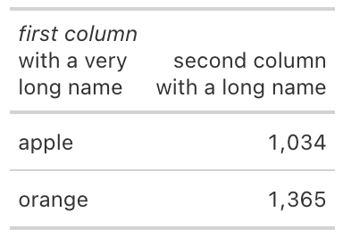
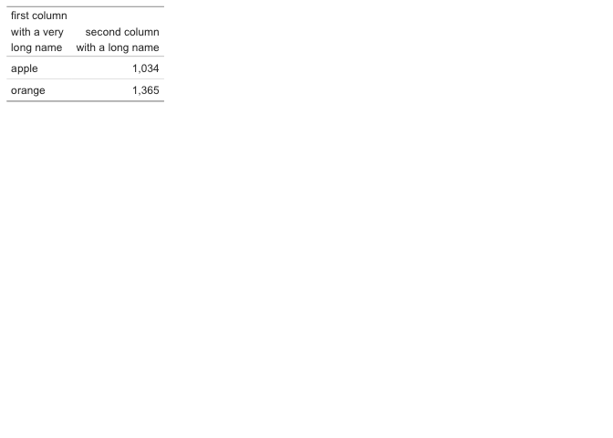
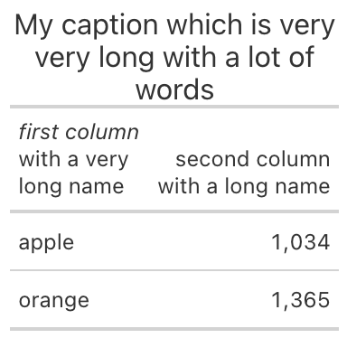
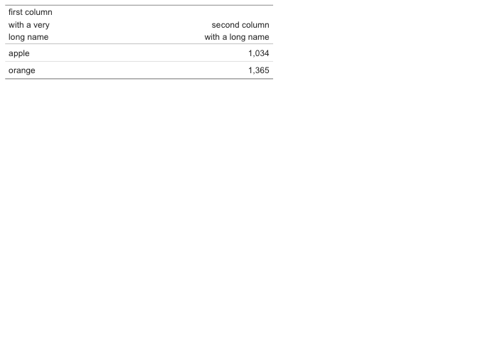
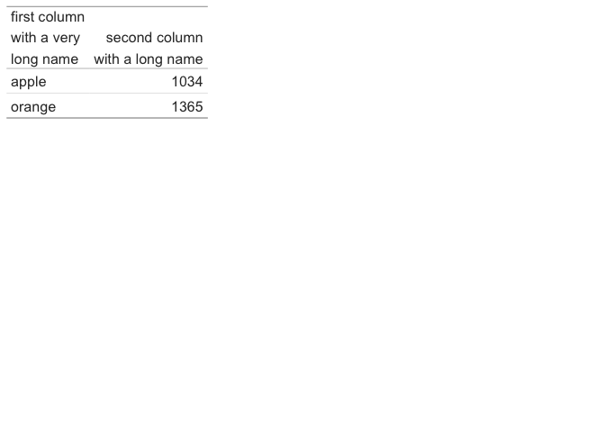
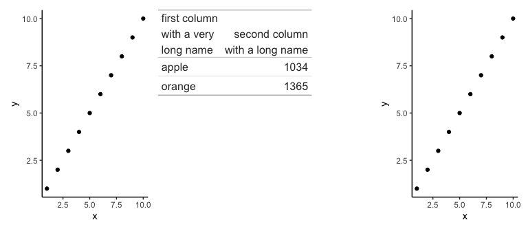

table_display_patchwork_and_gt_demo
================
Janet Young

2025-11-07

Testing a few details to do with wrapping long column names when I
display tables, as well as combining tables and plots using the
`patchwork` package.

Make an example tibble with long names (`my_tbl`):

``` r
my_tbl <- tibble(
    first_column_break_with_a_very_break_long_name = c("apple", "orange"),
    second_column_break_with_a_long_name = c(1034,1365)
)
my_tbl
```

    ## # A tibble: 2 × 2
    ##   first_column_break_with_a_very_break_long_name second_column_break_with_a_lo…¹
    ##   <chr>                                                                    <dbl>
    ## 1 apple                                                                     1034
    ## 2 orange                                                                    1365
    ## # ℹ abbreviated name: ¹​second_column_break_with_a_long_name

Create `my_tbl_gt` - I use gt to display that, inserting `<br>`
linebreaks, and doing some formatting (italics, and font size). Looks
good.

``` r
my_tbl_gt <- gt(my_tbl) %>% 
    fmt_number(use_seps = TRUE, decimals=0) %>% 
    cols_label(first_column_break_with_a_very_break_long_name="<em>first column</em><br>with a very<br>long name",
               second_column_break_with_a_long_name="second column<br>with a long name",
               .fn = md ) %>%  
    ## this makes font 75% the size of default
    tab_style(style = cell_text(size = pct(75)),
              locations=list(cells_column_labels(), cells_body()))

# save it as png
suppressMessages( gtsave(my_tbl_gt, 
                         filename=here("Rscripts/table_display_temp_tables/my_tbl_gt.png")) )
# my_tbl_gt
```



Now display `my_tbl_gt` using `patchwork::wrap_table()`. It still wraps
the colnames, and keeps the column widths reasonable (although it does
drop the italics):

``` r
options(gt.html_tag_check = FALSE)
wrap_table(my_tbl_gt, panel="full")
```

<!-- -->

We can also give the table a caption using gt. Looks OK if I display
using gt:

``` r
my_tbl_gt_with_long_caption <- gt(my_tbl, caption="My caption which is very very long with a lot of words") %>% 
    fmt_number(use_seps = TRUE, decimals=0) %>% 
    cols_label(first_column_break_with_a_very_break_long_name="<em>first column</em><br>with a very<br>long name",
               second_column_break_with_a_long_name="second column<br>with a long name",
               .fn = md ) %>%  
    ## this makes font 75% the size of default
    tab_style(style = cell_text(size = pct(75)),
              locations=list(cells_column_labels(),
                             cells_body()))
# save it as png
suppressMessages( gtsave(my_tbl_gt_with_long_caption, 
                         filename=here("Rscripts/table_display_temp_tables/my_tbl_gt_with_long_caption.png")) )
# my_tbl_gt
```



However, if we display a gt table with a long caption using
`patchwork::wrap_table()` (which we might do if we want to combine it
with plots), then two things are wrong:

- the caption is not visible (a knowon issue - we could deal with that
  by adding `+ plot_annotation(title="my title")`).
- worse: even though the caption is not visible, its presence messes up
  the column widths:

``` r
wrap_table(my_tbl_gt_with_long_caption, panel="full")
```

<!-- -->

We can also make a version where we include `\n` in the colnames, to try
to wrap them a different way

``` r
my_tbl_wrap_colnames <- my_tbl %>% 
    set_names(nm=c("first column\nwith a very\nlong name",
                   "second column\nwith a long name"))
```

A plain print output does not wrap colnames:

``` r
my_tbl_wrap_colnames
```

    ## # A tibble: 2 × 2
    ##   `first column\nwith a very\nlong name` `second column\nwith a long name`
    ##   <chr>                                                              <dbl>
    ## 1 apple                                                               1034
    ## 2 orange                                                              1365

Neither does using `gt()`:

``` r
my_tbl_wrap_colnames_gt <- my_tbl_wrap_colnames %>% gt()

# save it as png
suppressMessages( gtsave(my_tbl_wrap_colnames_gt, 
                         filename=here("Rscripts/table_display_temp_tables/my_tbl_wrap_colnames_gt.png")) )
# my_tbl_wrap_colnames
```


But `wrap_table()` does see the `\n` in colnames:

``` r
wrap_table(my_tbl_wrap_colnames)
```

<!-- -->

Combining the table with a plot (without gt):

(harder to add styling like font size this way)

``` r
p1 <- tibble(x=1:10, y=1:10) %>% 
    ggplot(aes(x=x,y=y))+
    geom_point() +
    theme_classic()

(p1 + wrap_table(my_tbl_wrap_colnames, panel="full") + p1) +
    plot_layout(widths=c(1,2,1))
```

<!-- -->

Combining the table with a plot (WITH gt):

``` r
p1 <- tibble(x=1:10, y=1:10) %>% 
    ggplot(aes(x=x,y=y))+
    geom_point() +
    theme_classic()

(p1 + wrap_table(my_tbl_gt, panel="full") + p1) +
    plot_layout(widths=c(1,2,1))
```

<!-- -->

``` r
sessionInfo()
```

    ## R version 4.5.1 (2025-06-13)
    ## Platform: aarch64-apple-darwin20
    ## Running under: macOS Sequoia 15.7.1
    ## 
    ## Matrix products: default
    ## BLAS:   /Library/Frameworks/R.framework/Versions/4.5-arm64/Resources/lib/libRblas.0.dylib 
    ## LAPACK: /Library/Frameworks/R.framework/Versions/4.5-arm64/Resources/lib/libRlapack.dylib;  LAPACK version 3.12.1
    ## 
    ## locale:
    ## [1] en_US.UTF-8/en_US.UTF-8/en_US.UTF-8/C/en_US.UTF-8/en_US.UTF-8
    ## 
    ## time zone: America/Los_Angeles
    ## tzcode source: internal
    ## 
    ## attached base packages:
    ## [1] stats     graphics  grDevices utils     datasets  methods   base     
    ## 
    ## other attached packages:
    ##  [1] gt_1.0.0        patchwork_1.3.2 here_1.0.2      lubridate_1.9.4
    ##  [5] forcats_1.0.0   stringr_1.5.2   dplyr_1.1.4     purrr_1.1.0    
    ##  [9] readr_2.1.5     tidyr_1.3.1     tibble_3.3.0    ggplot2_3.5.2  
    ## [13] tidyverse_2.0.0
    ## 
    ## loaded via a namespace (and not attached):
    ##  [1] sass_0.4.10        utf8_1.2.6         generics_0.1.4     xml2_1.4.0        
    ##  [5] stringi_1.8.7      hms_1.1.3          digest_0.6.37      magrittr_2.0.4    
    ##  [9] evaluate_1.0.5     grid_4.5.1         timechange_0.3.0   RColorBrewer_1.1-3
    ## [13] fastmap_1.2.0      jsonlite_2.0.0     rprojroot_2.1.1    processx_3.8.6    
    ## [17] chromote_0.5.1     ps_1.9.1           promises_1.3.3     scales_1.4.0      
    ## [21] cli_3.6.5          rlang_1.1.6        litedown_0.7       commonmark_2.0.0  
    ## [25] withr_3.0.2        yaml_2.3.10        tools_4.5.1        tzdb_0.5.0        
    ## [29] vctrs_0.6.5        R6_2.6.1           lifecycle_1.0.4    fs_1.6.6          
    ## [33] pkgconfig_2.0.3    later_1.4.4        pillar_1.11.1      gtable_0.3.6      
    ## [37] Rcpp_1.1.0         glue_1.8.0         xfun_0.53          tidyselect_1.2.1  
    ## [41] rstudioapi_0.17.1  knitr_1.50         farver_2.1.2       websocket_1.4.4   
    ## [45] htmltools_0.5.8.1  labeling_0.4.3     rmarkdown_2.29     webshot2_0.1.2    
    ## [49] compiler_4.5.1     markdown_2.0
