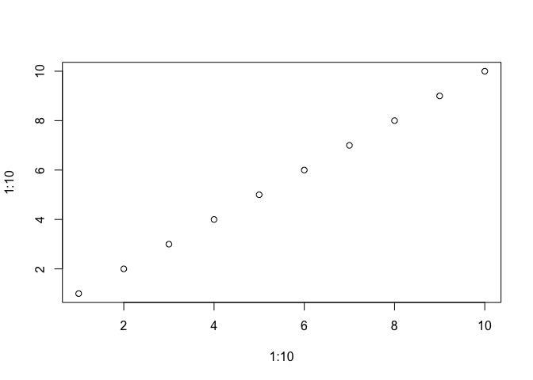

= test_quarto

== Quarto

Quarto enables you to weave together content and executable code into a finished document. To learn more about Quarto see https://quarto.org.

== Running Code

When you click the *Render* button a document will be generated that includes both content and the output of embedded code. You can embed code like this:

[source,r,cell-code]
----
1 + 1
----

....
[1] 2
....

You can add options to executable code like this

....
[1] 4
....

The `+echo: false+` option disables the printing of code (only output is displayed).

== make a new section

write some stuff

a bulleted list

* first
* second
* third

.test caption
[cols=",,",options="header",]
|===
|Col1 |Col2 |Col3
|x |3 |a
|y |4 |b
|z |1 |c
|===

xxx

[source,r,cell-code]
----
plot(1:10,1:10)
----

