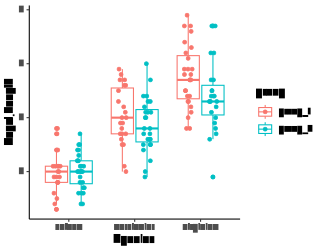

test\_randomCodeBits\_part2
================
Janet Young

2025-11-07

This is the second in a set of two linked Rmd scripts, to help me test
my `render_Rmd_series.perl` script.

This script (part2) plots the fake dataset we made in part1.

``` r
# load iris_plus_groups
load(file=here("Rscripts/zz_test_renderRmd_in_series/iris_plus_groups.Rdata"))
```

``` r
iris_plus_groups %>% 
    ggplot(aes(x=Species, y=Sepal.Length, color=group)) +
    geom_boxplot() +
    geom_point(position=position_jitterdodge(jitter.width = 0.12)) +
    theme_classic()
```

<!-- -->

``` r
ggsave(filename=here("Rscripts/zz_test_renderRmd_in_series/iris_plus_groups_plot.pdf"),
       height=3.5, width=4.5)
```

# Finished

``` r
sessionInfo()
```

    ## R version 4.4.1 (2024-06-14)
    ## Platform: x86_64-pc-linux-gnu
    ## Running under: Ubuntu 18.04.6 LTS
    ## 
    ## Matrix products: default
    ## BLAS/LAPACK: FlexiBLAS OPENBLAS;  LAPACK version 3.11.0
    ## 
    ## locale:
    ##  [1] LC_CTYPE=en_US.UTF-8       LC_NUMERIC=C              
    ##  [3] LC_TIME=en_US.UTF-8        LC_COLLATE=en_US.UTF-8    
    ##  [5] LC_MONETARY=en_US.UTF-8    LC_MESSAGES=en_US.UTF-8   
    ##  [7] LC_PAPER=en_US.UTF-8       LC_NAME=C                 
    ##  [9] LC_ADDRESS=C               LC_TELEPHONE=C            
    ## [11] LC_MEASUREMENT=en_US.UTF-8 LC_IDENTIFICATION=C       
    ## 
    ## time zone: America/Los_Angeles
    ## tzcode source: system (glibc)
    ## 
    ## attached base packages:
    ## [1] stats     graphics  grDevices utils     datasets  methods   base     
    ## 
    ## other attached packages:
    ##  [1] here_1.0.1      lubridate_1.9.4 forcats_1.0.0   stringr_1.5.1  
    ##  [5] dplyr_1.1.4     purrr_1.0.4     readr_2.1.5     tidyr_1.3.1    
    ##  [9] tibble_3.3.0    ggplot2_3.5.1   tidyverse_2.0.0
    ## 
    ## loaded via a namespace (and not attached):
    ##  [1] gtable_0.3.6      compiler_4.4.1    tidyselect_1.2.1  textshaping_0.4.0
    ##  [5] systemfonts_1.1.0 scales_1.3.0      yaml_2.3.8        fastmap_1.2.0    
    ##  [9] R6_2.6.1          labeling_0.4.3    generics_0.1.4    knitr_1.50       
    ## [13] rprojroot_2.0.4   munsell_0.5.1     pillar_1.11.0     tzdb_0.4.0       
    ## [17] rlang_1.1.5       stringi_1.8.7     xfun_0.53         timechange_0.3.0 
    ## [21] cli_3.6.3         withr_3.0.2       magrittr_2.0.3    digest_0.6.36    
    ## [25] grid_4.4.1        hms_1.1.3         lifecycle_1.0.4   vctrs_0.6.5      
    ## [29] evaluate_0.24.0   glue_1.8.0        farver_2.1.2      ragg_1.3.2       
    ## [33] colorspace_2.1-0  rmarkdown_2.27    tools_4.4.1       pkgconfig_2.0.3  
    ## [37] htmltools_0.5.8.1
