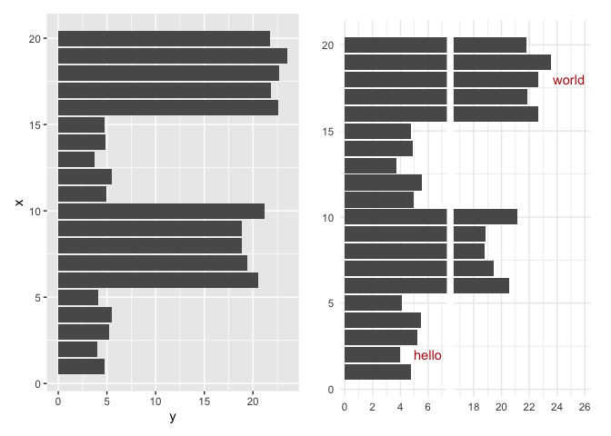

ggbreaks
================

``` r
library(ggplot2)
library(ggbreak) 
```

    ## ggbreak v0.1.2
    ## 
    ## If you use ggbreak in published research, please cite the following
    ## paper:
    ## 
    ## S Xu, M Chen, T Feng, L Zhan, L Zhou, G Yu. Use ggbreak to effectively
    ## utilize plotting space to deal with large datasets and outliers.
    ## Frontiers in Genetics. 2021, 12:774846. doi: 10.3389/fgene.2021.774846

``` r
library(patchwork)
```

``` r
# there is a blank plot below, as well as the intended plots, but it doesn't appear when knit to html rendering
set.seed(2019-01-19)
d <- data.frame(x = 1:20,
   y = c(rnorm(5) + 4, rnorm(5) + 20, rnorm(5) + 5, rnorm(5) + 22)
)
 
p1 <- ggplot(d, aes(y, x)) + geom_col(orientation="y")
d2 <- data.frame(x = c(2, 18), y = c(7, 26), label = c("hello", "world"))
p2 <- p1 + scale_x_break(c(7, 17)) + 
  geom_text(aes(y, x, label=label), data=d2, hjust=1, colour = 'firebrick')  + 
  xlab(NULL) + ylab(NULL) + theme_minimal()

p1 + p2
```

<!-- -->
