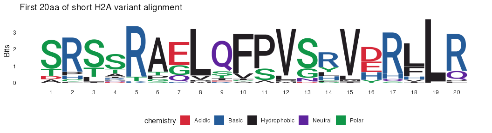

alignment_sliding_windows_forAbby
================
Janet Young

2026-05-07

# Goals

Given a multiple sequence alignment, and some sort of per-residue
statistic (like a CONSURF score), how do we get sliding-window
statistics?

Also, we might need to know how to convert position in the alignment to
position in a reference sequence (which differ when the alignment
contains gaps).

Probably best to talk through this code together at some point and
that’ll help me see where you are with your R knowledge and fluency, and
how best to deliver info like this to you. We can talk about any
functions you’re not familiar with, ways to troubleshoot, ways to learn
about new packages.

# Note about ways to use R

1.  Rmd documents: I’m a big fan of putting my code in Rmd documents for
    reproducibility and ease of displaying code, notes and output all
    together (including displaying code output via github). I think
    Maria does a different thing (maybe python notebooks?) that probably
    achieves the same end results.

2.  R projects: I’m a big fan of these, too. When working in Rprojects,
    I’ve also found the `here` package and the `here()` function to be
    very helpful for navigating file paths.

# Setup

Load libraries etc

``` r
## setting echo=TRUE means code will be shown in the final rendered output. Sometimes you want this and sometimes you don't
knitr::opts_chunk$set(echo = TRUE)

library(tidyverse)
library(here)

## Biostrings is a bioconductor package, not a regular R package. This page has instructions on how to install it (or other bioconductor packages):
## https://bioconductor.org/packages/release/bioc/html/Biostrings.html

library(Biostrings)     ## functions to handle sequences and alignments
library(GenomicRanges)  ## functions to handle regions
library(ggseqlogo)      ## logo plots
```

# Reading alignments into R

Fasta-formatted alignments are my go-to for most uses. I’m also a fan of
the Mac ‘seaview’ alignment viewer for times I need a very lightweight
way to just look around an alignment.

Here I use the Biostrings library to read in an amino acid alignment.
It’s the histone fold domain of four or five different short H2A variant
genes, several orthologs of each.

``` r
## using here() means file path is relative to the top level project directory
## (otherwise it's relative to the location of the Rmd script we are in). 
## This is helpful if you end up moving scripts around, 
## and/or your script and data are in different folders (that's common for me)

aln_file <- here("Rscripts/multiple_sequence_alignments/example_alignment_files/exampleProtAln_shortH2As_histoneFoldDomain.fa")


## use readAAStringSet (there's an equivalent readDNAStringSet)
shortH2Aaln <- readAAStringSet(aln_file)

shortH2Aaln
```

    ## AAStringSet object of length 37:
    ##      width seq                                              names               
    ##  [1]    82 SRSSRAGLQFPVGRVHRLLRKGN...TRIIPRHLQLAIRNDEELNKLL H2A_panda panda_H...
    ##  [2]    82 TRSSRAGLQFPVGRVHRLLRKGN...TRIIPRHLQLAIRNDEELNKLL H2A_armadillo arm...
    ##  [3]    82 TRSSRAGLQFPVGRVHRLLRKGN...TRIIPRHLQLAIRNDEELNKLL H2A_chineseHamste...
    ##  [4]    82 SRSSRAGLQFPVGRVHRLLRKGN...TRIIPRHLQLAIRNDEELNKLL H2A_leopard leopa...
    ##  [5]    82 TRSSRAGLQFPVGRVHRLLRKGN...TRIIPRHLQLAIRNDEELNKLL H2A_mouse mouse_H...
    ##  ...   ... ...
    ## [33]    82 THLTTTEPQVPVSFVDHLLQEDQ...MQMTPQDVERAVDSNAEPHRQV H2A.P_pig PIGHYMP...
    ## [34]    82 SHLIRSELQCPLSYVDRLLLEDQ...MHTVPQD-DRGVGSNGQRPQNL H2A.P_leopard leo...
    ## [35]    82 AHLITTELQVPVSYVDRLLQENQ...MPTAPQDVERAVDSSGEPYHRS H2A.P_panda Panda...
    ## [36]    82 ACLPTAELQFPVSYLDRLLQKDE...SSSVAQDVEGGVNNNREPQRQV H2A.P_rhino rhino...
    ## [37]    82 SLSARTEMEFSPSGLERLLQEDR...SHIAPLDVERGVRNNRLLRHLL H2A.P_armadillo A...

Show first 6 sequences names

``` r
names(shortH2Aaln) |> head()
```

    ## [1] "H2A_panda panda_H2A_usingHistoneDB.frame1pep.fasta "                  
    ## [2] "H2A_armadillo armadillo_H2A_usingHistoneDB.frame1pep.fasta "          
    ## [3] "H2A_chineseHamster chineseHamster_H2A_usingHistoneDB.frame1pep.fasta "
    ## [4] "H2A_leopard leopard_H2A_usingHistoneDB.frame1pep.fasta "              
    ## [5] "H2A_mouse mouse_H2A_usingHistoneDB.frame1pep.fasta "                  
    ## [6] "H2A_rat rat_H2A_usingHistoneDB.frame1pep.fasta "

Those are hard to deal with - I usually like to simplify the sequence
names by removing any description field that’s present (after the first
space)

``` r
names(shortH2Aaln) <- sapply(strsplit(names(shortH2Aaln), " "), "[[", 1)

names(shortH2Aaln) |> head()
```

    ## [1] "H2A_panda"          "H2A_armadillo"      "H2A_chineseHamster"
    ## [4] "H2A_leopard"        "H2A_mouse"          "H2A_rat"

Learn how many positions are in our alignment: it’s 82aa

``` r
width(shortH2Aaln) |> unique()
```

    ## [1] 82

Learn how many sequences are in our alignment: it’s 37

``` r
length(shortH2Aaln) 
```

    ## [1] 37

Demonstrate a couple of things:

- the `narrow()` function lets us take a certain region of a Biostrings
  object
- `ggseqlogo()` is nice (but cannot handle AAStringSet object as input,
  as we use as.character first). I’ have some scripts where I’ve used
  this quite a bit now so can help with any troubleshooting

``` r
## ggseqlogo package code will generate some warnings (because it uses outdated ways to interact with ggplot) so notice the code chunk header above to suppress the warning
shortH2Aaln |> 
    narrow(start=1, end=20) |> 
    as.character() |> 
    ggseqlogo() +
    labs(title="First 20aa of short H2A variant alignment")
```

<!-- -->

# Generate an example statistic for each alignment position

Let’s say we want to count the number of positively charged amino acids
per position (R and K):

Step 1 - Biostrings has a nice function called `consensusMatrix()` that
tabulates amino acid counts at each position (note that it tabulates all
characters, including gaps, not just the 20 standard amino acids. There
are ways to control what it counts or, you can subset the results)

I show results for the first 10 positions:

``` r
shortH2Aaln_aa_counts <- shortH2Aaln |> 
    consensusMatrix()

shortH2Aaln_aa_counts[,1:10]
```

    ##   [,1] [,2] [,3] [,4] [,5] [,6] [,7] [,8] [,9] [,10]
    ## A    3    0    0    4    0   28    0    0    0     1
    ## R    0   28    0    2   33    0    0    0    1     0
    ## N    0    0    0    0    0    0    0    0    0     0
    ## D    3    0    0    1    0    0    0    0    0     0
    ## C    0    2    0    0    0    0    0    0    0     1
    ## Q    0    0    0    1    0    0    6    0   26     0
    ## E    0    0    0    0    0    0   21    0    1     0
    ## G    0    0    0    0    0    2    9    0    0     0
    ## H    0    3    0    0    0    0    0    0    0     0
    ## I    0    0    1    2    0    0    0    0    2     1
    ## L    0    1    4    0    0    0    0   32    0     0
    ## K    0    0    0    0    1    0    1    0    0     0
    ## M    0    0    0    1    0    0    0    1    0     0
    ## F    0    0    0    0    0    0    0    0    0    29
    ## P    0    3    0    1    0    3    0    1    0     0
    ## S   25    0   24   20    0    1    0    0    4     0
    ## T    6    0    8    5    3    3    0    0    2     0
    ## W    0    0    0    0    0    0    0    0    0     0
    ## Y    0    0    0    0    0    0    0    0    0     0
    ## V    0    0    0    0    0    0    0    3    0     4
    ## U    0    0    0    0    0    0    0    0    0     0
    ## O    0    0    0    0    0    0    0    0    0     0
    ## B    0    0    0    0    0    0    0    0    0     0
    ## J    0    0    0    0    0    0    0    0    0     0
    ## Z    0    0    0    0    0    0    0    0    0     0
    ## X    0    0    0    0    0    0    0    0    0     0
    ## *    0    0    0    0    0    0    0    0    0     0
    ## -    0    0    0    0    0    0    0    0    1     1
    ## +    0    0    0    0    0    0    0    0    0     0
    ## .    0    0    0    0    0    0    0    0    0     0

Step 2 - get total R+K counts at each position:

``` r
shortH2Aaln_RK_counts <- shortH2Aaln_aa_counts[c("R","K"), ] |> 
    colSums()

shortH2Aaln_RK_counts |> head()
```

    ## [1]  0 28  0  2 34  0

# Make our sliding windows

Uses code and object types from the GenomicRanges package

We could figure out the window coordinates ourselves, but the
GenomicRanges package offers us a nice shortcut.

First we make a GRanges object that represents the entire alignment:

``` r
# IRanges kind of works but I've had better luck with GRanges (they're used more)
shortH2Aaln_gr <- GRanges(seqnames="shortH2Aaln",
                          ranges=IRanges(start=1, end= unique(width(shortH2Aaln)) ))
shortH2Aaln_gr
```

    ## GRanges object with 1 range and 0 metadata columns:
    ##          seqnames    ranges strand
    ##             <Rle> <IRanges>  <Rle>
    ##   [1] shortH2Aaln      1-82      *
    ##   -------
    ##   seqinfo: 1 sequence from an unspecified genome; no seqlengths

Then we use that GRanges object to make 20aa windows, sliding by 5aa
(notice that the last window is incomplete. Sometimes we keep those,
sometimes we filter out smaller-than-desired windows, or we could
replace by a full-length window that ends at the last position but
wouldn’t normally fit with the slide amount)

``` r
shortH2Aaln_windows <- slidingWindows(shortH2Aaln_gr, width=20, step=5)

## slidingWindows returns a list but we just want the first (and only) item.
## I think the list might come into play e.g. if you have >1 chromosome 
shortH2Aaln_windows <- shortH2Aaln_windows[[1]]

shortH2Aaln_windows
```

    ## GRanges object with 14 ranges and 0 metadata columns:
    ##           seqnames    ranges strand
    ##              <Rle> <IRanges>  <Rle>
    ##    [1] shortH2Aaln      1-20      *
    ##    [2] shortH2Aaln      6-25      *
    ##    [3] shortH2Aaln     11-30      *
    ##    [4] shortH2Aaln     16-35      *
    ##    [5] shortH2Aaln     21-40      *
    ##    ...         ...       ...    ...
    ##   [10] shortH2Aaln     46-65      *
    ##   [11] shortH2Aaln     51-70      *
    ##   [12] shortH2Aaln     56-75      *
    ##   [13] shortH2Aaln     61-80      *
    ##   [14] shortH2Aaln     66-82      *
    ##   -------
    ##   seqinfo: 1 sequence from an unspecified genome; no seqlengths

Use the `Views()` function to get data to consider for each window

``` r
shortH2Aaln_RK_counts_windows <- Views(shortH2Aaln_RK_counts,
                                       ranges(shortH2Aaln_windows))
shortH2Aaln_RK_counts_windows
```

    ## Views on a 82-double XDouble subject
    ## subject:  0 28  0  2 34  0  1  0  1  0  0 ...  0  2 14  1  0  4  0  1  4 14  1
    ## views:
    ##      start end width
    ##  [1]     1  20    20 [ 0 28  0  2 34  0  1  0  1 ...  0  0 18  0  0 30  0  0 28]
    ##  [2]     6  25    20 [ 0  1  0  1  0  0  0  0 18 ... 30  0  0 28 10  0  4  1  0]
    ##  [3]    11  30    20 [ 0  0  0 18  0  0 30  0  0 ...  0  4  1  0  5 28  0  1  0]
    ##  [4]    16  35    20 [ 0 30  0  0 28 10  0  4  1 ... 28  0  1  0  0  0  1  0  0]
    ##  [5]    21  40    20 [10  0  4  1  0  5 28  0  1 ...  0  1  0  0  1  0  0  0  0]
    ##  [6]    26  45    20 [ 5 28  0  1  0  0  0  1  0 ...  0  0  0  0  0  0  0  0  3]
    ##  [7]    31  50    20 [0 0 1 0 0 1 0 0 0 0 0 0 0 0 3 7 0 0 0 0]
    ##  [8]    36  55    20 [1 0 0 0 0 0 0 0 0 3 7 0 0 0 0 0 0 4 1 0]
    ##  [9]    41  60    20 [ 0  0  0  0  3  7  0  0  0 ...  0  4  1  0 16  3  3 12 25]
    ## [10]    46  65    20 [ 7  0  0  0  0  0  0  4  1 ...  3  3 12 25 11 25  0  0  0]
    ## [11]    51  70    20 [ 0  0  4  1  0 16  3  3 12 ... 25  0  0  0 10  0  3  2 13]
    ## [12]    56  75    20 [16  3  3 12 25 11 25  0  0 ...  0  3  2 13  0  2 14  1  0]
    ## [13]    61  80    20 [11 25  0  0  0 10  0  3  2 ...  2 14  1  0  4  0  1  4 14]
    ## [14]    66  82    17 [10  0  3  2 13  0  2 14  1  0  4  0  1  4 14  1  0]

Get mean and median in each window and add them to the windows object,
to keep track of window positions and statistics together.

``` r
shortH2Aaln_windows$meanRKcount <- shortH2Aaln_RK_counts_windows |> 
    viewMeans()

shortH2Aaln_windows$medianRKcount <- shortH2Aaln_RK_counts_windows |> 
    viewApply(median)
```

Now you could make plots, or export that data. I often do something like
this to get a tibble, which we can use more easily in ggplot. Window
midpoint can be useful for plotting so let’s add that.

``` r
shortH2Aaln_windows_tbl <- shortH2Aaln_windows |> 
    as.data.frame() |> 
    as_tibble() |> 
    mutate(midpoint = start + width/2 ) |> 
    ## picky detail but the true midpoint is actually 
    ## in between bases 10 and 11 of each window
    mutate(midpoint = midpoint - 0.5 ) |> 
    relocate(midpoint, .after=end)

shortH2Aaln_windows_tbl
```

    ## # A tibble: 14 × 8
    ##    seqnames    start   end midpoint width strand meanRKcount medianRKcount
    ##    <fct>       <int> <int>    <dbl> <int> <fct>        <dbl>         <dbl>
    ##  1 shortH2Aaln     1    20     10.5    20 *             7.1            0  
    ##  2 shortH2Aaln     6    25     15.5    20 *             4.65           0  
    ##  3 shortH2Aaln    11    30     20.5    20 *             6.25           0  
    ##  4 shortH2Aaln    16    35     25.5    20 *             5.4            0  
    ##  5 shortH2Aaln    21    40     30.5    20 *             2.55           0  
    ##  6 shortH2Aaln    26    45     35.5    20 *             1.95           0  
    ##  7 shortH2Aaln    31    50     40.5    20 *             0.6            0  
    ##  8 shortH2Aaln    36    55     45.5    20 *             0.8            0  
    ##  9 shortH2Aaln    41    60     50.5    20 *             3.7            0  
    ## 10 shortH2Aaln    46    65     55.5    20 *             5.35           0.5
    ## 11 shortH2Aaln    51    70     60.5    20 *             6.4            3  
    ## 12 shortH2Aaln    56    75     65.5    20 *             7              3  
    ## 13 shortH2Aaln    61    80     70.5    20 *             5.2            2  
    ## 14 shortH2Aaln    66    82     74      17 *             4.06           2

# Understanding relationship between alignment position and individual sequence

Let’s say one of the sequences in the alignment is our “reference”
sequence (e.g. in your case it’ll be VSV). Maybe (probably) there are
gaps in the aligned reference sequence, meaning alignment coordinates
don’t match reference coordinates.

In this example, we’ll use “H2A.P_rhino” as the reference (has a 3aa gap
at position 56-58).

Show alignment from position 45 to the end, showing reference seq and
two others:

``` r
narrow( shortH2Aaln[c("H2A.P_panda", "H2A.P_rhino", "H2A.P_armadillo")],
        start=45)
```

    ## AAStringSet object of length 3:
    ##     width seq                                               names               
    ## [1]    38 DYILDVVGTEA-NNSNMPTAPQDVERAVDSSGEPYHRS            H2A.P_panda
    ## [2]    38 DYILEMVGNEA---TNSSSVAQDVEGGVNNNREPQRQV            H2A.P_rhino
    ## [3]    38 TYILELAANEAHNNHRSHIAPLDVERGVRNNRLLRHLL            H2A.P_armadillo

Here’s how we can handle the gaps and positions.

First let’s make a lookup tbl - containing alignment position, ref amino
acid, and ref position. We’ll add our statistic of interest (num RKs at
each position) to it

``` r
shortH2Aaln_lookup_tbl <- tibble(
    aln_pos = 1: unique(width(shortH2Aaln)),
    ref_aa = strsplit( as.character(shortH2Aaln[["H2A.P_rhino"]]), 
                       split="" )[[1]] )  |> 
    mutate(ref_pos = cumsum(ref_aa != "-")) |> 
    mutate(ref_pos = case_when(ref_aa=="-" ~ NA,
                               TRUE ~ ref_pos) ) |> 
    mutate(tot_RK = shortH2Aaln_RK_counts)
shortH2Aaln_lookup_tbl
```

    ## # A tibble: 82 × 4
    ##    aln_pos ref_aa ref_pos tot_RK
    ##      <int> <chr>    <int>  <dbl>
    ##  1       1 A            1      0
    ##  2       2 C            2     28
    ##  3       3 L            3      0
    ##  4       4 P            4      2
    ##  5       5 T            5     34
    ##  6       6 A            6      0
    ##  7       7 E            7      1
    ##  8       8 L            8      0
    ##  9       9 Q            9      1
    ## 10      10 F           10      0
    ## # ℹ 72 more rows

Now, let’s make a GRanges object that represents the entire ungapped
reference sequence (not the alignment). Then (as before) we will make
sliding windows and get the scores in each window.

``` r
H2AP_rhino_gr <- GRanges(
    seqnames="H2A.P_rhino",
    ranges=IRanges(start=1, 
                   end = max(shortH2Aaln_lookup_tbl$ref_pos, na.rm=TRUE)))
H2AP_rhino_gr
```

    ## GRanges object with 1 range and 0 metadata columns:
    ##          seqnames    ranges strand
    ##             <Rle> <IRanges>  <Rle>
    ##   [1] H2A.P_rhino      1-79      *
    ##   -------
    ##   seqinfo: 1 sequence from an unspecified genome; no seqlengths

Get sliding window coordinates

``` r
H2AP_rhino_windows_gr <- slidingWindows(H2AP_rhino_gr, width=20, step=5)[[1]]
H2AP_rhino_windows_gr
```

    ## GRanges object with 13 ranges and 0 metadata columns:
    ##           seqnames    ranges strand
    ##              <Rle> <IRanges>  <Rle>
    ##    [1] H2A.P_rhino      1-20      *
    ##    [2] H2A.P_rhino      6-25      *
    ##    [3] H2A.P_rhino     11-30      *
    ##    [4] H2A.P_rhino     16-35      *
    ##    [5] H2A.P_rhino     21-40      *
    ##    ...         ...       ...    ...
    ##    [9] H2A.P_rhino     41-60      *
    ##   [10] H2A.P_rhino     46-65      *
    ##   [11] H2A.P_rhino     51-70      *
    ##   [12] H2A.P_rhino     56-75      *
    ##   [13] H2A.P_rhino     61-79      *
    ##   -------
    ##   seqinfo: 1 sequence from an unspecified genome; no seqlengths

We’ll also turn `shortH2Aaln_lookup_tbl` into a GRanges object (called
`H2AP_rhino_data_gr`), with one ‘range’ per position of the reference
seq (ignoring positions that are gaps in the ref):

``` r
H2AP_rhino_data_gr <- shortH2Aaln_lookup_tbl |> 
    ## ignore positions that are gaps in the reference sequence
    filter(!is.na(ref_pos)) |> 
    ## get the columns that we want to keep in our GRanges object
    select(start=ref_pos, ref_aa, tot_RK) |> 
    ## add more columns that GRanges needs
    mutate(seqnames="H2A.P_rhino") |> 
    mutate(end=start) |> 
    ## convert to GRanges
    GRanges()
H2AP_rhino_data_gr
```

    ## GRanges object with 79 ranges and 2 metadata columns:
    ##           seqnames    ranges strand |      ref_aa    tot_RK
    ##              <Rle> <IRanges>  <Rle> | <character> <numeric>
    ##    [1] H2A.P_rhino         1      * |           A         0
    ##    [2] H2A.P_rhino         2      * |           C        28
    ##    [3] H2A.P_rhino         3      * |           L         0
    ##    [4] H2A.P_rhino         4      * |           P         2
    ##    [5] H2A.P_rhino         5      * |           T        34
    ##    ...         ...       ...    ... .         ...       ...
    ##   [75] H2A.P_rhino        75      * |           P         1
    ##   [76] H2A.P_rhino        76      * |           Q         4
    ##   [77] H2A.P_rhino        77      * |           R        14
    ##   [78] H2A.P_rhino        78      * |           Q         1
    ##   [79] H2A.P_rhino        79      * |           V         0
    ##   -------
    ##   seqinfo: 1 sequence from an unspecified genome; no seqlengths

Get all of the RK counts in each window

``` r
H2AP_rhino_RK_counts_windows <- Views(H2AP_rhino_data_gr$tot_RK,
                                       ranges(H2AP_rhino_windows_gr))
H2AP_rhino_RK_counts_windows
```

    ## Views on a 79-double XDouble subject
    ## subject:  0 28  0  2 34  0  1  0  1  0  0 ...  0  2 14  1  0  4  0  1  4 14  1
    ## views:
    ##      start end width
    ##  [1]     1  20    20 [ 0 28  0  2 34  0  1  0  1 ...  0  0 18  0  0 30  0  0 28]
    ##  [2]     6  25    20 [ 0  1  0  1  0  0  0  0 18 ... 30  0  0 28 10  0  4  1  0]
    ##  [3]    11  30    20 [ 0  0  0 18  0  0 30  0  0 ...  0  4  1  0  5 28  0  1  0]
    ##  [4]    16  35    20 [ 0 30  0  0 28 10  0  4  1 ... 28  0  1  0  0  0  1  0  0]
    ##  [5]    21  40    20 [10  0  4  1  0  5 28  0  1 ...  0  1  0  0  1  0  0  0  0]
    ##  [6]    26  45    20 [ 5 28  0  1  0  0  0  1  0 ...  0  0  0  0  0  0  0  0  3]
    ##  [7]    31  50    20 [0 0 1 0 0 1 0 0 0 0 0 0 0 0 3 7 0 0 0 0]
    ##  [8]    36  55    20 [1 0 0 0 0 0 0 0 0 3 7 0 0 0 0 0 0 4 1 0]
    ##  [9]    41  60    20 [ 0  0  0  0  3  7  0  0  0 ...  0  4  1  0 12 25 11 25  0]
    ## [10]    46  65    20 [ 7  0  0  0  0  0  0  4  1 ... 25 11 25  0  0  0 10  0  3]
    ## [11]    51  70    20 [ 0  0  4  1  0 12 25 11 25 ...  0 10  0  3  2 13  0  2 14]
    ## [12]    56  75    20 [12 25 11 25  0  0  0 10  0 ... 13  0  2 14  1  0  4  0  1]
    ## [13]    61  79    19 [ 0  0 10  0  3  2 13  0  2 14  1  0  4  0  1  4 14  1  0]

Get mean (etc) in each window and add it to the object

``` r
H2AP_rhino_windows_gr$meanRKcount <- H2AP_rhino_RK_counts_windows |> 
    viewMeans()

H2AP_rhino_windows_gr$medianRKcount <- H2AP_rhino_RK_counts_windows |> 
    viewApply(median)

H2AP_rhino_windows_gr
```

    ## GRanges object with 13 ranges and 2 metadata columns:
    ##           seqnames    ranges strand | meanRKcount medianRKcount
    ##              <Rle> <IRanges>  <Rle> |   <numeric>     <numeric>
    ##    [1] H2A.P_rhino      1-20      * |        7.10             0
    ##    [2] H2A.P_rhino      6-25      * |        4.65             0
    ##    [3] H2A.P_rhino     11-30      * |        6.25             0
    ##    [4] H2A.P_rhino     16-35      * |        5.40             0
    ##    [5] H2A.P_rhino     21-40      * |        2.55             0
    ##    ...         ...       ...    ... .         ...           ...
    ##    [9] H2A.P_rhino     41-60      * |     4.40000             0
    ##   [10] H2A.P_rhino     46-65      * |     4.90000             0
    ##   [11] H2A.P_rhino     51-70      * |     6.10000             2
    ##   [12] H2A.P_rhino     56-75      * |     6.15000             2
    ##   [13] H2A.P_rhino     61-79      * |     3.63158             1
    ##   -------
    ##   seqinfo: 1 sequence from an unspecified genome; no seqlengths

# Finished

I like to put `sessionInfo()` at the end of my code, for reproducibility
purposes. If the code breaks when I update to a newer version of R or
new R packages, it’s helpful to know the version that worked the last
time I successfully rendered the Rmd document. Or if I’m giving code to
someone else.

``` r
sessionInfo()
```

    ## R version 4.5.2 (2025-10-31)
    ## Platform: x86_64-pc-linux-gnu
    ## Running under: Ubuntu 24.04.3 LTS
    ## 
    ## Matrix products: default
    ## BLAS:   /usr/lib/x86_64-linux-gnu/openblas-pthread/libblas.so.3 
    ## LAPACK: /usr/lib/x86_64-linux-gnu/openblas-pthread/libopenblasp-r0.3.26.so;  LAPACK version 3.12.0
    ## 
    ## locale:
    ##  [1] LC_CTYPE=en_US.UTF-8       LC_NUMERIC=C              
    ##  [3] LC_TIME=en_US.UTF-8        LC_COLLATE=en_US.UTF-8    
    ##  [5] LC_MONETARY=en_US.UTF-8    LC_MESSAGES=en_US.UTF-8   
    ##  [7] LC_PAPER=en_US.UTF-8       LC_NAME=C                 
    ##  [9] LC_ADDRESS=C               LC_TELEPHONE=C            
    ## [11] LC_MEASUREMENT=en_US.UTF-8 LC_IDENTIFICATION=C       
    ## 
    ## time zone: Etc/UTC
    ## tzcode source: system (glibc)
    ## 
    ## attached base packages:
    ## [1] stats4    stats     graphics  grDevices utils     datasets  methods  
    ## [8] base     
    ## 
    ## other attached packages:
    ##  [1] ggseqlogo_0.2.2      GenomicRanges_1.62.1 Biostrings_2.78.0   
    ##  [4] Seqinfo_1.0.0        XVector_0.50.0       IRanges_2.44.0      
    ##  [7] S4Vectors_0.48.1     BiocGenerics_0.56.0  generics_0.1.4      
    ## [10] here_1.0.2           lubridate_1.9.5      forcats_1.0.1       
    ## [13] stringr_1.5.2        dplyr_1.2.1          purrr_1.1.0         
    ## [16] readr_2.2.0          tidyr_1.3.2          tibble_3.3.1        
    ## [19] ggplot2_4.0.2        tidyverse_2.0.0     
    ## 
    ## loaded via a namespace (and not attached):
    ##  [1] utf8_1.2.6         stringi_1.8.7      hms_1.1.4          digest_0.6.37     
    ##  [5] magrittr_2.0.4     evaluate_1.0.5     grid_4.5.2         timechange_0.4.0  
    ##  [9] RColorBrewer_1.1-3 fastmap_1.2.0      rprojroot_2.1.1    scales_1.4.0      
    ## [13] textshaping_1.0.4  cli_3.6.5          rlang_1.2.0        crayon_1.5.3      
    ## [17] withr_3.0.2        yaml_2.3.10        tools_4.5.2        tzdb_0.5.0        
    ## [21] vctrs_0.7.2        R6_2.6.1           lifecycle_1.0.5    ragg_1.5.0        
    ## [25] pkgconfig_2.0.3    pillar_1.11.1      gtable_0.3.6       glue_1.8.0        
    ## [29] systemfonts_1.3.1  xfun_0.57          tidyselect_1.2.1   rstudioapi_0.17.1 
    ## [33] knitr_1.50         farver_2.1.2       htmltools_0.5.8.1  labeling_0.4.3    
    ## [37] rmarkdown_2.30     compiler_4.5.2     S7_0.2.1
