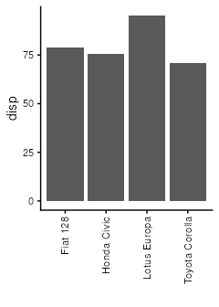

script2
================
Janet Young

2026-04-13

Load the `mtcars_efficient` object, saved by script1.

``` r
load(file="mtcars_efficient.Rdata")
```

``` r
efficient_car_names <- paste(rownames(mtcars_efficient), collapse = ",")
```

The names of the efficient cars are:

Fiat 128,Honda Civic,Toyota Corolla,Lotus Europa

And let’s make a graph

``` r
mtcars_efficient |> 
    as_tibble(rownames="car_id") |> 
    ggplot(aes(x=car_id, y=disp)) +
    geom_col(stat="identity") +
    theme_classic() + 
    theme(axis.text.x = element_text(angle = 90, hjust = 1, vjust = 0.5)) +
    labs(x="")
```

<!-- -->

Now we remove the file with the object that was saved by script1, so
that we can run afresh next time, meaning that this script can only be
run after a successful script1 run.

``` r
unlink("mtcars_efficient.Rdata")
```

# Finished

Show R and package version information

``` r
sessionInfo()
```

    ## R version 4.5.2 (2025-10-31)
    ## Platform: x86_64-pc-linux-gnu
    ## Running under: Ubuntu 24.04.3 LTS
    ## 
    ## Matrix products: default
    ## BLAS:   /usr/lib/x86_64-linux-gnu/openblas-pthread/libblas.so.3 
    ## LAPACK: /usr/lib/x86_64-linux-gnu/openblas-pthread/libopenblasp-r0.3.26.so;  LAPACK version 3.12.0
    ## 
    ## locale:
    ##  [1] LC_CTYPE=en_US.UTF-8       LC_NUMERIC=C              
    ##  [3] LC_TIME=en_US.UTF-8        LC_COLLATE=en_US.UTF-8    
    ##  [5] LC_MONETARY=en_US.UTF-8    LC_MESSAGES=en_US.UTF-8   
    ##  [7] LC_PAPER=en_US.UTF-8       LC_NAME=C                 
    ##  [9] LC_ADDRESS=C               LC_TELEPHONE=C            
    ## [11] LC_MEASUREMENT=en_US.UTF-8 LC_IDENTIFICATION=C       
    ## 
    ## time zone: Etc/UTC
    ## tzcode source: system (glibc)
    ## 
    ## attached base packages:
    ## [1] stats     graphics  grDevices utils     datasets  methods   base     
    ## 
    ## other attached packages:
    ##  [1] lubridate_1.9.5 forcats_1.0.1   stringr_1.5.2   dplyr_1.2.1    
    ##  [5] purrr_1.1.0     readr_2.2.0     tidyr_1.3.2     tibble_3.3.1   
    ##  [9] ggplot2_4.0.2   tidyverse_2.0.0
    ## 
    ## loaded via a namespace (and not attached):
    ##  [1] gtable_0.3.6       compiler_4.5.2     tidyselect_1.2.1   systemfonts_1.3.1 
    ##  [5] scales_1.4.0       textshaping_1.0.4  yaml_2.3.10        fastmap_1.2.0     
    ##  [9] R6_2.6.1           labeling_0.4.3     generics_0.1.4     knitr_1.50        
    ## [13] pillar_1.11.1      RColorBrewer_1.1-3 tzdb_0.5.0         rlang_1.2.0       
    ## [17] stringi_1.8.7      xfun_0.54          S7_0.2.1           timechange_0.4.0  
    ## [21] cli_3.6.5          withr_3.0.2        magrittr_2.0.4     digest_0.6.37     
    ## [25] grid_4.5.2         hms_1.1.4          lifecycle_1.0.5    vctrs_0.7.2       
    ## [29] evaluate_1.0.5     glue_1.8.0         farver_2.1.2       ragg_1.5.0        
    ## [33] rmarkdown_2.30     tools_4.5.2        pkgconfig_2.0.3    htmltools_0.5.8.1
