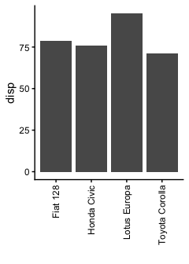

script2
================
Janet Young

2026-04-13

Load the `mtcars_efficient` object, saved by script1.

``` r
load(file="mtcars_efficient.Rdata")
```

``` r
efficient_car_names <- paste(rownames(mtcars_efficient), collapse = ",")
```

The names of the efficient cars are:

Fiat 128,Honda Civic,Toyota Corolla,Lotus Europa

And let’s make a graph

``` r
mtcars_efficient |> 
    as_tibble(rownames="car_id") |> 
    ggplot(aes(x=car_id, y=disp)) +
    geom_col(stat="identity") +
    theme_classic() + 
    theme(axis.text.x = element_text(angle = 90, hjust = 1, vjust = 0.5)) +
    labs(x="")
```

<!-- -->

Now we remove the file with the object that was saved by script1, so
that we can run afresh next time, meaning that this script can only be
run after a successful script1 run.

``` r
unlink("mtcars_efficient.Rdata")
```

# Finished

Show R and package version information

``` r
sessionInfo()
```

    ## R version 4.5.3 (2026-03-11)
    ## Platform: aarch64-apple-darwin20
    ## Running under: macOS Tahoe 26.4.1
    ## 
    ## Matrix products: default
    ## BLAS:   /Library/Frameworks/R.framework/Versions/4.5-arm64/Resources/lib/libRblas.0.dylib 
    ## LAPACK: /Library/Frameworks/R.framework/Versions/4.5-arm64/Resources/lib/libRlapack.dylib;  LAPACK version 3.12.1
    ## 
    ## locale:
    ## [1] en_US.UTF-8/en_US.UTF-8/en_US.UTF-8/C/en_US.UTF-8/en_US.UTF-8
    ## 
    ## time zone: America/Los_Angeles
    ## tzcode source: internal
    ## 
    ## attached base packages:
    ## [1] stats     graphics  grDevices utils     datasets  methods   base     
    ## 
    ## other attached packages:
    ##  [1] lubridate_1.9.5 forcats_1.0.1   stringr_1.6.0   dplyr_1.2.1    
    ##  [5] purrr_1.2.1     readr_2.2.0     tidyr_1.3.2     tibble_3.3.1   
    ##  [9] ggplot2_4.0.2   tidyverse_2.0.0
    ## 
    ## loaded via a namespace (and not attached):
    ##  [1] gtable_0.3.6       compiler_4.5.3     tidyselect_1.2.1   scales_1.4.0      
    ##  [5] yaml_2.3.12        fastmap_1.2.0      R6_2.6.1           labeling_0.4.3    
    ##  [9] generics_0.1.4     knitr_1.51         pillar_1.11.1      RColorBrewer_1.1-3
    ## [13] tzdb_0.5.0         rlang_1.1.7        stringi_1.8.7      xfun_0.57         
    ## [17] S7_0.2.1           otel_0.2.0         timechange_0.4.0   cli_3.6.5         
    ## [21] withr_3.0.2        magrittr_2.0.5     digest_0.6.39      grid_4.5.3        
    ## [25] rstudioapi_0.18.0  hms_1.1.4          lifecycle_1.0.5    vctrs_0.7.2       
    ## [29] evaluate_1.0.5     glue_1.8.0         farver_2.1.2       rmarkdown_2.31    
    ## [33] tools_4.5.3        pkgconfig_2.0.3    htmltools_0.5.9
